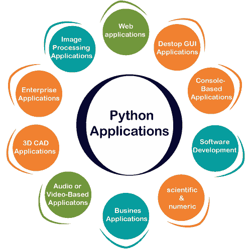

# Python 应用

> 原文：<https://www.javatpoint.com/python-applications>

Python 以其通用性质而闻名，这使得它几乎适用于软件开发的每个领域。Python 出现在每个新兴领域。它是发展最快的编程语言，可以开发任何应用。

这里，我们指定了可以应用 Python 的应用领域。

### 1)网络应用

我们可以使用 Python 开发网络应用。它提供了处理互联网协议的库，如超文本标记语言和可扩展标记语言、JSON、电子邮件处理、请求、美化程序、提要解析器等。在 **Instagram** 上使用了一个名为 Django 的 Python 网络框架。Python 提供了许多有用的框架，如下所示:

*   Django 和金字塔框架(用于重型应用)
*   烧瓶和瓶子(微框架)
*   Plone 和 Django 内容管理高级版

### 2)桌面图形用户界面应用

图形用户界面代表图形用户界面，它为任何应用提供了流畅的交互。Python 提供了一个 **Tk GUI 库**来开发用户界面。下面是一些流行的图形用户界面库。

*   Tkinter 或 Tk
*   界面库
*   Kivy(用于编写多点触控应用)
*   PyQt 还是 Pyside

### 3)基于控制台的应用

基于控制台的应用从命令行或 shell 运行。这些应用是用来执行命令的计算机程序。这种应用在老一代计算机中更受欢迎。Python 可以非常有效地开发这种应用。它以拥有 REPL 而闻名，这意味着**读取-评估-打印循环**，这使得它成为最适合命令行应用的语言。

Python 提供了许多免费的库或模块来帮助构建命令行应用。必要的 **IO** 库用于读写。它有助于解析参数和创建控制台帮助文本。还有可以开发独立控制台应用的高级库。

### 4)软件开发

Python 对软件开发过程很有用。它作为一种支持语言工作，可用于构建控制和管理、测试等。

*   **SCons** 用于构建控制。
*   **Buildbot** 和**Apache**Gump 用于自动化连续编译和测试。
*   **回合**或**追踪**进行 bug 追踪和项目管理。

### 5)科学和数字

这是人工智能的时代，机器可以像人类一样执行任务。Python 语言是最适合人工智能或机器学习的语言。它由许多科学和数学库组成，便于解决复杂的计算。

实现机器学习算法需要复杂的数学计算。Python 有很多科学和数字库，比如 Numpy、Pandas、Scipy、Scikit-learn 等。如果你有一些 Python 的基础知识，你需要在代码的顶部导入库。下面给出了一些流行的机器库框架。

*   我的天啊
*   Scikit-learn
*   NumPy
*   Pandas
*   Matplotlib

### 6)商业应用

业务应用不同于标准应用。电子商务和企业资源规划是商业应用的一个例子。这种应用需要广泛的可扩展性和可读性，Python 提供了所有这些特性。

Oddo 是基于 Python 的一体化应用的一个例子，它提供了一系列业务应用。Python 提供了一个 **Tryton** 平台，用来开发业务应用。

### 7)基于音频或视频的应用

Python 可以灵活地执行多项任务，并可用于创建多媒体应用。使用 Python 制作的一些多媒体应用有 **TimPlayer、cplay、**等。下面给出了几个多媒体库。

*   媒体框架
*   皮格莱特
*   QT 声子

### 8)三维计算机辅助设计应用

计算机辅助设计用于设计与工程相关的建筑。它用于开发系统一部分的三维表示。Python 可以通过使用以下功能来创建三维计算机辅助设计应用。

*   凡丹戈(流行)
*   康沃克斯
*   HeeksCNC
*   任何 CAD
*   【RCM】

### 9)企业应用

Python 可用于创建可在企业或组织内使用的应用。一些实时应用有 OpenERP、Tryton、根尖等。

### 10)图像处理应用

Python 包含许多用于处理图像的库。图像可以根据我们的要求进行操作。下面给出了一些图像处理库。

*   开放计算机视觉
*   枕头
*   简单明了

在本主题中，我们描述了所有类型的应用，其中 Python 在这些应用的开发中起着至关重要的作用。在下一个教程中，我们将学习更多关于 Python 的概念。

* * *