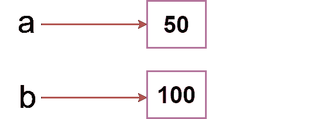

# Python 变量

> 原文：<https://www.javatpoint.com/python-variables>

变量是用于引用内存位置的名称。Python 变量也称为标识符，用于保存值。

在 Python 中，我们不需要指定变量的类型，因为 Python 是一种推断语言，并且足够聪明，可以获得变量类型。

变量名可以是一组字母和数字，但它们必须以字母或下划线开头。

建议变量名使用小写字母。rahul 和 Rahul 都是两个不同的变量。

## 标识符命名

变量是标识符的例子。标识符用于标识程序中使用的字面值。命名标识符的规则如下。

*   变量的第一个字符必须是字母或下划线（`_`）。
*   除第一个字符外，所有字符都可以是小写字母(a-z)、大写字母(A-Z)、下划线或数字(0-9)。
*   标识符名称不能包含任何空格或特殊字符(！, @, #, %, ^, &, *).
*   标识符名称不得与语言中定义的任何关键字相似。
*   标识符名称区分大小写；比如我的名字，和我的名字不一样。
*   有效标识符的例子:a123，_n，n_9 等。
*   无效标识符的示例:1a、n%4、n 9 等。

## 声明变量并赋值

Python 不要求我们在应用中使用变量之前声明变量。它允许我们在需要的时候创建一个变量。

我们不需要在 Python 中显式声明变量。当我们给变量赋值时，该变量会自动声明。

等号(=)运算符用于给变量赋值。

## 对象引用

当我们声明一个变量时，有必要了解 Python 解释器是如何工作的。处理变量的过程与许多其他编程语言有些不同。

Python 是高度面向对象的编程语言；这就是为什么每个数据项都属于特定类型的类。考虑下面的例子。

```py
print("John")

```

**输出:**

```py
John

```

Python 对象创建一个整数对象，并将其显示在控制台上。在上面的 print 语句中，我们创建了一个字符串对象。让我们使用 Python 内置的 **type()** 函数来检查它的类型。

```py
type("John")

```

**输出:**

```py
<class 'str'>

```

在 Python 中，变量是一个符号名称，是对对象的引用或指针。变量用来用这个名字来表示对象。

让我们理解下面的例子

```py
a = 50 

```


在上图中，变量 **a** 指的是一个整数对象。

假设我们将整数值 50 赋给一个新变量 b。

a = 50

b = a


变量 b 引用了 a 指向的同一个对象，因为 Python 不会创建另一个对象。

让我们将新值赋给 b。现在两个变量将引用不同的对象。

a = 50

b =100



如果我们将同一个变量赋给两个不同的值，Python 可以有效地管理内存。

## 对象标识

在 Python 中，每个创建的对象在 Python 中都是唯一标识的。Python 保证没有两个对象具有相同的标识符。内置 **id()** 功能，用于识别对象标识符。考虑下面的例子。

```py
a = 50
b = a
print(id(a))
print(id(b))
# Reassigned variable a
a = 500
print(id(a))

```

**输出:**

```py
140734982691168
140734982691168
2822056960944

```

我们指定 **b = a，a** 和 **b** 都指向同一个对象。当我们通过 **id()** 函数检查时，它返回了相同的数字。我们将 **a** 重新分配给 500；然后它引用新的对象标识符。

## 变量名

我们已经讨论了如何声明有效变量。变量名可以是任意长度，可以有大写、小写(A 到 Z、A 到 Z)、数字(0-9)和下划线字符（`_`）。考虑以下有效变量名称的示例。

```py
name = "Devansh"
age = 20
marks = 80.50

print(name)
print(age)
print(marks)

```

**输出:**

```py
Devansh
20
80.5

```

请考虑以下有效变量名称。

```py
name = "A"
Name = "B"
naMe = "C"
NAME = "D"
n_a_m_e = "E"
_name = "F"
name_ = "G"
_name_ = "H"
na56me = "I"

print(name,Name,naMe,NAME,n_a_m_e, NAME, n_a_m_e, _name, name_,_name, na56me)

```

**输出:**

```py
A B C D E D E F G F I

```

在上面的例子中，我们已经声明了一些有效的变量名，比如 name，_name_，等等。但不建议这样做，因为当我们试图阅读代码时，可能会造成混乱。变量名应该是描述性的，以使代码更易读。

多词关键字可以通过以下方法创建。

*   **Camel Case -** 在 Camel Case 中，中间的每个单词或缩写都以大写字母开头。没有空白的介入。例如- nameOfStudent、valueOfVaraible 等。
*   **Pascal Case -** 与 Camel Case 相同，但这里第一个字也是大写。例如- NameOfStudent 等。
*   **蛇格-** 在蛇格中，单词用下划线隔开。例如-学生姓名等。

## 多重赋值

Python 允许我们在一条语句中为多个变量赋值，这也称为多次赋值。

我们可以通过两种方式应用多个赋值，要么将单个值赋给多个变量，要么将多个值赋给多个变量。考虑下面的例子。

**1。给多个变量赋值**

**Eg:**

```py
x=y=z=50  
print(x)  
print(y)  
print(z)  

```

**输出:**

```py
50  
50  
50  

```

**2。给多个变量分配多个值:**

**Eg:**

```py
a,b,c=5,10,15  
print a  
print b  
print c  

```

**输出:**

```py
5  
10  
15  

```

这些值将按照变量出现的顺序进行分配。

## Python 变量类型

Python 中有两种类型的变量——局部变量和全局变量。让我们了解以下变量。

### 局部变量

局部变量是在函数内部声明并在函数内部有作用域的变量。让我们理解下面的例子。

**示例-**

```py
# Declaring a function
def add():
    # Defining local variables. They has scope only within a function
    a = 20
    b = 30
    c = a + b
    print("The sum is:", c)

# Calling a function
add()

```

**输出:**

```py
The sum is: 50

```

**说明:**

在上面的代码中，我们声明了一个名为 **add()** 的函数，并在函数中分配了一些变量。这些变量将被称为**局部变量**，其范围仅在函数内部。如果我们试图在函数外使用它们，我们会得到以下错误。

```py
add()
# Accessing local variable outside the function 
print(a)

```

**输出:**

```py
The sum is: 50
    print(a)
NameError: name 'a' is not defined

```

我们试图在它们的范围之外使用局部变量；它抛出了**命名错误。**

### 全局变量

全局变量可以在整个程序中使用，其范围在整个程序中。我们可以在函数内部或外部使用全局变量。

默认情况下，在函数外部声明的变量是全局变量。Python 提供了**全局**关键字来使用函数内部的全局变量。如果我们不使用**全局**关键字，函数会将其视为局部变量。让我们理解下面的例子。

**示例-**

```py
# Declare a variable and initialize it
x = 101

# Global variable in function
def mainFunction():
    # printing a global variable
    global x
    print(x)
    # modifying a global variable
    x = 'Welcome To Javatpoint'
    print(x)

mainFunction()
print(x)

```

**输出:**

```py
101
Welcome To Javatpoint
Welcome To Javatpoint

```

**说明:**

在上面的代码中，我们声明了一个全局变量 **x** ，并为其赋值。接下来，我们定义了一个函数，并使用函数内部的**全局**关键字访问了声明的变量。现在我们可以修改它的值。然后，我们给变量 x 分配了一个新的字符串值。

现在，我们调用该函数并继续打印 **x** 。它打印为新分配的 x 值。

## 删除变量

我们可以使用 **del** 关键字删除变量。语法如下。

**语法-**

```py
del <variable_name>

```

在下面的例子中，我们创建了一个变量 x，并为其赋值。我们删除了变量 x，打印出来，得到错误**“变量 x 没有定义”**。变量 x 今后将不再使用。

**示例-**

```py
# Assigning a value to x
x = 6
print(x)
# deleting a variable. 
del x
print(x)

```

**输出:**

```py
6
Traceback (most recent call last):
  File "C:/Users/DEVANSH SHARMA/PycharmProjects/Hello/multiprocessing.py", line 389, in print(x)
NameError: name 'x' is not defined 
```

## Python 中整数的最大可能值

与其他编程语言不同，Python 没有长整型或浮点型数据类型。它将所有整数值视为 **int** 数据类型。这里，问题出现了。Python 中变量能容纳的最大可能值是多少？考虑下面的例子。

**示例-**

```py
# A Python program to display that we can store
# large numbers in Python

a = 10000000000000000000000000000000000000000000
a = a + 1
print(type(a))
print (a)

```

**输出:**

```py
<class 'int'>
10000000000000000000000000000000000000000001

```

正如我们在上面的例子中看到的，我们给变量 **x** 分配了一个大的整数值，并检查了它的类型。它打印了**类< int >** 不长 int。因此，没有位数的限制，我们可以扩展到我们的记忆极限。

Python 没有任何特殊的数据类型来存储更大的数字。

### 用 Python 打印单个和多个变量

我们可以在一个 print 语句中打印多个变量。以下是单个和多个打印值的示例。

**示例- 1(打印单变量)**

```py
# printing single value 
a = 5
print(a)
print((a))

```

**输出:**

```py
5
5

```

**示例- 2(打印多个变量)**

```py
a = 5
b = 6
# printing multiple variables
print(a,b)
# separate the variables by the comma
Print(1, 2, 3, 4, 5, 6, 7, 8) 

```

**输出:**

```py
5 6
1 2 3 4 5 6 7 8

```

## 基本原理:

本节包含 Python 的基础知识，例如:

**i)代币及其类型。**

**ii)评论**

**a)代币:**

*   标记可以定义为标点符号、保留词和语句中的每个词。
*   令牌是给定程序中最小的单元。

Python 中有以下标记:

*   关键词。
*   标识符。
*   字面值。
*   操作员。

我们将在接下来的教程中详细讨论上述令牌。

* * *