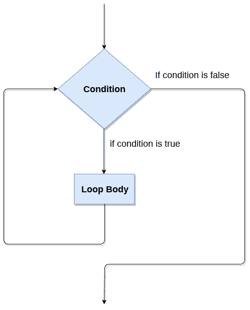

# Python `While`循环

> 原文：<https://www.javatpoint.com/python-while-loop>

Python `While`循环允许执行部分代码，直到给定条件返回 false。它也被称为预测试环路。

它可以被看作是一个重复的 `if`语句。当我们不知道迭代次数时，`While`循环是最有效的。

语法如下。

```py
while expression:  
    statements  

```

这里，语句可以是单个语句或一组语句。表达式应该是任何导致真或假的有效 Python 表达式。true 是任何非零值，false 是 0。

### 当循环流程图



## 循环控制语句

我们可以在使用循环控制语句执行循环时改变**的正常顺序。当 `While`循环执行完成时，该范围内定义的所有自动对象都将被拆除。Python 提供了以下控制语句在 `While`循环中使用。**

**1。`continue`语句-** 当遇到 `continue`语句时，控制转移到循环的开始。让我们理解下面的例子。

**示例:**

```py
# prints all letters except 'a' and 't' 
i = 0
str1 = 'javatpoint'

while i < len(str1): 
	if str1[i] == 'a' or str1[i] == 't': 
		i += 1
		continue
	print('Current Letter :', a[i]) 
	i += 1

```

**输出:**

```py
Current Letter : j
Current Letter : v
Current Letter : p
Current Letter : o
Current Letter : i
Current Letter : n

```

**2。`break`语句-** 当遇到 `break`语句时，它会将控制带出循环。

**示例:**

```py
# The control transfer is transfered
# when break statement soon it sees t
i = 0
str1 = 'javatpoint'

while i < len(str1): 
	if str1[i] == 't': 
		i += 1
		break
	print('Current Letter :', str1[i]) 
	i += 1

```

**输出:**

```py
Current Letter : j
Current Letter : a
Current Letter : v
Current Letter : a

```

**3。`pass`语句-**`pass`语句用于声明空循环。它也用于定义空类、函数和控制语句。让我们理解下面的例子。

**示例-**

```py
# An empty loop 
str1 = 'javatpoint'
i = 0

while i < len(str1): 
	i += 1
	pass
print('Value of i :', i)

```

**输出:**

```py
Value of i : 10

```

### 示例-1:使用 `While`循环打印 1 到 10 的程序

```py
i=1
#The while loop will iterate until condition becomes false.
While(i<=10):  
    print(i) 
    i=i+1 

```

**输出:**

```py
1
2
3
4
5
6
7
8
9
10

```

### 示例 2:打印给定数字表的程序。

```py
i=1  
number=0  
b=9  
number = int(input("Enter the number:"))  
while i<=10:  
    print("%d X %d = %d \n"%(number,i,number*i))  
    i = i+1  

```

**输出:**

```py
Enter the number:10
10 X 1 = 10 

10 X 2 = 20 

10 X 3 = 30 

10 X 4 = 40 

10 X 5 = 50 

10 X 6 = 60 

10 X 7 = 70 

10 X 8 = 80 

10 X 9 = 90 

10 X 10 = 100 

```

## 无限 `While`循环

如果 `While`循环中给出的条件永远不会变为假，那么 `While`循环永远不会终止，变成**无限 `While`循环。**

`While`循环中的任何**非零**值表示**始终为真**条件，而零表示始终为假条件。如果我们希望我们的程序在没有任何干扰的情况下连续运行，这种方法是有用的。

### 例 1

```py
while (1):  
    print("Hi! we are inside the infinite while loop")

```

**输出:**

```py
Hi! we are inside the infinite while loop
Hi! we are inside the infinite while loop

```

### 例 2

```py
var = 1  
while(var != 2):  
    i = int(input("Enter the number:"))  
    print("Entered value is %d"%(i))  

```

**输出:**

```py
Enter the number:10
Entered value is 10
Enter the number:10
Entered value is 10
Enter the number:10
Entered value is 10
Infinite time

```

## 将 else 与 `While`循环一起使用

Python 允许我们在 `While`循环中使用 else 语句。当 while 语句中给出的条件变为 false 时，执行 else 块。就像循环一样，如果 `While`循环使用 `break`语句中断，那么 else 块将不会被执行，而 else 块之后的语句将被执行。else 语句可以选择与 `While`循环一起使用。考虑下面的例子。

### 例 1

```py
i=1 
while(i<=5):  
    print(i)  
    i=i+1  
else:
    print("The while loop exhausted")  

```

### 例 2

```py
i=1  
while(i<=5):  
    print(i)  
    i=i+1  
    if(i==3):  
        break 
else:
    print("The while loop exhausted")

```

**输出:**

```py
1
2

```

在上面的代码中，当遇到 `break`语句时，`While`循环停止执行并跳过 else 语句。

### 示例-3 打印斐波那契数列到给定极限的程序

```py
terms = int(input("Enter the terms "))
# first two intial terms
a = 0
b = 1
count = 0

# check if the number of terms is Zero or negative
if (terms <= 0):
   print("Please enter a valid integer")
elif (terms == 1):
   print("Fibonacci sequence upto",limit,":")
   print(a)
else:
   print("Fibonacci sequence:")
   while (count < terms) :
       print(a, end = ' ')
       c = a + b
       # updateing values
       a = b
       b = c

    count += 1

```

**输出:**

```py
Enter the terms 10
Fibonacci sequence:
0 1 1 2 3 5 8 13 21 34 

```

* * *