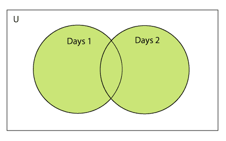
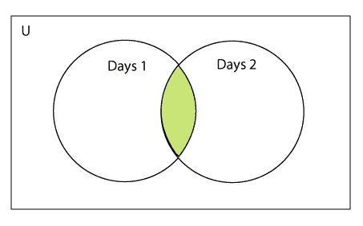
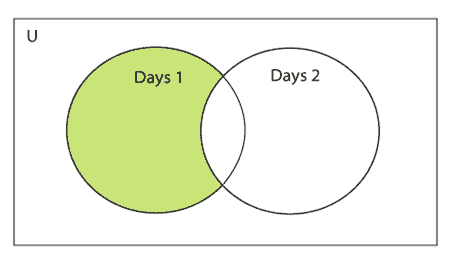
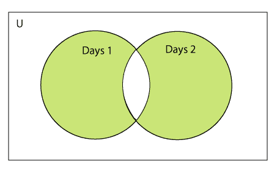

# Python 集

> 原文：<https://www.javatpoint.com/python-set>

Python 集合是无序项目的集合。集合中的每个元素必须是唯一的、不可变的，并且集合移除重复的元素。集合是可变的，这意味着我们可以在它创建后修改它。

与 Python 中的其他集合不同，集合的元素没有附加索引，即我们不能通过索引直接访问集合的任何元素。但是，我们可以一起打印它们，或者我们可以通过循环集合来获得元素列表。

## 创建集合

可以通过用花括号{}将逗号分隔的不可变项括起来来创建集合。Python 还提供了 set()方法，可用于通过传递的序列创建集合。

### 示例 1:使用大括号

```py
Days = {"Monday", "Tuesday", "Wednesday", "Thursday", "Friday", "Saturday", "Sunday"}  
print(Days)  
print(type(Days))  
print("looping through the set elements ... ")  
for i in Days:  
    print(i)  

```

**输出:**

```py
{'Friday', 'Tuesday', 'Monday', 'Saturday', 'Thursday', 'Sunday', 'Wednesday'}
<class 'set'>
looping through the set elements ... 
Friday
Tuesday
Monday
Saturday
Thursday
Sunday
Wednesday

```

### 示例 2:使用 set()方法

```py
Days = set(["Monday", "Tuesday", "Wednesday", "Thursday", "Friday", "Saturday", "Sunday"])  
print(Days)  
print(type(Days))  
print("looping through the set elements ... ")  
for i in Days:  
    print(i)  

```

**输出:**

```py
{'Friday', 'Wednesday', 'Thursday', 'Saturday', 'Monday', 'Tuesday', 'Sunday'}
<class 'set'>
looping through the set elements ... 
Friday
Wednesday
Thursday
Saturday
Monday
Tuesday
Sunday

```

它可以包含任何类型的元素，如整数、浮点、元组等。但是可变元素(列表、字典、集合)不能是集合的成员。考虑下面的例子。

```py
# Creating a set which have immutable elements
set1 = {1,2,3, "JavaTpoint", 20.5, 14}
print(type(set1))
#Creating a set which have mutable element
set2 = {1,2,3,["Javatpoint",4]}
print(type(set2))

```

**输出:**

```py
<class 'set'>

Traceback (most recent call last)
<ipython-input-5-9605bb6fbc68> in <module>
      4 
      5 #Creating a set which holds mutable elements
----> 6 set2 = {1,2,3,["Javatpoint",4]}
      7 print(type(set2))

TypeError: unhashable type: 'list'

```

在上面的代码中，我们创建了两个集合，集合**集合**有不可变元素，集合 2 有一个可变元素作为列表。在检查 set2 的类型时，它引发了一个错误，这意味着 set 只能包含不可变的元素。

创建空集合有点不同，因为空的大括号{}也用于创建字典。所以 Python 提供了 set()方法，在没有参数的情况下创建一个空集合。

```py
# Empty curly braces will create dictionary
set3 = {}
print(type(set3))

# Empty set using set() function
set4 = set()
print(type(set4))

```

**输出:**

```py
<class 'dict'>
<class 'set'>

```

让我们看看如果我们向集合提供重复的元素会发生什么。

```py
set5 = {1,2,4,4,5,8,9,9,10}
print("Return set with unique elements:",set5)

```

**输出:**

```py
Return set with unique elements: {1, 2, 4, 5, 8, 9, 10}

```

在上面的代码中，我们可以看到**集合 5** 由多个重复的元素组成，当我们打印它时，从集合中移除重复。

## 向集合中添加项目

Python 提供了 **add()** 方法和 **update()** 方法，可用于向集合中添加特定的项目。add()方法用于添加单个元素，而 update()方法用于向集合中添加多个元素。考虑下面的例子。

### 示例:1 -使用 add()方法

```py
Months = set(["January","February", "March", "April", "May", "June"])  
print("\nprinting the original set ... ")  
print(months)  
print("\nAdding other months to the set...");  
Months.add("July");  
Months.add ("August");  
print("\nPrinting the modified set...");  
print(Months)  
print("\nlooping through the set elements ... ")  
for i in Months:  
    print(i)  

```

**输出:**

```py
printing the original set ... 
{'February', 'May', 'April', 'March', 'June', 'January'}

Adding other months to the set...

Printing the modified set...
{'February', 'July', 'May', 'April', 'March', 'August', 'June', 'January'}

looping through the set elements ... 
February
July
May
April
March
August
June
January 

```

要在集合中添加多个项目，Python 提供了 **update()** 方法。它接受 iterable 作为参数。

考虑下面的例子。

### 示例- 2 使用 update()函数

```py
Months = set(["January","February", "March", "April", "May", "June"])  
print("\nprinting the original set ... ")  
print(Months)  
print("\nupdating the original set ... ")  
Months.update(["July","August","September","October"]);  
print("\nprinting the modified set ... ")   
print(Months);

```

**输出:**

```py
printing the original set ... 
{'January', 'February', 'April', 'May', 'June', 'March'}

updating the original set ... 
printing the modified set ... 
{'January', 'February', 'April', 'August', 'October', 'May', 'June', 'July', 'September', 'March'}

```

## 从集合中移除项目

Python 提供了**丢弃()**方法和**移除()**方法，可用于从器械包中移除物品。这些函数之间的区别，使用 discard()函数如果集合中不存在该项，则集合保持不变，而 remove()方法将通过一个错误。

考虑下面的例子。

### 示例-1 使用丢弃()方法

```py
months = set(["January","February", "March", "April", "May", "June"])  
print("\nprinting the original set ... ")  
print(months)  
print("\nRemoving some months from the set...");  
months.discard("January");  
months.discard("May");  
print("\nPrinting the modified set...");  
print(months)  
print("\nlooping through the set elements ... ")  
for i in months:  
    print(i)  

```

**输出:**

```py
printing the original set ... 
{'February', 'January', 'March', 'April', 'June', 'May'}

Removing some months from the set...

Printing the modified set...
{'February', 'March', 'April', 'June'}

looping through the set elements ... 
February
March
April
June

```

Python 还提供了 **remove()** 方法来从集合中移除项目。考虑以下示例，使用**移除()**方法移除项目。

### 示例-2 使用 remove()函数

```py
months = set(["January","February", "March", "April", "May", "June"])  
print("\nprinting the original set ... ")  
print(months)  
print("\nRemoving some months from the set...");  
months.remove("January");  
months.remove("May");  
print("\nPrinting the modified set...");  
print(months)  

```

**输出:**

```py
printing the original set ... 
{'February', 'June', 'April', 'May', 'January', 'March'}

Removing some months from the set...

Printing the modified set...
{'February', 'June', 'April', 'March'}

```

我们还可以使用 pop()方法移除该项。一般来说，pop()方法总是会删除最后一项，但是集合是无序的，我们无法确定从集合中弹出哪个元素。

考虑以下示例，使用 pop()方法从集合中移除该项。

```py
Months = set(["January","February", "March", "April", "May", "June"])  
print("\nprinting the original set ... ")  
print(Months)  
print("\nRemoving some months from the set...");  
Months.pop();  
Months.pop();  
print("\nPrinting the modified set...");  
print(Months)  

```

**输出:**

```py
printing the original set ... 
{'June', 'January', 'May', 'April', 'February', 'March'}

Removing some months from the set...

Printing the modified set...
{'May', 'April', 'February', 'March'}

```

在上面的代码中，**月**集合的最后一个元素是**3 月**，但是 pop()方法删除了**6 月和 1 月**，因为集合是无序的，pop()方法无法确定集合的最后一个元素。

Python 提供了 clear()方法来从集合中移除所有项目。

考虑下面的例子。

```py
Months = set(["January","February", "March", "April", "May", "June"])  
print("\nprinting the original set ... ")  
print(Months)  
print("\nRemoving all the items from the set...");  
Months.clear()  
print("\nPrinting the modified set...")  
print(Months)  

```

**输出:**

```py
printing the original set ... 
{'January', 'May', 'June', 'April', 'March', 'February'}

Removing all the items from the set...

Printing the modified set...
set()

```

## 丢弃()和移除()之间的区别

尽管 **discard()** 和 **remove()** 方法都执行相同的任务，但是 discard()和 remove()之间有一个主要区别。

如果要使用 discard()从集合中删除的密钥在集合中不存在，Python 不会给出错误。程序保持其控制流程。

另一方面，如果要使用 remove()从集合中删除的项目在集合中不存在，Python 将会引发错误。

考虑下面的例子。

### 示例-

```py
Months = set(["January","February", "March", "April", "May", "June"])  
print("\nprinting the original set ... ")  
print(Months)  
print("\nRemoving items through discard() method...");  
Months.discard("Feb"); #will not give an error although the key feb is not available in the set  
print("\nprinting the modified set...")  
print(Months)  
print("\nRemoving items through remove() method...");  
Months.remove("Jan") #will give an error as the key jan is not available in the set.   
print("\nPrinting the modified set...")  
print(Months)  

```

**输出:**

```py
printing the original set ... 
{'March', 'January', 'April', 'June', 'February', 'May'}

Removing items through discard() method...

printing the modified set...
{'March', 'January', 'April', 'June', 'February', 'May'}

Removing items through remove() method...
Traceback (most recent call last):
  File "set.py", line 9, in 
    Months.remove("Jan")
KeyError: 'Jan'

```

## Python 集合运算

集合可以进行数学运算，如并集、交集、差集和对称差集。Python 提供了用操作符或方法执行这些操作的工具。我们将这些操作描述如下。

### 两个集合的并集

两个集合的并集是使用管道(|)运算符计算的。这两个集合的并集包含这两个集合中存在的所有项。



考虑下面的例子来计算两个集合的并集。

**例 1:使用 union |运算符**

```py
Days1 = {"Monday","Tuesday","Wednesday","Thursday", "Sunday"}  
Days2 = {"Friday","Saturday","Sunday"}  
print(Days1|Days2) #printing the union of the sets   

```

**输出:**

```py
{'Friday', 'Sunday', 'Saturday', 'Tuesday', 'Wednesday', 'Monday', 'Thursday'}

```

Python 还提供了**并集()**方法，也可以用来计算两个集合的并集。考虑下面的例子。

**例 2:使用 union()方法**

```py
Days1 = {"Monday","Tuesday","Wednesday","Thursday"}  
Days2 = {"Friday","Saturday","Sunday"}  
print(Days1.union(Days2)) #printing the union of the sets   

```

**输出:**

```py
{'Friday', 'Monday', 'Tuesday', 'Thursday', 'Wednesday', 'Sunday', 'Saturday'}

```

### 两个集合的交集

两个集合的交集可以通过**和&** 操作符或**交集()功能**进行。两个集合的交集被给出为两个集合中公共的元素的集合。



考虑下面的例子。

**例 1:使用&算子**

```py
Days1 = {"Monday","Tuesday", "Wednesday", "Thursday"}  
Days2 = {"Monday","Tuesday","Sunday", "Friday"}  
print(Days1&Days2) #prints the intersection of the two sets  

```

**输出:**

```py
{'Monday', 'Tuesday'}

```

**例 2:使用交集()方法**

```py
set1 = {"Devansh","John", "David", "Martin"}  
set2 = {"Steve", "Milan", "David", "Martin"}  
print(set1.intersection(set2)) #prints the intersection of the two sets  

```

**输出:**

```py
{'Martin', 'David'}

```

**例 3:**

```py
set1 = {1,2,3,4,5,6,7}
set2 = {1,2,20,32,5,9}
set3 = set1.intersection(set2)
print(set3)

```

**输出:**

```py
{1,2,5}

```

## 交集 _update()方法

**交集 _ 更新()**方法从原始集合中移除两个集合中不存在的项目(如果指定了多个集合，则移除所有集合)。

**交集 _ 更新()**方法不同于交集()方法，因为它通过移除不需要的项目来修改原始集合，另一方面，交集()方法返回新的集合。

考虑下面的例子。

```py
a = {"Devansh", "bob", "castle"}  
b = {"castle", "dude", "emyway"}  
c = {"fuson", "gaurav", "castle"}  

a.intersection_update(b, c)  

print(a)  

```

**输出:**

```py
{'castle'}

```

## 两套之间的差异

两个集合的差可以用减法(-)运算符或**交集()**方法计算。假设有两个集合 A 和 B，不同的是 A-B 表示结果集合将获得集合 B 中不存在的元素 A



考虑下面的例子。

**例 1:使用减法(-)运算符**

```py
Days1 = {"Monday",  "Tuesday", "Wednesday", "Thursday"}  
Days2 = {"Monday", "Tuesday", "Sunday"}  
print(Days1-Days2) #{"Wednesday", "Thursday" will be printed}  

```

**输出:**

```py
{'Thursday', 'Wednesday'}

```

**例 2:使用差分()方法**

```py
Days1 = {"Monday",  "Tuesday", "Wednesday", "Thursday"}  
Days2 = {"Monday", "Tuesday", "Sunday"}  
print(Days1.difference(Days2)) # prints the difference of the two sets Days1 and Days2  

```

**输出:**

```py
{'Thursday', 'Wednesday'}

```

## 两组对称差

两组对称差用^算子或**对称 _ 差()**法计算。集合的对称差，它去掉了存在于两个集合中的元素。考虑以下示例:



**示例- 1:使用^算子**

```py
a = {1,2,3,4,5,6}
b = {1,2,9,8,10}
c = a^b
print(c)

```

**输出:**

```py
{3, 4, 5, 6, 8, 9, 10}

```

**例- 2:使用对称 _ 差分()方法**

```py
a = {1,2,3,4,5,6}
b = {1,2,9,8,10}
c = a.symmetric_difference(b)
print(c)

```

**输出:**

```py
{3, 4, 5, 6, 8, 9, 10}

```

## 设置比较

Python 允许我们对集合使用比较运算符，即、<=, > =、==，通过比较运算符，我们可以检查一个集合是子集、超集还是其他集合的等价集合。根据集合中存在的项目，返回布尔值 true 或 false。

考虑下面的例子。

```py
Days1 = {"Monday",  "Tuesday", "Wednesday", "Thursday"}  
Days2 = {"Monday", "Tuesday"}  
Days3 = {"Monday", "Tuesday", "Friday"}  

#Days1 is the superset of Days2 hence it will print true.   
print (Days1>Days2)   

#prints false since Days1 is not the subset of Days2   
print (Days1
```

**输出:**

```py
True
False
False

```

## FrozenSets

冻结集是正规集的不可变形式，即冻结集的项目不能改变，因此它可以用作字典中的关键字。

创建后不能更改冻结集的元素。我们不能通过使用 add()或 remove()等方法来更改或追加冻结集的内容。

frozenset()方法用于创建 frozenset 对象。可迭代序列被传递到这个方法中，该方法被转换成冻结集作为该方法的返回类型。

考虑以下示例来创建冻结集。

```py
Frozenset = frozenset([1,2,3,4,5])   
print(type(Frozenset))  
print("\nprinting the content of frozen set...")  
for i in Frozenset:  
    print(i);  
Frozenset.add(6) #gives an error since we cannot change the content of Frozenset after creation   

```

**输出:**

```py
<class 'frozenset'>

printing the content of frozen set...
1
2
3
4
5
Traceback (most recent call last):
  File "set.py", line 6, in <module>
    Frozenset.add(6) #gives an error since we can change the content of Frozenset after creation 
AttributeError: 'frozenset' object has no attribute 'add'

```

## 为字典做准备

如果我们将字典作为 frozenset()方法中的序列传递，它将只从字典中获取键，并返回一个 frozenset，该 frozen set 包含字典的键作为其元素。

考虑下面的例子。

```py
Dictionary = {"Name":"John", "Country":"USA", "ID":101}   
print(type(Dictionary))  
Frozenset = frozenset(Dictionary); #Frozenset will contain the keys of the dictionary  
print(type(Frozenset))  
for i in Frozenset:   
    print(i)  

```

**输出:**

```py
<class 'dict'>
<class 'frozenset'>
Name
Country
ID

```

### 设置编程示例

**示例- 1:** 编写一个程序，从集合中删除给定的数字。

```py
my_set = {1,2,3,4,5,6,12,24}
n = int(input("Enter the number you want to remove"))
my_set.discard(n)
print("After Removing:",my_set)

```

**输出:**

```py
Enter the number you want to remove:12
After Removing: {1, 2, 3, 4, 5, 6, 24}

```

**示例- 2:** 编写一个程序，向集合中添加多个元素。

```py
set1 = set([1,2,4,"John","CS"])
set1.update(["Apple","Mango","Grapes"])
print(set1)

```

**输出:**

```py
{1, 2, 4, 'Apple', 'John', 'CS', 'Mango', 'Grapes'}

```

**例- 3:** 写一个程序，求两个集合的并集。

```py
set1 = set(["Peter","Joseph", 65,59,96])
set2  = set(["Peter",1,2,"Joseph"])
set3 = set1.union(set2)
print(set3)

```

**输出:**

```py
{96, 65, 2, 'Joseph', 1, 'Peter', 59}

```

**例- 4:** 写一个程序，找出两个集合的交集。

```py
set1 = {23,44,56,67,90,45,"Javatpoint"}
set2 = {13,23,56,76,"Sachin"}
set3 = set1.intersection(set2)
print(set3)

```

**输出:**

```py
{56, 23}

```

**示例- 5:** 编写向 frozenset 添加元素的程序。

```py
set1 = {23,44,56,67,90,45,"Javatpoint"}
set2 = {13,23,56,76,"Sachin"}
set3 = set1.intersection(set2)
print(set3)

```

**输出:**

```py
TypeError: 'frozenset' object does not support item assignment

```

上面的代码引发了一个错误，因为 frozensets 是不可变的，创建后不能更改。

**例- 6:** 编写程序，找到发布者、发布者和超集。

```py
set1 = set(["Peter","James","Camroon","Ricky","Donald"])
set2 = set(["Camroon","Washington","Peter"])
set3 = set(["Peter"])

issubset = set1 >= set2
print(issubset)
issuperset = set1 <= set2
print(issuperset)
issubset = set3 <= set2
print(issubset)
issuperset = set2 >= set3
print(issuperset)

```

**输出:**

```py
False
False
True
True

```

* * *

## Python 内置的集合方法

Python 包含以下用于集合的方法。

| 塞内加尔 | 方法 | 描述 |
| one | [增加(项)](python-set-add-method) | 它向集合中添加一个项目。如果该项目已经存在于集合中，则没有效果。 |
| Two | 清除() | 它会从集合中删除所有项目。 |
| three | 复制() | 它返回集合的一个浅拷贝。 |
| four | 差异 _ 更新(....) | 它通过删除指定集合中的所有项目来修改该集合。 |
| five | [丢弃(物品)](python-set-discard-method) | 它从集合中移除指定的项目。 |
| six | 交叉点() | 它返回一个只包含两个集合的公共元素的新集合。(如果指定了两个以上的集合，则为所有集合)。 |
| seven | 交集 _ 更新(....) | 它从原始集合中删除两个集合中不存在的项目(如果指定了多个集合，则删除所有集合)。 |
| eight | Isdisjoint(....) | 如果两个集合有空交集，则返回真。 |
| nine | Issubset（....） | 报告另一个集合是否包含此集合。 |
| Ten | Issuperset(....) | 报告此集合是否包含另一个集合。 |
| Eleven | [pop()](python-set-pop-method) | 移除并返回任意集合元素，即该集合的最后一个元素。如果集合为空，则引发键错误。 |
| Twelve | [移除(项目)](python-set-remove-method) | 从集合中移除元素；它必须是一个成员。如果元素不是成员，则引发键错误。 |
| Thirteen | 对称 _ 差异(....) | 从集合中移除元素；它必须是一个成员。如果元素不是成员，则引发键错误。 |
| Fourteen | 对称 _ 差异 _ 更新(....) | 用自身和另一个的对称差更新一个集合。 |
| Fifteen | 工会(....) | 将集合的并集作为新集合返回。
(即任一集合中的所有元素。) |
| Sixteen | 更新() | 用自己和他人的联合来更新集合。 |

* * *