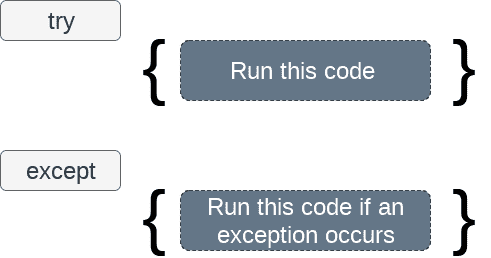
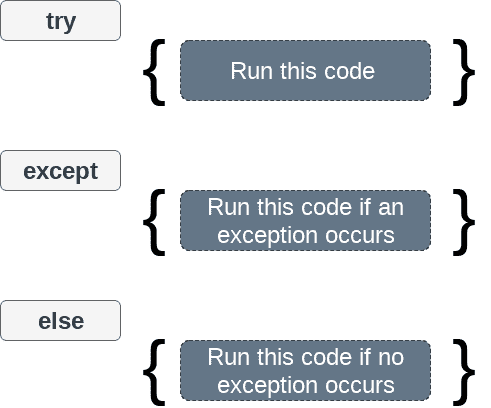
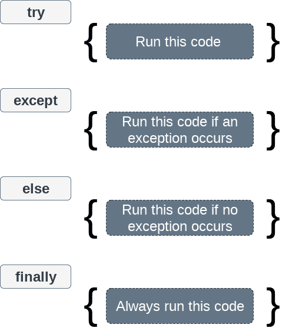

# Python 异常

> 原文：<https://www.javatpoint.com/python-exception-handling>

异常可以定义为程序中导致程序流程中断的异常情况。

每当出现异常时，程序就会停止执行，因此不会执行下一个代码。因此，一个例外是无法处理 Python 脚本的运行时错误。异常是表示错误的 Python 对象

Python 提供了一种处理异常的方法，这样代码就可以在没有任何中断的情况下执行。如果我们不处理异常，解释器就不会执行异常后存在的所有代码。

Python 有许多**内置异常**，使我们的程序能够不间断运行并给出输出。这些例外情况如下:

## 常见例外

Python 提供了内置异常的数量，但这里我们描述的是常见的标准异常。下面列出了标准 Python 程序可能引发的常见异常。

1.  **零除错误:**当一个数被零除时发生。
2.  **名称错误:**找不到名称时出现。它可能是局部的，也可能是全局的。
3.  **缩进错误:**如果给出了不正确的缩进。
4.  **IOError:** 输入输出操作失败时出现。
5.  **EOFError:** 当到达文件末尾，但仍在执行操作时，就会出现这种情况。

* * *

## 不处理异常的问题

正如我们已经讨论过的，异常是中止程序执行的异常情况。

假设我们有两个变量 **a** 和 **b** ，它们接受用户的输入并执行这些值的除法。如果用户输入零作为分母呢？它将中断程序执行，并通过一个**零分**异常。让我们看看下面的例子。

### 例子

```py

a = int(input("Enter a:"))  
b = int(input("Enter b:"))  
c = a/b
print("a/b = %d" %c)  

#other code:  
print("Hi I am other part of the program")

```

**输出:**

```py
Enter a:10
Enter b:0
Traceback (most recent call last):
  File "exception-test.py", line 3, in <module>
    c = a/b;
ZeroDivisionError: division by zero

```

上面的程序在语法上是正确的，但是它由于异常输入而出错。这种编程可能不适合或不推荐项目，因为这些项目需要不间断的执行。这就是为什么异常处理在处理这些意外异常时起着重要作用。我们可以用以下方式处理这些异常。

## python 中的异常处理

### 尝试-期望语句

如果 Python 程序包含可能引发异常的可疑代码，我们必须将该代码放在 **try** 块中。 **try** 块后面必须跟有**除了**语句，该语句包含一个代码块，如果 try 块中有异常，将执行该代码块。



**语法**

```py

try:  
    #block of code   

except Exception1:  
    #block of code  

except Exception2:  
    #block of code  

#other code  

```

考虑下面的例子。

**例 1**

```py

try:
    a = int(input("Enter a:"))  
    b = int(input("Enter b:"))  
    c = a/b
except:
    print("Can't divide with zero")

```

**输出:**

```py
Enter a:10
Enter b:0
Can't divide with zero

```

我们还可以将 else 语句与 try-except 语句一起使用，在 try 语句中，如果 try 块中没有发生异常，我们可以放置将在场景中执行的代码。

下面给出了将 else 语句与 try-except 语句一起使用的语法。

```py

try:  
    #block of code   

except Exception1:  
    #block of code   

else:  
    #this code executes if no except block is executed  

```



考虑以下程序。

**例 2**

```py

try:  
    a = int(input("Enter a:"))  
    b = int(input("Enter b:"))  
    c = a/b
    print("a/b = %d"%c)  
# Using Exception with except statement. If we print(Exception) it will return exception class
except Exception:  
    print("can't divide by zero")  
    print(Exception)
else:  
    print("Hi I am else block")   

```

**输出:**

```py
Enter a:10
Enter b:0
can't divide by zero
<class 'Exception'>

```

## 无例外的例外语句

Python 提供了不在异常语句中指定异常名称的灵活性。

考虑下面的例子。

**例**

```py

try:  
    a = int(input("Enter a:"))  
    b = int(input("Enter b:"))  
    c = a/b;  
    print("a/b = %d"%c)  
except:  
    print("can't divide by zero")  
else:  
    print("Hi I am else block")   

```

### 与异常变量一起使用的 except 语句

除了语句，我们可以将异常变量与**一起使用。使用**作为**关键字。该对象将返回异常的原因。考虑以下示例:**

```py

try:  
    a = int(input("Enter a:"))  
    b = int(input("Enter b:"))  
    c = a/b
    print("a/b = %d"%c)  
    # Using exception object with the except statement
except Exception as e:  
    print("can't divide by zero")  
    print(e)
else:  
    print("Hi I am else block")   

```

**输出:**

```py
Enter a:10
Enter b:0
can't divide by zero
division by zero

```

## 需要记住的要点

1.  Python 方便我们不用 except 语句指定异常。
2.  我们可以在 except 语句中声明多个异常，因为 try 块可能包含引发不同类型异常的语句。
3.  我们还可以在 try-except 语句中指定一个 else 块，如果 try 块中没有引发异常，就会执行该语句。
4.  不抛出异常的语句应该放在 else 块中。

**例**

```py

try:  
    #this will throw an exception if the file doesn't exist.   
    fileptr = open("file.txt","r")  
except IOError:  
    print("File not found")  
else:  
    print("The file opened successfully")  
    fileptr.close()  

```

**输出:**

```py
File not found

```

## 声明多个异常

Python 允许我们用 except 子句声明多个异常。在 try 块引发多个异常的情况下，声明多个异常非常有用。语法如下。

**语法**

```py

try:  
    #block of code   

except (<Exception 1>,<Exception 2>,<Exception 3>,...<Exception n>)  
    #block of code   

else:  
    #block of code  

```

考虑下面的例子。

```py

try:    
    a=10/0;    
except(ArithmeticError, IOError):    
    print("Arithmetic Exception")    
else:    
    print("Successfully Done")     

```

**输出:**

```py
Arithmetic Exception

```

## 尝试...最后封锁

Python 提供了可选的 **finally** 语句，与 **try** 语句一起使用。无论发生什么异常，它都会被执行，并用于释放外部资源。finally 块为执行提供了保证。

我们可以将 finally 块与 try 块一起使用，在 try 块中我们可以调整必要的代码，这些代码必须在 try 语句引发异常之前执行。

下面给出了使用 finally 块的语法。

**语法**

```py

try:  
    # block of code   
    # this may throw an exception  
finally:  
    # block of code  
    # this will always be executed   

```



**例**

```py

try:  
    fileptr = open("file2.txt","r")    
    try:  
        fileptr.write("Hi I am good")  
    finally:  
        fileptr.close()  
        print("file closed")  
except:  
    print("Error")  

```

**输出:**

```py
file closed
Error

```

## 引发异常

使用 Python 中的 **raise** 子句可以强制引发异常。在我们需要引发异常来停止程序执行的场景中，这非常有用。

例如，有一个程序需要 2GB 内存来执行，如果程序试图占用 2GB 内存，那么我们可以引发一个异常来停止程序的执行。

下面给出了使用 raise 语句的语法。

**语法**

```py

raise Exception_class,<value>  

```

**记分**

1.  若要引发异常，请使用 raise 语句。异常类名紧随其后。
2.  可以为异常提供一个可以在括号中给出的值。
3.  使用关键字访问值“**”作为**。” **e** 用作存储异常值的参考变量。
4.  我们可以将该值传递给异常，以指定异常类型。

**例**

```py

try:  
    age = int(input("Enter the age:"))  
    if(age<18):  
        raise ValueError 
    else:  
        print("the age is valid")  
except ValueError:  
    print("The age is not valid")  

```

**输出:**

```py
Enter the age:17
The age is not valid

```

**示例 2 通过消息**引发异常

```py

try:
     num = int(input("Enter a positive integer: "))
     if(num <= 0):
# we can pass the message in the raise statement
         raise ValueError("That is  a negative number!")
except ValueError as e:
     print(e)

```

**输出:**

```py
Enter a positive integer: -5
That is a negative number!

```

**例 3**

```py

try:  
    a = int(input("Enter a:"))  
    b = int(input("Enter b:"))  
    if b is 0:  
        raise ArithmeticError
    else:  
        print("a/b = ",a/b)  
except ArithmeticError:  
    print("The value of b can't be 0")

```

**输出:**

```py
Enter a:10
Enter b:0
The value of b can't be 0

```

## 自定义例外

Python 允许我们创建可以从程序中引发并使用 except 子句捕获的异常。但是，我们建议您在访问 Python 对象和类后阅读这一部分。

考虑下面的例子。

**例**

```py

class ErrorInCode(Exception):    
    def __init__(self, data):    
        self.data = data    
    def __str__(self):    
        return repr(self.data)    

try:    
    raise ErrorInCode(2000)    
except ErrorInCode as ae:    
    print("Received error:", ae.data)    

```

**输出:**

```py
Received error: 2000

```

* * *