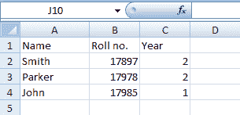

# Python 读取 excel 文件

> 原文：<https://www.javatpoint.com/python-read-excel-file>

Excel 是微软开发的电子表格应用。它是一个易于访问的工具，用于组织、分析和存储表中的数据。它广泛应用于世界各地的许多不同应用中。从分析师到首席执行官，各种专业人士都使用 Excel 进行快速统计和认真的数据处理。

## Excel 文档

Excel 电子表格文档称为工作簿，保存在带有**的文件中。xlsx** 分机。电子表格的第一行主要保留给标题，而第一列标识采样单位。每个工作簿可以包含多个工作表，这些工作表也称为工作表。位于特定列和行的框称为单元格，每个单元格可以包含一个数字或文本值。包含数据的单元格网格形成一张工作表。

活动工作表被定义为用户当前正在查看或在关闭 Excel 之前最后一次查看的工作表。

## 从 Excel 文件中读取

首先，你需要写一个命令来安装 **xlrd** 模块。

```py

pip install xlrd  

```

## 创建工作簿

工作簿包含 excel 文件中的所有数据。您可以从头开始创建新的工作簿，也可以从已经存在的 excel 文件轻松创建工作簿。

**输入文件**

我们已经拍摄了工作簿的快照。



**代码**

```py

# Import the xlrd module    
import xlrd   

# Define the location of the file   
loc = ("path of file")   

# To open the Workbook   
wb = xlrd.open_workbook(loc)   
sheet = wb.sheet_by_index(0)   

# For row 0 and column 0   
sheet.cell_value(0, 0)

```

**说明:**在上例中，我们首先导入了 xlrd 模块，定义了文件的位置。然后，我们从已经存在的 excel 文件中打开了工作簿。

## 从 Pandas 那里阅读

Pandas 被定义为建立在 NumPy 库之上的开源库。它为用户提供了快速分析、数据清理和数据准备，并支持来自 URL 的 xls 和 xlsx 扩展。

这是一个 python 包，它提供了一种称为数据帧的有益数据结构。

**例**

```py

Example - 
import pandas as pd  

# Read the file  
data = pd.read_csv(".csv", low_memory=False)  

# Output the number of rows  
print("Total rows: {0}".format(len(data)))  

# See which headers are available  
print(list(data))  

```

## 阅读 openpyxl

首先，我们需要从命令行使用 pip 安装一个 openpyxl 模块。

```py

pip install openpyxl  

```

之后，我们需要导入模块。

我们还可以使用 openpyxl 从现有的电子表格中读取数据。它还允许用户执行计算并添加不属于原始数据集的内容。

**例**

```py

import openpyxl  
my_wb = openpyxl.Workbook()  
my_sheet = my_wb.active  
my_sheet_title = my_sheet.title  
print("My sheet title: " + my_sheet_title)  

```

**输出:**

```py
My sheet title: Sheet

```

要了解 openpyxl 的更多信息，请访问我们完整的教程[点击此处](https://www.javatpoint.com/python-openpyxl)。我们已经在本教程中讨论了基本细节。

* * *