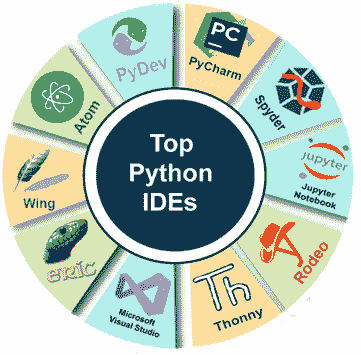
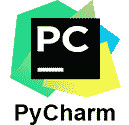
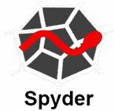
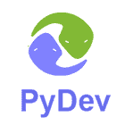
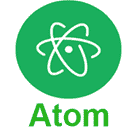
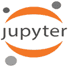
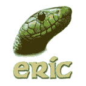

# Python IDEs

> 原文：<https://www.javatpoint.com/python-ides>

IDE 代表集成开发环境，被定义为有助于自动化编辑、编译、测试等过程的编码工具。它为开发人员运行、编写和调试代码提供了便利。

它是专门为软件开发设计的，由几个用于开发和测试软件的工具组成。

下面是一些 Python IDEs:

*   [PyCharm](#PyCharm)
*   [Spyder](#Spyder)
*   [PyDev](#PyDev)
*   [原子](#Atom)
*   [翼](#Wing)
*   [Jupyter 笔记型电脑](#JupyterNotebook)
*   [千年一遇](#Thonny)
*   [竞技表演](#Rodeo)
*   [微软 Visual Studio](#MicrosoftVisualStudio)
*   [埃里克](#Eric)

* * *

## PyCharm

PyCharm 是由 Jet Brains 开发的，是专门为 python 设计的跨平台集成开发环境(IDE)。它是使用最广泛的集成开发环境，既有付费版本，也有免费开源版本。它通过处理日常任务节省了大量时间。

它是一个完整的 python IDE，加载了一组丰富的功能，如自动代码完成、快速项目导航、快速错误检查和更正、远程开发支持、数据库可访问性等。

### 特征

*   智能代码导航
*   突出显示错误
*   强大的调试器
*   支持 Python web 开发框架，即 Angular JS、Javascript

* * *

## 斯派德

Spyder 是一个开源的，在 IDE 市场有很高的认可度，最适合数据科学。Spyder 的全称是科学 Python 开发环境。它支持所有重要的平台 Linux、Windows 和 MacOS X。

它提供了一组功能，如本地化代码编辑器、文档查看器、变量资源管理器、集成控制台等。并支持 NumPy、SciPy 等多个科学模块。

### 特征

*   正确的语法突出显示和自动代码完成
*   与 IPython 控制台强集成
*   在多语言编辑器和自动代码完成模式下表现良好

* * *

## 派德夫

PyDev 被定义为常用的 Python IDE 之一，它是 Eclipse 的外部插件。作为 Python 解释器，这是来自 Java 背景的 Python 开发人员的自然选择，在市场上非常受欢迎。

亚历山大·托蒂克因其对马赛克浏览器的贡献而闻名，并在 2003-2004 年期间参与了 Pydev 项目。

Pydev 有一个特性，包括 Django 集成、自动代码完成、智能缩进和块缩进等。

### 特征

*   强参数，如重构、调试、代码分析和代码覆盖函数。
*   它支持虚拟环境、Mypy 和黑色格式化程序。
*   还支持 PyLint 集成、远程调试器、单元测试集成等。

* * *

## 原子

Atom 是由 GitHub 开发的，最初是作为开源的、跨平台的。它基于一个框架，即电子，该框架支持使用 Chromium 和 Node.js 的跨平台桌面应用程序，通常被称为“21 世纪的可黑客文本编辑器”。

### 特征

*   在 Atom 上可视化结果，无需打开任何其他窗口。
*   一个名为“降价预览 Plus”的插件为编辑和可视化降价文件提供了内置支持。

* * *

## 翼

它被定义为一个跨平台的集成开发环境，包含了必要的特性和良好的开发支持。它的个人版是免费的。专业版有 30 天的试用期，供开发者试用。

它有几个功能，包括自动完成、语法突出显示、缩进和调试。

### 特征

*   可定制，也可以扩展。
*   支持远程开发、测试驱动开发以及单元测试。

* * *

## Jupyter 笔记型电脑

Jupyter 是数据科学行业中使用最多的 IPython 笔记本编辑器之一。它是一个基于服务器-客户端结构的 web 应用程序，允许您创建和操作笔记本文档。它充分利用了 python 是一种解释语言的事实。

### 特征

*   支持降价
*   轻松创建和编辑代码
*   数据科学初学者的理想选择

* * *

## Thonny

Thonny 是另一个最适合学习和教授编程的 IDE。它是塔尔图大学开发的软件，支持代码完成和突出语法错误。

### 特征

*   简单调试器
*   支持突出显示错误和自动完成代码

* * *

## 竞技

Rodeo 被定义为 python 最好的 IDE 之一，最广泛地用于数据科学项目，如从不同的资源中获取数据和信息。

它支持跨平台功能，并提供自动完成代码。

### 特征

*   允许用于比较数据、交互、绘图和检查数据的功能。
*   自动代码完成，语法荧光笔，可视化文件导航器等。

* * *

## 工具

微软 Visual Studio 是一个开源代码编辑器，最适合于最新网络和云项目的开发和调试。它有自己的扩展市场。

### 特征

*   支持 Visual studio 中的 Python 编码
*   有付费版和免费版

* * *

## 埃里克 python

埃里克 Python 是一个用 Python 本身开发的编辑器，可以用于专业和非专业工作。

### 特征

*   提供可配置的窗口布局，编辑器，源代码折叠
*   高级项目管理能力，版本控制
*   内置调试器和任务管理支持