# Python 中的 Gmail API

> 原文：<https://www.javatpoint.com/gmail-api-in-python>

在本教程中，我们将学习 Python 中的 Gmail API，我们还将学习如何使用 Python 中的 Gmail API 来执行许多 Gmail 操作，如发送电子邮件、搜索电子邮件、删除电子邮件等。为此，我们将学习在 Python 脚本中设置 Gmail API。首先，让我们简单介绍一下 Gmail API 及其基本介绍。

## Gmail APIs

Gmail 是当今世界上最受欢迎的邮件服务，几乎所有人和许多组织都在使用它。在过去的几年里，许多 Gmail 功能随着人工智能的使用而得到了增强，包括撰写电子邮件时的建议和安全功能(检测欺诈和垃圾邮件)。

Gmail API 是基于[RESTful](https://www.javatpoint.com/restful-web-services-tutorial)API 的 API，允许其用户与我们的 Gmail 账户进行交互，它帮助我们使用 Python 脚本使用其功能。

### 在 Python 中使用 Gmail APIs 的先决条件

在 Python 脚本中使用 Gmail 应用编程接口时，我们必须满足以下要求:

*   我们应该有一个高于或等于 2.6 的 Python 版本。
*   我们必须有一个启用了 Gmail 服务的谷歌账户。
*   系统必须安装**美化程序**库(如果没有，那么我们应该在命令终端中使用‘pip install bsp’语法将其安装在我们的设备中)。
*   我们应该有谷歌 OAuth 库和谷歌 API 客户端的基本知识。

### 所需库的安装:

在启用 Gmail 应用编程接口在我们的 [Python](https://www.javatpoint.com/python-tutorial) 脚本中使用它们之前，让我们首先在系统中安装预先需要的库。要安装启用 Gmail APIs 所需的库，我们应该遵循以下步骤:

**第一步:**打开系统的命令提示终端，确定我们的设备有活动的互联网连接。

**第二步:**在终端写下以下命令:

```py

pip install --upgrade google-api-python-client google-auth-httplib2 google-auth-oauthlib

```

现在，按 enter 键开始安装库。

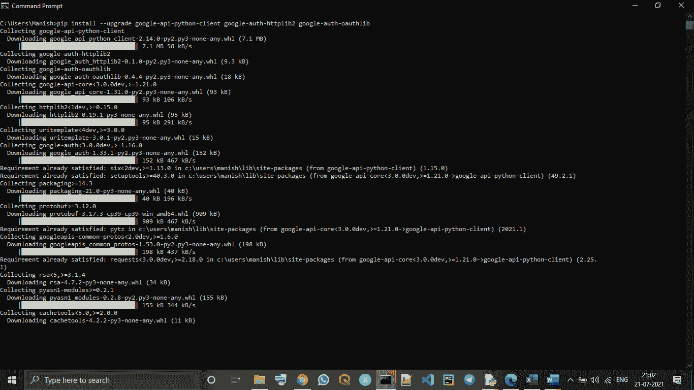

正如我们所看到的，启用 Gmail APIs 所需的库已经成功安装在我们的系统中。现在，我们可以在本教程中继续启用 Gmail APIs 部分。

### 在我们的设备中启用 Gmail 应用编程接口

我们必须遵循以下给定的步骤在我们的设备中启用 Gmail 应用编程接口，以便我们可以在 Python 脚本中使用这些应用编程接口:

**第一步:在谷歌云控制台上创建新项目:**

在这一步中，首先我们要用我们的谷歌账号登录到谷歌云控制台**(https://console.cloud.google.com/?pli=1)**，然后我们要点击‘新建项目’创建一个新项目。

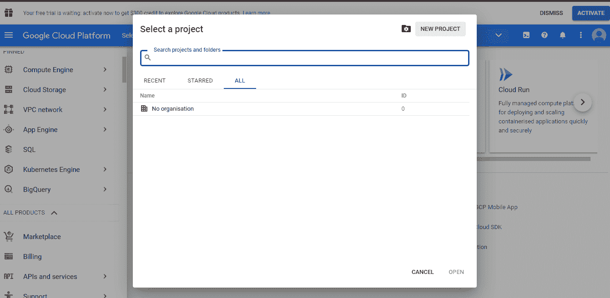

如果我们已经有一个现有的项目，那么我们也可以继续现有的项目。

**步骤 2:** 现在，我们必须从已经创建的项目菜单中转到 API 和服务选项。


**第三步:**现在，我们可以看到选项‘启用 Gmail API 和服务’，我们必须选择这个选项才能为项目启用 Gmail API。

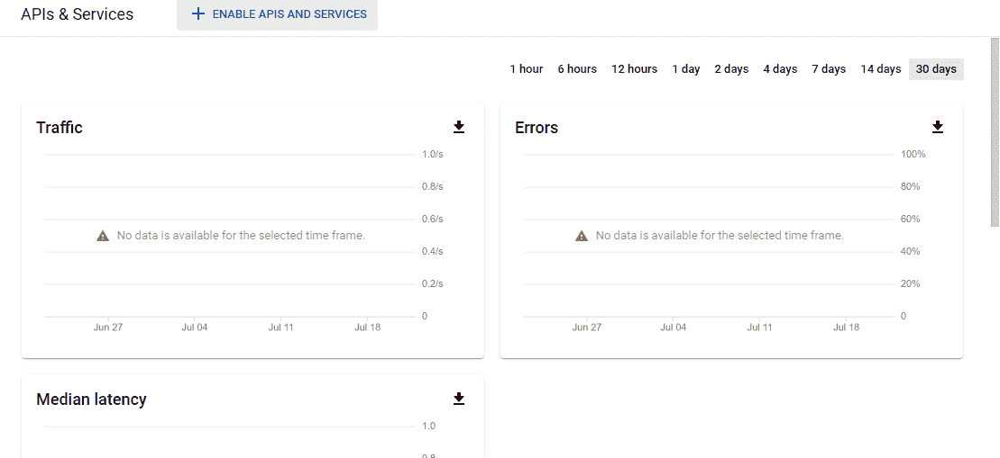

**第四步:同意画面配置:**

现在，在这一步中，我们将通过单击菜单中给出的**“审核同意屏幕”**选项来配置我们创建的项目的同意屏幕。只有在同意屏幕尚未配置的情况下，我们才能看到此选项。

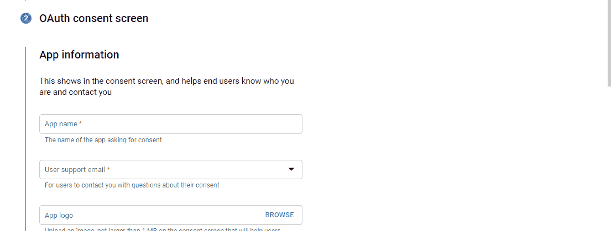

**第五步:**现在，我们要输入自己选择的应用名称，保存项目。

**第 6 步:**现在，点击凭证选项，转到凭证。

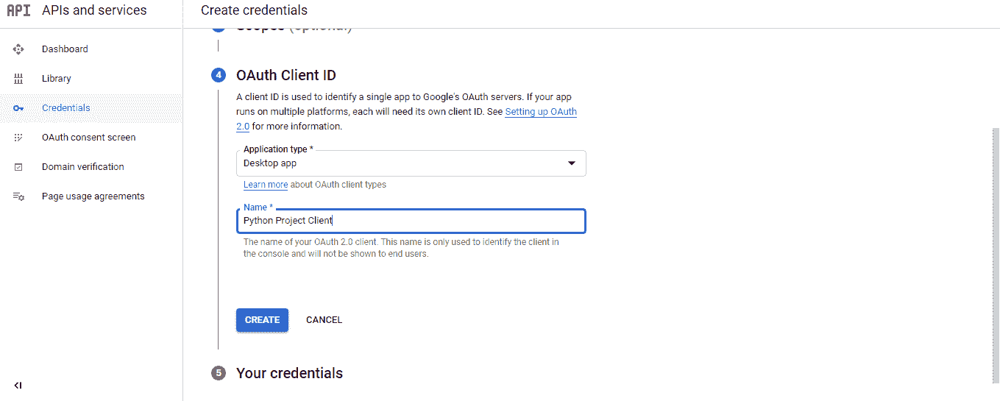

**步骤 7:创建 OAuth 客户端标识:**

现在，我们点击**“创建凭证”**选项，转到 OAuth 客户端 ID 创建它。

我们按照以下顺序过程执行此操作，为我们的项目创建一个新的 OAuth 客户端标识:

*   首先，我们选择应用类型作为项目的桌面应用。
    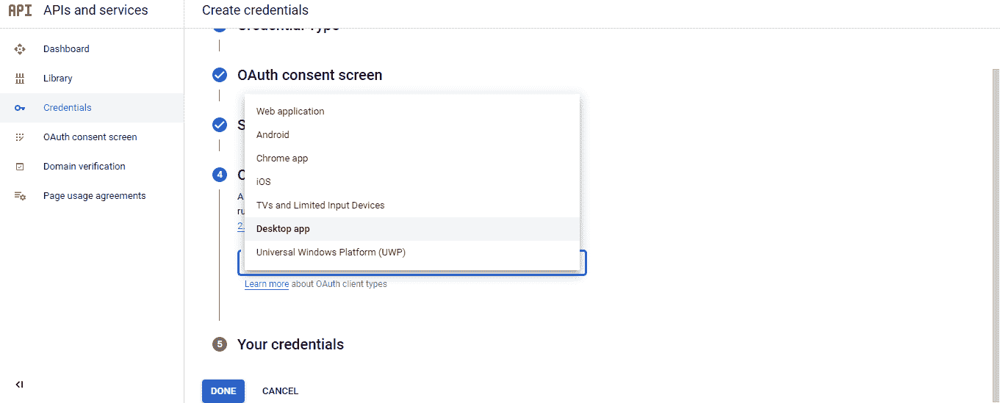
*   之后，我们输入应用名称(可以与我们在上述步骤中设置的名称相同，也可以不同)，然后单击创建按钮。
*   现在，将为我们的项目创建 OAuth 客户端 ID，我们下载它，并用“credentials.json”名称和格式保存它，以供将来参考。
    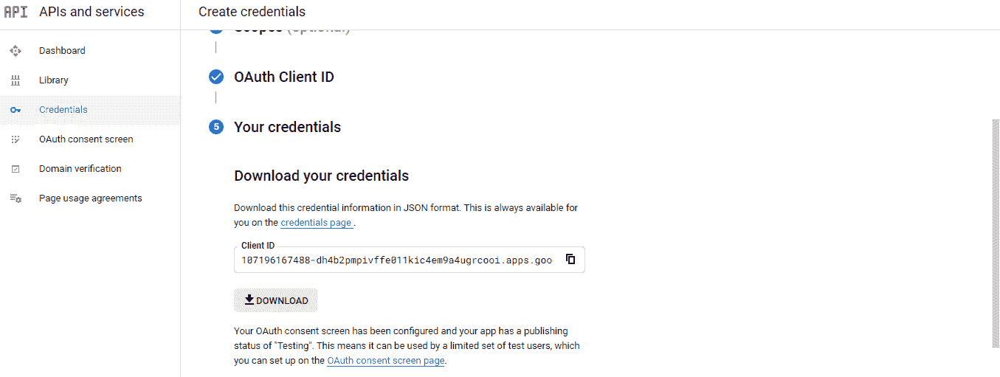

现在，我们已经完成了启用 Gmail API 的所有步骤，我们可以开始在 Python 脚本中使用 Gmail API 了。

#### 注意:我们必须保存客户标识和密码，以便在将来需要时参考。

**导入必要的模块**

现在，我们已经设置了所有必要的 API，我们应该继续导入所有必要的模块。让我们看看下面导入模块的例子。

**示例-**

```py

# Importing os and pickle module in program
import os
import pickle
# Creating utils for Gmail APIs
from googleapiclient.discovery import build
from google_auth_oauthlib.flow import InstalledAppFlow
from google.auth.transport.requests import Request
# Importing libraries for encoding/decoding messages in base64
from base64 import urlsafe_b64decode, urlsafe_b64encode
# Importing libraries for dealing with the attachment of MIME types in Gmail
from email.mime.text import MIMEText
from email.mime.multipart import MIMEMultipart
from email.mime.image import MIMEImage
from email.mime.audio import MIMEAudio
from email.mime.base import MIMEBase
from email.mime.multipart import MIMEMultipart
from mimetypes import guess_type as guess_mime_type

# Request all access from Gmail APIs and project
SCOPES = ['https://mail.google.com/']
OurEmailID = 'OurMail@gmail.com' # giving our Gmail Id

# using a default function to authenticate Gmail APIs
def authenticateGmailAPIs():
    creds = None
    # Authorizing the Gmail APIs with tokens of pickles
    if os.path.exists("token.pickle"): # using if else statement
        with open("token.pickle", "rb") as token:
            creds = pickle.load(token)
    # If there are no valid credentials available in device, we will let the user sign in manually
    if not creds or not creds.valid:
        if creds and creds.expired and creds.refresh_token:
            creds.refresh(Request())
        else:
            flow = InstalledAppFlow.from_client_secrets_file('client_secret_107196167488-dh4b2pmpivffe011kic4em9a4ugrcooi.apps.googleusercontent.com.json', SCOPES) # downloaded credential name
            creds = flow.run_local_server(port=0) # running credentials
        # Save the credentials for the next run
        with open("token.pickle", "wb") as token:
            pickle.dump(creds, token)
    return build('Gmail', 'v1', credentials=creds) # using Gmail to authenticate

# Get the Gmail API service by calling the function
service = authenticateGmailAPIs()

```

**输出:**

```py
Please visit this URL to authorize this application: https://accounts.google.com/o/oauth2/auth?response_type=code&client_id=107196167488-dh4b2pmpivffe011kic4em9a4ugrcooi.apps.googleusercontent.com&redirect_uri=http%3A%2F%2Flocalhost%3A55991%2F&scope=https%3A%2F%2Fmail.google.com%2F&state=kfXlNyjvbKetyUK0op7OF9WY7shrKS&access_type=offline

```

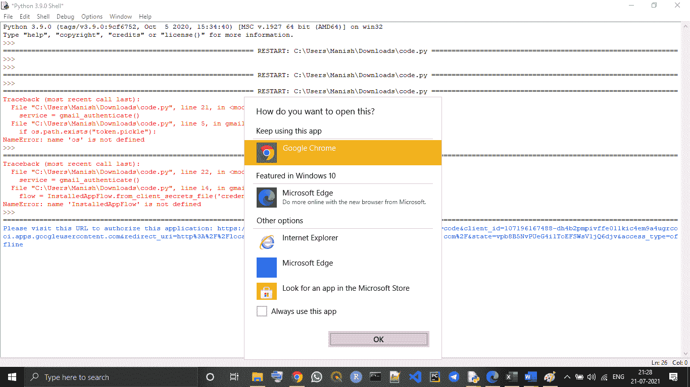

**解释-**

当我们运行上面给定的程序时，我们会看到一个选择浏览器的选项，如上图所示，如果我们没有看到这样的选项，我们需要点击输出中给定的链接。然后，我们可以选择我们选择的浏览器或系统的默认浏览器来继续这个过程。现在，当我们选择浏览器时，我们将被重定向到我们的浏览器，并可以看到在其中打开的以下选项卡:

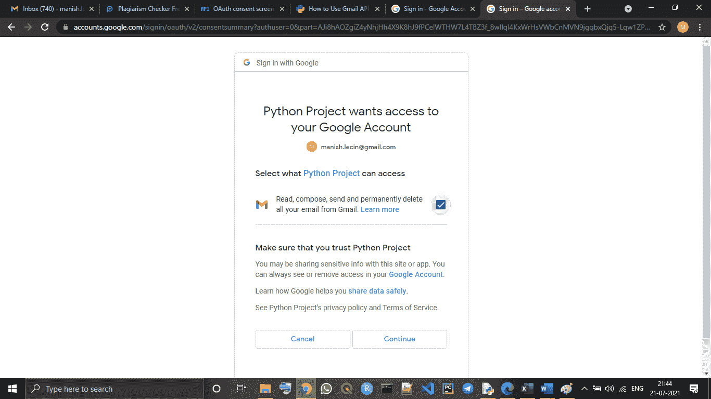

现在，我们勾选对话框中显示的复选框选项，以提供所需的权限，然后，我们将不得不单击继续选项。点击继续后，我们可以看到以下窗口将在同一选项卡中打开:

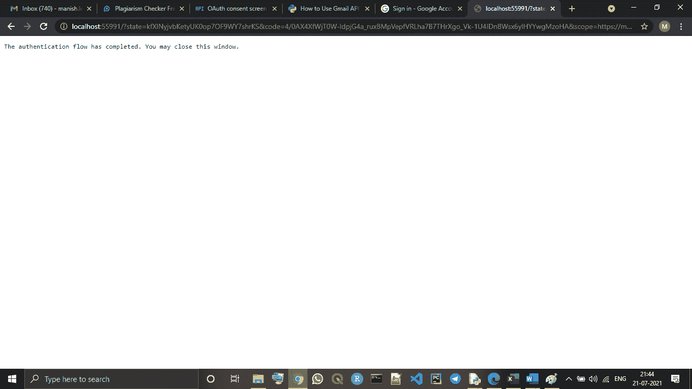

如窗口所示，启用 Gmail 应用编程接口的身份验证部分已经完成，我们已经将 Gmail 帐户与我们创建的 Gmail 应用编程接口项目相链接。

#### 注意:当然，我们必须把我们可以连接到 Gmail APIs 的邮件放在上面程序中提供的“[【电子邮件保护】](/cdn-cgi/l/email-protection)”的地方，以供将来使用 Gmail APIs 时参考。

## 使用 Python 中的 Gmail APIs 执行操作

现在，我们已经用 Python 脚本在我们的项目中完全设置并启用了 Gmail APIs。现在，我们可以使用 Python 程序从 Gmail 帐户执行许多操作。

我们可以在 Python 脚本中使用 Gmail APIs 执行以下 Gmail 操作:

*   发送电子邮件
*   搜索电子邮件
*   删除电子邮件或整个电子邮件历史记录
*   阅读电子邮件
*   标记已读/未读电子邮件等。

在本教程中，我们将只讨论在 Python 程序中使用 Gmail APIs 发送电子邮件，我们将学习使用 Python 脚本编写执行此操作的代码。

### 发送电子邮件

我们可以通过编写一个 Python 程序并在其中使用启用的 Gmail APIs 来简单地编写和发送一封电子邮件。在这一部分，我们将编写一个 Python 程序，通过运行该程序，我们就可以从 Gmail 帐户发送电子邮件。

为了更好地理解它，请看下面的 Python 程序:

**示例-**

```py

# importing os and pickle module in program
import os
import pickle
# Creating utils for Gmail APIs
from googleapiclient.discovery import build
from google_auth_oauthlib.flow import InstalledAppFlow
from google.auth.transport.requests import Request
# Importing libraries for encoding/decoding messages in base64
from base64 import urlsafe_b64decode, urlsafe_b64encode
# Importing libraries for dealing with the attachment of MIME types in Gmail
from email.mime.text import MIMEText
from email.mime.multipart import MIMEMultipart
from email.mime.image import MIMEImage
from email.mime.audio import MIMEAudio
from email.mime.base import MIMEBase
from email.mime.multipart import MIMEMultipart
from mimetypes import guess_type as guess_mime_type

# Request all access from Gmail APIs and project
SCOPES = ['https://mail.google.com/'] # providing the scope for Gmail APIs
OurEmailID = 'OurMail@gmail.com' # giving our Gmail Id

# using a default function to authenticate Gmail APIs
def authenticateGmailAPIs():
    creds = None
    # authorizing the Gmail APIs with tokens of pickles
    if os.path.exists("token.pickle"): # using if else statement
        with open("token.pickle", "rb") as token:
            creds = pickle.load(token)
    # if there are no valid credentials available in device, we will let the user sign in manually
    if not creds or not creds.valid:
        if creds and creds.expired and creds.refresh_token:
            creds.refresh(Request())
        else:
            flow = InstalledAppFlow.from_client_secrets_file('client_secret_107196167488-dh4b2pmpivffe011kic4em9a4ugrcooi.apps.googleusercontent.com.json', SCOPES) # downloaded credential name
            creds = flow.run_local_server(port=0) # running credentials
        # save the credentials for the next run
        with open("token.pickle", "wb") as token:
            pickle.dump(creds, token)
    return build('gmail', 'v1', credentials=creds) # using Gmail to authenticate

# Get the Gmail API service by calling the function
ServicesGA = authenticateGmailAPIs()

# Using a default funnction to add attachments in Mail
def AddAttachment(mail, NameofFile):
    content_type, encoding = guess_mime_type(NameofFile)
    if content_type is None or encoding is not None: # defining none file type attachment
        content_type = 'application/octet-stream'
    main_type, sub_type = content_type.split('/', 1)
    if main_type == 'text': # defining text file type attachment
        fp = open(NameofFile, 'rb') # opening file
        msg = MIMEText(fp.read().decode(), _subtype = sub_type)
        fp.close() 
    elif main_type == 'image': # defining image file type attachment
        fp = open(NameofFile, 'rb')
        msg = MIMEImage(fp.read(), _subtype = sub_type)
        fp.close()
    elif main_type == 'audio': # defining audio file type attachment
        fp = open(NameofFile, 'rb')
        msg = MIMEAudio(fp.read(), _subtype = sub_type) # reading file
        fp.close()
    else:
        fp = open(NameofFile, 'rb')
        msg = MIMEBase(main_type, sub_type)
        msg.set_payload(fp.read())
        fp.close() # closing file
    NameofFile = os.path.basename(NameofFile)
    msg.add_header('Content-Disposition', 'attachment', NameofFile = NameofFile)
    mail.attach(msg) # composing the mail with given attachment

# Creating mail with a default function
def CreateMail(RecieverMail, SubofMail, BodyofMail, attachments=[]): # various import content of mail as function's parameter
    # Using if else to check if there is any attachment in mail or not
    if not attachments: # no attachment is given in the mail
        mail = MIMEText(BodyofMail) # Body of Mail
        mail['to'] = RecieverMail # mail ID of Reciever
        mail['from'] = OurEmailID # our mail ID
        mail['subject'] = SubofMail # Subject of Mail
    else: # attachment is given in the mail
        mail = MIMEMultipart()
        mail['to'] = RecieverMail
        mail['from'] = OurEmailID
        mail['subject'] = SubofMail
        mail.attach(MIMEText(BodyofMail))
        for NameofFile in attachments:
            AddAttachment(mail, NameofFile)
    return {'raw': urlsafe_b64encode(mail.as_bytes()).decode()}

# Creating a default function to send a mail
def SendMail(ServicesGA, RecieverMail, SubofMail, BodyofMail, attachments=[]):
    return ServicesGA.users().messages().send(
      userId = "me",
      body = CreateMail(RecieverMail, SubofMail, BodyofMail, attachments)
    ).execute() # Body of the mail with execute() function

# Sending an email by adding important content, i.e., Reciever's mail, Subject, Body, etc.
SendMail(ServicesGA, "Reciever@gmail.com", "Python Project i.e., This is the subject of Mail we are sendimg!", 
            "Now, this is the body of the email we are writing and we can add only written text here!", ["test.txt", "client_secret_107196167488-dh4b2pmpivffe011kic4em9a4ugrcooi.apps.googleusercontent.com.json"]) # calling out default SendMail() function

```

**输出:**

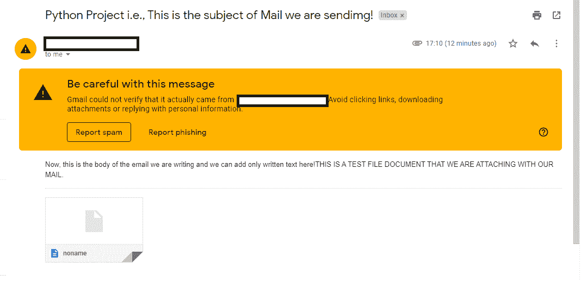

如果我们把我们的邮件放在收件人邮件的地方，即[【email protected】](/cdn-cgi/l/email-protection)，我们会发现邮件实际上是发送给我们在运行程序时作为收件人邮件输入的邮件，与我们在上面的输出图像中看到的一样。

## 结论

要将 Gmail 应用编程接口与我们的 Python 脚本或简单地与 Python 一起使用，首先，我们必须启用它们，并使用我们的 Gmail 帐户在谷歌云中创建一个项目。

我们还可以执行许多其他操作，如阅读、删除等。，在我们的 Python 程序中使用 Gmail APIs 就像发送电子邮件一样。我们还可以通过运行我们的 Python 脚本(通过 Gmail APIs 启用)将许多东西修改到我们通过 Gmail APIs 项目验证的 Gmail 帐户中。

* * *