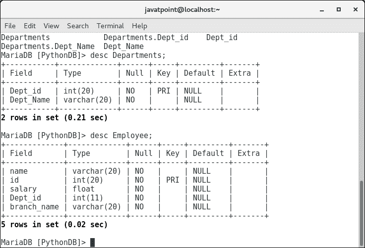
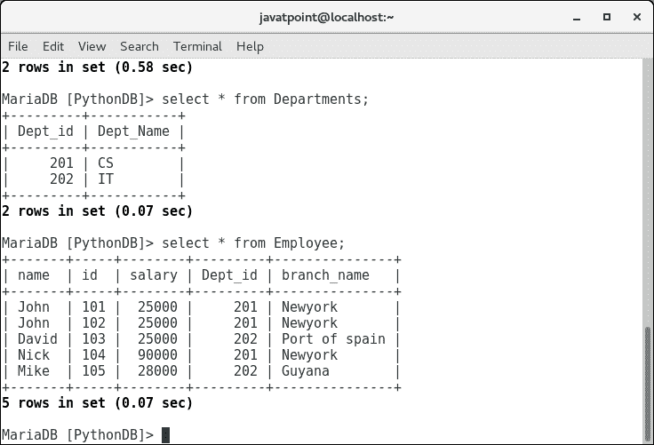

# 连接操作

> 原文：<https://www.javatpoint.com/python-mysql-join-operation>

我们可以通过使用 join 语句在两个或多个表中使用一些公共列来组合它们。

我们的数据库中只有一个表，让我们用两列 department _ id 和 department_name 再创建一个 Departments 表。

```py

create table Departments (Dept_id int(20) primary key not null, Dept_Name varchar(20) not null);

```



因为我们已经创建了一个新的表 Departments，如上图所示。然而，我们还没有在其中插入任何值。

让我们插入一些部门 id 和部门名称，以便将其映射到我们的员工表。

```py

insert into Departments values (201, "CS");
insert into Departments values (202, "IT");

```

让我们看看每个表中插入的值。请看下图。



现在，让我们创建一个 python 脚本，将公共列(即 dept_id)上的两个表连接起来。

### 例子

```py

import mysql.connector

#Create the connection object 
myconn = mysql.connector.connect(host = "localhost", user = "root",passwd = "google",database = "PythonDB")

#creating the cursor object
cur = myconn.cursor()

try:
    #joining the two tables on departments_id
    cur.execute("select Employee.id, Employee.name, Employee.salary, Departments.Dept_id, Departments.Dept_Name from Departments join Employee on Departments.Dept_id = Employee.Dept_id")
    print("ID    Name    Salary    Dept_Id    Dept_Name")
    for row in cur:
        print("%d    %s    %d    %d    %s"%(row[0], row[1],row[2],row[3],row[4]))

except:
    myconn.rollback()

myconn.close()

```

**输出:**

```py
ID    Name    Salary    Dept_Id    Dept_Name
101   John    25000    	201    		CS
102   John    25000    	201    		CS
103   David   25000       202    		IT
104   Nick    90000   	201    		CS
105   Mike    28000   	202   		IT

```

* * *

## 右连接

右连接显示右侧表的所有列，因为我们在数据库 PythonDB 中有两个表，即 Departments 和 Employee。表中没有任何员工不在任何部门工作(部门标识为空的员工)。然而，为了理解右连接的概念，让我们创建一个。

在 MySQL 服务器上执行以下查询。

```py

insert into Employee(name, id, salary, branch_name) values ("Alex",108,29900,"Mumbai"); 

```

这将插入一个不在任何部门工作的员工 Alex(部门 id 为空)。

现在，我们在“员工”表中有一名员工，其部门 id 不在“部门”表中。现在让我们在两个表上执行正确的连接。

### 例子

```py

import mysql.connector

#Create the connection object 
myconn = mysql.connector.connect(host = "localhost", user = "root",passwd = "google",database = "PythonDB")

#creating the cursor object
cur = myconn.cursor()

try:
    #joining the two tables on departments_id
    result = cur.execute("select Employee.id, Employee.name, Employee.salary, Departments.Dept_id, Departments.Dept_Name from Departments right join Employee on Departments.Dept_id = Employee.Dept_id")

	print("ID    Name    Salary    Dept_Id    Dept_Name")

	for row in cur:
        print(row[0],"    ", row[1],"    ",row[2],"    ",row[3],"    ",row[4])

except:
    myconn.rollback()

myconn.close()

```

**输出:**

```py
ID    Name    Salary    Dept_Id    Dept_Name
101      John      25000.0      201      CS
102      John      25000.0      201      CS
103      David      25000.0      202      IT
104      Nick      90000.0      201      CS
105      Mike      28000.0      202      IT
108      Alex      29900.0      None      None

```

* * *

## 左连接

左连接包含左侧表中的所有数据。它对右连接的效果正好相反。考虑下面的例子。

### 例子

```py

import mysql.connector

#Create the connection object 
myconn = mysql.connector.connect(host = "localhost", user = "root",passwd = "google",database = "PythonDB")

#creating the cursor object
cur = myconn.cursor()

try:
    #joining the two tables on departments_id
    result = cur.execute("select Employee.id, Employee.name, Employee.salary, Departments.Dept_id, Departments.Dept_Name from Departments left join Employee on Departments.Dept_id = Employee.Dept_id")
    print("ID    Name    Salary    Dept_Id    Dept_Name")
    for row in cur:
        print(row[0],"    ", row[1],"    ",row[2],"    ",row[3],"    ",row[4])

except:
    myconn.rollback()

myconn.close()

```

**输出:**

```py
ID    Name    Salary    Dept_Id    Dept_Name
101      John      25000.0      201      CS
102      John      25000.0      201      CS
103      David      25000.0      202      IT
104      Nick      90000.0      201      CS
105      Mike      28000.0      202      IT

```