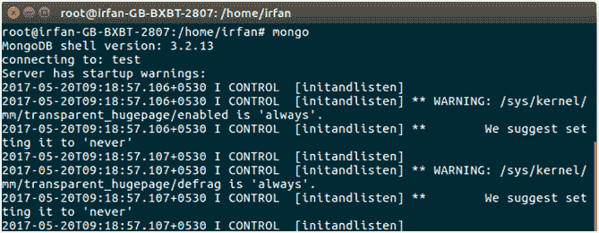
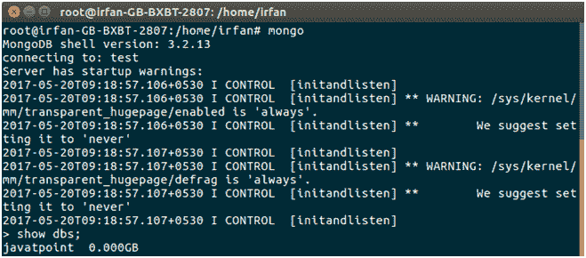
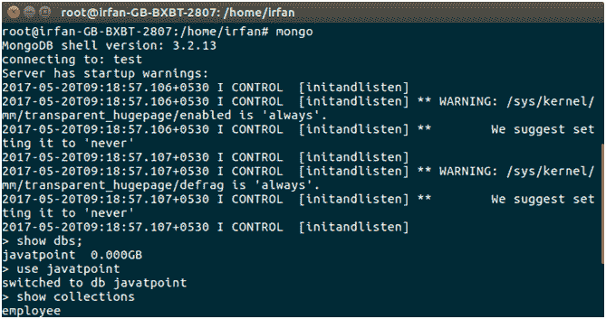

# Python MongoDB 连接


为了在 Python 编程语言和 MongoDB 数据库之间建立连接，我们需要首先安装 **pymongo** 驱动程序。这里，我们正在创建一个连接到数据库并执行基本数据库操作的示例。

该示例包括以下步骤:

### 1)安装驱动程序

```py
$ pip install pymongo

```


### 2)创建 Python 文件

**// connect.py**

```py
from pymongo import MongoClient # import mongo client to connect
import pprint
# Creating instance of mongoclient
client = MongoClient()
# Creating database
db = client.javatpoint
employee = {"id": "101",
"name": "Peter",
"profession": "Software Engineer",
}
# Creating document
employees = db.employees
# Inserting data
employees.insert_one(employee)
# Fetching data
pprint.pprint(employees.find_one())

```

### 3)执行 Python 脚本

该脚本在控制台上打印插入的记录。


### 4)进入蒙古 Shell

现在，进入 MongoDB 数据库 Shell，查看创建的数据库和集合。

我们可以使用以下命令进入数据库。

```py
$ mongo

```



### 5)检查数据库

以下命令用于显示可用的数据库。

```py
> show dbs

```



### 6)支票收款

以下命令用于显示数据库中的可用集合。

```py
> show collections

```



### 7)访问记录

我们可以看到特定集合中存储的记录。以下命令用于显示记录。

```py
> db.employees.find()

```


* * *