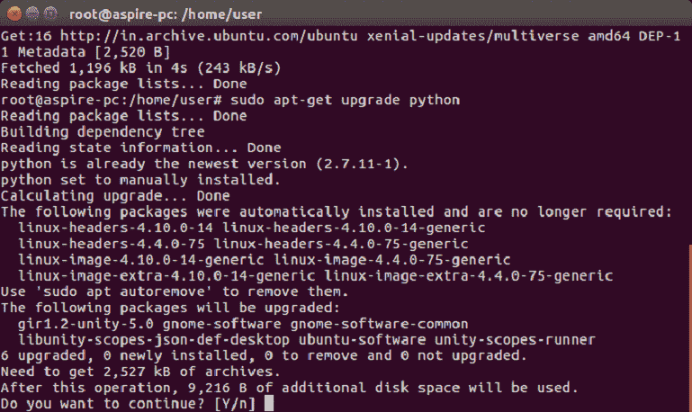
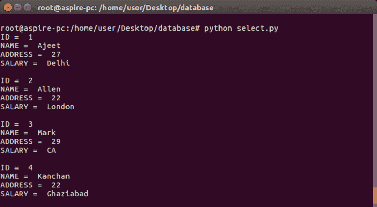

# 用 Python 连接 SQLite

> 哎哎哎:# t0]https://www . javatppoint . com/python-SQLite

首先，您必须在系统上安装 python 和 sqlite。

## 安装 Python

使用以下代码:

```py
sudo apt-get update
sudo apt-get upgrade python

```



按 y，安装将在几秒钟内完成。

## 安装 SQLite

**安装步骤**

键入以下命令:

```py
sudo apt-get install sqlite3 libsqlite3-dev

```

安装后检查安装，sqlite 终端会给你提示和版本信息？

```py
sqlite3

```

转到所需文件夹并创建数据库:

sqlite3 数据库. db

它将在您发出命令的文件夹中创建 database.db。

要检查数据库是否已创建，请在 sqlite3 终端中使用以下命令:

```py
 .databases

```

#### 注意:要使用 Python 连接 SQLite，您不需要单独安装连接模块，因为默认情况下，它是与 Python 2.5 . x 版一起发货的。

* * *

## 使用 Python 的 SQLite

创建一个 python 文件“connect.py”，包含以下代码:

```py
#!/usr/bin/python

import sqlite3

conn = sqlite3.connect('javatpoint.db')

print "Opened database successfully";

```

**在命令提示符下执行以下语句:**

```py
python connect.py

```


现在已经创建了与 javatpoint 数据库的连接。现在，您可以创建一个表。

## 创建表格

在数据库“javatpoint”中创建一个表“Employees”。

创建一个 python 文件“createtable.py”，包含以下代码:

```py
#!/usr/bin/python

import sqlite3

conn = sqlite3.connect('javatpoint.db')
print "Opened database successfully";

conn.execute('''CREATE TABLE Employees
       (ID INT PRIMARY KEY     NOT NULL,
       NAME           TEXT    NOT NULL,
       AGE            INT     NOT NULL,
       ADDRESS        CHAR(50),
       SALARY         REAL);''')
print "Table created successfully";

conn.close()

```

在命令提示符下执行以下语句:

```py
python createtable.py

```


在“javatpoint”数据库中创建了一个表“Employees”。

## 插入记录

在“员工”表中插入一些记录。

创建一个 python 文件“connection.py”，包含以下代码:

```py
#!/usr/bin/python

import sqlite3

conn = sqlite3.connect('javatpoint.db')
print "Opened database successfully";

conn.execute("INSERT INTO Employees (ID,NAME,AGE,ADDRESS,SALARY) \
      VALUES (1, 'Ajeet', 27, 'Delhi', 20000.00 )");

conn.execute("INSERT INTO Employees (ID,NAME,AGE,ADDRESS,SALARY) \
      VALUES (2, 'Allen', 22, 'London', 25000.00 )");

conn.execute("INSERT INTO Employees (ID,NAME,AGE,ADDRESS,SALARY) \
      VALUES (3, 'Mark', 29, 'CA', 200000.00 )");

conn.execute("INSERT INTO Employees (ID,NAME,AGE,ADDRESS,SALARY) \
      VALUES (4, 'Kanchan', 22, 'Ghaziabad ', 65000.00 )");

conn.commit()
print "Records inserted successfully";
conn.close()

```

**在命令提示符下执行以下语句:**

```py
python connection.py

```


记录插入成功。

## 选择记录

现在，您可以使用 SELECT 语句从“雇员”表中获取并显示您的记录。

创建一个 python 文件“select.py”，包含以下代码:

```py
#!/usr/bin/python

import sqlite3

conn = sqlite3.connect('javatpoint.db')

data = conn.execute("select * from Employees");

for row in data:
   print "ID = ", row[0]
   print "NAME = ", row[1]
   print "ADDRESS = ", row[2]
   print "SALARY = ", row[3], "\n"

conn.close();

```

在命令提示符下执行以下语句:

```py
python select.py 

```



查看您之前插入的所有记录。

通过同样的过程，您可以使用 Python 更新和删除 SQLite 数据库中的表。