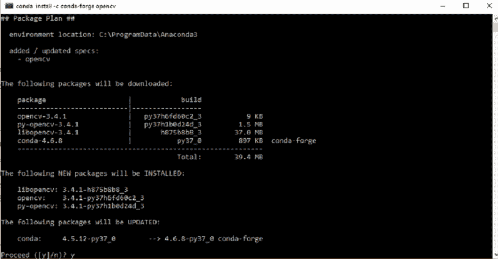

# 如何在 Python 中安装 OpenCV

> 原文：<https://www.javatpoint.com/how-to-install-opencv-in-python>

OpenCV 是一个开源的 Python 库，用来理解数字图像的内容。CV 是计算机视觉的缩写形式。它从实时图像或数字图像中提取描述，这些图像可以是对象、文本描述等。

我们可以使用 OpenCV 库执行许多任务，如人脸检测、人脸识别、斑点检测、边缘检测、图像滤波、模板匹配等。为了使用 OpenCV，我们需要将其安装在我们的 [Python](https://www.javatpoint.com/python-tutorial) 环境中。

## OpenCV 的安装

这里，我们使用以下方式安装 OpenCV。

*   使用 pip 命令
*   使用蟒蛇

### 使用 pip 命令

打开命令提示符并键入以下命令。

```py

pip install opencv-contrib-python --upgrade

```

或者，我们可以通过以下命令在没有额外模块的情况下安装它。

```py

pip install opencv-python

```


现在，我们将验证 OpenCV 的正确安装。导入 cv2 模块并打印其版本。


如果它已经正确安装，那么它将显示它的版本。

### 使用蟒蛇

Anaconda 是 Python 的一个软件包。拥有 Jupyter 的 Anaconda 是使用 OpenCV 的最佳方式。首先，我们需要从它的官方网站安装 Anaconda 图形安装程序。


现在，选择一个合适的 bit 安装程序。


下载完成后。打开 Anaconda 提示符并键入以下命令。

```py

conda install -c conda-forge opencv  

```


然后，点击进入按钮，它将下载所有额定 OpenCV 配置。



现在，我们已经准备好使用 OpenCV 了。你可以通过我们的 OpenCV 教程([https://www.javatpoint.com/opencv](https://www.javatpoint.com/opencv))学习完整的 OpenCV。

* * *