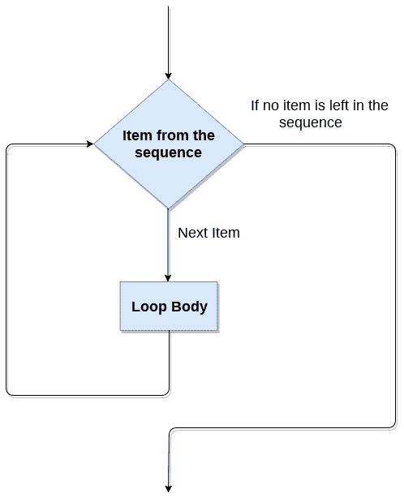

# 如何在 Python 中使用`for`循环

> 原文：<https://www.javatpoint.com/how-to-use-for-loop-in-python>

Python `for`循环遍历序列。它将这段代码重复 n 次。考虑以下 `for`循环的流程图。

### 流程图



[Python](https://www.javatpoint.com/python-tutorial) for loop 可以通过两种方式使用。

*   使用序列
*   使用 range()函数

### 使用序列

在 Python 中，序列被称为列表、集合、字符串、元组和字典。我们可以使用 `for`循环提取序列的元素。下面是循环的语法。

**语法:**

```py

for iterating_var in sequence:
    statement(s)

```

让我们理解下面的例子。

**示例- 1**

```py

list1 = [10, 20, 30, 40, 50, 60]
for i in list1:
    print(i)

```

**输出:**

```py
10
20
30
40
50
60

```

**示例- 2**

```py

str = "JavaTpoint"
for i in str:
    print(i)

```

**输出:**

```py
J
a
v
a
T
p
o
i
n
t

```

### 使用 range()函数

range 函数()生成数字序列。例如，如果我们执行**范围(5)** ，它将生成 0 到 4。range()函数的语法如下。

**语法:**

```py

range(start, stop, step-size)

```

它接受这三个论点。

*   开始代表迭代的开始。
*   停止表示循环结束。它将迭代直到 stop-1。
*   步长跳过特定的迭代次数。默认情况下，步长为 1。

让我们理解下面的例子。

**示例- 1**

```py

for i in range(20):
    print(i, end = ' ')

```

**输出:**

```py
0 1 2 3 4 5 6 7 8 9 10 11 12 13 14 15 16 17 18 19

```

**示例- 2 使用 range()函数遍历列表元素**

```py

list = ['Peter', 'Joseph', 'Ricky', 'Devansh', 'Kevin']  
for i in range(len(list)):  
    print("Hii",list[i])  

```

**输出:**

```py
Hii Peter
Hii Joseph
Hii Ricky
Hii Devansh
Hii Kevin

```

**说明:**

**len()** 函数返回列表的长度。**范围()**获得列表中的元素数量并打印其元素。

* * *