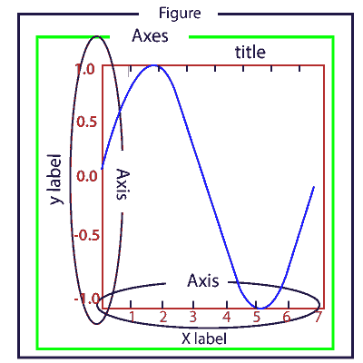
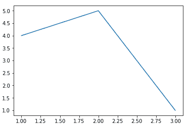
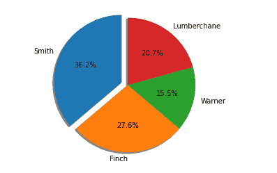
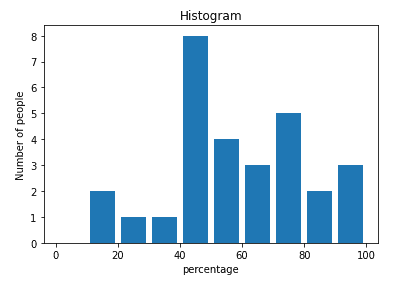
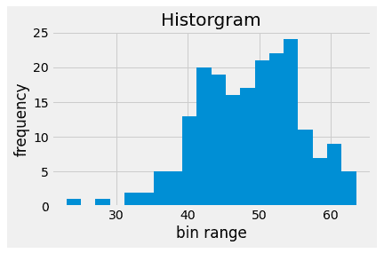
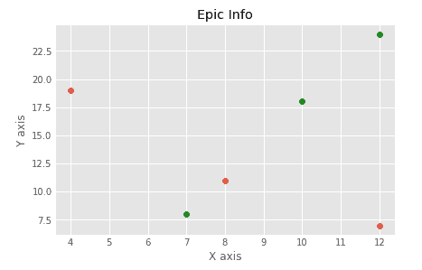
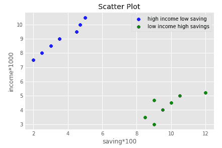

# 如何用 Python 绘制图形

> 原文：<https://www.javatpoint.com/how-to-plot-a-graph-in-python>

Python 提供了一个最流行的绘图库，叫做 **Matplotlib** 。它是开源的、跨平台的，用于从数组中的数据制作 2D 图。它通常用于数据可视化，并通过各种图形表示。

Matplotlib 最初是由约翰·d·亨特在 2003 年构思的。matplotlib 的最新版本是 2018 年 1 月发布的 2.2.0。

在开始使用 [matplotlib 库](https://www.javatpoint.com/matplotlib)之前，我们需要在 Python 环境中安装。

### 安装 Matplotlib

在您的终端中键入以下命令，然后按 enter 键。

```py

pip install matplotlib

```

以上命令将在 Window 操作系统上安装 matplotlib 库及其依赖包。

### Matplotlib 的基本概念

图表包含以下部分。让我们理解这些部分。



**图形:**是一个可以包含一个或多个轴(图)的整体图形。我们可以把一个人物想象成一个容纳情节的画布。

**轴:**一个图形可以包含多个轴。它由两个或三个(在 3D 的情况下)轴对象组成。每个轴由一个标题、一个 x 标签和一个 y 标签组成。

**轴:**轴是线状物体的数量，负责生成图形界限。

**艺术家:**艺术家是我们在图形上看到的所有东西，如文本对象、线 2D 对象和收藏对象。大多数艺术家都被绑在斧头上。

### pyplot 简介

matplotlib 提供 pyplot 包，用于绘制给定数据的图形。 **matplotlib.pyplot** 是一组命令风格的函数，使 matplotlib 像 MATLAB 一样工作。pyplot 包包含许多功能，用于创建图形、在图形中创建绘图区域、用标签装饰图形、在绘图区域中绘制一些线条等。

我们可以用 pyplot 快速绘制图表。让我们看看下面的例子。

### 绘制图形的基本示例

下面是生成简单图形的基本示例；该计划如下:

```py

from matplotlib import pyplot as plt  
#ploting our canvas  
plt.plot([1,2,3],[4,5,1])  
#display the graph  
plt.show()  

```

**输出:**



## 电镀不同类型的图形

我们可以使用 pyplot 模块绘制各种图表。让我们理解下面的例子。

### 1.线图

折线图用于将信息显示为一系列线条。很容易策划。考虑下面的例子。

**示例-**

```py

from matplotlib import pyplot as plt  

x = [1,2,3]  
y = [10,11,12]  

plt.plot(x,y)  

plt.title("Line graph")  
plt.ylabel('Y axis')  
plt.xlabel('X axis')  
plt.show()  

```

**输出:**

可以使用各种功能修改该行。它使图表更有吸引力。下面是例子。

**示例-**

```py

from matplotlib import pyplot as plt  
from matplotlib import style  

style.use('ggplot')  
x = [10, 12, 13]  
y = [8, 16, 6]  
x2 = [8, 15, 11]  
y2 = [6, 15, 7]  
plt.plot(x, y, 'b', label='line one', linewidth=5)  
plt.plot(x2, y2, 'r', label='line two', linewidth=5)  
plt.title('Epic Info')  
fig = plt.figure()  
plt.ylabel('Y axis')  
plt.xlabel('X axis')  

plt.show()

```

### 2.条形图

条形图是最常见的图形之一，用于表示与分类变量相关的数据。 **bar()** 函数接受三个参数——分类变量、值和颜色。

**示例-**

```py

from matplotlib import pyplot as plt  
Names = ['Arun','James','Ricky','Patrick']  
Marks = [51,87,45,67]  
plt.bar(Names,Marks,color = 'blue')  
plt.title('Result')  
plt.xlabel('Names')  
plt.ylabel('Marks')  
plt.show()  

```

### 3.圆形分格统计图表

图表是分成子部分或段的圆形图。它用于表示百分比或比例数据，其中每个饼图切片代表一个特定类别。让我们理解下面的例子。

**示例-**

```py

from matplotlib import pyplot as plt  

# Pie chart, where the slices will be ordered and plotted counter-clockwise:  
Aus_Players = 'Smith', 'Finch', 'Warner', 'Lumberchane'  
Runs = [42, 32, 18, 24]  
explode = (0.1, 0, 0, 0)  # it "explode" the 1st slice   

fig1, ax1 = plt.subplots()  
ax1.pie(Runs, explode=explode, labels=Aus_Players, autopct='%1.1f%%',  
        shadow=True, startangle=90)  
ax1.axis('equal')  # Equal aspect ratio ensures that pie is drawn as a circle.  

plt.show()  

```

**输出:**



### 4.柱状图

直方图和条形图非常相似，但有一点点不同。直方图用于表示分布，条形图用于比较不同的实体。直方图通常用于绘制多个值相对于一组值范围的频率。

在下面的例子中，我们获取了学生不同分数百分比的数据，并绘制了关于学生人数的直方图。让我们理解下面的例子。

**示例-**

```py

from matplotlib import pyplot as plt  
from matplotlib import pyplot as plt  
percentage = [97,54,45,10, 20, 10, 30,97,50,71,40,49,40,74,95,80,65,82,70,65,55,70,75,60,52,44,43,42,45]  
number_of_student = [0,10,20,30,40,50,60,70,80,90,100]  
plt.hist(percentage, number_of_student, histtype='bar', rwidth=0.8)  
plt.xlabel('percentage')  
plt.ylabel('Number of people')  
plt.title('Histogram')  
plt.show()  

```

**输出:**



让我们理解另一个例子。

**示例- 2:**

```py

from matplotlib import pyplot as plt  
# Importing Numpy Library  
import numpy as np  
plt.style.use('fivethirtyeight')  

mu = 50  
sigma = 7  
x = np.random.normal(mu, sigma, size=200)  
fig, ax = plt.subplots()  

ax.hist(x, 20)  
ax.set_title('Historgram')  
ax.set_xlabel('bin range')  
ax.set_ylabel('frequency')  

fig.tight_layout()  
plt.show()  

```

**输出:**



### 5.散点图

散点图用于比较变量与其他变量。它被定义为一个变量如何影响另一个变量。数据表示为点的集合。让我们理解下面的例子。

**示例-**

```py

from matplotlib import pyplot as plt  
from matplotlib import style  
style.use('ggplot')  

x = [4,8,12]  
y = [19,11,7]  

x2 = [7,10,12]  
y2 = [8,18,24]  

plt.scatter(x, y)  

plt.scatter(x2, y2, color='g')  

plt.title('Epic Info')  
plt.ylabel('Y axis')  
plt.xlabel('X axis')  

plt.show()  

```

**输出:**



**示例- 2:**

```py

import matplotlib.pyplot as plt  
a = [2, 2.5, 3, 3.5, 4.5, 4.7, 5.0]
b = [7.5, 8, 8.5, 9, 9.5, 10, 10.5]  

a1 = [9, 8.5, 9, 9.5, 10, 10.5, 12]  
b1 = [3, 3.5, 4.7, 4, 4.5, 5, 5.2]  
plt.scatter(a, b, label='high income low saving', color='b')  
plt.scatter(a1, b1, label='low income high savings', color='g')  
plt.xlabel('saving*100')  
plt.ylabel('income*1000')  
plt.title('Scatter Plot')  
plt.legend()  
plt.show()  

```

**输出:**



在本教程中，我们已经讨论了数据可视化中使用的所有基本类型的图形。要了解更多关于图形，请访问我们的 matplotlib 教程。

* * *