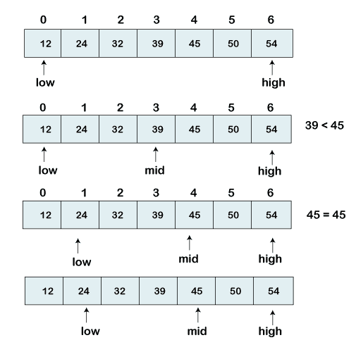

# Python 中的二分搜索法

> 原文：<https://www.javatpoint.com/binary-search-in-python>

本教程将学习如何使用 Python 应用二分搜索法算法来查找元素在给定列表中的索引位置。

## 介绍

二分搜索法是一种在列表中查找特定元素的算法。假设我们有一个包含一千个元素的列表，我们需要得到一个特定元素的索引位置。我们可以使用二分搜索法算法非常快速地找到元素的索引位置。

有许多搜索算法，但二分搜索法是其中最受欢迎的。

列表中的元素必须经过排序才能应用二分搜索法算法。如果元素没有排序，那么首先对它们进行排序。

让我们理解二分搜索法的概念。

## 二分搜索法的概念

在二分搜索法算法中，我们可以使用以下方法找到元素位置。

*   递归方法
*   迭代法

分治法技术之后是递归方法。在这个方法中，一个函数一次又一次地调用自己，直到它在列表中找到一个元素。

一组语句被重复多次，以在迭代方法中找到元素的索引位置。**和**循环用于完成该任务。

二分搜索法比线性搜索更有效，因为我们不需要搜索每个列表索引。必须对列表进行排序，以实现二分搜索法算法。

让我们一步一步实施二分搜索法。

我们有一个排序的元素列表，我们正在寻找索引位置 45。

**【12、24、32、39、45、50、54】**

因此，我们在列表中设置了两个指针。一个指针用于表示较小的值**低**，第二个指针用于表示最高的值**高**。

接下来，我们计算数组中**中间**元素的值。

```py

mid = (low+high)/2
Here, the low is 0 and the high is 7.
mid = (0+7)/2
mid = 3 (Integer)

```

现在，我们将把搜索到的元素与中间索引值进行比较。在这种情况下， **32** 不等于 **45。**所以我们需要做进一步的对比，找到元素。

如果我们搜索的数字等于 mid。然后返回**中间**否则进入下一步比较。

要搜索的数字大于**中间的**数字，我们将 **n** 与**中间**右侧元素的中间元素进行比较，并将低设置为**低=中间+ 1。**

否则，将 **n** 与**中间**左侧元素的**中间元素**进行比较，将**高**设置为**高=中间 1。**



重复以上步骤，直到找到我们正在搜索的号码。

## 用 Python 实现一个二分搜索法

首先，我们用迭代法实现一个二分搜索法。我们将重复一组语句并迭代列表中的每一项。我们将找到中间值，直到搜索完成。

下面我们来了解一下迭代法的程序。

### Python 实现

```py

# Iterative Binary Search Function method Python Implementation
# It returns index of n in given list1 if present, 
# else returns -1 
def binary_search(list1, n):
    low = 0
    high = len(list1) - 1
    mid = 0

    while low <= high:
        # for get integer result 
        mid = (high + low) // 2

        # Check if n is present at mid 
        if list1[mid] < n:
            low = mid + 1

        # If n is greater, compare to the right of mid 
        elif list1[mid] > n:
            high = mid - 1

        # If n is smaller, compared to the left of mid
        else:
            return mid

            # element was not present in the list, return -1
    return -1

# Initial list1
list1 = [12, 24, 32, 39, 45, 50, 54]
n = 45

# Function call 
result = binary_search(list1, n)

if result != -1:
    print("Element is present at index", str(result))
else:
    print("Element is not present in list1")

```

**输出:**

```py
Element is present at index 4

```

**说明:**

在上面的程序中-

*   我们创建了一个名为 **binary_search()** 的函数，该函数接受两个参数——一个要排序的列表和一个要搜索的数字。
*   我们已经声明了两个变量来存储列表中的最低值和最高值。低值被赋予初始值 0，**高值**被赋予**透镜(列表 1)** - 1，中间值为 0。
*   接下来，我们已经声明了 **while** 循环，条件是**最低的**等于并且小于**最高的**`While`循环将迭代，如果还没有找到数字的话。
*   在 `While`循环中，我们找到中间值，并将索引值与我们正在搜索的数字进行比较。
*   如果中间索引的值小于 **n** ，我们将中间值增加 1，并将其分配给搜索移动到左侧。
*   否则，降低中间值并将其分配到**高电平**。搜索移动到右侧。
*   如果 n 等于中间值，则返回**中间**。
*   直到**低电平**等于且小于**高电平**时，才会出现这种情况。
*   如果我们到达函数的末尾，那么该元素不在列表中。我们向调用函数返回-1。

让我们理解二分搜索法的递归方法。

## 递归二分搜索法

递归方法可用于二分搜索法。在本文中，我们将定义一个递归函数，它会一直调用自己，直到满足条件。

让我们使用递归函数来理解上面的程序。

### Python 程序

```py

# Python program for recursive binary search.
# Returns index position of n in list1 if present, otherwise -1
def binary_search(list1, low, high, n): 

   # Check base case for the recursive function
   if low <= high:

      mid = (low + high) // 2

      # If element is available at the middle itself then return the its index
      if list1[mid] == n: 
         return mid 

      # If the element is smaller than mid value, then search moves
      # left sublist1
      elif list1[mid] > n: 
         return binary_search(list1, low, mid - 1, n) 

      # Else the search moves to the right sublist1
      else: 
         return binary_search(list1, mid + 1, high, n) 

   else: 
      # Element is not available in the list1
      return -1

# Test list1ay 
list1 = [12, 24, 32, 39, 45, 50, 54]
n = 32

# Function call 
res = binary_search(list1, 0, len(list1)-1, n) 

if res != -1: 
   print("Element is present at index", str(res))
else: 
   print("Element is not present in list1")

```

**输出:**

```py
Element is present at index 2

```

**解释**

上面的程序与前面的程序相似。我们声明了一个递归函数及其基本条件。条件是最低值小于或等于最高值。

*   我们像上一个程序一样计算中间的数字。
*   我们使用了 **if** 语句来处理二分搜索法。
*   如果中间值等于我们要找的数字，则返回中间值。
*   如果中间值小于该值，我们将再次查看递归函数 **binary_search()** ，并将中间值增加 1 并赋给 low。
*   如果中间值大于我们正在查看的值，那么我们的递归函数 **binary_search()** 再次将中间值减少 1，并将其指定为低。

在最后一部分，我们已经写好了我们的主程序。和之前的程序一样，唯一不同的是我们在 **binary_search()** 函数中传递了两个参数。

这是因为我们不能在递归函数中将初始值分配给低、高和中。每次调用递归时，这些变量的值都会被重置。那会给出错误的结果。

## 复杂性

对于最佳情况，二分搜索法算法的复杂度为 **O(1)** 。如果我们正在寻找的元素在第一次比较中找到，就会发生这种情况。 **O(logn)** 是二分搜索法最差和平均的情况复杂性。这取决于为找到我们要找的元素而进行的搜索次数。

## 结论

二分搜索法算法是搜索列表中元素的最有效、最快速的方法。它跳过了不必要的比较。顾名思义，搜索分为两部分。它集中在列表的一侧，接近我们正在搜索的数字。

我们已经讨论了两种方法来找到给定数字的索引位置。

* * *