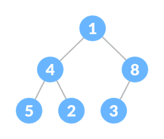

# Python 中的堆排序

> 原文：<https://www.javatpoint.com/heap-sort-in-python>

堆排序与选择排序完全相同，我们找到最大元素并将其放在末尾。它基于在二进制堆数据结构上工作的比较排序算法。这是高效排序算法的最佳示例。

## 什么是堆排序？

堆排序是一种高效且流行的排序算法。堆排序的概念是**从列表的堆部分逐一“消除”**元素，**将它们插入到列表的排序部分。在进一步了解堆排序算法之前，让我们讨论一下堆数据结构。**

它是一种就地算法，这意味着使用固定数量的内存来存储排序列表，或者内存大小不依赖于初步列表的大小。

**例如-** 我们不需要额外的内存栈来存储排序后的数组，也不需要递归调用栈。heapsort 算法通常使用第二个数组排序固定值。这一过程快速、简单、自然且易于实施。

另一方面，堆排序是不稳定的，这意味着它不维护具有相等值的元素的比较顺序。它可以快速排序整数和字符等基本类型，但它对复杂类型和对象有问题。

让我们通过下面的例子来理解它-

我们有一个自定义类**学生**带有属性**年龄**和**名字，**和该类的几个对象在一个数组中，包括一个名为**“托马斯”**年龄为“20”的学生，还有**“彼得”**年龄为 20 的以相同的顺序出现。

如果我们按照年龄排序人的排列，那么不能保证**“托马斯”**会出现在排序后的排列中的**“彼得”**之前。可以定义顺序，但不能保证。

## 堆数据结构

堆数据结构是**一个完成堆属性的完整二叉树**。它也被称为二进制堆。

完整的二叉树满足以下属性。

*   每一关都要填。
*   所有节点都尽可能靠左。



正如我们在上面的堆图像中看到的，但是它没有被排序。我们不会深入挖掘这篇文章，因为我们的重点是解释 Heap 排序算法，而不是堆。在堆排序中，下一个最小的元素总是第一个元素。

堆树可以是两种类型-最小堆和最大树。最小堆保存最大元素的记录。最大堆跟踪最大的元素。堆主要支持以下操作——delete _ minimum()，get_minimum()和 add()。

堆的第一个元素可以在恢复后删除。需要 **O(log N)** 时间，那是高效的。

## 履行

Python 提供了使用堆排序排序元素的内置函数。功能如下。

*   **heappush(list，item) -** 用于添加堆元素并重新排序。
*   **heappop(list) -** 用于移除元素并返回元素。
*   **heapfy() -** 用来把给定的列表变成堆。

考虑下面的堆排序示例。

**示例-**

```py

from heapq import heappop, heappush

 def heapsort(list1):
     heap = []
     for ele in list1:
         heappush(heap, ele)

     sort = []

     # the elements are lift in the heap
     while heap:
         sort.append(heappop(heap))

     return sort

 list1 = [27, 21, 55, 15, 60, 4, 11, 17, 2, 87]
 print(heapsort(list1))

```

**输出:**

```py
[2, 4, 11, 15, 17, 21, 27, 55, 60, 87]

```

**解释**

在上面的代码中，我们已经导入了由**heap PP()**和 **heappush()** 方法组成的 **heapq** 模块。我们创建了**Heapsort Heapsort()**方法，该方法以 list1 为参数。`for`循环遍历列表 1，并将元素推送到**空堆**。我们使用 `While`循环，并将排序后的元素添加到**空排序**中。

我们调用了 **Heapsort Heapsort ()** 函数，并传递了一个列表。它返回排序列表。

## 对自定义对象排序

堆排序对于预定义的数据类型很有用，但是处理用户定义的数据类型(如类对象)更复杂。我们将在本节中排序自定义对象。

正如我们所看到的，我们的实现依赖于内置的方法。Python 提供了以下方法。

*   **heapq . nlargetst(* n *，*iterable*，*key = None) -** 该方法用于从数据集中获取具有 n 个最大元素的列表，由 iterable 定义。
*   **heapq . nsmallast(* n *，*iterable*，*key = None) -** 该方法用于从数据集获取 n 个最小元素的列表，该列表由 iterable 定义。

让我们理解以下自定义对象的实现。

**示例-**

```py

from heapq import heappop, heappush

 class Car:
     def __init__(self, model, year):
         self.model = model
         self.year = year

     def __str__(self):
         return str.format("Model Name: {}, Year: {}", self.model, self.year)

     def __lt__(self, other):
         return self.year < other.year

     def __gt__(self, other):
         return other.__lt__(self)

     def __eq__(self, other):
         return self.year == other.year

     def __ne__(self, other):
         return not self.__eq__(other)

 def heapsort(list1):
     heap = []
     for element in list1:
         heappush(heap, element)

     ordered = []

     while heap:
         ordered.append(heappop(heap))

     return ordered

 car1 = Car("Renault", 2001)
 car2 = Car("Bentley", 2005)
 car3 = Car("Kia", 2014)
 car4 = Car("Maruti Suzuki", 1999);
 car5 = Car("Nano", 2012)

 list1 = [car1, car2, car3, car4, car5]

 for c in Heapsort Heapsort (list1):
     print(c)

```

**输出:**

```py
Model Name: Maruti Suzuki, Year: 1999
Model Name: Renault, Year: 2001
Model Name: Bentley, Year: 2005
Model Name: Nano, Year: 2012
Model Name: Kia, Year: 2014

```

我们已经根据年份对物品进行了分类。

## 堆排序与其他算法的比较

流行的快速排序算法之一也非常有效，但堆排序是合法使用的，因为它的可靠性。就时间复杂度而言，堆排序的主要好处是 **O(nlogn)** 上限。

堆排序算法在平均和最坏情况下都需要 O(nlogn)时间，而快速排序在平均情况下要快 20%。

快速排序算法在可预测的情况下会变得很慢。快速排序存在安全漏洞的可能性，因为犯规 O(n2)很容易被触发。

现在我们比较归并排序，它与堆排序花费相同的时间。

归并排序稳定得多，直观上是可并行的，而堆排序没有这样的优势。

此外，归并排序在大多数情况下比堆排序更快，因为它们具有相同的时间复杂性。

相比之下，HeapsortHeapsort 可以比 Marge sort 更快地就地实现。

## 结论

Heapsort 没有那么受欢迎，速度也没有那么快，但它比任何其他排序算法都更容易预测。在内存和安全性是优先考虑的情况下，此算法是首选。

可以使用 Python 快速实现。我们需要将元素插入堆中，然后取出它们。

* * *