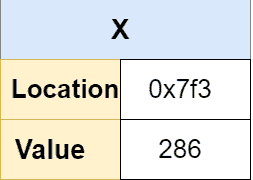
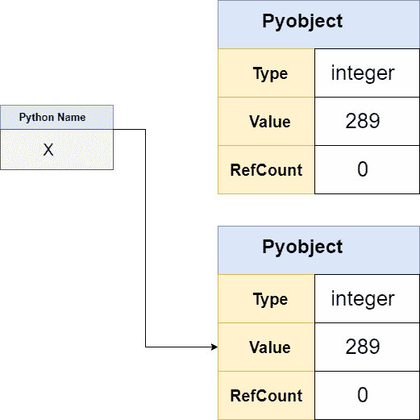

# Python 中的指针，为什么 Python 不支持指针

> 原文：<https://www.javatpoint.com/pointer-in-python>

在本教程中，我们将学习 Python 中的指针，并了解为什么 Python 不支持指针概念。

我们还将了解如何在 Python 中模拟指针。下面是指针的介绍，给那些对此一无所知的人。

我们还将了解如何在 Python 中模拟指针。下面是指针的介绍，给那些对此一无所知的人。

## 什么是指针？

指针是一个非常流行和有用的工具来存储变量的地址。如果有人曾经使用过低级语言，比如 [C](https://www.javatpoint.com/c-programming-language-tutorial) 。 [C++](https://www.javatpoint.com/cpp-tutorial) ，他/她可能熟悉指针。它非常有效地管理代码。对于初学者来说可能有点难，但这是程序的一个重要概念。但是，它会导致各种内存管理错误。因此，指针的定义-

**“指针是保存另一个变量的内存地址的变量。指针变量用星号(*)表示。**

让我们看看下面 C 编程语言中指针的例子。

**示例-如何在 C 中使用指针**

```py

#include int main()
{
   int* po, o;

   0 = 10;
   printf("Address of c: %p\n", &c);
   printf("Value of c: %d\n\n", c);  

   o = &0;
   printf("Address of pointer pc: %p\n", o);
   printf("Content of pointer pc: %d\n\n", *o);   
   0 = 11;
   printf("Address of pointer pc: %p\n", p0);
   printf("Content of pointer pc: %d\n\n", *p0);   
   *po = 2;
   printf("Address of c: %p\n", &o);
   printf("Value of c: %d\n\n", o);
   return 0;
} 
```

**输出:**

```py
Address of o: 2686784
Value of o: 22

Address of pointer po: 2686784
Content of pointer po: 22

Address of pointer po: 2686784
Content of pointer po: 11

Address of o: 2686784
Value of o: 2

```

除了有用之外， [Python](https://www.javatpoint.com/python-tutorial) 中不使用指针。在本主题中，我们将讨论 Python 的对象模型，并了解为什么 Python 中不存在指针。我们还将学习在 Python 中模拟指针的不同方法。首先，我们来讨论为什么 Python 不支持指针。

## 为什么 Python 不支持指针

不支持指针的确切原因尚不清楚。Python 中的指针可以原生存在吗？Python 的主要概念是简单，但是指针违背了 Python 的**禅。**指针主要是鼓励隐式变化，而不是显式变化。它们也很复杂，尤其是对初学者来说。

指针往往会增加代码的复杂性，Python 主要关注可用性，而不是速度。因此，Python 不支持指针。然而，Python 给出了使用指针的一些好处。

在理解 Python 中的指针之前，我们需要有以下几点的基本想法。

*   不可变对象与可变对象
*   Python 变量/名称

## Python 中的对象

在 Python 中，一切都是对象，甚至是类、函数、变量等。每个对象至少包含三条数据。

*   引用计数
*   类型
*   价值

我们一个一个来讨论。

**参考计数-** 用于内存管理。要获得更多关于 Python 内存管理的信息，请阅读 Python 中的内存管理。

**类型-****CPython**层用作类型，以确保运行时的类型安全。最后，还有一个值，它是与对象关联的实际值。

如果我们深入这个物体，我们会发现并不是所有的物体都是一样的。对象类型之间的重要区别是不可变和可变的。首先，我们需要了解对象类型之间的区别，因为它探索了 Python 中的指针。

## 不可变对象与可变对象

不可变对象不能修改，可变对象可以修改。让我们看看下表中常见的类型，以及它们是否可变。

| 目标 | 类型 |
| （同 Internationalorganizations）国际组织 | 不变的 |
| 浮动 | 不变的 |
| 弯曲件 | 不变的 |
| 目录 | 易变的 |
| 一组 | 易变的 |
| 复杂的 | 易变的 |
| 元组 | 不变的 |
| 冻结集合 | 不变的 |
| 字典 | 易变的 |

我们可以使用 **id()** 方法检查上述对象的类型。这个方法返回对象的内存地址。

我们在 REPL 的环境中键入下面的行。

```py

x = 5
id(x)

```

**输出:**

```py
140720979625920

```

在上面的代码中，我们将值 10 赋给了 x，如果我们用替换来修改这个值，我们将得到新的对象。

```py

x-=1
id(x)

```

**输出:**

```py
140720979625888

```

如我们所见，我们修改了上面的代码，并获得了新的对象作为响应。我们再举一个 **str** 的例子。

```py

s = "java"
print(id(s))

s += "Tpoint"
print(s)

id(s)

```

**输出:**

```py
2315970974512
JavaTpoint
1977728175088

```

同样，我们通过添加一个新的字符串来修改 x 的值，我们得到了新的内存地址。让我们尝试直接在 s 中添加字符串。

```py

s = 'java'
s[0] = T
print(id(s))

```

**输出:**

```py
Traceback (most recent call last):
  File "C:/Users/DEVANSH SHARMA/PycharmProjects/MyPythonProject/python1.py", line 34, in s[0] = T
NameError: name 'T' is not defined 
```

上面的代码返回错误，表示字符串不支持变异。所以 **str** 是不可变的对象。

现在，我们将看到诸如 list 这样的可变对象。

```py

my_list = [3, 4, 8]
print(id(my_list))

my_list.append(4)
print(my_list)

print(id(my_list))

```

**输出:**

```py
2571132658944
[3, 4, 8, 4]
2571132658944

```

从上面的代码中我们可以看到， **my_list** 原本有 id，我们在列表中追加了 5；**我的列表**具有相同的 id，因为列表支持**可变性。**

## 理解 Python 变量

Python 中定义变量的方式与 C 或 C++有很大不同。Python 变量没有定义数据类型。事实上，Python 有名字，没有变量。

因此，我们需要理解变量和名称之间的区别，尤其是当我们在 Python 中导航指针这个棘手的主题时。

让我们理解变量在 C 语言中是如何工作的，以及名称在 Python 中是如何工作的。

### C 语言中的变量

在 C 语言中，变量是指它保存值或存储值。它是用数据类型定义的。让我们看看下面定义变量的代码。

```py

int x = 286;

```

*   为整数分配足够的内存。
*   我们将值 286 分配给该存储位置。
*   x 代表那个值。

如果我们代表记忆的观点-



如我们所见，x 有一个值 286 的存储位置。现在，我们将给 x 赋值。

x = 250

这个新值会覆盖以前的值。这意味着变量 x 是可变的。

x 的值位置相同，但值发生了变化。这是一个重要的点，表明 x 是内存位置，而不仅仅是它的名字。

现在，我们引入一个新的变量，这个变量取 x，然后 y 创建一个新的内存盒。

```py

int y = x;

```

变量 y 创建了一个名为 y 的新框，将 x 的值复制到该框中。


## Python 中的名称

正如我们前面讨论的，Python 没有变量。它有名字，我们用这个术语作为变量。但是变量和名字是有区别的。让我们看看下面的例子。

```py

x = 289

```

上面的代码在执行过程中被分解。

1.  创建一个对象
2.  将 PyObject 的 typecode 设置为整数
3.  将对象的值设置为 289
4.  创建一个名为 x 的名称
5.  指向新的对象
6.  将对象的引用计数增加 1

如下图所示。



我们可以理解 Python 中一个变量的内部工作方式。变量 x 指向对象的引用，它没有像以前那样的内存空间。它还显示 x = 289 正在将名称 x 绑定到引用。

现在，我们引入一个新的变量，并给它赋值 x。

```py

y = x

```

在 Python 中，变量 y 不会创建新对象；它只是指向同一个对象的新名称。物体**反射计数**也增加一。我们可以确认如下。

```py

y is x

```

**输出:**

```py
True

```

如果我们将 y 的值增加一，它将不再引用同一个对象。

```py

y + =1
y is x

```

这意味着，在 Python 中，我们不分配变量。相反，我们将名称绑定到引用。

## 用 Python 模拟指针

正如我们已经讨论过的，Python 不支持指针，但是我们可以获得使用指针的好处。Python 提供了在 Python 中使用指针的替代方法。下面给出这两种方式。

*   使用可变类型作为指针
*   使用自定义 Python 对象

让我们理解给定的要点。

### 使用可变类型作为指针

在前一节中，我们已经定义了可变类型对象；我们可以把它们当作指针来对待，以模拟指针行为。让我们理解下面的例子。

C

```py

void add_one(int *a) {
    *a += 1;
}

```

在上面的代码中，我们定义了指针*a，然后将值增加 1。现在，我们将使用 main()函数实现它。

```py

#include int main(void) {
    int y = 233;
    printf("y = %d\n", y);
    add_one(&y);
    printf("y = %d\n", y);
    return 0;
} 
```

**输出:**

```py
y = 233
y = 234

```

我们可以通过使用 Python 可变类型来模拟这种类型的行为。理解下面的例子。

```py

def add_one(x):
    x[0] += 1

y = [2337]
add_one(y)
y[0]

```

上面的函数访问列表的第一个元素，并将其值增加 1。当我们执行上面的程序时，它打印出 y 的修改值。这意味着我们可以使用可变对象复制指针。但是如果我们尝试使用不可变对象来模拟指针。

```py

z = (2337,)
add_one(z)

```

**输出:**

```py
Traceback (most recent call last):
  File "", line 1, in <module>File "<stdin>", line 2, in add_one
TypeError: 'tuple' object does not support item assignment</stdin></module> 
```

我们在上面的代码中使用了元组，一个不可变的对象，所以它返回了错误。我们也可以用字典来模拟 Python 中的指针。

让我们理解下面的例子，其中我们将计算程序中发生的每个操作。我们可以用 dict 来实现这一点。

**示例-**

```py

count = {"funcCalls": 0}
def car():
    count["funcCalls"] += 1

def foo():
    count["funCcalls"] += 1
    car()

foo()
count["funcCalls"]

```

**输出:**

```py
2

```

**解释-**

在上面的例子中，我们使用了 ***count*** 字典，它记录了函数调用的次数。当调用 **foo()** 函数时，计数器增加 2，因为 dict 是可变的。

### 使用 Python 对象

在前面的例子中，我们使用 dict 来模拟 Python 中的指针，但是有时很难记住所有使用的键名。我们可以使用 Python 自定义类来代替字典。让我们理解下面的例子。

**示例-**

```py

class Pointer(object):
    def __init__(self):
        self._metrics = {
            "funCalls": 0,
            "catPictures": 0,
        }

```

在上面的代码中，我们定义了指针类。这个类使用 dict 来保存 _metrics 成员变量中的实际数据。它将为我们的程序提供可变性。我们可以这样做。

```py

class Pointer(object):
    # ...

    @property
    def funCalls(self):
        return self._metrics["func_calls"]

    @property
    def catPictures_served(self):
        return self._metrics["cat_pictures_served"]

```

我们使用了**@ T1【物业】@ T2**装饰机。如果您不熟悉装饰者，请访问我们的 Python 装饰者教程。@property decorator 将访问 funCalls 和 catPicture_served。现在，我们将创建一个指针类的对象。

```py

pt = Pointer()
pt.funCalls()
pt.catPicture_served

```

这里我们需要增加这些值。

```py

class Pointer(object):
    # ...

    def increament(self):
        self._metrices["funCalls"] += 1

    def cat_pics(self):
        self._metrices["catPictures_served"] += 1

```

我们定义了两种新方法——增量()和 cat_pics()。我们在矩阵字典中使用这些函数修改了值。在这里，我们可以像修改指针一样修改类。

```py

pt = Pointer()
pt.increment()
pt.increment()
pt.funCalls()

```

## python ctypes 模块

Python ctypes 模块允许我们在 Python 中创建一个 C 型指针。如果我们想对需要指针的 C 库进行函数调用，这个模块很有帮助。让我们理解下面的例子。

**示例- C 语言**

```py

void incr_one(int *x) {
    *x += 1;
}

```

在上面的函数中，我们将 x 的值加 1。假设我们保存了上述名为 incrPointer.c 的文件，并在终端中键入以下命令。

```py

$ gcc -c -Wall -Werror -fpic incrPointer.c
$ gcc -shared -o libinc.so incrPointer.o

```

第一个命令将**incrpoint . c**编译成一个名为**incrpoint . o**的对象，第二个命令接受对象文件并产生 libinic.so 与 ctypes 协作。

```py

import ctypes
##  libinc.so library should be same directory as this program
lib = ctypes.CDLL("./libinc.so")
lib.increment

```

**输出:**

```py
<_funcptr object="" at="">

```

在上面的代码中，**键。CDLL** 返回一个名为 **libinic.so.** 的共享对象，它包含**incrpoire()**函数。如果我们需要指定指向我们在共享对象中定义的函数的指针，我们必须使用 ctypes 来指定它。让我们看看下面的例子。

```py

inc = lib.increment 
## defining the argtypes 
inc.argtypes = [ctypes.POINTER(ctypes.c_int)]

```

如果我们使用不同的类型调用函数，它会通过一个错误。

```py

incrPointer(10)

```

**输出:**

```py
Traceback (most recent call last):
  File "<stdin>", line 1, in <module>
ctypes.ArgumentError: argument 1: <class 'TypeError'>: expected LP_c_int instance instead of int

```

这是因为 incrPointer 需要一个指针，而 ctypes 是 Python 中传递指针的一种方式。

```py

v = ctypes.c_int(10)

```

v 是一个 C 变量。ctypes 提供了名为 **byref()** 的方法，用于传递变量引用。

```py

inc(ctypes.byref(a)) 
a

```

**输出:**

```py
c_int(11)

```

我们使用参考变量增加了值。

## 结论

我们已经讨论过 Python 中不存在指针，但是我们可以用*可变对象实现相同的行为。我们还讨论了 Python 中可以定义 C 指针的 ctypes 模块。我们已经定义了一些在 Python 中模拟指针的优秀方法。

* * *