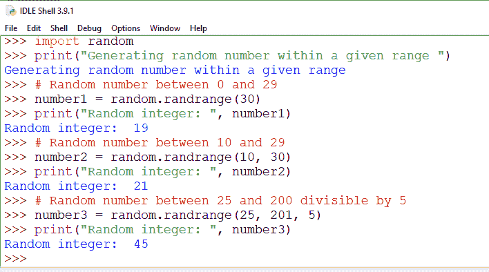

# Python 随机随机随机范围()

> 原文：<https://www.javatpoint.com/python-random-randrange>

Python **随机**模块允许生成随机数。生成的数字是一系列基于所用函数的伪随机数。随机模块中使用不同类型的函数来生成随机数，例如 **random.random()、random.randint()、random.choice()、random.randrange(开始、停止、宽度)**等等。

在这里，我们将讨论**随机**模块的**随机范围()**功能。*随机范围()*函数用于在其参数的指定范围之间生成一个随机数。它接受三个参数:起始数字、停止数字和宽度，用于跳过范围内的数字。

## random.randrange()的语法

```py

random.randrange(start, stop[, width])

```

***random . randrange()***函数返回给定范围内的随机整数，即开始和停止。***random . range()***功能以三个参数作为输入**启动、**停止、**宽度**。在这三个参数中，两个参数 ***开始*** 和 ***宽度*** 是可选的。

*   **起始**参数是随机范围内的起始或下限整数。如果参数中没有传入 start 参数，它将采用默认值 0(零)。
*   A **stop** 参数是随机范围内的最后一个数字或上限整数。
*   **宽度**参数是随机序列中每个数字之间的范围。此参数是可选的，如果宽度参数没有传入参数，它将采用默认值 1(一)。

***随机范围(开始、停止、宽度)*** 函数在生成随机整数时不包含结束参数。 ***停止*** 参数是**独占**，不是随机生成的。

看看这个 random range(3，30，3)函数，它会生成 3 到 30 之间的任何随机整数值，比如 3，6，9，12，…27。但是这个函数在生成随机数时从不包含 30。

在应用程序中生成随机数一直很重要，它在日常生活中有几种实时用途。例如，生成一个随机数并将其作为一次性密码发送给客户，以进行安全交易。另一个生成随机数的例子是在玩 ludo 游戏时生成随机骰子数。

### 示例 1: random.randrange()生成给定范围内的随机整数

让我们看一个例子，我们在给定的范围内生成一个随机整数。这个例子展示了 random.randrange()函数的所有不同形式。

```py

import random
print("Generating random number within a given range ")
# Random number between 0 and 29
number1 = random.randrange(30)
print("Random integer: ", number1)
# Random number between 10 and 29
number2 = random.randrange(10, 30)
print("Random integer: ", number2)
# Random number between 25 and 200 divisible by 5
number3 = random.randrange(25, 201, 5)
print("Random integer: ", number3)

```

**输出:**



### 示例 2:生成 n 的随机整数范围(倍数)

让我们生成 5 到 100 之间的随机整数，范围是 5，如 5，10，25，…，90，95。

```py

import random
#print "Random number range (multiple) of 5"
number = random.randrange(5, 100, 5)
print("Random number range (multiple) of 5 is ", number)

```

**输出:**


### 示例 3:生成特定长度的随机整数

您还可以生成特定长度的随机整数。如果要生成长度为 3 的随机数，请在 ***【随机范围()*** 函数中输入*开始*和*停止*参数，作为 3 位数长度的最小数(100)和 4 位数长度的最小数(1000)，因为它生成 100 到 999 的 3 位数形式的随机数，其中不包括 4 位数(1000)。

**示例:使用 random.randrange()** 生成一个 3 位数的随机数

```py

import random
number1 = random.randrange(100, 1000)
print("First random number of length 3 is: ", number1)
number2 = random.randrange(100, 1000)
print("Second random number of length 3 is: ", number2)

```

**输出:**

```py
First random number of length 3 is: 813
Second random number of length 3 is: 770

```

### 示例 4:生成随机负整数:

让我们看一个例子，它生成一个介于-50 到-10 之间的随机负整数。

```py

import random
randomNagativeInteger = random.randrange(-50, -10)
print("Random negative integer number between -50 to -10")
print("Random negative integer number between -50 to -10 is: ",randomNagativeInteger)

```

**输出:**

```py
Random negative integer number between -50 to -10
Random negative integer number between -50 to -10 is:  -43

```

### 示例 5:生成随机的正整数或负整数

```py

import random
number1 = random.randrange(-5, 5)
print(number1)
number2 = random.randrange(-5, 5)
print(number2)

```

**输出:**

```py
-5
0

```

#### 注意在 *random.randrange()* 函数中传递的参数 *start* 和 *stop* 必须是递增的顺序，如 *random.randrange(5，10)* 或 *random.randrange(-20，-10)* 。*启动*参数始终小于*停止*参数；否则，此函数会生成一个错误作为*“回溯(最近一次调用最后一次)”，并为 rand range()”*提升 ValueError 空范围。

**例如:**

看看这个例子，我们违反了规则，在***random . randrange()***函数中传递了大于 *stop* 参数的 *start* 参数，这将生成如下错误消息:

```py

import random
randomNumber = random.randrange(10,5)

```

**输出:**


[Python 的**随机**模块](https://www.javatpoint.com/python-random-module)的其他一些用于随机生成数字的功能有:

*   **选择()**
*   **边缘()**
*   **样品()**
*   **排序()**

## random.choice()

[Python](https://www.javatpoint.com/python-tutorial) **随机**模块有一个 **choice()** 功能，用于从列表或其他序列中选择一个随机元素。一个 ***random.choice()*** 函数用于从值列表中返回一个随机元素。

**ram DOM . choice()**的语法

```py

random.choice(sequence)

```

或者

```py

random.choices(sequence, k=l)

```

这里的参数**序列**可以是字符串、列表、元组， *random.choice()* 只有一个随机元素。

在 *random.choices()* 函数中 **k** 是要返回的元素数量。假设我们没有提到 **k** 参数的值 *random.choices()* 从序列或列表中返回一个项目。

**例 1:**

在这个例子中，我们提供了 on sequence (list)作为参数，并返回了一个随机元素。

```py

import random
listValue = [5,10,15,20,25,30]
item = random.choice(listValue)
print("random item from list is: ", item)

```

**输出:**

```py
random item from list is:  10 

```

**例 2:**

random.choices()函数主要用于返回具有各种可能性的随机元素。这个函数还取权重(k)随机选择的个数。例如，我们想从 5 部电影的列表中随机打印 3 部电影名称。

```py

import random
movieList = ['Matrix', 'Terminator', 'Black Panther', 'Avengers', 'Titanic']
randomMovies = random.choices(movieList, k=3)
print("random movies from list are: ", randomMovies)

```

**输出:**

```py
random movies from list are:  ['Avengers', 'Black Panther', 'Titanic']

```

### random.randint()

Python **random.randint()** 函数用于生成指定范围内的随机整数。

**语法:**

```py

random.randint(start, stop)

```

**random.randint()** 函数取两个参数*启动*为起始范围，*停止*为终止范围。生成随机数时包括两个参数(开始、停止)。

**生成随机整数列表的例子**

本示例将使用 randint()函数创建多个随机整数的列表。生成一个 1 到 100 之间的 5 个随机整数的列表，两个值都包含在内。

```py

import random
randomListValue = []
# specifing length of list equal to 5
for i in range(0, 5):
    # generates random numbers from 1 to 100
    randomListValue.append(random.randint(1, 100))
print("Printing list of 5 generated random numbers")
print(randomListValue)

```

**输出:**

```py
Printing list of 5 generated random numbers
[65, 82, 3, 39, 40]

```

但是，*random . randint()*函数可能会在输出结果中返回一个重复的数字。要避免结果中出现重复的随机整数，请使用 *random.sample()* 函数。

## 随机. sample()

在上面的例子中，可能存在 *random.randint()* 从列表中生成重复随机数的可能性。如果要从列表中生成唯一的随机数，请使用 *random.sample()* 函数。

**random.sample()** 函数从集合、列表和其他序列中生成唯一的元素。Python 的 random.sample()函数允许对列表范围内的多个元素进行随机采样，而无需复制。

**从没有重复的列表中生成随机元素的 random.sample()示例:**

在这个例子中，我们将生成 10 个范围从 0 到 100 的随机整数。

```py

import random
# Generate 10 unique random numbers within a range
randomList = random.sample(range(0, 100), 10)
print(randomList)

```

**输出:**

```py
[15, 17, 16, 66, 34, 85, 71, 82, 97, 48]

```

如果要生成一个随机数列表，并且每个随机数必须是“n”的倍数，则使用 range()函数的 step 参数。

例如，使用 random.sample(范围(0，100，5)，10)生成 10 个随机整数，它们是 0 到 100 范围内的 5 的倍数。

```py

import random
# Generate 10 unique random numbers within a range
randomList = random.sample(range(0, 100, 5), 10)
print(randomList)

```

**输出:**

```py
[75, 40, 20, 55, 15, 10, 5, 90, 95, 70]

```

## 列表排序()

Python **sort()** 函数用于对列表的随机整数进行升序排序(默认)。我们也可以通过指定列表值的顺序*反向=真*来对列表值进行降序排序。*倒车*的默认值为*假*。

**示例 1: sort()按升序对列表元素进行排序**

在这个例子中，我们将生成一个 50 到 100 范围内的 5 个数字的随机列表，宽度为 5，并使用 *sort()* 函数对它们进行排序。

```py

import random
randomList = random.sample(range(50, 100, 5), 5)
print("Before sorting random integers list")
print(randomList)
# sort the list ascending order by default
randomList.sort()
print("After sorting random integers list")
print(randomList)

```

**输出:**

```py
Before sorting random integers list
[90, 80, 60, 55, 85]
After sorting random integers list
[55, 60, 80, 85, 90]

```

**示例 2: sort()按降序对列表元素进行排序**

在本例中，我们将使用*randomlist . sort(reverse = True)*对列表元素进行降序排序。

```py

import random
randomList = random.sample(range(50, 100, 5), 5)
print("Before sorting random integers list")
print(randomList)
# sort the list descending order
randomList.sort(reverse=True)
print("After sorting random integers list")
print(randomList)

```

**输出:**

```py
Before sorting random integers list
[70, 50, 80, 90, 85]
After sorting random integers list
[90, 85, 80, 70, 50]

```

* * *