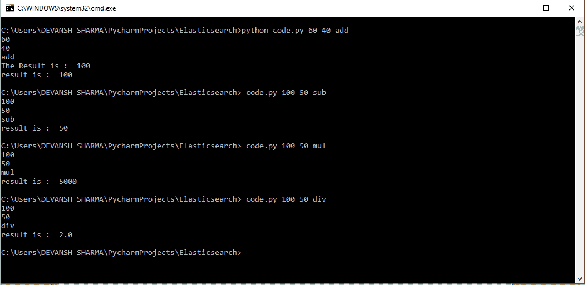
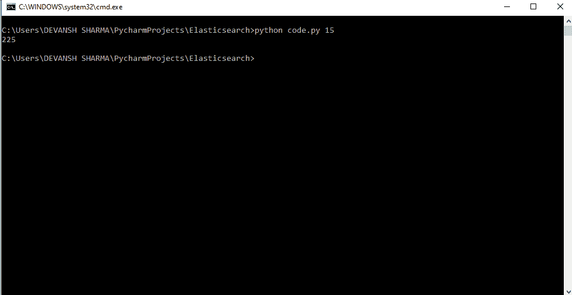
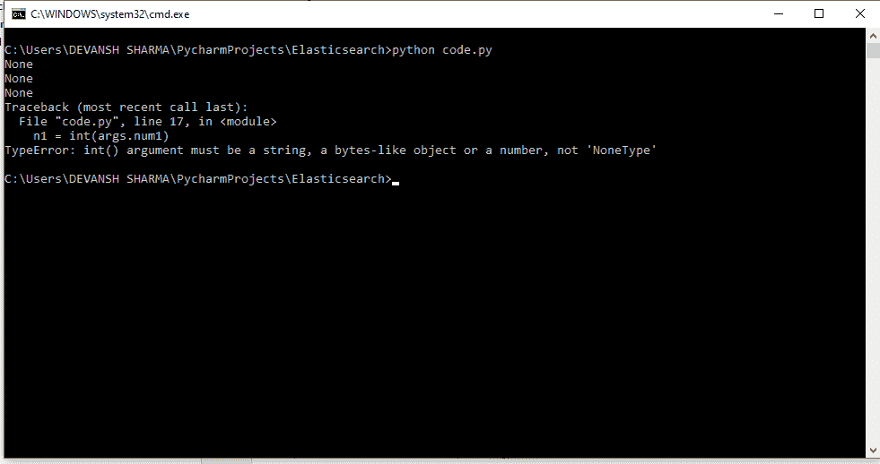
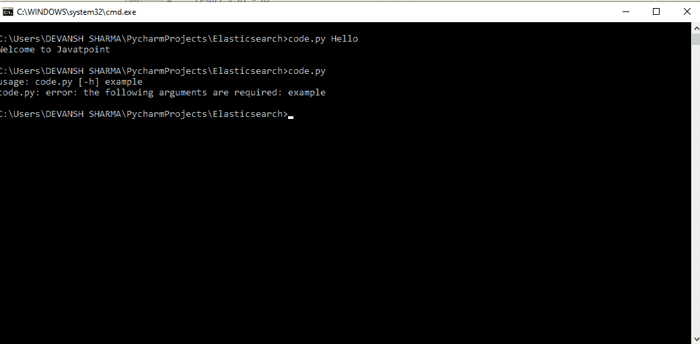
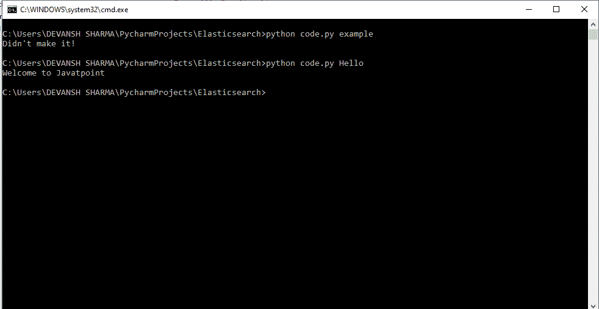

# Python 中的参数解析

> 原文：<https://www.javatpoint.com/argparse-in-python>

在本文中，我们将学习 Python 中的 argparse 模块。我们将探索它的工作原理和功能。对于基础开发人员、工程师和计算机科学家来说，这是一个非常重要的话题。众所周知，Python 因其包含丰富的库而广受欢迎。如果开发人员为命令行编写脚本，他/她还需要传递我们可以使用 **argparse** 库创建的命令行参数。

在本文中，我们将探讨以下与 argparse 相关的主题。

*   什么是命令行界面？
*   Python 中的 argparse 是什么？
*   如何实现 Python argparse 库来创建命令行界面？
*   命令行界面中的参数类型
*   Python 参数解析位置参数
*   Python 参数解析位置参数默认值
*   使用可选参数的简称
*   用 argparse 组合可选参数和位置参数
*   结论

让我们了解 argparse 是什么，以及如何实现它。

### 什么是命令行界面？

命令行界面也称为 CLI，它与命令行脚本进行交互。 [Python](https://www.javatpoint.com/python-tutorial) 提供了许多允许我们使用 CLI 的库，但是 Python argparse 是当前场景中最适合的库。

### 命令行界面是如何工作的？

在深入这个主题之前，我们需要了解命令行界面是如何工作的？所以打开命令行终端，输入 [**ls** 命令](https://www.javatpoint.com/linux-ls)即可获得系统中可用文件的完整列表。

```py

C:\Users\DEVANSH SHARMA>ls

```

**输出:**

```py
face.png
Favorites
file1.txt
file2.txt
flower.jpg
forest.jpg
Gow-0.8.0.exe
gradients.jpg
hadoop-2.8.0
hadoop-2.8.0.tar.gz
hello_fullstack
highway.mp4
IBA_IOAPDATA
innocentcat
IntelGraphicsProfiles
international-cricket-players-data.zip
Iris.csv
iris.zip
java_error_in_pycharm_6408.log
java_error_in_pycharm_6684.log
jtp_logo.png
linear_reg
linear_reg.zip
Links
Local Settings
main_image.jpg
mario.png
metastore_db
MicrosoftEdgeBackups
Music
My Documents
mycus
9c409ba1dd3f}.TMContainer00000000000000000001.regtrans-ms
NTUSER.DAT{42939bbc-edb6-11ea-9c24-9c409ba1dd3f}.TMContainer00000000000000000002.regtrans-ms
ntuser.ini
PySpark DataFrame.ipynb
PySpark RDD.ipynb
PySpark SQL.ipynb
PySpark UDF.ipynb
tesseract-3.02.02-win32-lib-include-dirs
tesseract-3.02.02-win32-lib-include-dirs.zip

```

正如我们在上面的输出中看到的，ls 命令返回当前目录中可用的许多文件。

现在，我们将通过在命令行中添加选项-l 来运行 **ls** 命令。

```py

C:\Users\DEVANSH SHARMA>ls -l

```

**输出:**

```py
total 717704
drw-rw-rw-   2 DEVANSH SHARMA 0         0 2020-04-07 13:25 __pycache__
dr--r--r--   2 DEVANSH SHARMA 0         0 2020-09-03 13:42 3D Objects
drw-rw-rw-   2 DEVANSH SHARMA 0         0 2014-01-03 15:37 8235702-a50f7c449c41b6dc8eb87d8d393eeff62121b392
drw-rw-rw-  20 DEVANSH SHARMA 0     32768 2020-12-07 16:20 Anaconda3
drw-rw-rw-   5 DEVANSH SHARMA 0         0 2020-09-03 13:02 AppData
drw-rw-rw-   2 DEVANSH SHARMA 0      8192 2021-02-11 21:39 Application Data
-rw-rw-rw-   1 DEVANSH SHARMA 0       224 2019-11-13 14:38 array.mat
-rw-rw-rw-   1 DEVANSH SHARMA 0     69548 2019-12-03 14:18 ballon.jpg
-rw-rw-rw-   1 DEVANSH SHARMA 0     69548 2019-12-03 14:20 baloon.jpg
-rw-rw-rw-   1 DEVANSH SHARMA 0      1857 2019-10-15 12:16 binary.png
-rw-rw-rw-   1 DEVANSH SHARMA 0         5 2020-04-01 16:46 binfile.bin
-rw-rw-rw-   1 DEVANSH SHARMA 0     13911 2019-10-16 11:52 blob.jpg
-rw-rw-rw-   1 DEVANSH SHARMA 0    244879 2019-10-14 14:19 book1.jpg
-rw-rw-rw-   1 DEVANSH SHARMA 0     10064 2020-04-07 16:35 calculation.py
-rw-rw-rw-   1 DEVANSH SHARMA 0     23073 2019-12-06 15:30 calibresult.jpg
-rw-rw-rw-   1 DEVANSH SHARMA 0       336 2019-11-29 15:11 cat.jpeg
-rw-rw-rw-   1 DEVANSH SHARMA 0         0 2019-12-05 12:34 cat.jpg
-rw-rw-rw-   1 DEVANSH SHARMA 0     13001 2019-10-13 17:22 cat_16x9.jpg
-rw-rw-rw-   1 DEVANSH SHARMA 0    249726 2019-10-13 15:02 cat1.jpg
-rw-rw-rw-   1 DEVANSH SHARMA 0      5633 2019-12-04 11:16 coin.jpg
-rw-rw-rw-   1 DEVANSH SHARMA 0      8652 2019-12-04 11:23 coin1.png
-rw-rw-rw-   1 DEVANSH SHARMA 0     59918 2020-03-02 11:22 comic.png
dr--r--r--   2 DEVANSH SHARMA 0         0 2020-09-03 13:42 Contacts

```

## Python 中的 argparse 是什么？

Python argparse 是一个命令行解析模块，建议使用命令行参数。该模块于 2011 年 2 月 20 日作为 Python 标准库的一部分发布。

它类似于 [**getopt 模块**](https://www.javatpoint.com/getopt-module-in-python) ，但使用起来略显吃力，执行同样的任务需要更多的代码行。然而，argparse 模块是 **Python getopt** 和 **optparse 模块**的更好替代。它提供了以下几个重要特性。

*   它允许我们使用位置参数。
*   它允许我们自定义前缀字符。
*   它支持单个选项的可变参数数量。
*   它支持子命令。

## 如何实现 argparse 库来创建命令行界面？

让我们看下面这个简单的例子来理解 Python 中 argparse 模块的工作原理。

**示例-** 在下面的示例中，我们使用**arg parse**模块创建了一个简单的 Python 程序来执行添加操作。我们将通过命令行界面传递参数。

```py

# importing argparse module
import argparse
parser = argparse.ArgumentParser()

# creating two variables using the add_argument method
parser.add_argument("num1", help = "first number")
parser.add_argument("num2", help = "second number")
parser.add_argument("operation", help = "operation")

```

我们已经导入了 argparse 模块，并创建了一个简单的解析器，将在整个程序中使用。我们调用了 **add_argument()** 方法，传递了两个参数- **num1 和 help。**我们已经将上述代码保存在名为 ***code.py.*** 的文件中

为了运行这个程序，我们打开命令行界面并运行上面的文件。

**命令**

```py

C:\Users\DEVANSH SHARMA\PycharmProjects\Elasticsearch>python code.py

```

当我们按回车键时，它将显示以下输出。

**输出:**

```py
usage: code.py [-h] num1 num2 operation
code.py: error: the following arguments are required: num1, num2, operation

```

正如我们所看到的，它显示了错误，因为我们没有传递所需的参数。

现在，我们将传递可选参数- h，它基本上用于帮助。

**命令**

```py

C:\Users\DEVANSH SHARMA\PycharmProjects\Elasticsearch>python code.py -h

```

它将显示以下输出。

```py
usage: code.py [-h] num1 num2 operation

positional arguments:
  num1        first number
  num2        second number
  operation   operation

optional arguments:
  -h, --help  show this help message and exit

```

我们得到了在 Python 程序中定义的所有参数列表。现在，我们将通过添加以下操作来打印参数和操作。当我们执行**时。parse_args()，**我们得到一个 Namespace 对象，它包含从命令行接收的每个输入参数的简单属性。

```py

args = parser.parse_args()

print(args.num1)
print(args.num2)
print(args.operation)

```

我们使用 args 变量将参数打印到控制台。默认情况下，它接受输入，因此我们需要将其类型转换为整数。

```py

n1 = int(args.num1)
n2 = int(args.num2)

```

为了将这两个数字相加，我们在代码中定义了加法操作。

```py

result = n1 + n2
print("The Result is : ",result)

```

```py
C:\Users\DEVANSH SHARMA\PycharmProjects\Elasticsearch>python code.py 20 30 add
20
30
add
The Result is :  50

```

**示例- 1 使用 argparse 的简单计算器程序**

```py

# importing argparse module
import argparse
parser = argparse.ArgumentParser()

# creating two variables using the add_argument method
parser.add_argument("num1", help = "first number")
parser.add_argument("num2", help = "second number")
parser.add_argument("operation", help = "operation")

args = parser.parse_args()

print(args.num1)
print(args.num2)
print(args.operation)

n1 = int(args.num1)
n2 = int(args.num2)

if args.operation == "add":
    result = n1 + n2
    print("The Result is : ",result)

elif args.operation == "sub":
    result = n1 - n2

elif args.operation == "mul":
    result = n1 * n2
elif args.operation == "div":
    result = n1 / n2
else:
    print("Unmatched Argument")

print("result is : ",result)

```

**输出:**



## 命令行界面中的参数类型

我们可以向命令行界面添加两个参数。

*   位置参数
*   可选参数

让我们理解这两个论点。

**位置参数-** 位置参数是我们在命令中用来操作的参数类型。我们将参数传递给命令并执行一些操作。它们的位置由它们的功能决定。这就是为什么它们被称为位置论证。

默认情况下，位置参数被视为字符串，但是我们可以在其他数据类型中进行类型转换。

在前面的示例中，我们使用了位置参数来执行两个数字之间的相加操作。

让我们理解下面的代码。

**示例- 1**

```py

import argparse

parser = argparse.ArgumentParser()

# By default, it treats input number as string
parser.add_argument('num', help="Enter nmber to get square of it.")
args = parser.parse_args()
print(args.num**2)

```

**输出:**


我们已经传递了 15，它返回了 1515，因为 argparse 被视为字符串。我们可以使用 type 属性来纠正这一点。

**示例-**

```py

import argparse

parser = argparse.ArgumentParser()

parser.add_argument('num', help="Enter number to get square of it.", type = int)
args = parser.parse_args()
print(args.num**2)

```

**输出:**



现在，我们得到了想要的结果。

**可选参数-** 可选参数不是必需的。如果不传递给脚本，我们将不会得到错误。这些类型的参数以-单破折号或“-”双破折号前缀开始。我们需要打电话给**。add_parse()** 传递可选参数。

让我们理解下面的例子。

**示例-**

```py

# importing argparse module
import argparse
parser = argparse.ArgumentParser()

# creating two variables using the add_argument method
parser.add_argument("--num1", help = "first number")
parser.add_argument("--num2", help = "second number")
parser.add_argument("--operation", help = "operation")

args = parser.parse_args()

print(args.num1)
print(args.num2)
print(args.operation)

n1 = int(args.num1)
n2 = int(args.num2)

if args.operation == "add":
    result = n1 + n2
    print("The Result is : ",result)

elif args.operation == "sub":
    result = n1 - n2

elif args.operation == "mul":
    result = n1 * n2
elif args.operation == "div":
    result = n1 / n2
else:
    print("Unmatched Argument")

print("result is : ",result)

```

当我们在不传递任何参数的情况下运行上述代码时，它将显示以下输出。

**输出:**



正如我们在上面的代码中看到的，我们在没有传递任何可选参数的情况下运行了脚本，它没有返回错误，而是返回 **none** 。可选参数的帮助消息和数据类型与位置参数中的相同。

## Python 参数解析位置参数

有时，我们需要在执行时在脚本中强制传递的参数。让我们看一个它没有通过的例子。

**示例-**

```py

import argparse

parser = argparse.ArgumentParser()
parser.add_argument("example")
args = parser.parse_args()

if args.example == 'Hello Python':
    print('Welcome to Javatpoint')
else:
    print("Didn't make it!")

```

当我们使用不同的参数运行上述代码时，它将显示以下参数。

**输出:**



如果参数没有在命令行终端中传递，我们可以显示错误。

## Python 参数解析位置参数默认值

我们可以使用 argparse 模块为变量或参数提供默认值。在前面的示例中，位置参数值在未提供时为空。让我们理解下面的例子。

**示例-**

```py

import argparse

parser = argparse.ArgumentParser()
parser.add_argument("example", default = "Hello How are you")
args = parser.parse_args()

if args.example == 'Hello':
    print('Welcome to Javatpoint')
else:
    print("Didn't make it!")

```

**输出:**



## 将简称用作可选参数

传递许多可选参数会使我们的 Python 脚本变长。因此，我们也可以为参数指定简称。我们可以给参数取缩写名；这将有助于我们保持 Python 脚本的简短。

让我们理解下面的例子。

**示例-**

```py

import argparse

parser = argparse.ArgumentParser()
parser.add_argument('-tut', '--tutorial', help="Best Tutorial ")
parser.add_argument('-w', '--writer', help="Technical Content")
args = parser.parse_args()

if args.tutorial == 'Javatpoint':
    print('Congratulation|| You made it!')

if args.writer == 'Devansh':
    print('Technical Writer.')

```

**输出:**

```py
C:\Users\DEVANSH SHARMA\PycharmProjects\Elasticsearch>python code.py -w Devansh
Technical Writer.	

```

在上面的代码中，我们为两个可选参数都指定了缩写。我们可以用它的简称来访问它。

### 用 argparse 组合可选参数和位置参数

我们可以使用 argparse 组合可选参数和位置参数，如下所示。让我们理解下面的例子。

**示例-**

```py

import argparse

parser = argparse.ArgumentParser()
# positionl Argument
parser.add_argument('tutorial', help="Best Tutorial ")
# optional argument 
parser.add_argument('-w', '--writer', help="Technical Content")
args = parser.parse_args()

if args.tutorial == 'Javatpoint':
    print('You made it!')

if args.writer == 'Devansh':
    print('Technical Writer.')

```

**输出:**

```py
C:\Users\DEVANSH SHARMA\PycharmProjects\Elasticsearch>python code.py Javatpoint -w Devansh
You made it!
Technical Writer.

```

我们已经将这两种类型的参数传递给了命令行，并获得了上面的输出。

## 结论

到目前为止，我们已经讨论了 argparse Python 模块的非常重要的概念。我们已经学习了如何创建它们，以及如何通过命令行界面使用它们。我们还了解了 argparse 模块是什么，以及为什么用 Python 编写命令行脚本很重要。

该模块帮助我们创建自解释程序，并为用户提供与我们的应用程序交互的方法。

* * *