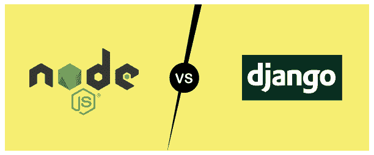
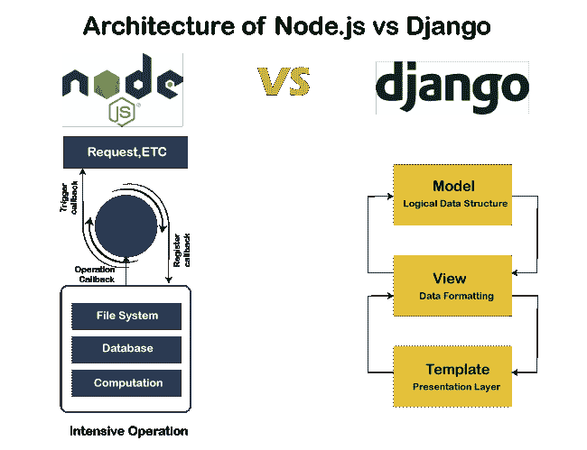

# Django 和 Node JS 的区别

> 原文：<https://www.javatpoint.com/django-vs-node-js>

在本教程中，我们将讨论趋势技术 Django 和 Node JS 之间的主要区别。本教程将对这两种技术进行深入分析，帮助您为项目或职业选择合适的语言。我们将探讨所有的基本主题，如优点、缺点及其用途。

这两种技术在构建具有优秀用户界面的各种用途的 web 应用方面都非常强大。两者都是开源的，这意味着任何人都可以在没有任何付费许可的情况下使用它们。让我们对下面给出的每项技术进行概述。

## Django是什么？

[Django](https://www.javatpoint.com/django-tutorial) 是一个高级 web 框架，允许用户开发安全且可维护的网站。它是用 [Python 编程语言](https://www.javatpoint.com/python-tutorial)编写的。有经验的程序员建造它。Django 处理网络开发的麻烦，这样用户就可以编写高效的网络应用。它有一个庞大的活跃社区、优秀的文档和其他功能。

### Django的特色

Django 具有许多有用的特性。

*   **完成**

Django 基于**“内置电池”**方法，允许开发者“开箱即用”地完成**的事情**它提供了几乎所有可以无缝协同工作的功能，并且遵循一致的设计原则。如果用户在使用时遇到困难，他/她可以从最新的文档中寻求帮助。

*   **多功能**

Django 是一个通用框架，用于开发多用途或任何网络应用。优点之一是它可以轻松地与客户端框架协作，并以几乎任何格式带来内容。

*   **固定**

安全是 Django 受欢迎的主要原因。它为 web 应用提供了最佳的安全性，并避免了常见的安全错误。它被设计成**“做正确的事情”**，自动保护网络应用。Django 提供了一种安全的方式来管理密码；它还避免了常见的错误，例如将会话信息放在容易受到影响的 cookies 中。

Django 保护网络应用免受许多安全问题的影响，例如 SQL 注入、跨站点脚本、跨站点请求遗忘和点击劫持。

*   **可扩展**

Django 的架构独立于其他架构，如果需要，可以轻松更改或替换。Django 的不同部分有明显的分离，这意味着它可以通过在任何级别添加硬件来增加流量。

*   **可维护**

Django 鼓励编写可维护和可重用的代码。它遵循 DRY(不要重复自己)方法，所以我们不会得到任何不必要的重复。它将相关功能分组到可重用的应用中。

## 什么是 Node JS？

[节点 JS](https://www.javatpoint.com/nodejs-tutorial) 是服务器端 [JavaScript](https://www.javatpoint.com/javascript-tutorial) 平台；它旨在构建可扩展的网络应用，由 Ryan Dahl 于 2009 年开发。Node JS 是一个跨平台的运行时环境，用于开发服务器端和网络应用。

Node JS 由一个非阻塞和事件驱动的模型组成，这使得它轻量级且有效。

### 节点 JS 的特点

以下是 Node JS 的几个重要特性。

*   **异步和事件驱动**

Node JS 的 API 是异步的和事件驱动的，这意味着基于 Node JS 的服务器不需要等待 API 返回数据。通知机制通知服务器，以前的 API 在使用新的 API 时会生成响应。

*   **速度**

节点。JS 库以超快的速度执行代码，因为它是建立在谷歌 Chrome 的 V8 JavaScript 引擎上的。

*   **高度可扩展**

节点。JS 是高度可伸缩的，因为它使用了带有事件循环的单线程模型。它的事件机制允许服务器以非阻塞方式响应，传统服务器创建有限的线程来处理请求。它使节点。JS 高度可扩展。节点。与传统服务器如 Apache HTTP 相比，JS 单线程程序可以为大量用户提供服务。

*   **无缓冲**

节点。JS 应用在处理数据时不缓冲。这些应用分部分处理输出数据。

## Django 和 Node 的区别。射流研究…

| 特征 | Django | 节点 JS |
| **定义** | Django 是基于 Python 的网络框架。它是一个开源平台，用于构建丰富的 web 应用。 | Node JS 是一个运行在 JavaScript 上的开源网络应用，旨在构建强大的 API(客户端)。 |
| **安全** | 它提供了强大的安全性，并配有高度保护的内置系统，可防止任何缺陷。 | 它不像 Django 那样安全，需要手动操作来处理安全问题。 |
| **性能** | 它提供了更好的性能，并有助于创建主要的网络应用。它带有一个内置的房屋模板系统，便于快速执行所需的任务。 | Node JS 的性能令人印象深刻，因为它为开发人员提供了自由。但是开发应用需要很多时间。 |
| **效率** | Django 效率很高，速度也很快。所以，它是有成本效益的。 | 它消耗更多的操作时间。然而，它很容易学习。它的成本效益较低。 |
| **架构** | 它遵循 MVT 模型模板视图。 | 它适用于事件驱动模型。它在操作系统上运行，维护一个小的请求栈。 |
| **灵活性** | 这个框架不太灵活，并且具有相当严格的开发特性。 | 在节点 JS 中，有各种各样的工具和特性，因为它是建立在 JavaScript 库的基础上的。 |
| **发育速度** | 由于内置系统，操作时间更少；但是，如果开发人员不了解 python，那么学习起来就很耗时。 | 它需要更多的操作时间，但是如果开发人员对 JavaScript 有经验，那么它会很有帮助。 |
| **刀具类型** | 这是一个网络框架。 | 这是一个运行时环境。 |
| **社区** | Django 在世界各地拥有庞大的社区和最新的文档。 | 它还有一个庞大的社区。 |

## 节点 JS 和 Django 的体系结构

### Django

Django遵循 [MVT(模型视图模板)](https://www.javatpoint.com/django-mvt)架构。与许多旧框架相比，它有几个优点。它帮助开发人员更快、更先进地构建应用。其基于组件的模式有助于简化修改。组件中的一个更改不会影响整个应用或另一个组件。

### 节点 JS

节点 JS 架构与其他服务器端平台非常不同。它基于偶数循环架构和单线程，有助于构建高端应用。单线程的优点是没有上下文切换，这有助于减少重载。在 Node JS 中，处理多个并发请求既简单又非常快速。它为应用提供了健壮性，并使它们可以毫不延迟地处理请求。

## Django的优缺点

以下是Django的几个重要优点和缺点。

**优势**

*   它为 web 应用提供了更好的安全性。
*   与其他框架相比，完成大型项目花费的时间更少。
*   它通过内置模板提供了更好的性能水平。
*   它相对容易学。

**缺点**

*   它只允许构建单层应用。
*   不适合小应用。
*   这需要对框架有更多的了解。

## 节点 JS 的优缺点

以下是 Node JS 的几个重要优缺点。

**优势**

*   它在世界各地有一个活跃而庞大的社区。
*   它是开源的，由更多的库组成。
*   它有一个更容易遵循的系统，具有不太复杂的特性。
*   我们可以轻松执行打开命令。

## 结论

在本教程中，我们学习了两种领先的网络技术——Node JS 和 Django 之间的区别。此外，我们还讨论了这两种技术的各个方面。这两种技术都适合构建大规模的网络应用。

在从他们中选择任何人之前，我们需要了解我们的要求。

Django 在有效维护密码方面非常安全，Node JS 提供了许多库，这有助于开发人员创建高度灵活的网络应用。

对于“哪种技术好得多”这个问题，没有具体的答案我们需要了解的是项目需求，然后应该转向最合适的技术。

* * *