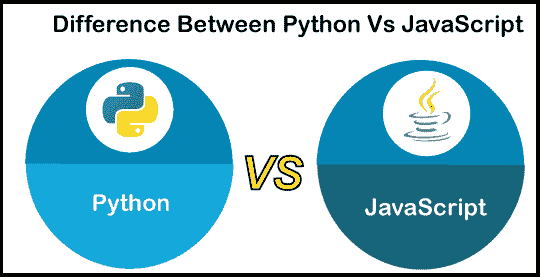

# Python 与 JavaScript

> 原文：<https://www.javatpoint.com/python-vs-javascript>

Python 和 JavaScript 都是极其强大的编程语言，有着广泛的现实应用。Python 是一种编程语言，可用于网页创建和各种其他用途，如科学研究。JavaScript 主要用于前端和后端 web 和移动应用开发。本文将讨论 Python 和 JavaScript 之间的差异。在进行比较之前，我们将了解 Python 和 JavaScript。

## Python 是什么？

[Python](https://www.javatpoint.com/python-tutorial) 是一种**动态语义、解释、面向对象的**和**高级编程语言**。是一个内置的[数据结构](https://www.javatpoint.com/data-structure-tutorial)，高水平的**动态绑定** g 和**动态打字**。它用作连接现有组件和创建**快速应用**的脚本或粘合语言。它有一个简单易懂的语法，强调可读性，降低了软件维护成本。它支持模块和包，允许程序更加模块化和可重用。Python 解释器和健壮的标准库可以自由使用，并以源代码或二进制形式发布给所有主要平台。

最早由**吉多·范·罗苏姆**于 20 世纪 80 年代后期**开发，并于 **1991** 发布。它是一种先进的开源编程语言，通过 **Python 增强提案**促进公众辩论。**

 **### Python 的优缺点

Python 的各种优缺点如下:

### 优势

*   它是一种面向对象的编程语言，用于开发快速应用。
*   与 **Java、C** 和 **C++** 相比，它的语法非常简单。
*   它运行在几种类型的操作系统和计算机上，比如 **Windows、macOS** 和 **Linux** 。
*   它有自动安装的外壳。
*   它有一个广泛的库和方便的开发工具。
*   它附带了各种预构建的库，使我们的开发任务变得非常容易。
*   它有一个交互式外壳，允许我们在项目实现之前对其进行评估。
*   它附带了一个巨大的标准库来支持各种常见的编程任务。

### 不足之处

*   它只在少数平台上使用。
*   它在移动计算方面比较弱，所以不用于 app 开发。
*   它没有商业支持。
*   它是一个开发不足且原始的数据库访问层。
*   由于 Python 是动态的，所以在执行过程中会产生更多的错误。

## 什么是 JavaScript？

[JavaScript](https://www.javatpoint.com/javascript-tutorial) 是一种**轻量级、面向对象的脚本语言**，用于在网页上构建具有交互效果的动态 [HTML](https://www.javatpoint.com/html-tutorial) 页面。JavaScript 也常用于游戏开发和移动应用开发。它是一种解释的脚本语言，代码只能在网络浏览器中执行和运行。我们可以使用 [Node.js](https://www.javatpoint.com/nodejs-tutorial) 在浏览器外部执行和运行代码。它也被称为**浏览器的语言**，可以用于客户端和服务器端开发。**网景**的 Brendan Eich** 创造了它，最早发表于 **1995** 。这种语言最初被称为 **LiveScript** ，后来被重新命名为 **JavaScript** 。JavaScript 的语法深受[编程语言 **C**](https://www.javatpoint.com/c-programming-language-tutorial) 的影响。JavaScript 文件名的扩展名为**。js** 。**

### JavaScript 的优缺点

JavaScript 的各种优缺点如下:

### 优势

*   这是一个开源项目。
*   它允许交叉编译。
*   支持**接口、模块**、**类**。
*   它在客户端和服务器端都使用。
*   它允许我们构建当用户将鼠标悬停在界面上时做出反应的界面。
*   它可以在任何浏览器中运行。
*   我们可以扩展 JavaScript 来编写大型应用。

### 不足之处

*   它不能用于开发网络应用，因为不支持网络应用。
*   客户端 JavaScript 不支持写入或读取文件。它一直只是为了安全目的而保留。
*   它只支持单一继承，不支持多重继承。某些程序可能需要这种面向对象的语言功能。

## Python 和 JavaScript 的主要区别

在这里，我们将讨论 Python 和 JavaScript 之间的主要区别:

*   Python 是强类型的，没有隐式形式转换，而 JavaScript 是弱类型的。
*   Python 是一种设计更好的语言，比 JavaScript 更容易维护。
*   Python 支持多种数值数据类型，包括 int、float 和定点十进制，而 Java-Script 主要处理浮点变量。
*   Python 基于对象的编程类似于 JavaScript，支持使用基本函数和变量的编程风格。
*   Python 使用一个 Self 参数作为每个函数的第一个参数，而 JavaScript 使用**“this”**函数来访问对象。
*   在 JavaScript 中，同步和阻塞编程很常见，而 Python 默认为**事实上为**。
*   Python 有许多库用于**机器学习、数据分析**和**科学计算**，而 JavaScript 没有这些库。
*   Python 主要用于服务器端编程，而 JavaScript 同时运行在服务器和浏览器上。
*   Python 比 JavaScript 更容易开始编程。
*   Python 执行程序比 JavaScript 慢。
*   JavaScript 使用了一个**“；”**语句终止符，而 Python 没有。
*   JavaScript 是移动应用开发的理想选择，而 Python 并不好。
*   与 JavaScript 不同，Python 不允许我们从实例继承。

## Python 和 JavaScript 的面对面比较

在这里，我们将以表格形式讨论 Python 和 JavaScript 之间的直接比较:

| 特征 | 计算机编程语言 | Java Script 语言 |
| 用线串 | 默认情况下，Python 的源代码是 ASCII，除非我们定义了编码格式。 | JavaScript 需要 UTF-16 编码，并且没有内置的支持来操作原始字节。 |
| 函数参数 | 如果用无效参数调用函数，Python 将抛出异常并接受任何额外的参数传递语法。 | Java-Script 不关心函数是否用精确的参数调用，因为缺省情况下，任何缺少的参数都被视为“未定义”，任何额外的参数都被视为特殊参数。 |
| 属性和属性 | 我们可以使用 getter 和 setter 函数，使用描述符协议在 Python 中定义一个属性。 | JavaScript 对象具有可能由底层属性组成的属性，并允许我们定义属性。 |
| REPL(读取-评估-打印-循环) | 我们将在安装 Python 时获得它，并且根据我们的设置，我们将使用不同的 Python 版本。 | 由于 Java-Script 主要用于浏览器，我们没有内置的 REPL。但是，我们可以通过安装 node.js 来使用 REPL |
| 民数记 | 在 Python 中，我们可以使用各种数字类型，如 int、定点十进制、float 和许多其他类型。 | 相比之下，Java-Script 只支持浮点数。 |
| 易变性 | Python 有可变和不可变的数据类型，包括集合和列表。 | JavaScript 没有可变和不可变这样的数据类型。 |
| 散列表 | 它有内置的哈希表，如字典、集合和其他可以用来在哈希表中存储键和值的表。 | 哈希表没有内置支持。 |
| 数据类型 | Python 有两种彼此相似的数据类型，即列表和元组。Python 的列表和 JavaScript 数组非常相似。 | 它有一个内置数组类型。 |
| 模块 | Python 称自己是一种包含电池的语言，因为它带有大量模块。 | JavaScript 只有几个模块，包括数学、正则表达式、日期和 JSON。它具有通过主机环境可用的功能，例如网络浏览器或其他环境。 |
| 代码块 | 它使用缩进。 | 它使用了花括号。 |
| 遗产 | 它使用基于类的继承模型。 | 它使用基于原型的继承模型。 |
| 范围 | Python 是数学密集型操作、数据分析和机器学习的更好选择。 | JavaScript 适合开发网站或原生应用。 |
| 移动开发 | 这不是设计移动应用的合理选择。 | 除了前端和后端开发，是移动开发的好选择。 |
| 对象访问 | Python 对每种方法的第一个论证都是自我论证。 | JavaScript 使用“this”方法来访问对象。 |

## 结论

Python 和 JavaScript 有细微的区别。我们可以用这两种语言做任何事情，因为它们共享许多特性，例如解释的、函数的、词汇范围的、面向对象的和命令式编程。Python 和 JavaScript 可以使用许多库和插件来完成比内置功能更多的工作。虽然两者都有很多工作机会，但 Python 的市场地位更高，也更容易学习。

* * ***