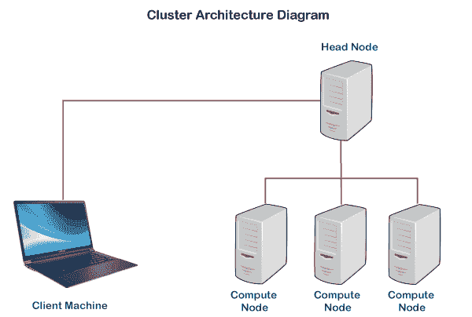
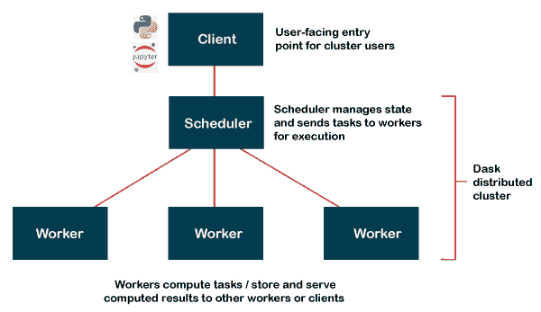
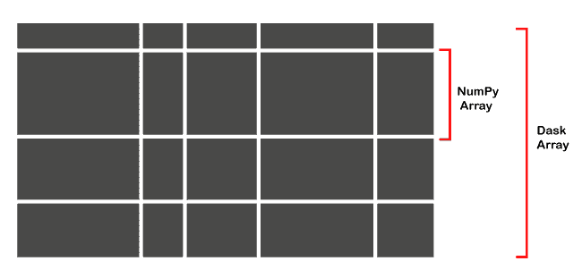

# Dask Python

> 原文：<https://www.javatpoint.com/dask-python>

在机器学习和数据科学的现代世界中，非常容易找到与众不同的 Python Tools。这些软件包包括 **scikit-learn、NumPy** 或**pands**，它们不能根据内存使用或处理时间的数据进行适当扩展。

预计将转向分布式计算工具(传统上称为 **Apache Spark** )。然而，这可能意味着为一个全新的系统重组工作流，在熟悉的 Python 生态系统和不同的 [Java 虚拟机(JVM)](https://www.javatpoint.com/jvm-java-virtual-machine) 世界之间导航，并使开发工作流明显复杂化。

**Dask** 库用于将分布式计算能力与数据科学 Python 开发的灵活性相结合，与 Python 的标准数据工具无缝集成。

### 理解分布式计算

让我们考虑一个场景:我们有一个数据集，可能是一组非常大的文本文件，以便放入机器的内存中。我们可以利用 Python 中的文件流和另一个生成器工具来迭代数据集，而无需将它们加载到内存中。然而，另一个问题会出现，因为程序仍然在单线程上工作，这最终会限制速度，即使在内存管理之后。

因此， [Python](https://www.javatpoint.com/python-tutorial) 提供了一个被称为全局解释器 Look 的安全特性(换句话说，大多数开发人员使用 **CPython** )来用 Python 编写并行代码，但这可能有点棘手。

因此，很少有好的解决方案可供选择。此类解决方案涉及使用 GIL 以外的低级工具(例如在 Python 以外的编译代码中执行多线程重载的 NumPy)或利用 Python 代码包中的多个进程/线程，例如**多进程**或 **joblib** 。

然而，很难尝试并行化来加快代码的速度，因此，即使流程完成得很正确，在可读性较差的代码中，开发人员需要完全重新设计流程，但系统资源有限。

对于实际上像上面这样的大规模困难，分布式计算可以被认为是一个普遍的关键。工作被分配给分布式系统中的多个独立工作机器，而不是仅仅试图在单个设备上的多个线程中工作。

这些自主工作机器在其处理器和磁盘空间或内存中处理数据集的块。这些工作机只通过相对简单的消息传递相互通信或通过中央调度进行通信，而不是像多线程代码那样共享磁盘空间和内存。

分布式计算系统还允许开发人员在相当大的数据集上扩展代码，以便在任意数量的工作人员上并行运行，以换取设置集中式调度器并使工作人员与每个工作人员完全分离的复杂设计。

让我们了解什么是 **Dask** 以及它是如何工作的。

### 了解 Dask

**Dask** 是与其他社区项目协同开发设计的免费开源库，如 **[【Pandas】](https://www.javatpoint.com/python-pandas)[NumPy](https://www.javatpoint.com/numpy-tutorial)****scikit-learn**。它是一个并行计算库，通过任务工作者和任务调度器来分配更广泛的计算，并将它们分解成更小的计算。 **Dask** 库在比内存更大的数据集上提供分布式并行和多核执行。

**Dask** 通过其低级调度器和高级集合提供不同的实用程序。

1.  **低级调度器:Dask** 提供动态的任务调度器，并行处理任务图。这些执行机器控制着**高级集合**。但是，我们可以使用它们来支持用户定义的习惯和工作负载。这些调度器具有较低的延迟(大约 1 毫秒)，并且努力在较小的内存占用中处理计算。 **Dask** 中的调度器是在复杂情况下或其他任务调度系统(如 **IPython 并行**或 **Luigi** )中指导使用多进程和线程库的替代方案。
2.  **高级集合:Dask** 提供了模仿Pandas、列表和 NumPy 的高级数组、数据帧和包集合。然而，我们可以在不适合内存的数据集上并行操作这些。对于大数据集来说， **Dask** 的高级集合是Pandas和 NumPy 的替代品。

**Dask** 的用例提供了几个示例工作流，其中 **Dask** 可以被认为是完美的匹配。

## Dask 调度程序的类型

**Dask** 提供的调度器主要有两种:**单机调度器和分布式调度器**。

1.  **单机调度器:**单机调度器针对大于内存利用率进行了优化。这个调度程序简单、相似，而且使用起来很便宜；然而，由于在单一机器上工作，它无法扩展。
2.  **分布式调度器:**与单机调度器相比，分布式调度器更加复杂，并且完全异步(连续无阻塞对话)。

建议在大多数情况下使用分布式计划程序，因为它提供了一个由多个表格和带有实时信息的图表组成的可调节的交互式仪表板。默认情况下，在初始化群集时，它在端口 8787 可用。

在进入安装部分之前，让我们先了解一下 **Dask 集群**。

### 了解 Dask 集群

一个**集群**是一个分布式或并行处理系统，包含一组相互连接的独立计算机，它们作为一个单一的集成计算资源一起支持运行。集群中的一个节点可以被认为是单个或多进程器系统，如[个人计算机](https://www.javatpoint.com/pc)、工作站，甚至是 SMP。



在集群世界中有各种各样的架构形式，以决定我们如何在计算机之间精确地分配工作。让我们了解集群的组织是如何在 **Dask** 中完成的。

**Dask 网络由三部分组成:**

1.  **集中式调度器:**集中式调度器管理工作人员，并为他们分配需要完成的任务。
2.  **许多工人:**许多工人执行计算，保留结果，并与其他工人交流结果。
3.  **一个或多个客户端:**一个或多个客户端可以通过 Jupyter 笔记本或脚本与用户进行交互。这些客户还将工作提交给时间表，以便对工人进行处理。

客户端将向调度发送请求，描述用于计算的代码类型。一旦接收到请求，调度器就在工人之间分配工作以完成请求，最后工人完成计算工作。



正如我们所观察到的， **Dask** 将这些大量的数据计算分为多个小的计算。

还值得注意的是 **Dask** 也可以基于集群部署在各种技术上，比如:

1.  不可思议的群集
2.  高性能计算集群处理工作经理，如 LSF、PBS、SGE、思乐姆或任何其他常见的科学和学术实验室。
3.  Spark 或 Hadoop 集群处理纱。

### 如何安装 Dask Python

我们可以使用 Anaconda 或者 pip 来安装 **Dask** 。

通过 Anaconda 安装 **Dask** 的语法如下:

```py

conda install dask

```

**或**

我们可以简单的在终端或者命令提示符下使用以下命令通过 pip 安装 **Dask** :

```py

$ pip install dask[complete]

```

一旦我们成功安装了 **Dask** 库，让我们了解一下 **Dask 界面**。

### 理解 Dask 接口

**Dask** 提供不同的用户界面。这些接口包含一组不同的分布式计算并行算法。下面为数据科学搜索从业者陈述了一些重要的用户界面，以扩展 NumPy、Pandas 和 scikit-learn。

1.  **阵列:**并行 NumPy
2.  **数据帧:**平行Pandas
3.  **机器学习:**并行 Scikit-Learn

**达斯克阵列**

Dask 中的数组在阻塞算法的帮助下提供了一个大于内存的、并行的、n 维数组。换句话说，它是 NumPy 数组的分布式形式。

下面这张图片将帮助我们了解 Dask 阵列的外观:



正如我们所看到的，多个 NumPy 数组被组织成网格，以形成一个 Dask 数组。当我们创建一个 Dask 数组时，我们可以规定卡盘的大小，这定义了 NumPy 数组的大小。例如，如果我们在一个数组中有十个值，并且提供的块大小为五，那么它将返回两个 NumPy 数组，每个数组有五个值。

**Dask 阵列**提供了以下描述的一些重要特性:

1.  **大于内存:** Dask Arrays 让我们可以处理比可用内存更大的数据集。Dask 有助于将数组分解成许多小片段，在这些片段上运行以减少计算的内存占用，并有效地从磁盘流式传输数据。
2.  **并行:** Dask 阵列利用所有内核进行并行计算。
3.  **阻塞算法:** Dask Arrays 还提供阻塞算法，以便在块或子矩阵上操作，而不是在数组的整行或整列上运行。该函数通过处理许多小的计算来帮助执行大的计算。

这里有一些使用 Dask 创建数组的简单案例。

**例 1:借助 Dask 数组**创建随机数组

```py

import dask.array as darray  

# using arange for creating an array with values from 0 to 15
my_array = darray.arange(16, chunks = 5)
print( my_array.compute())

# using chunks for checking the size of each chunk
print(my_array.chunks)

```

**输出:**

```py
[ 0  1  2  3  4  5  6  7  8  9 10 11 12 13 14 15]
((5, 5, 5, 1),)

```

**说明:**

在上面的程序中，我们从 **dask** 库中导入了数组模块，并使用 **arange()** 方法创建了一个由 16 个值组成的数组，并将块大小分别定义为 5。然后，我们使用**计算()**方法打印数组。我们还使用**组块**功能检查了每个组块的大小。结果，我们得到了结果数组，我们还可以观察到数组分布在四个块中，其中第一个、第二个和第三个块各包含五个值，第四个块只有一个值。

**示例 2:将 NumPy 数组转换为 Dask 数组**

```py

import numpy as np
import dask.array as darray

first_array = np.arange(15)

second_array = darray.from_array(first_array, chunks = 5)

# resulting in a dask array
print(second_array.compute()) 

```

**输出:**

```py
[ 0  1  2  3  4  5  6  7  8  9 10 11 12 13 14]

```

**说明:**

在上例中，我们导入了 **NumPy** 库和 **dask** 库的数组模块。然后，我们使用**方法创建了一个由 15 个值组成的 NumPy 数组作为 **first_array** 。然后，我们使用 from_array()** 方法将组块分别定义为 5，将**第一 _ 数组**转换为 Dask 数组作为**第二 _ 数组**。然后我们使用**计算()**函数打印数组。

此外，Dask 阵列支持 NumPy 阵列的大部分功能。例如，我们可以使用 **mean()** 、 **sum()** 等等。

**例 3:计算前 100 个数之和**

```py

import numpy as np
import dask.array as darray

# arange is used to create array on values from 0 to 100
first_array = np.arange(100)  

# converting numpy array to dask array
second_array = darray.from_array(first_array, chunks = (10))  

# computing mean of the array
print(second_array.sum().compute()) 

```

**输出:**

```py
4950

```

**说明:**

在上例中，我们导入了 **NumPy** 库和 **Dask** 库的数组模块，并使用**保证**函数创建了一个从 1 到 100 的 NumPy 数组。然后，我们将 NumPy 数组转换为 Dask 数组，并使用 **sum()** 函数打印 Dask 数组值的总和。因此，我们得到了前 100 个数字的总和。

我们已经讨论了 Dask Python 的基本介绍，但是几乎没有重要的概念需要讨论。教程的其余部分将在第二部分中介绍。

* * *