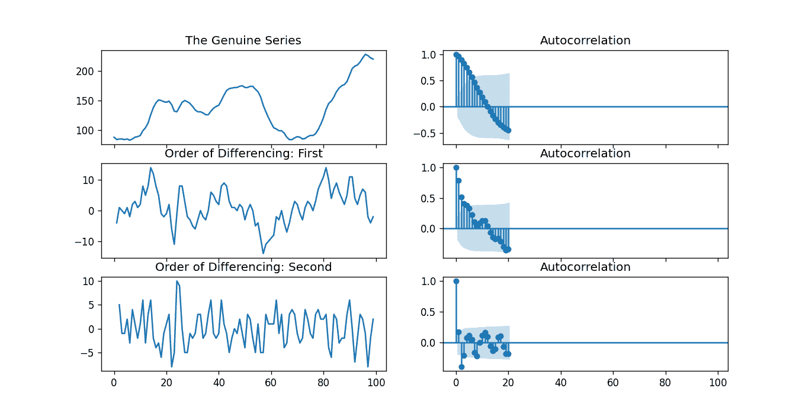
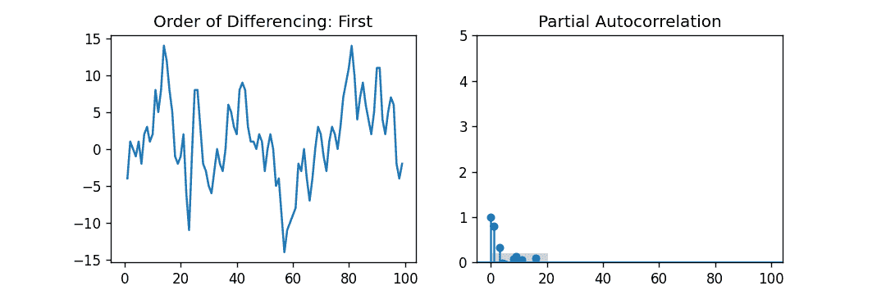
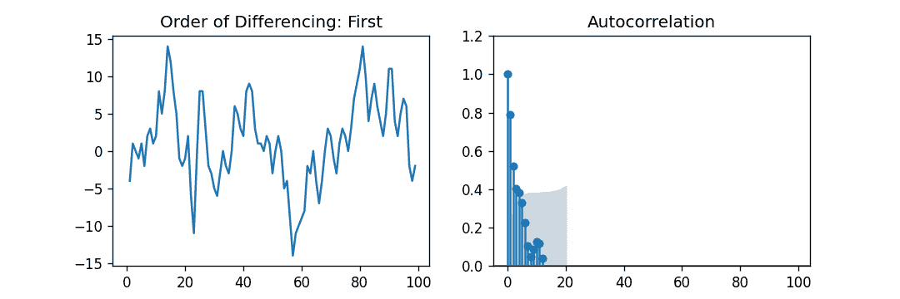
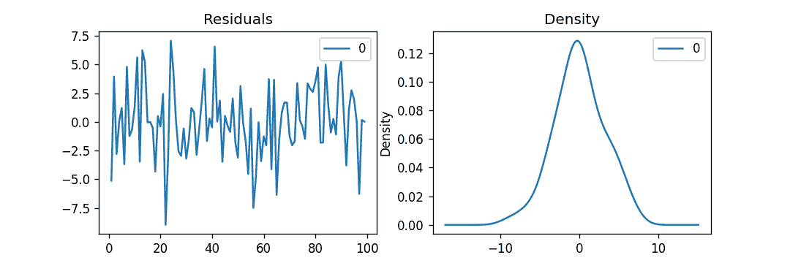
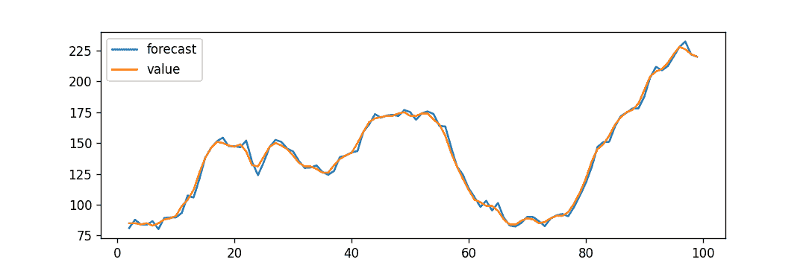

# Python 中的 Arima 模型

> 原文：<https://www.javatpoint.com/arima-model-in-python>

### 时间序列预测导论

在恒定时间间隔内记录度量的序列称为**时间序列**。

**根据频率，时间序列可以分为以下几类:**

1.  年度(例如，年度预算)
2.  季度(例如，费用)
3.  每月(例如，空中交通)
4.  每周(例如，销售数量)
5.  每日(例如，天气)
6.  每小时(例如，股票价格)
7.  分钟(例如，呼叫中心的来话呼叫)
8.  秒级(例如，网络流量)

一旦我们完成了时间序列分析，我们必须对其进行预测，以便预测该序列将采用的未来值。

**但是，预测的必要性是什么？**

因为预测时间序列，如销售和需求，通常具有难以置信的商业价值，这增加了预测的需求。

**时间序列预测**通常用于许多制造公司，因为它驱动主要的业务规划、采购和生产活动。任何预测的误差都会在供应链或任何商业框架中波动。因此，为了节省成本，获得准确的预测是非常重要的，也是成功的关键。

时间序列预测背后的概念和技术也可以应用于任何行业，包括制造业。

**时间序列预测可以大致分为两类:**

1.  **单变量时间序列预测:**单变量时间序列预测是对时间序列的预测，其中我们利用时间序列的前一个值只是为了猜测即将到来的值。
2.  **多变量时间序列预测:**多变量时间序列预测是对时间序列的预测，其中我们利用序列之外的预测因子(也称为外生变量)来进行预测。

在下面的教程中，我们将了解称为 **ARIMA 建模**的具体方法类型。

**自回归综合移动平均线**，缩写为 **ARIMA** ，是一种预测算法，其核心是时间序列先前值中的数据可以单独用于预测未来值的概念。

让我们详细了解一下 ARIMA 模型。

### ARIMA 模型简介

**ARIMA** ，缩写为**“自回归综合移动平均线”**，是一类基于给定时间序列的先前值“演示”给定时间序列的模型:其滞后和预测中的滞后误差，因此可以利用等式来预测未来值。

我们可以用 **ARIMA 模型**来模拟任何非季节展示模式且不是随机白噪声的时间序列。

**ARIMA 模型有三个特征术语:**

**p、q 和 d**

**在哪里，**

*   **p**= AR 项的顺序
*   **q**= MA 项的顺序
*   **d** =使时间序列稳定所需的差值数

如果一个时间序列有季节模式，我们必须插入季节周期，它就变成了**萨瑞玛**，简称**“季节性 ARIMA”**。

现在，在理解**AR 术语**的顺序之前，让我们讨论一下‘d’术语。

### ARIMA 模型中的“p”、“q”和“d”是什么？

第一步是**使时间序列平稳**，以便建立 ARIMA 模型。这是因为 ARIMA 的术语**“自回归”**暗示了一个使用其滞后作为预测因子的线性回归模型。正如我们已经知道的，线性回归模型适用于独立和非相关的预测。

为了使数列平稳，我们将使用最常用的方法，即从现值中减去过去值。有时，根据序列的复杂性，可能需要多次减法。

因此，d 的值是使级数平稳所需的最小减法次数。如果时间序列已经是平稳的，那么 d 就变成了 0。

现在，让我们理解术语“ **p** ”和“ **q** ”。

“ **p** 是**【AR】(自回归)项**的顺序，这意味着要用作预测因子的 Y 的滞后数。同时， **q** 是**【MA】(移动平均线)术语**的顺序，这意味着 ARIMA 模型中应该使用滞后预测误差的数量。

现在，让我们详细了解一下什么是“AR”和“MA”模型。

### 理解自回归和移动平均模型

在下一节中，我们将讨论 AR 和 MA 模型以及这些模型的实际数学公式。

纯自回归模型是一种只依赖自身滞后的模型。因此，我们也可以得出结论，它是“Y <sub>t</sub> 的滞后”的函数


其中，Y <sub>t-1</sub> 为该系列的 lag1。β <sub>1</sub> 是 lag1 的系数，是模型计算的截距项。

类似地，纯移动平均线模型是一个仅依赖滞后预测误差的模型。


其中，误差项是相应滞后的 AR 模型误差。ϵ <sub>t</sub> 和ϵ <sub>t-1</sub> 的误差来自下面给出的公式:


因此，我们分别总结了自回归模型和移动平均模型。

现在让我们理解 ARIMA 模型的方程。

ARIMA 模型是一个模型，其中时间序列被减去至少一次，以使其平稳，我们结合了自回归(AR)和移动平均(MA)项。因此，我们得到以下等式:


**ARIMA 车型用词:**

**预测 Y <sub>t</sub> =常数+Y 的线性组合滞后(最大 p 滞后)+滞后预测误差的线性组合(最大 q 滞后)**

因此，该模型的目标是找到 **p、q** 和 **d** 的值。然而，我们怎么才能找到呢？

让我们从找到 ARIMA 模型中的**开始。**

 **### 在 ARIMA 模型中求微分的阶

ARIMA 模型中差分的主要目的是使时间序列平稳。

然而，我们必须注意不要对序列进行过度差分，因为过度差分的序列也可能是平稳的，这将影响模型的参数。

现在，让我们了解适当的差分顺序。

最合适的差分阶是实现围绕定义的平均值漫游的几乎稳定的序列和相对较快地到达零的 ACF 平台所需的最小差分。

如果自相关对于多个滞后是正的(通常是十个或更多)，则该系列需要进一步求差。相比之下，如果滞后 1 自相关非常负，那么序列可能是过度差分。

如果我们实际上不能在两个差分序列之间做出决定，那么我们必须选择在差分序列中提供最小标准差的序列。

让我们考虑一个例子来检查序列是否是平稳的。我们将使用 [Python 编程语言](https://www.javatpoint.com/python-tutorial)的 **statsmodels** 包中的**增强 Dickey-Fuller 测试(adfuller())** 。

**示例:**

```py

from statsmodels.tsa.stattools import adfuller
from numpy import log
import pandas as pd

mydata = pd.read_csv('mydataset.csv', names = ['value'], header = 0)

res = adfuller( mydata.value.dropna())
print('Augmented Dickey-Fuller Statistic: %f' % res[0])
print('p-value: %f' % res[1])

```

**输出:**

```py
Augmented Dickey-Fuller Statistic: -2.464240
p-value: 0.124419

```

**说明:**

在上面的例子中，我们已经导入了 **adfuller** 模块以及 **numpy** 的日志模块和**熊猫**。然后我们使用**熊猫**库读取 CSV 文件。然后，我们使用 **adfuller** 方法，并将值打印给用户。

有必要检查系列是否静止。如果没有，我们就得用差；否则， **d** 变成**零**。

**增广迪基-富勒(ADF)** 检验的零假设是时间序列不是平稳的。因此，如果 ADF 检验的 p 值小于显著性水平(0.05)，那么我们将拒绝零假设，并推断时间序列肯定是平稳的。我们可以观察到，p 值比显著性水平更显著。因此，我们可以对序列进行差分，并检查自相关图，如下所示。

**示例:**

```py

import numpy as np, pandas as pd
from statsmodels.graphics.tsaplots import plot_acf, plot_pacf
import matplotlib.pyplot as plt

plt.rcParams.update({'figure.figsize' : (9,7), 'figure.dpi' : 120})

# Importing data
df = pd.read_csv('mydataset.csv', names = ['value'], header = 0)

# The Genuine Series
fig, axes = plt.subplots(3, 2, sharex = True)
axes[0, 0].plot(df.value); axes[0, 0].set_title('The Genuine Series')
plot_acf(df.value, ax = axes[0, 1])

# Order of Differencing: First
axes[1, 0].plot(df.value.diff()); axes[1, 0].set_title('Order of Differencing: First')
plot_acf(df.value.diff().dropna(), ax = axes[1, 1])

# Order of Differencing: Second
axes[2, 0].plot(df.value.diff().diff()); axes[2, 0].set_title('Order of Differencing: Second')
plot_acf(df.value.diff().diff().dropna(), ax = axes[2, 1])

plt.show()

```

**输出:**



**说明:**

在上面的例子中，我们已经导入了所需的库和模块。然后我们导入数据并绘制不同的图表。我们绘制了原始的系列图、一阶差分和二阶差分以及它们的自相关图。正如我们所观察到的，时间序列已经达到了两个不同阶的平稳性。然而，当我们查看二阶差分的自相关图时，滞后进入远负区域的速度相当快，这表明序列可能已经被过度差分了。

因此，我们将暂时固定差分顺序，因为级数不是完全平稳的，或者我们可以说级数具有弱平稳性。

这可以如下所示完成。

**示例:**

```py

from pmdarima.arima.utils import ndiffs
import pandas as pd

df = pd.read_csv('mydataset.csv', names = ['value'], header = 0)
X = df.value

# Augmented Dickey Fuller Test
adftest = ndiffs(X, test = 'adf')

# KPSS Test
kpsstest = ndiffs(X, test = 'kpss')

# PP Test
pptest = ndiffs(X, test = 'pp')

print("ADF Test =", adftest)
print("KPSS Test =", kpsstest)
print("PP Test =", pptest)

```

**输出:**

```py
ADF Test = 2
KPSS Test = 0
PP Test = 2

```

**说明:**

在上面的例子中，我们已经导入了 **pmdarima** 模块的 **ndiffs** 方法。然后，我们导入数据集，并将“X”定义为包含数据集值的对象。我们使用 **ndiffs** 方法执行 ADF、KPSS 和 PP 测试，并将结果打印给用户。

### 求自回归项的阶

在下一节中，我们将讨论检查模型是否需要任何**自回归(AR)项**的步骤。通过研究**偏自相关(PACF)图**，可以找到所需的增强现实项的数量。

一旦从中间滞后中排除贡献，我们可以将**偏自相关**视为序列与其滞后之间的相关性。因此， **PACF** 倾向于传达序列与其滞后之间的纯相关性。因此，我们可以确定自回归项是否需要这种滞后。

序列滞后(k)的偏自相关是 y 的自回归方程中滞后的系数


**现在，让我们来了解一下如何找到 AR 项的个数？**

我们知道，平稳序列中的任何自相关都可以通过插入足够的 AR 项来校正。因此，我们可以先取自回归项的阶，相当于 PACF 图中跨越显著性极限的滞后数。

**示例:**

```py

import numpy as np, pandas as pd
from statsmodels.graphics.tsaplots import plot_acf, plot_pacf
import matplotlib.pyplot as plt

plt.rcParams.update({'figure.figsize':(9,3), 'figure.dpi':120})

# importing data
df = pd.read_csv('mydataset.csv', names = ['value'], header = 0)

fig, axes = plt.subplots(1, 2, sharex = True)
axes[0].plot(df.value.diff()); axes[0].set_title('Order of Differencing: First')
axes[1].set(ylim = (0,5))
plot_pacf(df.value.diff().dropna(), ax = axes[1])

plt.show()

```

**输出:**



**说明:**

在上面的例子中，我们已经导入了所需的库、模块和数据集。然后，我们绘制了图表来表示一阶差分及其部分自相关。

因此，我们可以观察到 PACF 滞后 1 在显著性线以上相当显著。滞后 2 似乎也很大，完全维持跨越显著性极限(蓝色区域)。然而，我们将保持保守，暂时将 p 固定为 1。

### 求移动平均线项的阶

类似于我们之前在 PACF 图中看到的自回归项的数量，我们可以使用 ACF 图来找到移动平均项的数量。理论上，移动平均线是滞后预测的误差。

ACF 图表示去除平稳序列中自相关所需的移动平均(MA)项的数量。

让我们考虑下面的例子来理解差分序列的自相关图。

**示例:**

```py

import numpy as np, pandas as pd
from statsmodels.graphics.tsaplots import plot_acf, plot_pacf
import matplotlib.pyplot as plt

plt.rcParams.update({'figure.figsize' : (9,3), 'figure.dpi' : 120})

# importing data
mydata = pd.read_csv('mydataset.csv', names = ['value'], header = 0)

fig, axes = plt.subplots(1, 2, sharex = True)
axes[0].plot(mydata.value.diff()); axes[0].set_title('Order of Differencing: First')
axes[1].set(ylim = (0, 1.2))
plot_acf(mydata.value.diff().dropna(), ax = axes[1])

plt.show()

```

**输出:**



**说明:**

在上面的例子中，我们已经导入了所需的库、模块和数据集。然后，我们绘制了图表来表示一阶差分及其自相关。因此，我们可以观察到一些滞后相当于显著线以上。所以，让我们暂时把 q 固定为 2。如果有任何疑问，我们也可以使用更简单的模型来充分证明 y

### 处理略微欠差或过差的时间序列

有时，可能会出现序列稍微差一点的情况，额外差一次会使序列稍微差一点。在这种情况下，我们必须为稍有差异的时间序列添加一个或多个额外的自回归项，并为稍有差异的时间序列添加一个额外的移动平均项。

一旦我们讨论了大部分的主题，让我们开始创建一个时间序列预测的 ARIMA 模型。

### 构建 ARIMA 模型

一旦我们确定了 p、q 和 d 的值，我们将尝试创建 ARIMA 模型。 **ARIMA()** 模块的实现如下所示:

**示例:**

```py

import numpy as np, pandas as pd
from statsmodels.tsa.arima_model import ARIMA

# importing data
mydata = pd.read_csv('mydataset.csv', names = ['value'], header = 0)

# Creating ARIMA model
mymodel = ARIMA(mydata.value, order = (1, 1, 2))
modelfit = mymodel.fit(disp = 0)
print(modelfit.summary())

```

**输出:**

```py
ARIMA Model Results
==============================================================================
Dep. Variable:                D.value   No. Observations:                   99
Model:                 ARIMA(1, 1, 2)   Log Likelihood                -253.790
Method:                       css-mle   S.D. of innovations              3.119
Date:                Thu, 15 Apr 2021   AIC                            517.579
Time:                        21:10:37   BIC                            530.555
Sample:                             1   HQIC                           522.829

=================================================================================
                    coef    std err          z      P>|z|      [0.025      0.975]
---------------------------------------------------------------------------------
const             1.1202      1.290      0.868      0.385      -1.409       3.649
ar.L1.D.value     0.6351      0.257      2.469      0.014       0.131       1.139
ma.L1.D.value     0.5287      0.355      1.489      0.136      -0.167       1.224
ma.L2.D.value    -0.0010      0.321     -0.003      0.998      -0.631       0.629
                                    Roots
=============================================================================
                  Real          Imaginary           Modulus         Frequency
-----------------------------------------------------------------------------
AR.1            1.5746           +0.0000j            1.5746            0.0000
MA.1           -1.8850           +0.0000j            1.8850            0.5000
MA.2          545.5472           +0.0000j          545.5472            0.0000
-----------------------------------------------------------------------------

```

**说明:**

在上例中，我们从 **statsmodels** 类导入了名为 **ARIMA** 的新模块，并创建了订单 1、1 和 2 的 ARIMA 模型。然后，我们将模型的摘要打印给用户。我们可以观察到，模型的概述揭示了很多细节。中间的表格是系数表，其中**“系数”**值作为相关术语的权重。

我们还可以注意到，MA2 项的系数趋于零，**【P】>| z | '**列中的 P 值极其微不足道。P 值应小于 0.05，理想情况下，相应的 X 值应显著。

现在，让我们尝试重建没有 MA2 项的模型。

**示例:**

```py

import numpy as np, pandas as pd
from statsmodels.tsa.arima_model import ARIMA

# importing data
mydata = pd.read_csv('mydataset.csv', names = ['value'], header = 0)

# Creating ARIMA model
mymodel = ARIMA(mydata.value, order = (1, 1, 1))
modelfit = mymodel.fit(disp = 0)
print(modelfit.summary())

```

**输出:**

```py
ARIMA Model Results
==============================================================================
Dep. Variable:                D.value   No. Observations:                   99
Model:                 ARIMA(1, 1, 1)   Log Likelihood                -253.790
Method:                       css-mle   S.D. of innovations              3.119
Date:                Thu, 15 Apr 2021   AIC                            515.579
Time:                        21:34:00   BIC                            525.960
Sample:                             1   HQIC                           519.779

=================================================================================
                    coef    std err          z      P>|z|      [0.025      0.975]
---------------------------------------------------------------------------------
const             1.1205      1.286      0.871      0.384      -1.400       3.641
ar.L1.D.value     0.6344      0.087      7.317      0.000       0.464       0.804
ma.L1.D.value     0.5297      0.089      5.932      0.000       0.355       0.705
                                    Roots
=============================================================================
                  Real          Imaginary           Modulus         Frequency
-----------------------------------------------------------------------------
AR.1            1.5764           +0.0000j            1.5764            0.0000
MA.1           -1.8879           +0.0000j            1.8879            0.5000
-----------------------------------------------------------------------------

```

**说明:**

在上面的例子中，我们减少了模型的 AIC，这实际上是好的。我们还可以观察到 AR1 和 MA1 术语“P 值”得到了改进，并且非常显著(< 0.05)。

现在，让我们绘制残差图，以确保不存在常数均值和方差等模式。

**示例:**

```py

import numpy as np, pandas as pd
from statsmodels.tsa.arima_model import ARIMA
import matplotlib.pyplot as plt

plt.rcParams.update({'figure.figsize' : (9,3), 'figure.dpi' : 120})

# importing data
mydata = pd.read_csv('mydataset.csv', names = ['value'], header = 0)

# Creating ARIMA model
mymodel = ARIMA(mydata.value, order = (1, 1, 1))
modelfit = mymodel.fit(disp = 0)

# Plotting Residual Errors
myresiduals = pd.DataFrame(modelfit.resid)
fig, ax = plt.subplots(1,2)
myresiduals.plot(title = "Residuals", ax = ax[0])
myresiduals.plot(kind = 'kde', title = 'Density', ax = ax[1])
plt.show()

```

**输出:**



**说明:**

在上面的例子中，我们绘制了残差和密度图。我们可以观察到，残差看起来是公平的，均值约为零，方差一致。让我们借助 **plot_predict()** 函数绘制代表实际值与拟合值的图表。

**示例:**

```py

import numpy as np, pandas as pd
from statsmodels.tsa.arima_model import ARIMA
import matplotlib.pyplot as plt

plt.rcParams.update({'figure.figsize' : (9,3), 'figure.dpi' : 120})

# importing data
mydata = pd.read_csv('mydataset.csv', names = ['value'], header = 0)

# Creating ARIMA model
mymodel = ARIMA(mydata.value, order = (1, 1, 1))
modelfit = mymodel.fit(disp = 0)

# Actual vs Fitted
modelfit.plot_predict(dynamic = False)
plt.show()

```

**输出:**



**说明:**

在上面的例子中，我们已经绘制了“实际值与拟合值”的图表，并将**动态设置为假**。因此，样本内滞后值被用于预测。

因此，模型得到训练，直到过去的值做出以下预测。因此，它可以创建拟合的预测，而实际情况显得非常微妙。

* * ***