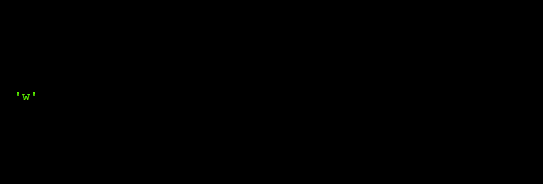
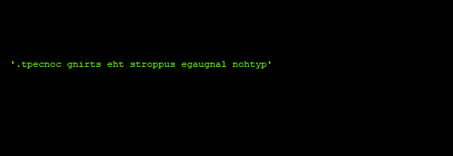

# Python 子串

> 原文：<https://www.javatpoint.com/python-substring>

## 字符串定义

"字符串是一个多代码字符序列。该字符串包含一个数字或字符集合，这些字符可能分别包含字母数字和特殊字符。

在 [Python 语言](https://www.javatpoint.com/python-tutorial)中，字符串是最常见的样式之一。通过在引文中隔离字符，我们可以构建它们。单引号由 Python 处理，类似于双引号。构建字符串就像给变量赋值一样容易。

**例如-**

```py

Variable1 = "Hello Python"
Variable2 = "Welcome to the world of Python"

```

## 预定义的字符串方法

在这里，我们将讨论一些在 python 中用来操作字符串的方法。它们列表如下-

| -你好。不，不。 | 方法 | 描述 |
| **1。** | **中心()** | 返回一个空格填充的字符串，输入字符串位于列的整个宽度。 |
| **2。** | **计数()** | 如果指定了开始列表开始和停止索引停止，它将用于计算“字符串”在序列或字符串的子字符串中出现的次数。 |
| **3。** | **大写()** | 此方法用于大写字符串的第一个字母。 |
| **4。** | **end with()** | 定义字符串或字符串的子字符串是否以后缀结尾(如果提供了开始列表和停止索引结尾)；返回 true，如果是，则返回 false。 |
| **5。** | **编码()** | 此方法返回字符串的加密字符串表示形式；如果出现故障，默认情况下会引发 ValueError，直到通过“忽略”或“替换”指定错误为止 |
| **6。** | **解码()** | 这项技术将允许您使用授权加密的编解码器来解密字符串。标准字符串编码的高级编码。 |
| **7。** | **扩展选项卡()** | 它用于将字符串部分扩展到多个空格；如果默认情况下未给出部分，则每个部分需要 8 个空格。 |
| **8。** | **find()** | 如果计算出索引，则返回开始和结束索引，否则返回-1，则此方法确定字符串是出现在字符串还是子字符串中。 |
| **9。** | **指数()** | index()方法的工作方式类似于 find()方法，但是如果 str 没有被识别出来，那么它就会产生一个异常。 |
| **10。** | **异α（）** | 如果序列至少有 1 个字母，并且所有字母都是字母或假，则返回真。 |
| **11 时。** | **【is lnum()** | 如果序列至少包含一个字母，并且所有字母都是字母数字，则此方法返回 true，否则返回 false。 |
| **12 时。** | **岛电()** | 如果字符串只包含单个字母，并且所有大小写字母都是小写，则使用此方法返回 true 否则，它返回 false。 |
| **13。** | **isdigital()** | 如果任何序列有数字，则返回 true，否则返回 false。 |
| **14。** | **标题（）** | 如果序列在“titlecase”中适当，Istitle()方法返回 true，否则返回 false。 |
| **15。** | **isnumeric()** | 如果 unicode 序列中只有数字字母，则用于返回有效，否则返回 false。 |
| **16。** | **这种空间()** | 如果字符串只有空白字母，此方法返回 true，否则返回 false。 |
| **17。** | **isupper()** | 如果字符串至少包含一个大小写字母，并且所有大小写字母都是大写形式，isupper()方法将变为 true，否则将变为 false。 |
| **18。** | **len()** | len()方法帮助您找到字符串的大小或长度。 |
| **19。** | **join()** | 这个函数用一个字符串分隔符将序列 seq 中的项目序列描述合并(连接)成一个字符串。 |
| **20。** | **maketrans()** | 此方法将允许您返回要使用的转换操作的转换图表。 |
| **21。** | **下降()** | 这将帮助您将字符串的所有大写字符转换为小写字符。 |
| **22。** | **灯()** | 这将用于将空格填充的序列分配到最大列宽，初始字符串左对齐。 |
| **23。** | **istrip（）** | 该方法将帮助您消除所有尾随的字符串空白。 |
| **24。** | **替换()** | 它用于用新的表现形式替换字符串中所有现有的表现形式，或者，如果给定了最大值，则最多为最大值。 |
| **25。** | **最大值()** | 此方法用于从序列字符串中返回最大字母数。 |
| **26。** | **分钟()** | 此方法用于从序列字符串中返回最小字母。 |
| **27。** | **rust()** | 它将帮助您将空格填充的序列返回到最大列宽，并将初始字符串右对齐。 |
| **28。** | **rfnd()** | rfind()方法的工作方式类似于 find()方法，但它在向后字符串中搜索。 |
| **29。** | **rinex()** | rindex()函数的工作方式类似于 index()函数，但它会查找向后的字符串。 |
| **30。** | **条状()** | 此方法用于执行 rstrip()和 lstrip()函数的功能。 |
| **31。** | **开头为()** | 用于决定一个序列或子串序列是否以 str 开头(如果允许开始索引 beg 和结束索引 end 如果是，则返回 true 如果不是，则返回 false。 |
| **32。** | **分裂()** | 它用于按子串字符串(如果未提供，则为存储)拆分序列，并返回子串数组；如果提供，分成最大数量的子字符串。 |
| **33。** | **溢出线()** | 它将用于将字符串分隔为所有新行(或 num)，并返回包含已删除新行的每行列表。 |
| **34。** | **平移()** | 它用于根据转换表中的字符串(256 个字符)转换字符串，删除 del 系列中的字符串。 |
| **35。** | **掉期()** | swapcase()方法用于反转所有序列字母的条件。 |
| **36。** | **标题（）** | 它用于返回字符串的描述版本，即所有术语以大写字母开始，其余以小写字母结束。 |
| **37。** | **isdiction()** | 如果 unicode 序列中只有十进制字母，则使用它返回 true，否则返回 false。 |
| **38。** | **zfzl()** | 这个方法将帮助您将原来的左填充零序列返回到最大宽度的字母；zfill()保留数字(小于零)的任何指定签名。 |
| **39。** | **上()** | 这将帮助您将字符串的所有小写字符转换为大写。 |
| **40。** | **rstrip()** | 它用于消除所有前面的序列空白。 |

## 什么是子串

“在适当的语言分析和计算机科学中，子串是[字符串](https://www.javatpoint.com/python-strings)中的连续字符段。”

换句话说，“字符串的一部分是子字符串。Python 字符串指定了几种构造子字符串的技术，检查它是否包含子字符串、子字符串索引等。”

例如，“更好的”的子串是“这是更好的时代”。这不要误认为是子串，子串是一种子串的泛化。

例如，“Itwastimes”是一个“这是最好的时代”系列，但不是一个子串。

在本文档中，我们将以最简单的术语解释 python 子串及其功能。

*   **子串的创建**

我们可以借助字符串切片来构造一个子字符串。我们应该使用 split()方法来完成基于所提到的分隔符的子字符串数组。

**语法**

python 中字符串创建的语法如下-

```py

S = 'Welcome to the python world'
name = s[10:]                      // substring creation with the help of slice
print[name]
A1 = s.split()
Print(A1)			// Array of substring with the help of split() method

```

这里，索引从 0 开始。

**例**

```py

>>> s = 'Welcome to the python world'
>>> s[10:]
'python'
>>> s.split()
['Welcome', 'to', 'the', 'python', 'world']
>>>

```

**输出:**

代码成功执行后，我们得到了下面提到的屏幕。


*   **检查我们是否找到了子串**

我们可以使用运算符中的**方法 find()** 或**来评估子串在序列中是否可用。**

**语法**

检查子串是否在字符串中的语法如下-

```py

s = 'Welcome to the python world'
if 'Name' in s:                                   // Checking substring with the help of in operator
    print('Substring found')
if s.find('Name') != -1:                    //  Checking substring with the help of find()
    print('Substring found')

```

这里，find()方法返回子串位置的索引，如果匹配，否则返回-1。

**示例代码**

```py

>>> s = 'Welcome to the python world'
>>>
>>> if 'name' in s: 
Print ('Substring found')
...
Substring found
>>>
>>> if s.find('name') ! = -1: 
Print ('Substring found')
...
Substring found
>>>

```

*   **检查子串出现**

我们可以使用 count()方法来识别数组中子串的迭代次数。

**语法**

检查位于字符串中的子字符串出现的语法如下-

```py

s = ' Welcome to the python world '
print('Substring count =', s.count('c'))
s = 'Python is a best language'
print('Substring count =', s.count('Py'))

```

**示例代码**

```py

>>> s = ' Welcome to the python world '
>>> print('Substring count =', s.count('c'))
>>> s = 'Python is a best language'
>>> print('Substring count =', s.count('Py'))
>>>

```

**输出**

执行上述代码后，我们得到了以下输出。


*   **在子串**中找到的所有索引

Python 语言没有任何内置函数来获取所有子字符串索引值的数组。毕竟，使用 find()方法，我们可以简单地实现一个。

**语法**

下面给出了查找所有子串索引的语法-

```py

def find_all_indexes (input_str, substring):
s = 'Python is the best programming language'
print(find_all_indexes(s, 'Py'))

```

**示例代码**

```py

>>> def find_all_indexes(input_str, substring):
?    L2 = []
?    length = Len(input_str)
?    index = 0
?    while index < Length:
?    i = input_str.find(substring, index)
?    if i == -1:
?    return L2
?    L2.append(i)
?    index = i + 1
?  return L2
?
>>> s = ' Python is the best programming language '
>>> print(find_all_indexes(s, 'Py'))

```

**输出:**

成功执行上述程序代码后，我们得到了以下输出。


*   **借助无结束索引的开始索引进行切片**

这将返回一个从数组的位置 5 开始直到 python 序列的最后一个的分片字符串。

**语法**

下面给出了在没有结束索引的情况下通过开始索引对子串进行切片的语法-

```py

 s = s[  startIndex  : ]

```

**示例代码**

```py

// Substring or slicing with the help of start index without end index
>>> s = 'It is to demonstrate substring functionality in python.'        
>>> s [5:]

```

**输出**

执行完上面的代码后，我们得到了下面的屏幕。


*   **借助结束索引而非开始索引进行切片**

这将返回从开始到结束的分片字符串-index-1。

**语法**

下面给出了通过结束索引而不是开始索引对子串进行切片的语法

```py

 s = s[  :  endIndex   ]

```

**示例代码**

```py

// Substring or slicing with the help of end index without start index
>>> s = 'Python is a powerful programming language'        
>>> s [7:]

```

**输出**

执行完上面的代码后，我们得到了下面的屏幕。


*   **用完整的绳子切片**

它帮助您获得整个字符串作为输出。

**语法**

分割整个子串的语法如下所示-

```py

 s = s[  :   ]

```

**示例代码**

```py

// Substring or slicing of complete string
>>> s = 'Python is a robust programming language.'        
>>> s [ : ]

```

**输出**

执行完上面的代码后，我们得到了下面的屏幕。


*   **从字符串中剪切出单个字符**

这将从字符串中获取单个字符的子字符串。

**语法**

从字符串中切分单个字符的语法如下所示-

```py

 s = s[  index   ]

```

**示例代码**

```py

// Substring or slicing of a single character
>>> s = 'Python is a widely used language.'        
>>> s [ 12 ]

```

**输出**

成功执行上述代码后，我们得到了以下输出。



*   **借助负(-)步**反转一根弦

它将帮助您以相反的顺序返回字符串。

**语法**

切割字符串的反向子字符串的语法如下所示-

```py

 s = s[  : : negative value  ]

```

**示例代码**

```py

// Reversing of a string with the help of Substring or slicing through negative step 
>>> s = 'Python language supports the string concept.'        
>>> s [ : : -1 ]

```

**输出**

成功执行上述程序代码后，我们得到了下面的输出。



## 负指数工作

下表展示了负指数的工作功能

|  | P | Y | T | H | O | 普通 |
| Zero | one | Two | three | four | five |
| -5 | -4 | -3 | -2 | -1 | -0 |

在上表中，我们用一个 Python 单词来演示负索引的确切工作功能。

*   **借助负(-)索引对字符串进行切片**

它用于在负索引的帮助下对字符串进行切片或子字符串。序列索引从 0 到 5 开始，我们也将使用负索引。

**语法**

在负索引的帮助下对字符串进行切片的语法如下所示-

```py

 s = s[ 0 : negative value  ]

```

**示例代码**

```py

// Substring or slicing of a string through a negative index 
>>> s = 'PYTHON'        
>>> s [ 0 : -4 ]

```

**输出**

成功执行上述程序代码后，我们得到了下面的输出。


*   **借助于正(+)索引**对字符串进行切片

它用于在正索引的帮助下对字符串进行切片或子字符串。

**语法**

借助正索引对字符串进行切片的语法如下所示-

```py

 s = s[ 0 : positive value  ]

```

**示例代码**

```py

// Substring or slicing of a string through a positive index 
>>> s = 'PYTHON'        
>>> s [ 0 : -2 ]

```

**输出**

成功执行上述程序代码后，我们得到了下面的输出。


*   **借助列表理解检索所有子串**

它在字符串切片和列表理解的帮助下返回字符串的完整子字符串。

**示例代码**

```py

// Using slicing and list comprehension of string's substring 
>>> s = 'PYTHON'        
>>> str = [s[ i : j] ]
for i in range (Len(s))
	for j in range (i + 1, Len(s) + 1)
print (str) 

```

**输出**

成功执行上述程序代码后，我们得到了下面的输出。


*   **借助 itertools.combination()方法检索所有子串**

它在字符串切片和列表理解的帮助下返回字符串的完整子字符串。

**示例代码**

```py

// Using slicing and itertools.combination() of string's substring 
>>> s = 'PYTHON'        
>>> str = [s[ i : j] ]
for i in range (Len(s))
	for j in range (i + 1, Len(s) + 1)
print (str) 

```

**输出**

成功执行上述程序代码后，我们得到了下面的输出。


* * *