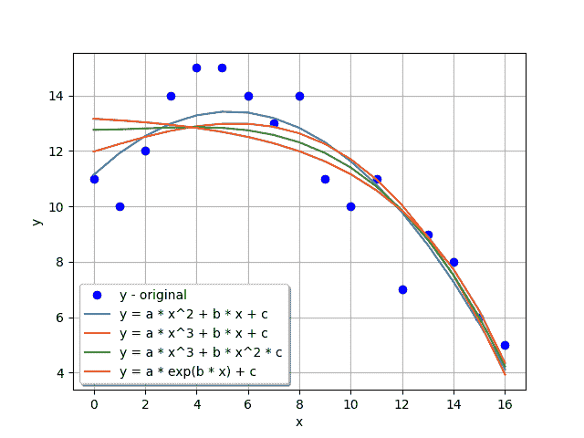

# Python 中的曲线拟合

> 原文：<https://www.javatpoint.com/curve-fit-in-python>

### 介绍

**曲线拟合**是一种优化，它为定义的函数找到一个最佳参数集，该函数适用于所提供的观察值集合。

与监督学习不同，曲线拟合需要我们定义将输入的例子映射到输出的函数。

用来映射的函数也被称为**基函数**，它可以形成我们喜欢的任何东西，比如直线(线性回归)、曲线(多项式回归)等等。该映射函数提供了灵活性和控制，以便定义曲线的形式，其中利用优化过程来找到函数的特定最优参数。

在接下来的教程中，我们将了解什么是曲线拟合，以及如何在 [Python](https://www.javatpoint.com/python-tutorial) 中执行。

到本教程结束时，我们将了解以下内容:

1.  曲线拟合包括找到函数的最佳参数，将输入示例映射到输出。
2.  SciPy Python 库提供了一个应用编程接口，以便将曲线拟合到数据集。
3.  使用 SciPy 中的曲线拟合，以便将各种不同的曲线拟合到观察集。

### 理解曲线拟合

正如我们前面讨论的，曲线拟合是一个优化问题，它允许我们找到一条适合一组观察值的线。

当我们把二维曲线拟合看作一个图形时，这就变得更容易了。

假设我们已经从问题域收集了数据示例，包括输入和输出。

图的 x 轴作为独立变量，是函数的输入。另一方面，图的 y 轴充当因变量，即函数的输出。我们可能不知道将输入示例映射到输出的函数形式；然而，我们可以使用标准形式的函数来近似函数。

曲线拟合包括以下阶段:

1.  首先，定义映射函数的函数形式(也称为目标函数或基函数)
2.  其次，寻找导致最小误差的函数参数。

使用由域提供的观测值来估计误差，并将输入传递给候选目标函数并估计输出。将计算的输出与实验输出进行比较。

一旦我们完成了拟合，我们就可以利用基函数来插值或外推域中的新点。通常使用基函数来执行输入值序列，以便估计输出序列。然后，我们根据显示输入和输出之间的方差的结果绘制线图，并在观察点上拟合直线。

曲线拟合的解释是基函数的形式。输入和输出之间的直线可以用下面给出的公式来描述:

**y = a × x + b**

其中 ***y*** 为预估输出， ***x*** 为输入， ***a*** 和 ***b*** 为借助优化算法找到的基函数的自变量。

这个方程被称为 ***线性方程*** ，因为它是输入的加权相加。

在线性回归模型中，这些参数被表示为系数，而在神经网络中，这些参数被称为权重。

我们可以将这个方程推广到任意数量的输入，这意味着曲线拟合的概念不是固定在两个维度上的(其中一个是输入，另一个是输出)。然而，它可以包含多个输入变量。

例如，两个输入变量的线目标函数的公式可能如下所示:

**y = a1 × x1 + a2 × x2 + b**

方程没有必要看起来是一条直线。

我们可以通过插入指数来定义目标函数的曲线。例如，我们可以插入由另一个参数加权的输入的平方版本，如下所述:

**y = a × x + b × x <sup>2</sup> + c**

这个方程被称为多项式回归，平方项指的是二次多项式。

这种类型的线性方程可以通过最小二乘法进行拟合和解析估计，这意味着我们可以借助一些线性代数来找到参数的最优值。

我们中的一些人可能还想在方程中包含其他数学函数，比如 s in、cos、tan 等等。使用一个参数对每个项进行加权，并将其添加到整个等式中，以产生以下输出:

**y = a × sin(b × x) + c**

通过将任意的数学函数加到目标函数上，我们不能解析地估计参数；然而，我们需要利用一种算法进行迭代优化。

这个方程被认为是非线性最小二乘，因为映射函数不再是凸的(它是非线性的)，并且相对不容易求解。

既然我们已经成功地理解了什么是曲线拟合，现在是我们开始理解如何在 Python 中执行曲线拟合的时候了。

### 在 Python 中执行曲线拟合

可以使用 Python 对数据集执行曲线拟合。Python 提供了一个名为 **SciPy** 包的开源库。这个 [**SciPy**](https://www.javatpoint.com/python-scipy) 包包含一个称为 **curve_fit()** 函数的函数，用于通过非线性最小二乘法进行曲线拟合。

**curve_fit()** 函数除了使用目标函数的名称之外，还使用相同的输入和输出数据作为参数。

目标函数必须包括输入数据示例和少量参数。剩余的参数将成为非线性最小二乘优化过程将优化的系数或权重常数。

让我们考虑一个示例演示来理解这个概念。

假设我们很少从域中观察到加载为 ***x*** 数量的输入变量和 ***y*** 数量的输出变量。

**语法:**

```py

...
# loading the input variables from a file
values_x = ...
values_y = ...

```

现在，我们必须设计一个目标函数，以便使一条线适合数据，并在 Python 中将它实现为一个接受输入和参数的函数。

让我们假设函数是一条直线，如下所示:

**语法:**

```py

# defining a mapping function
def mapping(x, a, b, c):
    return a * x + b

```

一旦定义了函数，我们就可以调用 **curve_fit()** 函数，以便借助定义的映射函数将直线拟合到数据集。

**曲线拟合()**函数将返回目标函数的最佳值。例如，系数值。该函数还将为计算的参数返回一个共方差矩阵；然而，这可以暂时忽略。

**语法:**

```py

...
# calling a the curve_fit() function
popt, _ = curve_fit(mapping, values_x, values_y)

```

一旦拟合成功，我们就可以利用最优参数和目标函数**映射()**来评估任何主观输入的输出。

这个函数可能包含我们已经从域中收集的示例的输出。它可能包含一些更新的值，可以对观察到的值进行插值。它还可能涉及超出观测值范围的外推值。

**语法:**

```py

...
# defining new input values
new_x = ...
# unpacking the optimal arguments for the mapping function
a, b, c = popt
# using the optimal arguments to estimate new values
new_y = mapping(new_x, a, b, c)

```

既然我们已经理解了如何利用应用编程接口进行曲线拟合，让我们看一个工作示例。

### Python 中曲线拟合的工作示例

让我们从为项目导入必要的包和库开始。

**语法:**

```py

# importing the required packages and libraries
from scipy.optimize import curve_fit
from numpy import array, exp
import matplotlib.pyplot as plt

```

一旦我们完成了包的导入，我们需要程序的测试数据来实现曲线拟合。因此，我们定义了基本输入数据 x 和输出数据 y，如下所示。

**语法:**

```py

# defining the variables
values_y = array([11, 10, 12, 14, 15, 15, 14, 13, 14, 11, 10, 11, 7, 9, 8, 6, 5])
values_x = array(range(len(values_y)))

```

然后，我们将定义一些映射函数，以便利用 **curve_fit()** 方法，并验证它们在拟合中的差异。我们将利用下面所示的等式作为映射函数:

1.  y = ax <sup>2</sup> + bx + c
2.  y = ax <sup>3</sup> + bx + c
3.  y = ax<sup>3</sup>+bx<sup>2</sup>+c
4.  y = a × exp？(bx) + c

以下语法描述了相同的过程:

**语法:**

```py

# defining objective functions
def mapping1(values_x, a, b, c):
    return a * values_x**2 + b * values_x + c

def mapping2(values_x, a, b, c):
    return a * values_x**3 + b * values_x + c

def mapping3(values_x, a, b, c):
    return a * values_x**3 + b * values_x**2 + c

def mapping4(values_x, a, b, c):
    return a * exp(b * values_x) + c

```

使用 **curve_fit()** 函数拟合数据非常简单，它分别提供了映射函数，数据 x 和 y。**曲线拟合()**方法将返回最佳参数和计算出的共方差值作为输出。

**语法:**

```py

# using the curve_fit() function
args, covar = curve_fit(mapping1, values_x, values_y)
print("Arguments: ", args)
print("Co-Variance: ", covar)

```

**输出:**

```py
Arguments:  [-0.08139835  0.8636481  11.1362229 ]
Co-Variance:  [[ 2.38376125e-04 -3.81401800e-03  9.53504499e-03]
 [-3.81401800e-03  6.55534344e-02 -1.88793892e-01]
 [ 9.53504499e-03 -1.88793892e-01  7.79966692e-01]]

```

我们可以观察到，**曲线拟合()**函数评估了最优自变量和协方差。然后，我们为用户打印了这些值。

我们将通过将目标函数和数据 x 和 y 配置到 **curve_fit()** 方法中来开始拟合数据，并获得包含 a、b 和 c 的参数值的结果数据。由于我们在这里没有使用协方差的值，因此我们可以跳过它。之后，我们将利用每个函数的导出 a、b 和 c 值来估计拟合的 y。

**语法:**

```py

args, _ = curve_fit(mapping1, values_x, values_y)
a, b, c = args[0], args[1], args[2]
y_fit1 = a * values_x**2 + b * values_x + c

args, _  = curve_fit(mapping2, values_x, values_y)
a, b, c = args[0], args[1], args[2]
y_fit2 = a * values_x**3 + b * values_x + c

args, _  = curve_fit(mapping3, values_x, values_y)
a, b, c = args[0], args[1], args[2]
y_fit3 = a * values_x**3 + b * values_x**2 + c

args, _  = curve_fit(mapping4, values_x, values_y)
a, b, c = args[0], args[1], args[2]
y_fit4 = a * exp(values_x * b) + c

```

最后，我们将绘制图表，以便直观地验证差异。其语法如下所示:

**语法:**

```py

# plotting the graph
plt.plot(values_x, values_y, 'bo', label="y - original")
plt.plot(values_x, y_fit1, label="y = a * x^2 + b * x + c")
plt.plot(values_x, y_fit2, label="y = a * x^3 + b * x + c")
plt.plot(values_x, y_fit3, label="y = a * x^3 + b * x^2 * c")
plt.plot(values_x, y_fit4, label="y = a * exp(b * x) + c")
plt.xlabel('x')
plt.ylabel('y')
plt.legend(loc = 'best', fancybox = True, shadow = True)
plt.grid(True)
plt.show()

```

程序的结果图如下所示:

**图形:**



* * *