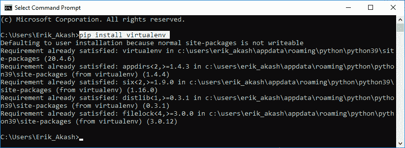
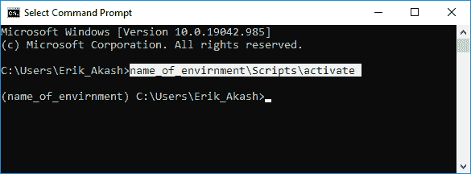
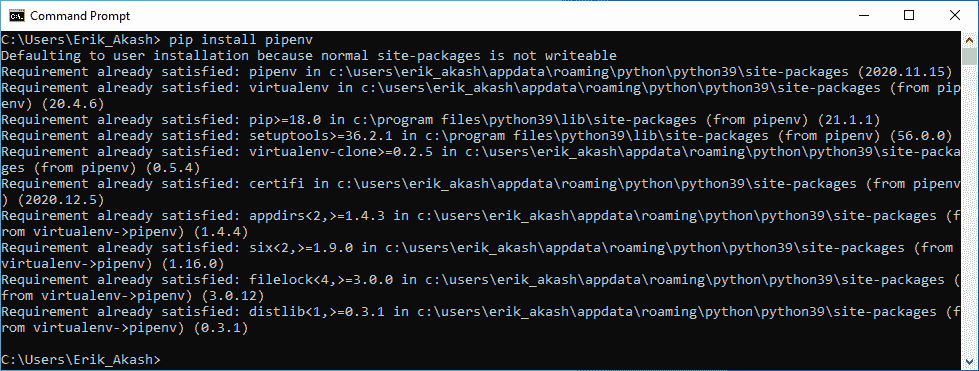
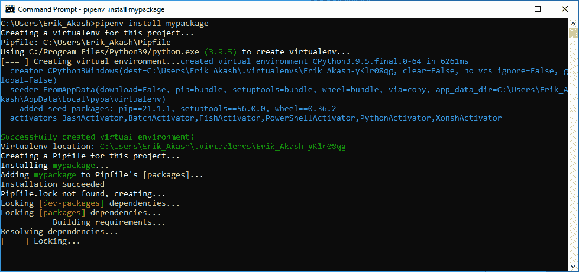
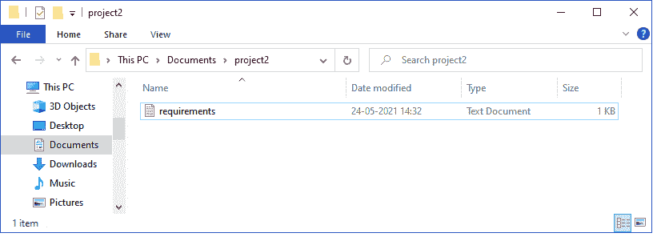

# 如何用 Python 创建 Requirements.txt 文件

> 原文：<https://www.javatpoint.com/how-to-create-requirements-txt-file-in-python>

如果您是一名开发人员，您可能知道，在处理任何 Python 项目或数据科学项目时，必须始终在一个使您的项目可重用和可重复的环境中工作，而不会给任何拿起您的项目的人带来问题。所以在讨论如何创建需求之前。Python 中的 txt 文件，让我们知道 requirement.txt 是什么，为什么需要它。

### Python 中 requirement.txt 文件是什么？

在 [Python 中](https://www.javatpoint.com/python-tutorial) **requirement.txt** 文件是一种文件类型，通常存储关于开发特定项目时使用的所有库、模块和包本身的信息。它还存储该项目依赖或需要运行的所有文件和包。通常，这个文件“requirement.txt”存储(或驻留)在项目的根目录中。这里出现了另一个重要的问题，为什么我们在项目中需要这种类型的文件。

### 为什么我们需要 requirement.txt？

它在几个方面帮助了我们，甚至当我们将来重新访问我们的项目时，因为它解决了几乎所有的兼容性问题。如果你曾经在任何 Python 项目中工作或开发过任何项目，你肯定知道我们通常需要几个包。然而，在开发项目时，我们通常使用特定版本的包。稍后，包管理器或维护者可能会进行一些更改，这些修改很容易破坏整个应用。因此，跟踪包中的每一个修改是一项非常繁重的工作。具体来说，在项目太大的地方，跟踪我们正在使用的每个包以避免意外的惊喜是至关重要的。

解决这类问题的标准方法之一是使用虚拟环境。原因是有两种主要类型的包和 Python 库通常存储的位置，我们在处理特定项目时通常不需要所有类型的包；因此，需要知道每个项目需要哪一个，以使再现性更容易。

它通常涉及以下文件:

*   构成标准 Python 库一部分的系统包
*   使用 pip 安装的站点包(第三方包)。

### 什么是虚拟环境？

虚拟环境是一种隔离的或人工的工作空间，它将用户的包与本地(或主)系统安装分开。它允许我们为每个 Python 项目创建一个“虚拟”的隔离环境。这使得每个项目更容易独立于其他项目，尤其是当它们共享相同的依赖关系时。有各种可用于创建虚拟环境的软件包 avialble。一些基本包如下:

*   virtualenv(虚拟环境)
*   pipenv

因此，一旦为我们的项目创建了虚拟环境，让我们看看如何安装包和库。在虚拟环境中，很容易获得我们在项目中需要使用的所有必需包。让我们首先看看如何使用“virtualenv”。

**A. virtualenv**

这是一种允许我们创建虚拟环境并使用它的库。要安装 virtualenv，可以按照给定的说明进行操作:

1.打开 Cmd，键入以下命令并按下回车键，如下图所示:

**命令**

```py

pip install virtualenv

```

**输出**



2.为项目创建新的工作目录

现在在项目目录中创建一个新的虚拟环境，以避免不必要的问题。

**命令**

```py

Python3 -m venv name_of_env

```

**输出**


3.现在要使用这个新创建的虚拟环境，我们只需要激活它。要激活此隔离环境，请键入以下给定命令，然后按 enter 按钮，如下所示:

**命令**

```py

name_of_envirnment\Scripts\activate

```

**输出**



要验证我们的新虚拟环境是否已创建，您可以在提示中看到，前缀已用新虚拟环境的名称进行了更改，在我们的示例中，我们将虚拟环境命名为“name _ of _ envirnmnet”。您也可以通过打开项目目录或文件夹来验证它，在该文件夹中将创建具有指定名称的新目录。

4.现在让我们看看如何创建 requirement.txt 文件

为了创建 requirement.txt 文件，最好知道它包含什么。

requirement.txt 文件包括在特定项目中使用的所有类型的标准包和库。因此，这个 requirement.txt 文件在开发任何小项目或大项目时都起着至关重要的作用。它还帮助我们使我们的项目更加便携。

借助“requirement.txt”文件，可以轻松避免几个主要问题。为了更详细地理解它，您可以考虑下面给出的例子:

**示例:**

假设您已经创建了一个新项目，例如与库和包的特定版本兼容的应用。因此，出于某种原因，您将此申请转发给您的朋友。

由于您没有使用 requirement.txt 文件，您的应用可能无法正常运行，甚至无法在朋友的系统上启动。这背后的主要原因是所有用户并不使用相同版本的库和包。但是，如果您使用了 requirement.txt 文件，任何人都可以运行和使用您的项目或应用，因为所有必需或使用的包和库也是以文件(requirement.txt)的形式与您的项目一起指定的。

在这个要求中。txt 文件，用户可以根据自己的需求方便地选择、存储和维护所需的文件。

### 如何获取需求. txt 文件:使用 Virtualenv

在这里，我们能够获得 requirements.txt 文件。要创建 requirement.txt 文件，我们可以使用以下命令:

**命令**

```py

pip3 freeze > requirements.txt

```

**输出**


### 如何获取需求文件:使用管道

Pipenv 也是一个优秀的虚拟环境创建库工具，它有一些很酷的特性。您可以使用下面给出的指令来获取 requirement.txt 文件。

1.键入以下命令安装管道

**命令**

```py

pip install pipenv

```

**输出**



2.现在输入以下命令并按回车键。

**命令**

```py

pipenv install mypackage

```

上面的命令用于安装项目所需的包。

**输出**



*   为项目安装软件包后，我们需要激活虚拟环境。因此，要激活虚拟环境，您可以使用以下命令:

**命令**

```py

pipenv shell

```

或者

```py

pipenv run

```

这些命令可用于激活新创建的虚拟环境，如下所示:

**输出**


现在，键入以下命令在虚拟环境中运行脚本。

**命令**

```py

pipenv run Python myscript.py

```

**解释**

此命令用于在虚拟环境中运行指定的脚本，如下所示:

**输出**


因为它更容易，而且它还自动跟踪 pipfile 和 pipfile 中用于项目的所有库。锁定文件。这些文件扮演着与 requirements.txt 相同的角色，并且还存储了 requirements . txt 中没有包含的一些东西的附加信息。

因此，您可以使用这个 pipfile 作为 requirements.txt 文件的替代文件。但是，如果您仍然想使用 requirements.txt 文件，可以使用以下命令:

```py

pipenv -r lock >> requirements.txt

```

**输出**


### 如何获取 Requirements.txt 文件:不用 Virtualenv 使用 Pipreqs

**Pipreqs 是**最高效、最简单易用的工具之一，不需要你创建任何虚拟环境。因此，如果用户只需要应用或项目中使用的包和库，这是非常有用的。

最重要的一点是，它会自动扫描脚本或 Python 文件中导入的库，并生成一个 requirements.txt。

**让我们看看它是如何工作的:**

1.首先，您必须安装“pipreqs”，因此要下载它，请在 cmd 中键入以下给定命令，然后点击 enter 按钮:

**命令**

```py

 pip install pipreqs

```

**输出**


2.一旦安装完成，您就可以启动“pipreqs”来获取 requirement.txt 文件，方法是将它指向项目文件夹所在的位置。

**命令**

```py

pipreqs /path/to/project

```

**输出**


要验证 requirement.txt 文件是否已成功创建，您可以在项目文件夹中看到将创建一个新文件“requirement.txt”，如下所示:



* * *