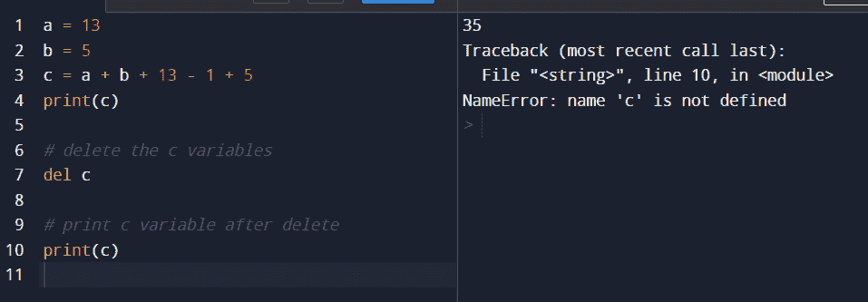
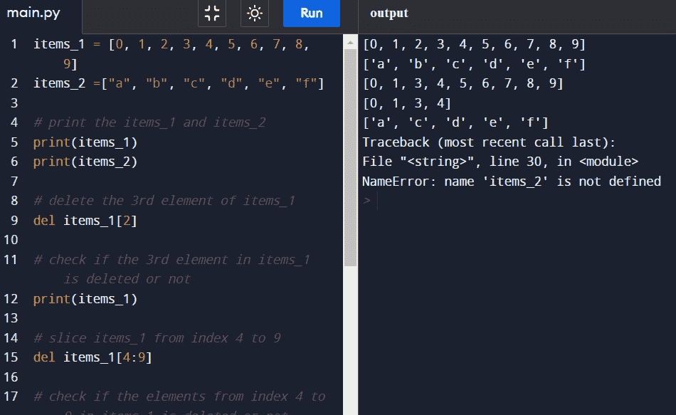
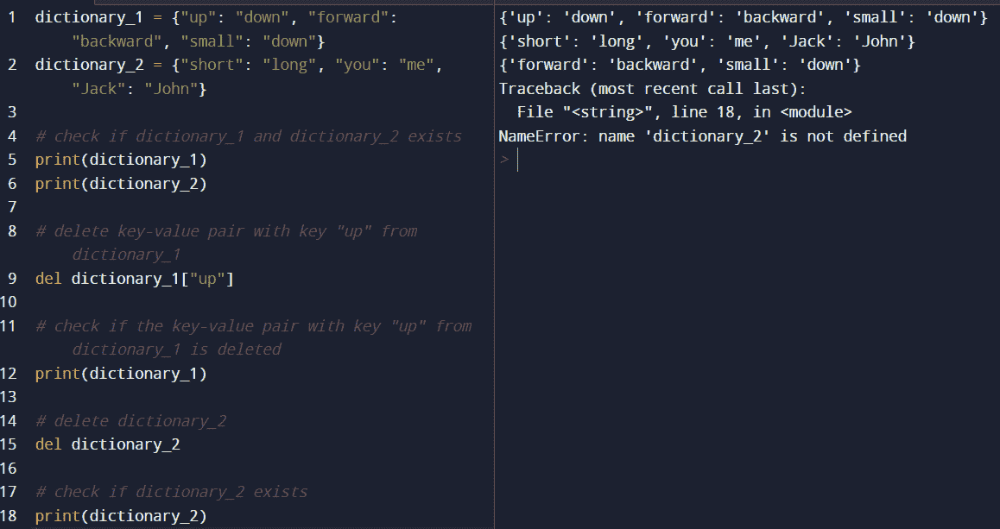
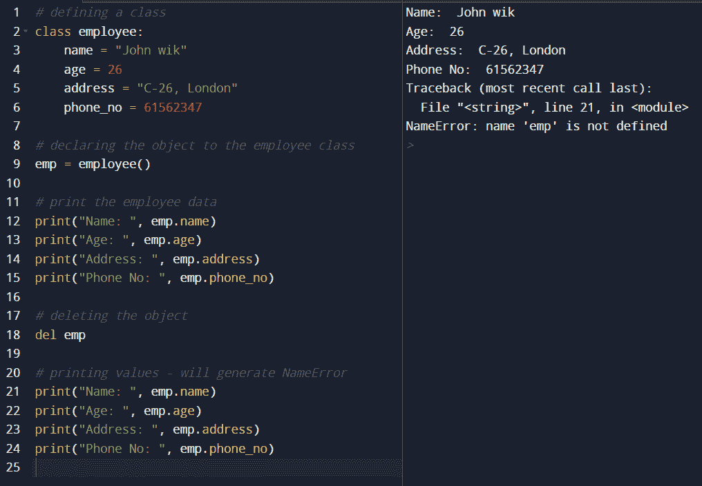

# Python del 语句

> 原文：<https://www.javatpoint.com/python-del-statement>

## 介绍

在 Python 中，del 关键字通常用于删除对象。因为 Python 中的所有内容都代表某种对象，所以 del 关键字也可以用来删除列表、变量、列表的一部分等。del 语句不返回任何类型的值。

## del 语句的语法

```py

del obj_name

```

#### 注意:del 是关键字，obj_name 可以是列表、字典、用户自定义对象、变量等。

## 戴尔声明示例

让我们看一些 del 语句的例子，并尝试删除一些项目。

**示例 1:在本程序中，我们将使用 del 语句**删除一个变量

```py

a = 13
b = 5
c = a + b + 13 - 1 + 5
print(c)

# delete the c variables
del c

# print c variable after delete
print(c)

```

**输出:**

```py
35

Traceback (most recent call last):
  File "", line 10, in <module>NameError: name 'c' is not defined
></module> 
```



**示例 2:在本程序中，我们将使用 del 关键字**删除列表和切片列表

```py

items_1 = [0, 1, 2, 3, 4, 5, 6, 7, 8, 9]
items_2 =["a", "b", "c", "d", "e", "f"]

# print the items_1 and items_2
print(items_1)
print(items_2)

# delete the 3rd element of items_1
del items_1[2]

# check if the 3rd element in items_1 is deleted or not
print(items_1)

# slice items_1 from index 4 to 9
del items_1[4:9]

# check if the elements from index 4 to 9 in items_1 is deleted or not
print(items_1)

# delete the 2nd element of items_2
del items_2[1]

# check if the 2nd element in items_2 is deleted or not
print(items_2)

# delete items_2
del items_2

# check if items_2 exists
print(items_2)

```

**输出:**

```py
[0, 1, 2, 3, 4, 5, 6, 7, 8, 9]
['a', 'b', 'c', 'd', 'e', 'f']
[0, 1, 3, 4, 5, 6, 7, 8, 9]
[0, 1, 3, 4]
['a', 'c', 'd', 'e', 'f']

Traceback (most recent call last):
  File "", line 30, in <module>NameError: name 'items_2' is not defined
></module> 
```



**示例 3:在本程序中，我们将使用 del 语句删除字典和键值对**

```py

dictionary_1 = {"up": "down", "forward": "backward", "small": "down"}
dictionary_2 = {"short": "long", "you": "me", "Jack": "John"}

# check if dictionary_1 and dictionary_2 exists
print(dictionary_1)
print(dictionary_2)

# delete key-value pair with key "up" from dictionary_1
del dictionary_1["up"]

# check if the key-value pair with key "up" from dictionary_1 is deleted
print(dictionary_1)

# delete dictionary_2
del dictionary_2

# check if dictionary_2 exists
print(dictionary_2)

```

**输出:**

```py
{'up': 'down', 'forward': 'backward', 'small': 'down'}
{'short': 'long', 'you': 'me', 'Jack': 'John'}
{'forward': 'backward', 'small': 'down'}

Traceback (most recent call last):
   File "", line 18, in <module>NameError: name 'dictionary_2' is not defined
></module> 
```



**示例 4:删除用户定义的对象**

```py

# defining a class
class employee:
    name = "John wik"
    age = 26
    address = "C-26, London"
    phone_no = 61562347  

# declaring the object to the employee class
emp = employee()

# print the employee data
print("Name: ", emp.name)
print("Age: ", emp.age)
print("Address: ", emp.address)
print("Phone No: ", emp.phone_no)

# deleting the object 
del emp

# printing values - will generate NameError
print("Name: ", emp.name)
print("Age: ", emp.age)
print("Address: ", emp.address)
print("Phone No: ", emp.phone_no)

```

**输出:**

```py
Name:  John wik
Age:  26
Address:  C-26, London
Phone No:  61562347
Traceback (most recent call last):
   File "", line 21, in <module>NameError: name 'emp' is not defined
></module> 
```



* * *