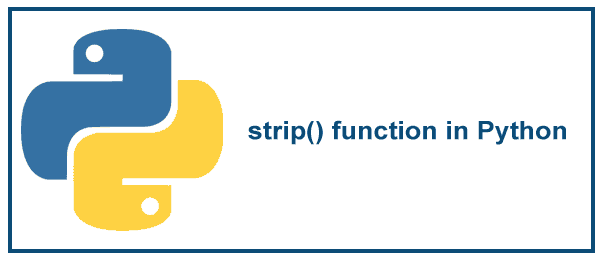

# Python 中的`strip()`函数

> 原文：<https://www.javatpoint.com/strip-function-in-python>

`strip()`函数是 Python 的预定义库函数。它用于通过移除传递给 `strip()`函数的前导和尾随空格、字符和符号来返回原始字符串的副本。换句话说，是 Python 字符串 `strip()`函数通过为 `strip()`函数指定一组字符作为参数来删除字符串左右两端的字符。默认情况下，如果没有参数传递给 `strip()`函数，它会从开始和结束字符串中删除空格。



### 句法

```py

strip( 'characters' )

```

### 参数:

1.  **strip(' chars '):**strip()参数是可选参数。因此，如果程序员没有向 `strip()`函数传递任何参数，它将从字符串中删除开始和结束空格。
2.  如果给定参数的集合被传递给 `strip()`函数，它将从原始字符串中移除字符或符号。

**返回值:**通过从原始字符串中删除字符集或空格，返回原始字符串的副本。

### 使用 `strip()`函数从给定字符串中删除字符或符号

让我们考虑一个在 Python 中通过移除给定字符串的前导或尾随字符来执行 `strip()`函数的示例。

**剥离**

```py

strinput = "  $$$$$  No. 1 Welcome to JAVATPOINT!! No. 1 $$$ "   
# use strip() function to remove the set of characters
res = strinput.strip ( ' $No. 10 !' ) # store result into res variable
print ( " Given string is: ", strinput)
print ( " After removing the set of characters: ", res) 

str3 = ' 1 11 111 111 1111 Learn Python Programming Tutorial 1111 111 11 1 '
str4 = str3\. strip ( '1' )
print (" \n  Given string is ", str3)
print (" Stripping 1 from both ends of the string using strip ('1') function ", str4)

# define new string
str5 = '++++++Python Programming Tutorial****** $$$$$'
print ("\n Given string is = ", str5)
# use strip function to remove the symbols from both ends
str6 = str5\. strip ( ' $*+' )
print (" Stripping the '+', '*' and '$' symbols on both sides of the string is = ", str6)

```

**输出**

```py
Given string is:    $$$$$  No. 1 Welcome to JAVATPOINT!! No. 1 $$$ 
 After removing the set of characters:  Welcome to JAVATPOINT

 Given string is   1 11 111 111 1111 Learn Python Programming Tutorial 1111 111 11 1
 Stripping 1 from both ends of the string using strip ('1') function   1 11 111 111 1111 Learn Python 
Programming Tutorial 1111 111 11 1

 Given string is =  ++++++Python Programming Tutorial****** $$$$$
 Stripping the '+', '*' and '$' symbols on both sides of the string is =  Python Programming Tutorial

```

### 使用 `strip()`函数删除给定字符串中的空白

让我们考虑一个在 Python 中通过移除给定字符串的前导或尾随空白来执行 `strip()`函数的示例。

**条纹 2.py**

```py

str1 = '   Welcome to the World!              '
# print the original string
print (' Given string is: ', str1)

# use strip() function to remove whitespace
str2 = str1.strip()
print(" After removing whitespaces from an original string: ", str2)

str3 = '             Learn    Python    programming          '
# print the original string
print (' Given string is: ', str3)

# use strip() function to remove whitespace
str4 = str3.strip()
print(" After removing whitespaces from an original string: ", str4)

```

**输出**

```py
Given string is:     Welcome to the World!
 After removing whitespaces from an original string:  Welcome to the World!
 Given string is:               Learn    Python    programming
 After removing whitespaces from an original string:  Learn    Python    programming

```

在上面的程序中，我们使用 `strip()`函数从给定字符串的开头和结尾移除空格，但它不会移除字符串之间的空格。

### 使用 `strip()`函数从用户处获取任何字符串并删除任何字符或符号的程序

**程序**

```py

str1 = input( " Enter the string ") # take a string 
print (" Your string is ", str1) 
ch = input (" Enter any character or symbol that you don't want to see in the string ")
res = str1.strip (ch) 
# print the string after using a strip() method
print (" After performing the strip() function, \n Your string is ", res)

```

**输出**

```py
Enter the string *** $$ Welcome to JavaTpoint. Learn Python programming !!! &&
 Your string is  *** $$ Welcome to JavaTpoint. Learn Python programming !!! &&
 Enter any character or symbol that you don't want to see in the string * $ Wel ! &
 After performing the strip() function, 
 Your string is  come to JavaTpoint. Learn Python programming

```

### 为什么使用 Python `strip()`函数？

下面是使用 python strip 函数的原因:

1.  它有助于根据传递给 `strip()`函数的字符从原始字符串的开头和结尾移除字符。
2.  如果用户没有向 strip 函数传递任何字符，默认情况下，它只删除字符串两端的空白。
3.  如果原始字符串的开头或结尾没有空格，它将返回原始字符串而不进行修改。
4.  如果传递的字符与原始字符串不匹配，strip 函数将返回原始字符串。

### 结论:

在上面的主题中，我们已经了解了 [Python](https://www.javatpoint.com/python-tutorial) 库的 `strip()`函数。这是一个 `strip()`函数，用于从原始字符串的开头和结尾删除字符或空格。但是，如果用户没有向 `strip()`函数传递任何字符，它只会从主字符串的前导和尾部删除空格。

* * *