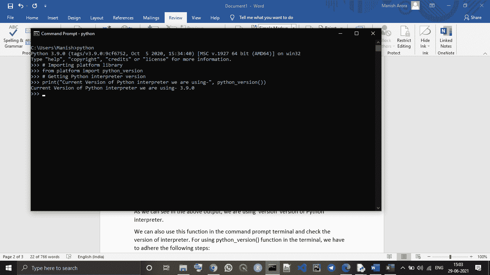
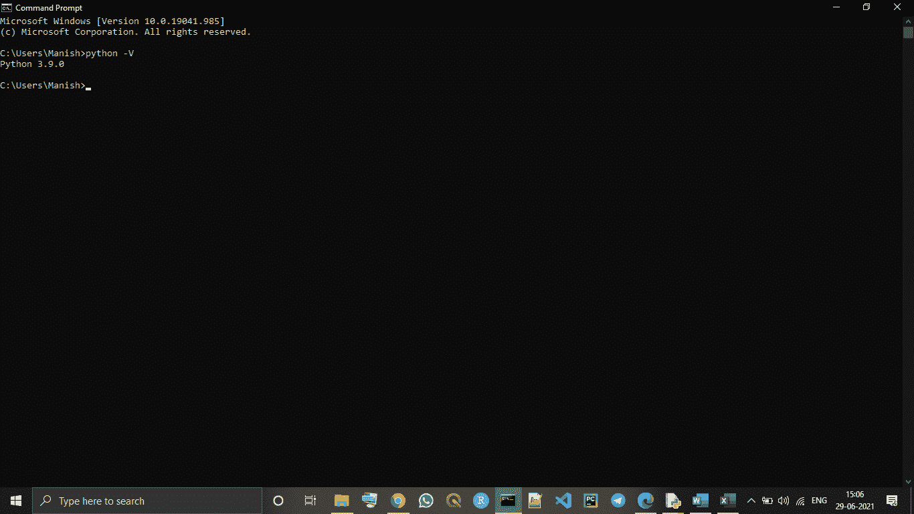

# 如何检查 Python 版本

> 原文：<https://www.javatpoint.com/how-to-check-python-version>

Python 解释器在商业上广泛应用于许多行业，用于源代码编码、计算机编程和代码测试。它从用户那里获取命令，并在解释后执行它们。因此，了解我们当前使用的 Python 解释器版本变得非常重要。

我们知道，是解释器从用户那里获取代码，并一行行地执行它。有时候，假设我们有一个旧版本的 Python 解释器。在这种情况下，由于解释器的旧版本及其与命令中使用的新函数不兼容，它会使命令无法正确执行。

众所周知，Python 是一种编程语言，它会定期更新，增加一些新的特性和功能；因此，作为用户，我们还必须定期用最新发布的版本更新我们的 Python 解释器。

#### 注意:Python 解释器的最新版本是“3.9.6”，版本稳定。

## 检查 Python 解释器版本的好处:

以下是检查我们正在使用的 [Python](https://www.javatpoint.com/python-tutorial) 解释器版本的一些突出优点:

*   我们将知道我们是否遗漏了解释器的任何更新，或者函数中的更新是否随之而来。
*   我们可以找出语法错误是否是因为 Python 解释器的旧版本而产生的。
*   我们可以访问 Python 解释器最新版本附带的所有最新功能和更新。

## 检查 Python 解释器的版本

在本节中，我们将了解快速检查我们正在使用的 Python 解释器版本的方法。我们甚至可以使用 [Python 程序](https://www.javatpoint.com/python-programs)来检查 Python 解释器版本。我们还将使用命令提示符方法来检查我们正在使用的 Python 解释器版本。

以下是检查 Python 解释器版本的方法，我们将在本教程中学习这些方法:

*   带有 python_version()函数
*   使用 python -V 命令
*   使用 sys.version 方法

让我们了解如何在 Python 中以及在命令提示终端中使用这些方法来检查 Python 解释器的版本。

### 方法 1:使用 python_version()函数:

要使用这个函数来检查 Python 解释器的版本，我们首先必须导入平台库。 **python_version()** 函数总是以字符串格式返回解释器的版本。为了更好地理解这个工作，让我们在 Python 程序中使用它。

**看下面的程序:**

**示例-**

```py

# Importing platform library
from platform import python_version 
# Getting Python interpreter version as a result
print("Current Version of Python interpreter we are using-", python_version())

```

**输出:**

```py
Current Version of Python interpreter we are using- 3.9.0

```

**解释-**

正如我们在上面的输出中看到的，我们使用的是 Python 解释器的‘3 . 9 . 0’版本。

我们也可以在命令提示终端使用这个功能，检查解释器的版本。为了在终端中使用 python_version()函数，我们必须遵循以下步骤:

**第一步:**打开系统的 cmd 终端Shell。

**第二步:**写‘Python’，按回车键进入 Python shell。

**第三步:**现在，在终端内部一行一行写好上面的代码，然后按回车键。

终端将显示解释器的版本作为代码输出，如下所示:



### 方法 2:使用 python -V 命令:

使用“python -V”命令被认为是检查我们正在使用的 python 解释器版本的最简单和最容易的方法。它是命令提示符 shell 的内置命令，这个方法是专门为命令提示符 shell 构建的，用于检查 Python 版本。

在这个方法中，我们只需要遵循以下两个步骤:

**步骤 1:** 打开我们设备中的终端Shell。

**第二步:**在 shell 中写下以下命令，按 enter 键:

```py

'python -V'

```

现在，我们将获得字符串格式的 Python 解释器版本。



### 方法 3:使用系统版本方法:

要使用 **sys.version** 方法检查 Python 解释器的版本，首先要导入平台库。像 python_version()函数方法一样，我们既可以在命令提示符 shell 中使用该方法，也可以在 python shell 中使用 Python 程序。在这里，我们将只使用这个方法作为 Python 程序，并获得 Python 解释器的版本作为程序的输出。

**看下面的程序:**

**示例-**

```py

# Importing sys library
import sys 
# Getting interpreter version as a result
print("Current Version of Python interpreter we are using-" sys.version)

```

**输出:**

```py
Current Version of Python interpreter we are using- 3.9.0 (tags/v3.9.0:9cf6752, Oct  5 2020, 15:34:40) [MSC v.1927 64 bit (AMD64)]

```

因此，正如我们在输出中看到的，我们已经获得了我们正在使用的字符串格式的解释器版本，我们还获得了 sys.version 方法中解释器版本的标签和发布日期。

* * *