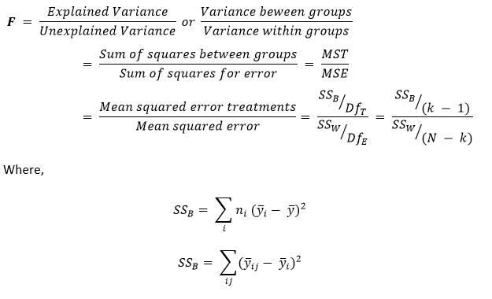
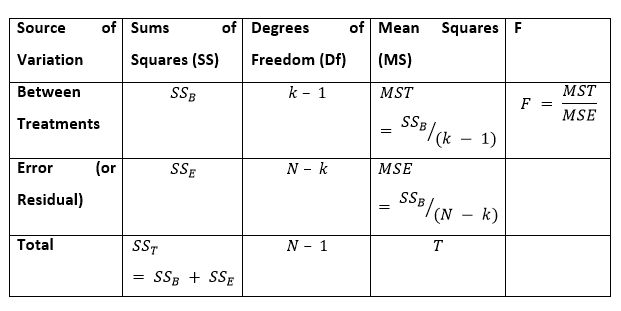
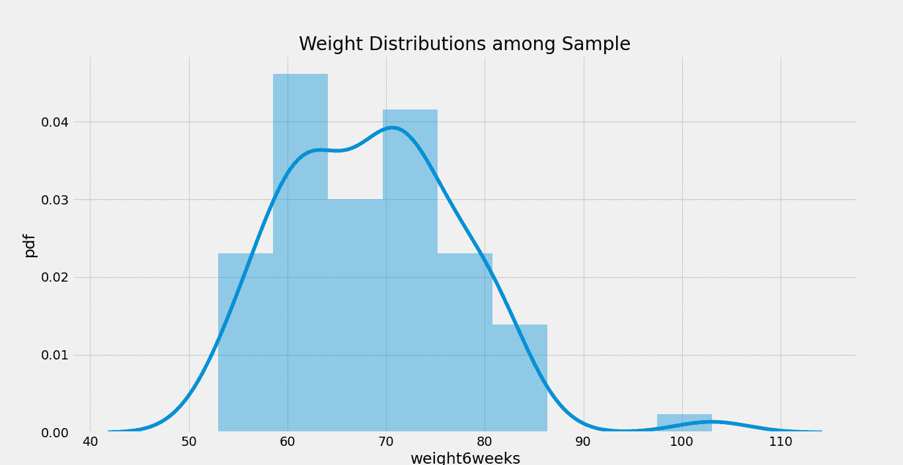
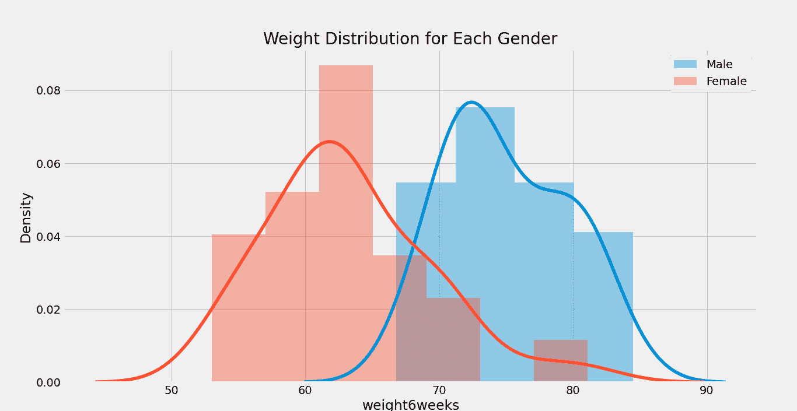
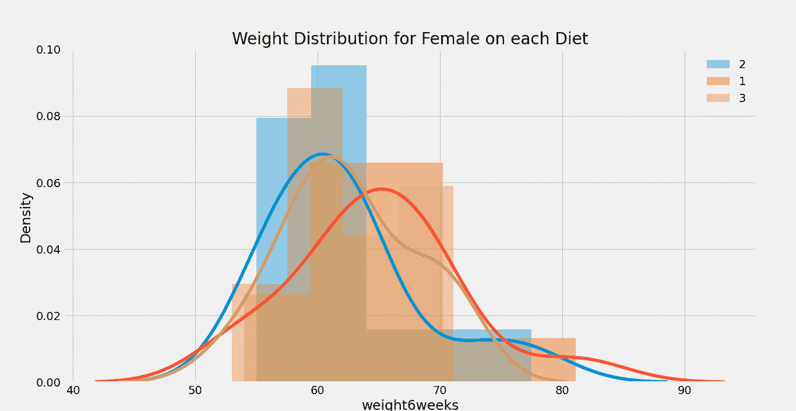
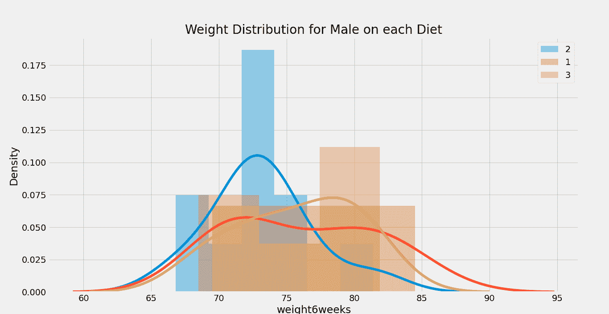

# Python 中的方差分析检验

> 原文：<https://www.javatpoint.com/anova-test-in-python>

以下教程基于数据分析；我们将详细讨论**方差分析(ANOVA)** ，以及用 Python 编程语言实现它的过程。ANOVAs 通常用于**心理学**研究。

在接下来的教程中，我们将了解如何借助 **SciPy** 库进行方差分析，利用 **Pyyttbl** 和 **Statsmodels** 在 Python 中对其进行**【手工】**评估。

## 理解方差分析检验

我们可以想到一个**方差分析检验**，也称为**方差分析**，来概括多组的 T 检验。通常，我们使用独立的 T 检验来比较两组之间的状态均值。每当我们需要比较两个以上组之间的状态平均值时，我们使用方差分析检验。

方差分析检验模型中某处的平均值是否有差异(检验是否有整体效应)；然而，这种方法不能告诉我们区别的地方(如果有的话)。通过进行事后检验，我们可以发现小组之间的差异点。

然而，为了进行任何检验，我们首先必须定义无效假设和替代假设:

1.  **无效假设:**各组之间没有显著差异。
2.  **交替假设:**各组之间有一个值得注意的差异。

我们可以通过比较两种变异来进行方差分析。第一个变化是在样本装置和每个样本中的另一个之间。下面显示的公式描述了单向方差分析检验统计。

方差分析公式的输出，即 **F 统计量**(也称为 **F 比**)，能够分析多组数据，以确定样本之间和样本内部的可变性。

我们可以写出单向方差分析的公式，如下所示:



哪里，

y <sub>i</sub> -样本均值在 **i <sup>第</sup>T5】组**

n <sub>i</sub> -第 **i <sup>第</sup>T5】组观察次数**

y -数据的总平均值

k -组的总数

y<sub>ij</sub>-**j<sup>th</sup>T5【观察中出 k 组**

总样本量

无论何时绘制方差分析表，我们都可以看到以下格式的所有上述组件:



通常，如果属于 F 的 p 值小于 0.05，则排除零假设，保持替代假设。在否定零假设的情况下，我们可以说所有集合/组的平均值不相等。

#### 注:如果被测组之间没有真正的差异，这就是所谓的零假设，方差分析检验的 F 比统计将接近 1。

## 方差分析检验假设

在进行方差分析检验之前，我们必须做一些假设，如下所示:

1.  我们可以从因子水平定义的总体中随机独立地获得观察值。
2.  因子的每个级别的数据通常是分布的。
3.  **病例独立:**样本病例必须相互独立。
4.  **方差同质性:**同质性表示组之间的方差需要大约相等。

我们可以借助布朗-福赛思检验或莱文检验来检验方差齐性的假设。我们还可以借助直方图、峰度或偏度值，或者借助像科尔莫戈罗夫-斯米尔诺夫、夏皮罗-维尔克或 Q-Q 图这样的检验来检验分数分布的正态性。我们也可以确定独立于研究设计的假设。

值得注意的是，方差分析检验对违反独立性假设并不稳健。这是为了告诉人们，即使有人试图违反正态性或同质性的假设，他们也可以进行检验并相信结果。

然而，如果独立性的假设被拒绝，方差分析的结果是不可接受的。通常，如果我们有同等规模的小组，分析以及违反同质性被认为是稳健的。如果我们有大样本量，恢复方差分析检验并违反正态性通常是可以的。

## 了解方差分析检验的类型

方差分析检验可以分为三种主要类型。这些类型如下所示:

1.  单向方差分析检验
2.  双向方差分析检验
3.  n 向方差分析检验

### 单向方差分析检验

只有一个自变量的方差分析检验被称为**单向方差分析检验**。

例如，一个国家可以评估冠状病毒病例的差异，一个国家可以有多个类别进行比较。

### 双向方差分析检验

有两个独立变量的方差分析检验被称为**双向方差分析检验**。这项检验也被称为**因子方差分析检验**。

例如，扩展上述示例，双向方差分析可以通过**年龄组**(第一自变量)和**性别**(第二自变量)来检查**冠状病毒**(因变量)病例的差异。双向方差分析可以用来检验这两个独立变量之间的相互作用。交互作用表示所有类别的自变量之间的差异是不均匀的。

假设**老年组**与**青年组**相比，冠状病毒总体病例可能更高；然而，与亚洲国家相比，这种差异在欧洲国家(T4)和亚洲国家(T7)可能有所不同。

### n 向方差分析检验

如果研究人员使用两个以上的独立变量，方差分析检验被认为是一个 n 向方差分析检验。这里 n 代表我们拥有的独立变量的数量。该检验也称为**马诺娃检验**。

例如，我们可以同时使用国家、年龄组、性别、种族等独立变量来检查冠状病毒病例的潜在差异。

方差分析检验将为我们提供单个(单变量)F 值；然而，一个 MANOVA 检验将为我们提供一个多元 F 值。

## 方差分析中有无复制的理解

一般来说，在方差分析检验中，我们中的一些人可能会听到有复制和没有复制的声音。让我们了解这些是什么:

### 复制双向方差分析检验

当两个组和这些组的成员执行多个任务时，进行带有复制的双向方差分析检验。

例如，假设冠状病毒疫苗仍在研发中。医生正在进行两种不同的治疗，以治愈两组感染病毒的患者。

### 无复制的双向方差分析检验

没有复制的双向方差分析检验是在我们只有一个组时进行的，我们对同一组进行双重检验。

例如，假设疫苗已经研制成功，研究人员在志愿者接种疫苗前后检验了一组志愿者，以观察疫苗接种是否正常。

## 理解后方差分析检验

在进行方差分析检验时，我们试图确定各组之间的统计学显著差异(如果有的话)。如果我们找到一个，我们将不得不检验群体差异点在哪里。

因此，研究人员使用事后检验来检查哪些组彼此不同。

我们可以进行事后检验，即检验各组间平均差异的 t 检验。我们可以进行多次比较检验来控制第一类错误率，包括邦费罗尼、邓尼特、谢菲和土耳其检验。

现在，我们将只理解使用 Python 编程语言的单向方差分析检验。

## 理解 Python 中的单向方差分析检验

我们将进行方差分析检验的过程分为不同的部分。

### 导入所需的库

为了开始进行方差分析检验，让我们为项目导入一些必要的库和模块。

**语法:**

```py

import pandas as pd
import matplotlib.pyplot as plt
import statsmodels.api as sm
from statsmodels.formula.api import ols
import seaborn as sns
import numpy as np
import pandas.tseries
plt.style.use('fivethirtyeight')

```

### 假设

让我们考虑这个问题的一个假设:

**“每种饮食，人的体重平均值都是一样的。”**

### 加载数据

在下面的问题中，我们将使用谢菲尔德大学设计的饮食数据集。数据集包含一个作为性别的二进制变量，其中 1 代表男性，0 代表女性。

让我们考虑以下语法:

**语法:**

```py

mydata = pd.read_csv('Diet_Dataset.csv')

```

### 理解数据集

一旦我们成功导入数据集，让我们打印一些数据来了解它。

**示例-**

```py

print(mydata.head())

```

**输出:**

```py
   Person gender  Age  Height  pre.weight  Diet  weight6weeks
0      25          41     171          60     2          60.0
1      26          32     174         103     2         103.0
2       1      0   22     159          58     1          54.2
3       2      0   46     192          60     1          54.0
4       3      0   55     170          64     1          63.3

```

现在让我们打印数据集中存在的总行数。

**示例-**

```py

print('The total number of rows in the dataset:', mydata.size)

```

**输出:**

```py
The total number of rows in the dataset: 546

```

### 检查缺失值

现在，我们必须看看数据集中是否缺少任何值。我们可以使用以下语法来检查这一点。

**示例-**

```py

print(mydata.gender.unique())
# displaying the person(s) having missing value in gender column
print(mydata[mydata.gender == ' '])

```

**输出:**

```py
[' ' '0' '1']
   Person gender  Age  Height  pre.weight  Diet  weight6weeks
0      25          41     171          60     2          60.0
1      26          32     174         103     2         103.0

```

我们可以观察到两个条目在“性别”列中包含缺失的值。现在让我们找出数据集中缺失值的总百分比。

**示例-**

```py

print('Percentage of missing values in the dataset: {:.2f}%'.format(mydata[mydata.gender == ' '].size / mydata.size * 100))

```

**输出:**

```py
Percentage of missing values in the dataset: 2.56%

```

我们可以观察到，数据集中大约有 3%的缺失值。我们可以忽略、删除或借助最接近的高度平均值对其性别进行分类。

### 了解重量的分布

在接下来的步骤中，我们将使用 **distplot()** 函数绘制图表，以了解样本数据中的权重分布。让我们考虑代码片段。

**示例-**

```py

f, ax = plt.subplots( figsize = (11,9) )
plt.title( 'Weight Distributions among Sample' )
plt.ylabel( 'pdf' )
sns.distplot( mydata.weight6weeks )
plt.show()

```

**输出:**



我们还可以绘制数据集中每个性别的分布图。下面是相同的语法:

**示例-**

```py

f, ax = plt.subplots( figsize = (11,9) )
sns.distplot( mydata[mydata.gender == '1'].weight6weeks, ax = ax, label = 'Male')
sns.distplot( mydata[mydata.gender == '0'].weight6weeks, ax = ax, label = 'Female')
plt.title( 'Weight Distribution for Each Gender' )
plt.legend()
plt.show()

```

**输出:**



我们也可以使用下面的函数来显示每个性别的分布图。

**示例:**

```py

def infergender(x):
    if x == '1': 
        return 'Male'

    if x == '0':
        return 'Female'

    return 'Other'

def showdistribution(df, gender, column, group):
    f, ax = plt.subplots( figsize = (11, 9) )
    plt.title( 'Weight Distribution for {} on each {}'.format(gender, column) )
    for groupmember in group:
        sns.distplot(df[df[column] == groupmember].weight6weeks, label='{}'.format(groupmember))
    plt.legend()
    plt.show()

uniquediet = mydata.Diet.unique()
uniquegender = mydata.gender.unique()

for gender in uniquegender:
    if gender != ' ':
        showdistribution(mydata[mydata.gender == gender], infergender(gender), 'Diet', uniquediet)

```

**输出:**

**图 1:**



**图 2:**



现在，我们将使用下面给出的代码片段根据“性别”列计算平均值、中位数、非零计数和标准差:

**示例-**

```py

print(mydata.groupby('gender').agg(
    [ np.mean, np.median, np.count_nonzero, np.std ]
).weight6weeks)

```

**输出:**

```py
             mean  median  count_nonzero        std
gender
        81.500000    81.5            2.0  30.405592
0       63.223256    62.4           43.0   6.150874
1       75.015152    73.9           33.0   4.629398

```

正如我们所观察到的，我们已经基于性别估计了所需的统计测量。我们也可以根据性别和饮食对这些统计数据进行分类。

**示例-**

```py

print(mydata.groupby(['gender', 'Diet']).agg(
    [np.mean, np.median, np.count_nonzero, np.std]
).weight6weeks)

```

**输出:**

```py
                  mean  median  count_nonzero        std
gender Diet
       2     81.500000   81.50            2.0  30.405592
0      1     64.878571   64.50           14.0   6.877296
       2     62.178571   61.15           14.0   6.274635
       3     62.653333   61.80           15.0   5.370537
1      1     76.150000   75.75           10.0   5.439414
       2     73.163636   72.70           11.0   3.818448
       3     75.766667   76.35           12.0   4.434848

```

我们可以观察到，饮食中女性的体重略有差异；然而，它似乎不会影响男性。

### 进行单向方差分析检验

单向方差分析检验的零假设是


这个检验试图检验这个假设是否成立。

让我们考虑初步确定 95%的置信水平，这也意味着我们将只接受 5%的误差率。

**示例-**

```py

mymod = ols('Height ~ Diet', data = mydata[mydata.gender == '0']).fit()
# performing type 2 anova test
aovtable = sm.stats.anova_lm(mymod, typ = 2)
print('ANOVA table for Female')
print('----------------------')
print(aovtable)
print()

mod = ols('Height ~ Diet', data = mydata[mydata.gender=='1']).fit()
# performing type 2 anova test
aovtable = sm.stats.anova_lm(mymod, typ = 2)
print('ANOVA table for Male')
print('----------------------')
print(aovtable)

```

**输出:**

```py
ANOVA table for Female
----------------------
               sum_sq    df        F    PR(>F)
Diet       559.680764   1.0  7.17969  0.010566
Residual  3196.086677  41.0      NaN       NaN

ANOVA table for Male
----------------------
               sum_sq    df        F    PR(>F)
Diet       559.680764   1.0  7.17969  0.010566
Residual  3196.086677  41.0      NaN       NaN

```

在上面的输出中，我们可以观察到两个 p 值(PR (> F)):男性和女性。

在男性的情况下，我们不能接受低于 95%置信水平的零假设，因为 p 值大于α值，即 0.05 < 0.512784。因此，在提供这三种类型的饮食后，男性的体重没有发现差异。

就女性而言，由于 p 值 PR (> F)低于误差率，即 0.05 > 0.010566，我们可以拒绝零假设。这种说法表明，我们对女性在饮食方面的身高差异非常有信心。

所以，现在我们明白了饮食对女性的影响；然而，我们没有意识到这两种饮食之间的区别。因此，我们将在 Tukey HSD(诚实显著差异)检验的帮助下进行事后分析。

让我们考虑下面的代码片段。

**示例-**

```py

from statsmodels.stats.multicomp import pairwise_tukeyhsd, MultiComparison
# using the female data only
mydf = mydata[mydata.gender == '0']

# comparing the height between each diet, using 95% confidence interval 
multiComp = MultiComparison(mydf['Height'], mydf['Diet'])
tukeyres = multiComp.tukeyhsd(alpha = 0.05)

print(tukeyres)
print('Unique diet groups: ', multiComp.groupsunique)

```

**输出:**

```py
Multiple Comparison of Means - Tukey HSD, FWER=0.05
=====================================================
group1 group2 meandiff p-adj   lower    upper  reject
-----------------------------------------------------
     1      2  -3.5714 0.5437 -11.7861  4.6432  False
     1      3  -8.7714 0.0307  -16.848 -0.6948   True
     2      3     -5.2 0.2719 -13.2766  2.8766  False
-----------------------------------------------------
Unique diet groups:  [1 2 3]

```

从上面的输出中我们可以观察到，我们只能拒绝第一种和第三种饮食类型中的无效假设，这意味着饮食 1 和饮食 3 的体重存在统计学上的显著差异。

* * *