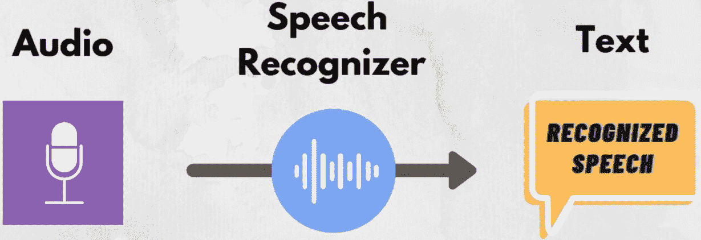

# Python 语音识别

> 原文：<https://www.javatpoint.com/speech-recognition-python>

你有没有想过**谷歌助手**或者**亚马逊 Alexa** 是如何识别你所说的一切的？你一定在想一些在监狱里工作的复杂智能技术。除了识别系统的巨大技术增长在市场上大受欢迎之外，大多数蜂窝设备都通过一些内置应用或第三方应用具有语音识别功能。不一定；大多数这样的语音识别系统都是在 python 包和库的帮助下构建和部署的。在一定程度上，Python 已经证明了它是可预见的未来的一个重要方面。原因很明显。要将语音识别纳入 Python，您需要一定程度的交互性和可访问性来匹配技术。

可访问性的概念值得考虑，因为该识别允许**老年人、身体残疾者、**或**视障人**与机器进行交互，并使用最先进的服务和产品快速解决他们的问题，而无需选择随机的图形用户界面应用。

在本文中，您将学习用 Python 创建语音识别系统。为了简化理解它是如何构建的过程，本文旨在教您如何用更少的努力和更大的热情来构建系统。但是在进入项目之前，让我们谈谈作为开发人员需要了解的一些更重要的方面。

## 概述-它是如何工作的

在进入项目的细节和复杂之处之前，您将构建并花一点时间了解语音识别工作的基本概况。虽然没有开始的先决条件，但是了解 python 编程语言的基础是很好的。

语音识别从 1950 年贝尔实验室进行的研究发展而来，仅限于单个说话者，词汇数据库有限。自从古代语音识别应用出现以来，现代语音识别应用已经取得了长足的进步。

说到演讲的成分，**第一个**成分是**演讲**。它必须从声音转换成可以通过麦克风传播的信号，并可以转换成数字数据。这是使用模数转换器完成的。一旦数据的形式被数字化，几个经过训练的模型可以很容易地将音频转录成文本。



现代语音识别器依赖于鲜为人知的**隐马尔可夫模型**的概念。该方法基于当语音信号持续一小段时间(比如 5 毫秒)时为其制定的假设，并且可以被称为平稳过程，即基于不随时间变化的统计的过程。

在典型的 HMM 中，语音的默认信号划分大约是**十毫秒**划分成各种片段。每个片段的功率谱有助于信号绘制一个函数，并产生一个频率，该频率随后被映射到实数向量，称为**倒谱系数**。映射向量的维度非常小，与一些精确系统相比只有 10 个维度，精确系统的维度可能接触 **32** 或更多。隐马尔可夫模型生成的最终输出以向量序列的形式出现。

向量组在借助音素(语音的基本单位)将语音解码成文本中起着重要作用。音素的计算取决于训练，因为存在说话者变化，并且即使对于同一说话者，话语有时也是不同的。因此，为了解决这个问题，考虑了一种特殊的算法来确定产生音素序列的最相关的单词。

就计算而言，你刚刚学习的整个过程相当昂贵。**神经网络**用于在现代语音识别系统中变换特征和维度，减少了对 HMM 的需求。此外，**语音活动检测器** (VAD)也用于减少音频信号中可能包含某些语音的部分。它主要用于识别不必要的词类，并阻止它们被考虑。

## 语音识别包

在 **PyPI** 的链条上，有一小撮语音识别软件包。其中一些是:

1.  装配
2.  阿皮亚
3.  语音识别
4.  才智
5.  沃森-开发者-云

上面给出的包，如**apai****wit**，提供了类似**自然语言处理**的功能。它们的内置功能有助于识别说话者的意图，并超越了一般的语音识别。其他包主要关注语音到文本的转换。

以上给出的包中只有一个包是**语音识别**。

识别语音需要一些音频形式的输入，语音识别包可以毫不费力地检索这些类型的输入。它不需要硬核脚本来访问麦克风，然后从头开始处理音频。这个包的另一个优点是，它将节省您的时间，并且在几分钟内就可以执行指令。

SpeechRecognition 库的行为就像是专门为语音构建的各种 API 的封面或包装。它非常灵活和敏捷。一个这样的 API 是**谷歌网络语音**API，支持硬编码的默认语音识别。

SpeechRecognition 库非常容易使用，并且该包很容易作为 python 项目导入。还需要注意的是，这个包可能不会包装目前所有可用的 API。因此，您需要准确地确定构建语音识别器需要什么样的包。

您可能已经从理论上理解了一些语音识别器的优点和缺点，并对语音识别器的工作原理有了一个概述，让我们使用下面给出的安装过程继续将语音识别包安装到本地环境中。

## 语音识别安装

SpeechRecognition 包兼容各种版本的 python 语言，如 **2.6、2.7** 、 **3.3** +。如果您的 python 版本较旧，它可能还需要一些其他安装。假设您的本地系统上有 Python 3.3+版本，您可以通过 **pip** 从终端执行您的安装方法。

```py

  $ pip install SpeechRecognition

```

安装后，您必须使用下面给出的代码验证安装是否被正确解释。

```py

 >>> import speech_recognition as sr
>>> sr._version_'3.8.1'

```

如果您正在处理包中的音频文件，语音识别可能会非常有效。然而，它可能还需要一些依赖关系。因此，为了简化这个过程， **PyAudio** 包在捕捉麦克风输入时非常方便。

## 识别器类

语音识别的魔力只有在**识别器类**出现时才会发挥作用。**识别器**的主要目的是识别语音以及不同语音的阅读变体，然后驱动功能并验证来自音频源的语音。

要创建识别器，您需要创建它的实例。因此，在 python 解释器中键入下面的代码。

```py

  >>> r=sr.Recognizer()

```

有各种方法可以创建识别器实例，这些实例可以在 API 的支持下识别来自音频源的语音。他们中的一些人在下面应征入伍。

```py

recognize_bing(): Microsoft Bing Speech

recognize_google(): Google Web Speech API

recognize_google_cloud(): Google Cloud Speech - requires 
installation of the google-cloud-speech package

recognize_houndify(): Houndify by SoundHound

recognize_ibm(): IBM Speech to Text

recognize_sphinx(): CMU Sphinx - requires installing PocketSphinx

recognize_wit(): Wit.ai

```

在这些包中，如果与 **CMU 狮身人面像引擎**一起使用，包**识别 _ 狮身人面像()**被设计为离线服务。其余的包需要互联网连接才能工作。

#### 注意:一定要注意语音识别中提供的默认键。它主要用于测试和安全目的，可能会被谷歌撤销。因此，SpeechRecognition 有一个 API 接口，可以翻译这些缺省键来小心使用。

**每个 _recognize_*(** )方法可能会抛出一个名为**语音识别的异常。RequestError** 异常。发生这种情况的原因可能是，由于安装损坏，API 可能无法访问。对于上面显示的其余方法，如果达到配额限制，可能会生成**请求错误**，或者服务器或互联网连接可能有问题。可能会出现类似这样的问题。

```py

 Traceback (most recent call last):
  File "", line 1, in <module>TypeError: recognize_google() missing 1 required positional argument: 'audio_data'</module> 
```

## 使用音频文件

在使用 Python 中的 SpeechRecognition 包之前，您首先需要下载一个音频文件。SpeechRecognition 通过将音频文件保存到您当前运行的 python 解释器的同一目录中，可以轻松处理音频文件。它通过使用**音频文件**类来做到这一点。这个类需要用音频文件路径初始化和设置，以便上下文管理器提供读取文件及其内容的良好接口。

### 支持的文件类型

语音识别支持的文件格式类型如下:

1.  **WAV** :格式必须是 PCM/LPCM
2.  **AIFF**
3.  **AIFF-C**
4.  **FLAC** :格式必须是原生 FLAC

如果您有基于 x-86 的 Windows、Linux 或 macOS，那么使用 FLAC 文件会更容易。除了这些操作系统之外，您可能还需要安装一个 FLAC 编码器，让您能够访问命令行工具。

## 使用记录()捕获数据

record()函数用于在文件中使用 python 解释器从文件中捕获数据。例如，文件的名称是“ **harvard.wav** ，用于编码该方法的 python 解释器代码如下。

```py

  >>> hardvard = sr.AudioFile('harvard.wav')
 >>> with harvard as source:
         Audio = r.record(source)

```

这段代码将打开上下文管理器来读取文件的内容，并将数据存储在名为**源**的**音频文件**实例中。**记录()**方法记录文件中的真实数据。要确认数据是否被记录，您可以使用以下代码进行检查。

```py

  >>> type(audio)

```

或者，您也可以调用 recognize_google()来识别音频。这可能取决于您的网络速度、音频捕获方式以及显示结果的秒数。

```py

  >>> r.recognize_google(audio)

```

该代码将转录文件中存在的所有数据，并以文本格式写入识别的音频。

## 持续时间和段偏移捕获

考虑您只想捕获文件中特定的语音片段。record()方法可以做到这一点，方法是识别 duration 关键字，后跟几秒钟后停止语音的参数。例如，您可能需要从“harvard.wav”文件中捕获演讲的前 5 秒；您可以使用下面给出的方法做到这一点。

```py

  >>> with harvard as source:
          Audio = r.record(source, duration=5)
 >> >r.recognize_google(audio)

```

当在块中使用时，record()方法总是希望在文件流中向前移动。这通常意味着录制会再次进行四秒钟，如果您正在录制前四秒钟，则会返回前四秒钟的音频。这个现象可以用下面给出的代码片段来说明。

```py

  >>> with harvard as source:
...     audio1 = r.record(source, duration=4)
...     audio2 = r.record(source, duration=4)
...
>>> r.recognize_google(audio1)
'the stale smell of old beer lingers'

>>> r.recognize_google(audio2)
'it takes heat to bring out the odor a cold dip.'

```

您可以注意到音频 2 包含音频第三阶段的一部分。也有一些情况下，您指定持续时间，录制中途停止，这通常会损害音频的透明度。此外，在指定 record()方法时，您甚至可以通过 offset 关键字使用参数设置特定的起始点。起点表示开始录制前距离文件的秒数。因此，要从音频文件中捕获第二个短语，您可以使用下面的方法，根据您的需要选择 5 秒或 3 秒。

```py

  >>> with harvard as source:
...     audio = r.record(source, offset=4, duration=3)
...
>>> r.recognize_google(audio)

```

持续时间和偏移关键字的重要性在于包含音频的文件的分段。如果你已经知道音频帧，你可能会匆忙陷入糟糕的转录结果。要可视化这种效果，请使用 python 解释器尝试使用以下代码。

```py

>>> with harvard as source:
...     audio = r.record(source, offset=4.7, duration=2.8)
...
>>> r.recognize_google(audio)

```

上面的代码片段表示录制从 4.7 秒开始，开头的短语将会丢失。同样，当录制结束时，捕获的短语将与开始阶段不匹配。

另一个遗漏导致不准确转录的短语的原因是噪音。以上可能工作得很好，因为它是干净的音频，但现实世界中没有没有噪音的地方。

## 噪声对语音识别的影响

没有一个地方没有噪音。所有的语音识别技术都是为了解决和消除语音中存在的有害噪声而开发的，这些噪声会削弱捕获音频帧的能力。噪音会破坏应用的精度。要了解 Noise 对语音识别的影响，需要下载一个名为“ **jackhammer.wav** ”的文件，并确保保存在解释器的工作目录中。假设这个文件中有一句“ **javaTpoint 是最好的 Java 培训网站**”大声说出来，你需要在后台转录。为此，请考虑以下方法。

```py

>>> jackhammer = sr.AudioFile('jackhammer.wav')
>>> with jackhammer as source:
...     audio = r.record(source)
...
>>> r.recognize_google(audio)

```

为了处理噪声，在上述步骤之后尝试的另一种方法是使用识别器类的**调整环境噪声(**)的方法。

```py

>>> with jackhammer as source:
...     r.adjust_for_ambient_noise(source)
...     audio = r.record(source)
...
>>> r.recognize_google(audio)

```

上面的代码片段错过了初始输出，输出中没有第一个单词。因此，当 record()方法捕获音频时，会使用音频文件的第一部分，并捕获后面的数据。**调整环境噪声()**方法读取音频文件的第一秒，识别器校准音频的噪声水平。

如果要使用调整环境噪声()来调整时间范围，可以在代码段中使用 duration 关键字，方法是以秒为单位为其分配数值。如果不赋值，则取一个作为默认值，但建议将该值降低到 **0.5** 。下面的代码片段显示了相同的技术。

```py

>>> with jackhammer as source:
...     r.adjust_for_ambient_noise(source, duration=0.5)
...     audio = r.record(source)
...
>>> r.recognize_google(audio)

```

上面的代码片段将返回您之前在开头错过的整个音频文件。但是，在某些情况下，很难处理或消除噪声的影响，因为信号可能过于嘈杂，无法处理。

因此，您可能不得不求助于一些其他技术来预处理音频，以处理这样的问题。为此，您可以使用音频编辑软件或类似 **SciPy** 的 Python 包。该软件包可以预处理音频文件，并可以过滤噪音。

此外，在处理有噪声的文件时，使用实际的 API 响应是有帮助的，因为大多数 API 返回具有许多转录的 JSON 字符串。类似地， **recognize_google()** 方法也必然会传递类似的转录文件，除非被迫传递完整的响应。这个方法实际上可以使用某些参数和关键字来实现，比如 recognize_google()方法返回的 show_all。

```py

  >>> r.recognize_google(audio, show_all=True)
{'alternative': [
  {'transcript': 'javatpoint best is the programming site'}, 
  {'transcript': 'the javatpoint site is best programming'}, 
  {'transcript': 'javatpoint programming is the best site'},
  {'transcript': 'the programming is javatpoint best site'}, 
  {'transcript': 'best is the programming site javatpoint'}, 
], 'final': True}

```

在上面的代码片段中， **recognize_google()** 方法返回一个字典，该字典带有指向上面显示的各种转录的替代键。尽管响应结构可能因为 API 的不同而有不同的形式，但这主要用于调试。

到目前为止，您可能已经学习了语音识别及其 Python 包的基础知识。学习的下一个阶段包括转录音频文件，通过麦克风输入使项目更具互动性。

## 使用麦克风输入工作

通过安装名为 **PyAudio** 的软件包，您可以使用 SpeechRecognizer 软件包访问您的麦克风。为此，请保存当前的更改并关闭解释器。继续安装 **PyAudio** ，过程与您安装 SpeechRecognizer 的过程相似。

```py

$ pip install pyaudio

```

安装后，要测试它是否与您正在使用的语音识别器版本兼容，请键入以下命令。

```py

$ python -m speech_recognizer

```

完成此步骤后，您需要确保默认麦克风已打开且未静音。如果您在安装和测试中没有遇到任何问题，您应该会在终端上看到类似这样的内容。

```py

A moment of silence, please?
Set minimum energy threshold to 600.4452854381937
Say something!

```

试着通过寻找麦克风并测试 SpeechRecognizer 包如何转录您的语音来玩。

### 麦克风班

麦克风类用于为系统创建一个实例，以识别来自源的音频文件。要使用这个类，您需要通过打开另一个解释器会话并创建一个识别器类来导入它，如下所示。

```py

>>> import speech_recognizer as sr
>>> r.=sr.Recognizer()

```

您需要使用系统上的默认麦克风，而不是使用来源的音频文件。您可以使用如图所示的方法来实现这一点。

```py

>>> mic = sr.Microphone()

```

如果您无法识别系统的默认麦克风，您可能需要指定一个设备索引。您可以使用麦克风类中的**list _ 麦克风 _ name()**方法获取所有可用麦克风名称的列表。

```py

>>> sr.Microphone.list_microphone_names()
['HDA Intel PCH: ALC272 Analog (hw:0,0)',
 'HDA Intel PCH: HDMI 0 (hw:0,3)',
 'sysdefault',
 'front',
 'surround40',
 'surround51',
 'surround71',
 'hdmi',
 'pulse',
 'dmix', 
 'default']

```

上述代码中定义的设备索引称为**索引**，其中包含系统上可用麦克风名称的列表。例如，在上面给出的输出中，名为“front”的麦克风位于列表中的索引 3 处。这可以使用下面给出的方法来完成。

```py

 >>> mic = sr.Microphone(device_index=3)

```

上面的代码只是一个例子，因此建议不要在解释器中运行。对于大多数项目，您应该使用默认的系统麦克风。

### 使用 listen()捕捉麦克风输入

您将在这里学习的另一种方法是 listen()方法，该方法用于捕获来自麦克风的输入。由于您已经创建了麦克风实例，现在是捕获一些输入的合适时机。像大多数音频文件类一样，麦克风也被视为上下文管理器。它通过内部有一个块的 Recognizer 类捕获输入，方法是接受它作为第一个参数，然后记录来自源的输入，直到麦克风检测到静音。为了对此进行总结，让我们看看如何使用给定的代码来应用它。

```py

  >>> with mic as source:
...     audio = r.listen(source)
...

```

一旦用块执行了上面的代码，您应该尝试对着麦克风说点什么，然后等待一段时间。解释器可能会在一段时间后提示显示。一旦您看到“> > >”作为返回的提示，就可以确定识别器可以识别您所说的任何内容。

如果识别器未能返回提示，可能会出现一些环境噪音。您可以通过按下 **Ctrl+C** 进行提示来停止。

要调整语音中的主要噪声，您可能需要使用与“识别器”类相同的调整方法。由于与音频文件相比，麦克风输入是不可预测的，所以总是在听麦克风输入时进行这些操作总是一个好主意。要获得精确且无噪声的输出，可以使用如下所示的 listen()方法进行尝试。

```py

  >>> with mic as source:
...     r.adjust_for_ambient_noise(source)
...     audio = r.listen(source)
...

```

当运行上述代码时，请等待几秒钟，以便 adjust _ for _ environmental Noise()方法完成其任务。代码编译并运行后，试着对着麦克风说点什么，等待解释器识别语音。如果它能识别并返回提示，它就能正常工作。

您也可以使用 duration 关键字，并尝试再次使用它来获得您想要识别的特定语音帧。同时，如果 duration 关键字的持续时间小于等于 0.5，SpeechRecognizer 文档建议使用 duration 关键字。您可能还会发现，在某些情况下没有使用 duration 关键字，因此使用了一个作为默认值来生成更好的结果。此外，最小值很可能取决于麦克风环境的输入。因此，一秒钟的持续时间最好被认为是这类任务的最佳时间。

### 无法识别的语音

有了代码库，你已经在解释器中创建了一些有形的代码，使用麦克风来发出一些难以理解的噪音。你肯定会收到这样的错误。

```py

  Traceback (most recent call last):
  File "", line 1, in <module>File 

"/home/david/real_python/speech_recognition_primer/venv/lib/pyth
on3.5/site-packages/speech_recognition/__init__.py", line 858, in recognize_google
if not isinstance(actual_result, dict) or 
len(actual_result.get("alternative", [])) == 0: raise 
UnknownValueError()
speech_recognition.UnknownValueError</module> 
```

这个错误是因为通过麦克风捕获的语音作为输入的不可识别的性质，因此 API 代码库不够先进，无法转录这些简短的咕噜声或人声。也可能有这样的情况，解释器可能通过识别当前输入并显示甚至不接近通过麦克风捕获的内容来提示。因此，像拍手、点击或其他小节这样的活动可能会分别引发异常或没有正确的输出。

## 摘要

在这篇关于 Python 语音识别的长教程中，您从零开始学习了时间表的工作方式。您讲述了从概念知识到创建实时简单的 python 语音识别器的实践经验，该语音识别器可以听到您的语音并以文本格式显示在控制台上。您还学习了一些关键方法来处理使用 SpeechRecognizer 包时经常出现的问题，并学习了如何纠正这些问题。Python 是广泛使用的编程和脚本语言，涵盖了大多数语音识别应用，因为它的环境库和框架显示了它只用几行简单可读的代码就能处理关键问题的能力。

* * *