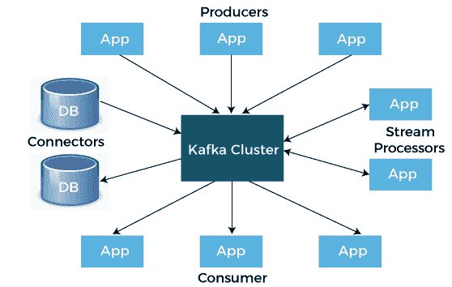
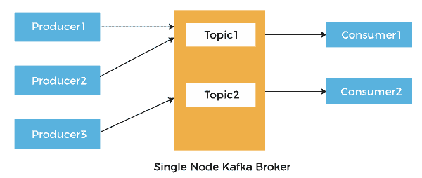

# Python 中的Kafka教程

> 原文：<https://www.javatpoint.com/kafka-in-python>

在下面的教程中，我们将讨论 Apache Kafka 及其在 Python 编程语言中的使用。

## 理解ApacheKafka

Apache Kafka 是一个开源的流媒体平台，最初由 LinkedIn 设计。后来，它被移交给Apache基金会，并于 2011 年开源。

**根据维基百科的定义:**

Apache Kafka 是一个由 Apache 软件基金会开发的开源平台，用于处理流。它是用 Java 和 Scala 编写的。该项目的目标是提供一个高吞吐量、统一、低延迟的平台，以便处理实时数据馈送。Apache Kafka 的存储层基本上是“设计为分布式事务日志的可大规模扩展的发布/订阅消息队列”，这使得它对于企业基础架构来说非常有价值，以便处理流式数据。此外，Kafka 通过 Kafka Connect 连接到外部系统(用于导入和导出数据)，并提供 Kafka Streams，一个用于 Java 流处理的库。



我们可以把它想象成一个巨大的提交日志，在那里我们可以按照发生的顺序存储数据。该日志的用户可以根据自己的需要访问和使用它。

## ApacheKafka的一些用例

我们可以在不同的地方使用ApacheKafka。让我们考虑Kafka的一些用例，这些用例可以帮助我们理解它的用法:

1.  **活动监控:**我们可以用Kafka来监控活动。该活动可能属于物理传感器和设备或网站。生产者可以发布来自数据源的原始数据，这些数据可以在以后用于发现趋势和模式。
2.  **消息传递:**我们还可以使用 Kafka 作为服务之间的消息代理。如果我们正在实现一个微服务架构，我们可以让一个微服务作为生产者，另一个作为消费者。例如，我们有一个微服务，负责创建新帐户，并向与帐户创建相关的用户发送电子邮件。
3.  **日志聚合:**我们还可以利用 Kafka 从不同的系统中收集日志，并将其存储在一个集中的系统中进行进一步的处理。
4.  **ETL:** Kafka提供了几乎实时流的特性；因此，我们可以根据需求开发一个 ETL。
5.  **数据库:**基于我们前面提到的事情，可以说Kafka也充当了数据库的角色。它不是一个典型的数据库，具有按需求查询数据的特性，但是 Kafka 可以将数据存储到我们需要的任何时间，而不会消耗它。

## 理解Kafka的概念

让我们讨论一下Kafka的核心概念。



1.  **主题:**输入系统的每条消息都必须是某个主题的一部分。这个话题是一连串的记录。消息以键值对的格式存储。每个消息都被分配一个序列，称为偏移。一个消息的结果可以是另一个消息的输入，用于进一步处理。
2.  **生产者:**生产者是负责将数据发布到Kafka系统中的应用。他们公布他们选择的主题的数据。
3.  **Consumer:** 有一些 Consumers 应用使用发布到主题中的消息。消费者获得其偏好主题的订阅并消费数据。
4.  **经纪人:**经纪人是Kafka的一个实例，负责消息交换。我们可以将Kafka作为集群或单机的一部分。

现在，让我们考虑一个简单的例子，有一个餐馆的仓库，所有的原材料都储存在那里，比如蔬菜、大米、面粉等等。

这家餐馆供应各种各样的菜，像印度菜、意大利菜、中国菜等等。每个菜系的厨师都可以参考仓库选择需要的物件，制作菜肴。有可能所有来自不同烹饪的厨师都使用相同的原料。这可以是各种菜肴中使用的任何秘密配料。在下面的案例中，仓库充当经纪人，商品的商家是生产者，商品和厨师创造的秘方是话题，厨师是消费者。

## 如何用 Python 访问Kafka？

Python 编程语言中有各种各样的库可以使用Kafka。其中一些库描述如下:

| 南号码 | 图书馆 | 描述 |
| one | **Kafka-Python** | 这是一个由 Python 社区设计的开源库。 |
| Two | **pykaka** | 这个库由 Parsly 维护，它声称是一个 Pythonic API。但是，我们不能像Kafka-Python 那样在这个库中创建动态主题。 |
| three | **融合PythonKafka** | 这个库是由 Confluent 提供的，作为 librdkafka 的一个薄薄的包装。因此，它的性能优于上述两种。 |

## 安装依赖项

我们将在这个项目中使用Kafka-Python。因此，我们可以使用 pip 安装程序手动安装它，如下所示:

**语法:**

```py

$ pip install kafka-python

```

现在，让我们开始建设这个项目。

## 项目代码

在下面的例子中，我们将创建一个生产者，产生从 1 到 500 的数字，并将它们发送给Kafka经纪人。稍后，消费者将从代理读取这些数据，并将它们保存在 MongoDB 集合中。

使用Kafka的好处之一是，万一一个消费者崩溃了，另一个或固定的消费者会继续阅读前一个离开的地方。这是一个很好的方法，可以确认所有数据都被输入到数据库中，没有丢失数据或重复数据。

在下面的示例中，让我们创建一个名为 produce.py 的新 Python 程序文件，并从导入一些必需的库和模块开始。

**文件:product . py**

```py

# importing the required libraries
from time import sleep
from json import dumps
from kafka import KafkaProducer

```

**说明:**

在上面的代码片段中，我们已经导入了所需的库和模块。现在，让我们初始化一个新的Kafka制作人。请注意以下参数:

1.  **bootstrap _ servers =[' localhost:9092 ']:**此参数设置主机和端口以联系生产者来引导初始集群元数据。这里不强制设置，因为默认主机和端口是 localhost: 9092。
2.  **value _ serializer = lambda x:dumps(x)。encode('utf-8'):** 此参数在将数据发送到代理之前对数据进行序列化。在这里，我们将数据转换成一个 JSON 文件，并将其编码为 UTF-8。

让我们考虑下面的代码片段。

**文件:product . py**

```py

# initializing the Kafka producer
my_producer = KafkaProducer(
    bootstrap_servers = ['localhost:9092'],
    value_serializer = lambda x:dumps(x).encode('utf-8')
    )

```

**说明:**

在上面的代码片段中，我们已经使用 **KafkaProducer()** 函数初始化了 Kafka 生产者，其中我们使用了上面描述的参数。

现在，我们必须生成从 1 到 500 的数字。我们可以使用的**循环来实现这一点，在这个循环中，我们使用每个数字作为字典中的一个值，只有一个键:num。此键仅用作数据的键，而不是主题的键。在同一个循环中，我们还将数据发送给一个代理。**

我们可以通过调用生产者的 send 方法并详细描述主题和数据来实现这一点。

#### 注意:值序列化程序将自动转换和编码数据。

为了结束迭代，我们可以休息五秒钟。如果我们必须确认代理是否收到了消息，建议包含一个回调。

**文件:product . py**

```py

# generating the numbers ranging from 1 to 500
for n in range(500):
    my_data = {'num' : n}
    my_producer.send('testnum', value = my_data)
    sleep(5)

```

**说明:**

在上面的代码片段中，我们使用了循环的**来迭代从 1 到 500 的数字。我们还在每次迭代之间增加了 5 秒的时间间隔。**

如果有人想要测试代码，建议创建一个新的主题，并将数据发送到新生成的主题。当我们一起测试生产者和消费者时，这种方法将避免在 **testnum** 主题中出现任何重复值和可能混淆的情况。

## 消费数据

在开始消费者的编码部分之前，让我们创建一个新的 Python 程序文件，并将其命名为 consumer . py。我们将导入一些模块，如 **json.loads、【MongoClient】**和 **KafkaConsumer** 。由于 **PyMongo** 不在本教程的范围内，我们不会对其代码进行更深入的挖掘。

此外，有人还可以根据需要用任何其他代码替换 mongo 代码。我们可以对其进行编码，以便将数据输入到另一个数据库中，也可以对其进行编码以处理数据，或者进行其他任何可以想到的操作。

首先，让我们考虑以下代码片段。

**文件:consume.py**

```py

# importing the required modules
from json import loads
from kafka import KafkaConsumer
from pymongo import MongoClient

```

**说明:**

在上面的代码片段中，我们已经从它们各自的库中导入了所需的模块。

让我们创造Kafka式的消费者。我们将使用 **KafkaConsumer()** 函数进行这项工作；所以让我们仔细看看这个函数中使用的参数。

1.  **主题:****KafkaConsumer()**函数的第一个参数就是主题。在下面的例子中，它是 **testnum** 。
2.  **bootstrap _ servers =[' localhost:9092 ']:**此参数与生产者相同。
3.  **auto_offset_reset = '最早':**该参数是其他重要参数之一。它处理消费者在关闭或中断后重新开始阅读的地方，我们可以将其设置为最新或最早。每当我们将其设置为最早时，消费者就开始读取最新的提交偏移量。每当我们将其设置为最新时，消费者就会在日志的末尾开始阅读。这正是我们需要的。
4.  **enable_auto_commit = True:** 此参数确认使用者是否在每个间隔提交其读取偏移量。
5.  **auto _ commit _ interval _ ms = 1000 毫秒:**此参数用于设置两次提交之间的时间间隔。由于每隔五秒钟就有消息传来，因此每隔一秒提交一次似乎是公平的。
6.  **group_id = 'counters':** 此参数是消费者所属的消费者组。请注意，消费者必须是消费者组的一部分，才能使他们自动提交工作。
7.  值**反序列化器**用于将数据反序列化为通用 JSON 格式，与值序列化器的工作方式相反。

让我们考虑下面的代码片段。

**文件:consume.py**

```py

# generating the Kafka Consumer
my_consumer = KafkaConsumer(
    'testnum',
     bootstrap_servers = ['localhost : 9092'],
     auto_offset_reset = 'earliest',
     enable_auto_commit = True,
     group_id = 'my-group',
     value_deserializer = lambda x : loads(x.decode('utf-8'))
     )

```

**说明:**

在上面的代码片段中，我们使用了 **KafkaConsumer()** 函数来生成 KafkaConsumer。我们还在前面研究的函数中添加了参数。

现在，让我们考虑下面的代码片段，以连接到 MongoDB 数据库的 **testnum** 集合(该集合类似于关系数据库中的一个表)。

**文件:consume.py**

```py

my_client = MongoClient('localhost : 27017')
my_collection = my_client.testnum.testnum

```

**说明:**

在上面的代码片段中，我们定义了一个变量为 **my_client** ，它使用了用主机和端口指定的 **MongoClient()** 函数。然后，我们将另一个变量定义为 **my_collection** ，它使用 **my_client** 变量来访问 **testnum** 主题中的数据。

这些数据可以通过循环从消费者那里提取出来(在这里，消费者可以被认为是可迭代的)。消费者会一直听下去，直到经纪人不再回应。我们可以使用 value 属性访问消息值。这里，我们用消息值覆盖消息。

下一行将数据插入数据库集合。最后一行将打印确认消息已添加到我们的收藏中。

#### 注意:可以在这个循环中插入对所有动作的回调。

**文件:consume.py**

```py

for message in my_consumer:
    message = message.value
    collection.insert_one(message)
    print(message + " added to " + my_collection)

```

**说明:**

在上面的代码片段中，我们使用了的**循环来遍历消费者，以便提取数据。现在为了测试代码，可以先执行**product . py**文件，然后执行 **consume.py** 。**

* * *