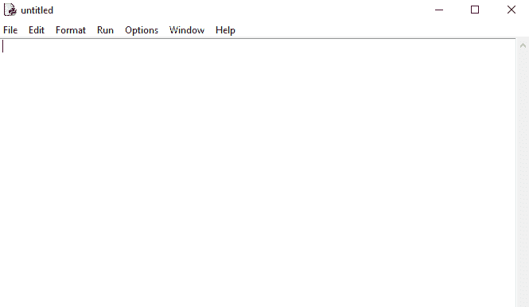
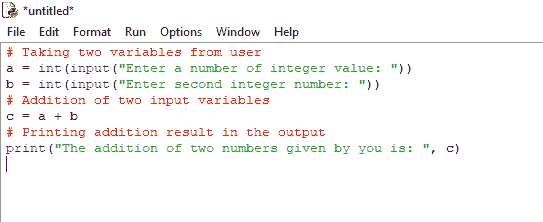
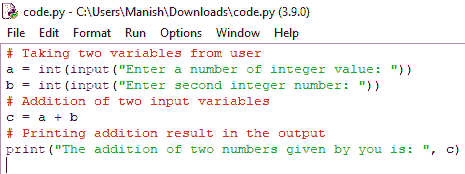
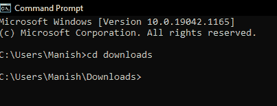
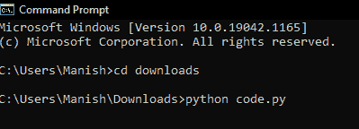
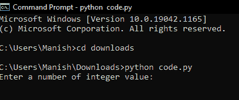
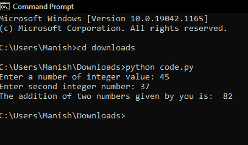
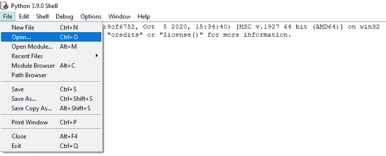
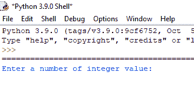
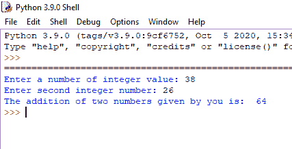

# Python 中的脚本模式是什么？

> 原文：<https://www.javatpoint.com/what-is-script-mode-in-python>

在 Python 编程语言的帮助下，我们可以更高效地集成系统，并非常快速地工作。Python 是一种高级的、广泛使用的通用编程语言，它的设计重点是提高代码的可读性。Python 的语法允许程序员用几行代码表达一个概念，而不是像其他编程语言那样写很多行代码。我们可以通过以下两种方式用 Python 编程语言运行代码:

1.  使用交互模式
2.  使用脚本模式

在本教程中，我们将学习 Python 中的脚本模式。我们将学习什么是脚本模式，如何使用脚本模式运行我们的 Python 程序，以及脚本模式的优势。让我们先从了解 Python 中的脚本模式开始。

## Python 中的脚本模式

写剧本或任何东西的系统在词源学上被称为剧本。我们首先在脚本模式下在一个文件(像脚本一样)里面编写一个 Python 程序，然后在我们的系统中保存文件后执行它。因此，Python 中的脚本模式是我们首先在脚本文件中编写 Python 程序，然后执行它。我们可以使用命令提示符或安装在系统中的 Python IDE 来执行代码脚本。

在脚本模式下，我们可以随时查看我们在文件中编写的代码，并且可以在下次执行之前对其进行修改。这就是为什么在脚本模式下编辑 Python 代码变得非常容易，我们可以根据需要编辑或查看代码多次。我们可以用脚本模式编写长代码，这就是为什么许多专业程序员更喜欢它而不是交互式执行模式。默认情况下，我们使用脚本模式创建的 Python 文件通常保存在安装 Python IDE 的文件夹中，并与 Python 文件一起保存(“。py”)扩展。

## 在脚本模式下运行 Python 程序

在我们了解了 Python 中的脚本执行模式之后，现在我们想到的问题是如何使用脚本模式运行 Python 程序。在本节中，我们将回答这个问题，并学习执行 Python 脚本的方法。但是在执行 Python 程序脚本之前，让我们首先创建一个并将其保存在我们的系统中。

### 创建和保存 Python 程序脚本文件:

为了在我们的设备中创建和保存 Python 程序脚本，我们必须按顺序执行以下步骤:

**第一步:**打开 Python 的文本编辑器或我们选择的任何其他文本编辑器(我们将在这里使用 Python 文件编辑器)。



**第二步:**在文本编辑器中编写以下 Python 程序:

```py

# Taking two variables from user
a = int(input("Enter a number of integer value: "))
b = int(input("Enter second integer number: "))
# Addition of two input variables
c = a + b
# Printing addition result in the output
print("The addition of two numbers given by you is: ", c)

```

正如我们写下的:



**第三步:**写完 Python 程序之后，我们要把文件保存在我们的 Python IDE 安装的文件夹里面，我们要用 Python 文件扩展名保存，也就是说。py '扩展名。我们已经在设备中为这个程序保存了一个名为“code.py”的文件。



一个包含 Python 程序的 Python 脚本被成功创建并保存在我们的设备中，现在我们可以继续执行该脚本了。

### 执行 Python 程序脚本

现在，为了获得程序的输出，我们必须执行 Python 程序脚本，我们有两种方法。我们将使用以下两种方法来执行 Python 程序脚本:

1.  使用命令提示终端执行
2.  使用 Python IDE 执行

让我们分别了解每种方法并执行脚本文件。

### 方法 1:使用命令提示终端执行 Python 脚本:

我们可以使用系统的命令提示终端来执行脚本文件(code.py)。文件的输出也将显示在终端 Shell 中。要执行 Python 脚本文件，我们必须遵循以下步骤:

**第一步:**打开命令提示终端，找到我们系统中安装 Python IDE 的目录(和我们保存 Python 脚本文件的地方一样)。要定位目录，我们可以使用带有“cd”的目录路径，正如我们所做的:


现在，写完目录路径后，按回车键在命令提示符下找到目录。



**第二步:**现在要写脚本文件名(带扩展名)，脚本文件名前要写 python，如下:



**第三步:**当我们按回车键时，Python 会在命令提示终端开始执行脚本文件。



当我们给出代码中所需的输入值时，我们甚至可以在命令提示符下看到程序的输出。



这就是我们如何在系统的命令提示符终端执行 Python 脚本文件。

### 方法 2:使用 Python IDE 执行 Python 脚本

除了通过命令提示终端执行 Python 脚本，我们还可以直接使用安装在我们系统中的 Python IDE 来执行脚本文件。要使用 Python IDE 执行 Python 脚本文件，我们必须遵循以下步骤:

**步骤 1:** 打开 Python IDE，使用给定的打开选项在 Python IDE 中打开脚本文件。



**第二步:**现在，打开文件后，我们会在顶部看到 run 选项:


或者，我们甚至可以使用“F5”按钮快捷方式在 Python IDE 中运行脚本文件。



我们可以看到我们的脚本文件(code.py)在 Python IDE 中开始执行，一旦我们给出了所需的输入值，我们就可以在 Python shell 中看到程序的输出，如下所示:



**输出:**

```py
Enter a number of integer value: 38
Enter second integer number: 26
The addition of two numbers given by you is:  64

```

这就是我们如何使用系统中安装的 Python IDE 运行或执行 Python 脚本文件的方法。

## 脚本模式的优势

最后，让我们看看使用 Python 程序的脚本执行模式相对于交互式执行模式的优势。以下是脚本执行模式的优势:

*   脚本执行模式非常适合我们编写长 Python 程序(代码行不止一行的程序)。
*   我们可以在脚本模式下轻松编辑 Python 程序。
*   我们可以在脚本模式下打开我们的 Python 程序任意多次。
*   在脚本模式下，我们甚至可以保存我们编写的代码，以便将来使用。
*   脚本模式是所有专家和 Python 程序员最喜欢的执行方式。

## 结论

在本教程中，我们已经了解了 Python 中的脚本模式执行。我们已经学习了使用脚本模式执行 Python 程序的方法。

最后，我们看到了 Python 中脚本模式执行的优势，通过看这些优势，我们可以很容易地说，为什么专家和程序员更喜欢脚本执行模式而不是交互执行模式。

* * *