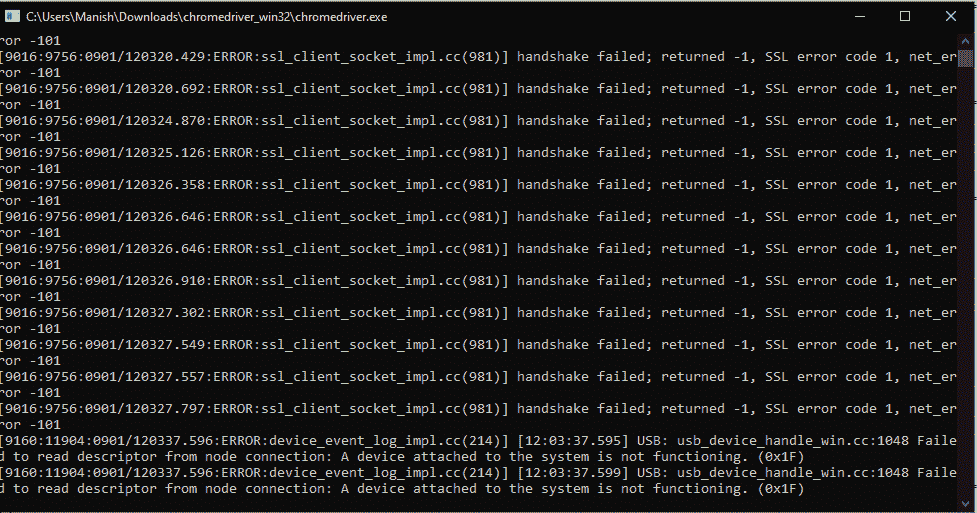

# 如何在 Python 中打开 URL

> 原文：<https://www.javatpoint.com/how-to-open-url-in-python>

Python 是一种非常强大和高级的编程语言，我们可以使用 Python 执行各种任务和功能。在 Python 的帮助下，我们可以轻松完成的任务之一是用 Python 程序打开一个 url。在本教程中，我们将讨论在 Python 中打开 url 的方法或途径。

## 用 Python 打开 url

我们可以使用 Python 程序使用 Python 脚本打开 url，为此，我们可以使用一组不同的库。我们有不同的方法，我们将使用不同的库和它们的函数来打开程序中给定的 url。

在本节中，我们将使用以下方法使用 Python 程序打开给定的 url:

1.  使用 Urllib 库函数
2.  使用网络浏览器库函数
3.  使用Selenium库功能

如上所述，在所有三个库中，前两个库通常预装了最新的 Python 版本。我们将讨论所有三种方法，并且我们将在每种方法中使用 Python 程序来更好地理解它们的实现。

### 方法 1:使用 urllib 库函数

Urllib 是一个内置的 Python 模块，我们可以使用它来处理 url，并使用 Python 程序打开 URL。在 urllib 模块中，定义了各种类和函数，帮助我们使用 Python 程序执行各种 url 操作。

我们将使用 urlopen()方法，在程序中导入 **urllib.request** 库，然后我们在这个函数内部给出 url，这样它就会在我们设备的浏览器中打开。为了更好地理解这种使用 urlopen()方法的实现，我们将在一个示例 Python 程序中使用它，并通过它打开一个链接。

**示例 1:** 看看下面的 Python 程序，我们在其中使用了 urlopen()函数:

```py

# Importing urllib request module in the program
import urllib.request
# Using urlopen() function with url in it
webUrl = urllib.request.urlopen('https://www.javatpoint.com/python-tutorial')

```

**输出:**


**说明:**我们通过在程序中给 urlopen()函数内部的 url 链接，在浏览器中打开了 Python 教程 in JavaTpoint’的 url。

### 方法二:使用网络浏览器库函数:

现在，我们将使用网络浏览器库，这是 Python 中的一个库，用于处理基于网络的内容。通过使用网络浏览器模块为用户创建一个环境，使用户能够在 Python 应用本身中显示各种基于网络的内容。

在我们开始使用网络浏览器库之前，我们应该确保它正确安装在我们运行 Python 的系统中。而且，如果系统中不存在 webbrowser 库，那么我们可以通过在设备的命令提示符下使用以下命令来安装相同的库。

```py

pip install webbrowser

```

现在，我们将开始使用网络浏览器库，并使用网络浏览器库打开 url 我们将在程序中使用它的 open()函数。为了更好地理解使用网络浏览器库在 Python 中打开 url 的这种方法的实现，我们将在一个示例 Python 程序中使用它，并通过它打开一个链接。

**示例 2:** 看看下面的 Python 程序:

```py

# Import webbrowser module in the program
import webbrowser
# Add a URL of JavaTpoint to open it in a browser
url= 'https://www.javatpoint.com/python-tutorial'
# Open the URL using open() function of module
webbrowser.open_new_tab(url)

```

**输出:**


**说明:**我们已经使用 webbrowser 模块的 open_new_tab()函数在我们系统的 chrome 浏览器中打开了 url，并在其中提供了 url 链接。

### 方法三:使用Selenium库函数:

Selenium库是 Python 提供的一个强大的工具，我们可以通过一个 Python 程序来使用它来控制我们系统的网址链接和网络浏览器。我们还可以使用 selenium 库函数在 Python 程序中打开 url 链接。Python 中Selenium库函数的绑定为我们访问 Chrome、Firefox、微软 Edge 等Selenium模块的网络驱动提供了一些非常方便的 API。

### 安装Selenium库

在开始使用Selenium库之前，我们应该确保Selenium库正确安装在运行 Python 的系统中。要安装 selenium 库，我们必须在命令提示符终端的 pip 安装程序中使用以下命令:

```py

pip install selenium

```


我们已经在系统中成功安装了Selenium库，如上图所示。目前支持 Selenium 库的 Python 版本有 Python 2.7、Python 3.5 以及所有更高版本。

### 网络驱动程序的安装:

要将 selenium 库函数用于 URL，我们还必须为相应的浏览器安装 selenium 提供的 web 驱动程序。

WebDriver 是由 selenium 提供的一个包，用于与我们系统中的 web 浏览器进行交互。网络驱动程序使用所有网络浏览器通用的有线协议与远程网络服务器或系统的网络浏览器交互。在这里，我们提供了下载一些著名浏览器的网页驱动程序的链接，并使用这些链接；您可以为系统中的 web 浏览器下载 web 驱动程序。

**Safari 的网络驱动程序:**

```py

https://webkit.org/blog/6900/webdriver-support-in-safari-10/

```

**火狐网络驱动:**

```py

https://github.com/mozilla/geckodriver/releases

```

**Chrome 的网页驱动程序:**

```py

https://sites.google.com/a/chromium.org/chromedriver/downloads

```

现在，我们将开始使用 selenium 库，并使用程序中的 selenium 库函数打开 url。为了更好地理解这种在 Python 中使用 selenium 库打开 url 的方法的实现，我们将在一个示例 Python 程序中使用它，并通过它打开一个链接。

**示例 3:** 看看下面的 Python 程序:

```py

# Import webdriver from selenium library
from selenium import webdriver
# Importing keys in the program from webdriver
from selenium.webdriver.common.keys import Keys
# Providing the path of chrome Web driver
driver = webdriver.Chrome('C:/Users/Manish/Downloads/chromedriver_win32/chromedriver.exe')
# Opening url by get() method
driver.get("https://www.javatpoint.com/python-tutorial") 

```

**输出:**




**说明:**从 selenium 库中导入 webdrivers 后，我们在程序中从 webdrivers 导入了密钥。我们使用上面给出的链接为我们下载的 chrome webdriver 提供了路径。然后，在驱动程序的 get()函数的帮助下，我们通过在 get()方法中给出一个链接，在浏览器中打开了 url。

通过使用我们在本教程中提到的三种方法中的任何一种，我们可以在 Python 程序的帮助下轻松地在系统的网络浏览器中打开 url。

* * *