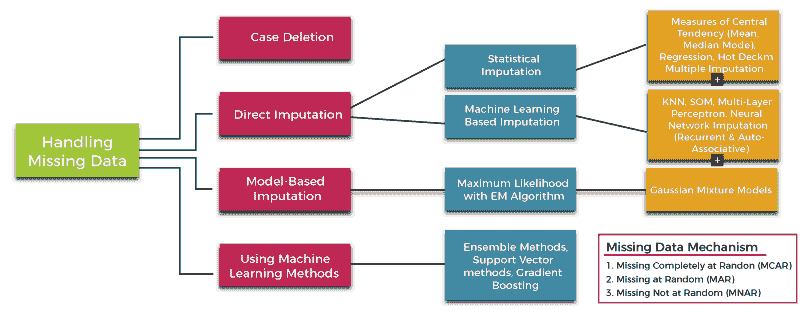

# 缺失数据难题：探索和插补技术

> 原文：<https://www.javatpoint.com/missing-data-conundrum-exploration-and-imputation-techniques>

缺失数据是统计分析和机器学习中最常见且不可协商的问题。它们影响数据质量。这可能是由于各种原因造成的，例如用户没有对推荐系统中的问题做出响应、患者在治疗中死亡或不遵守等等。

在本教程中，我们将讨论丢失数据的重要性，并确定丢失数据的原因。

### 缺失数据机制

在当前时代，数据被视为燃料意味着数据是最强大的东西。它可以用于许多方面。但是不完整的数据会导致一个问题。所以首先需要了解数据的重要性，更重要的是需要全面识别缺失数据发生的原因。数据收集过程对于识别数据收集错误也起着重要作用。

丢失数据的机制可以分为三大类。这些类别基于缺失数据和观测数据的性质。下面给出了这些机制。

**完全随机缺失(MCAR)**

缺失数据的性质与观测数据有关，但与缺失数据无关。例如，孩子们缺课是因为他们的父母要搬到另一个城市，因此，孩子们不得不离开书房。

**随机缺失(MAR)**

缺失数据的性质与观测数据有关，但与缺失数据无关。**例如-** 孩子们缺课是因为他们的父母搬到了不同的城市，因此，孩子们不得不离开书房。

**不随机缺失(MNAR)**

它也被称为不可忽略的，因为丢失机制不能被忽略。只有当既没有 MCAR 也没有马尔时，这种情况才会发生。变量上的缺失值与观察变量和未观察变量都相关。例如——由于有毒的空气，父母拒绝把他们的孩子送到学习中心，他们不想他们的孩子受到欺负。多边核方案数据的问题与可识别性问题有着内在联系。

了解数据收集过程和实质性科学知识有助于建立数据机制。统计测试还有助于理解缺失数据机制的类型。

可以有效处理缺失数据的模块有很多，但是**fanchimpte**模块还是挺有用的，也挺受欢迎的。

## fancyinpute 模块

缺失数据在创建预测模型中起着重要作用；算法在缺少数据集的情况下表现不佳。

Fancyimpute 是一个用于缺失数据填补算法的机器学习库。它使用机器学习算法来估算缺失值。Fancyimpute 使用整个列来估算缺少的值。它提供了两种方法来估算缺失的数据

*   KNN 还是 K 近邻
*   用链式方程进行多重插补

### k-最近邻

KNN 在所有特征中找出相似的数据点，并填写缺失值。让我们理解下面的例子。

**示例-**

```py

import pandas as pd
import numpy as np
# importing the KNN from fancyimpute library
from fancyimpute import KNN

df = pd.DataFrame([[np.nan, 1, np.nan, 0],
        [2, 7, np.nan, 1],
        [np.nan, np.nan, np.nan, 5],
        [np.nan, 8, np.nan, 4],
        [9,  7, 8,   2],
        [2,  5, 7,   9]],
        columns = list('ABCD'))

# printing the dataframe
print(df)

# calling the KNN class
knn_imputer = KNN()
# imputing the missing value with knn imputer
df = knn_imputer.fit_transform(df)

# printing dataframe
print(df)

```

**输出:**

```py
A    B    C  D
0  NaN  1.0  NaN  0
1  2.0  7.0  NaN  1
2  NaN  NaN  NaN  5
3  NaN  8.0  NaN  4
4  9.0  7.0  8.0  2
5  2.0  5.0  7.0  9
Imputing row 1/6 with 2 missing, elapsed time: 0.001
[[4.80735271 1\.         7.70802941 0\.        ]
 [2\.         7\.         7.57627146 1\.        ]
 [5.29411783 7.49760549 7.64000033 5\.        ]
 [6.2499999  8\.         7.87179494 4\.        ]
 [9\.         7\.         8\.         2\.        ]
 [2\.         5\.         7\.         9\.        ]]

```

## 链式方程多重插补

在这种方法中，小鼠使用多重插补而不是单一插补。它对样本数据进行多元回归并取平均值。让我们理解下面的例子。

**示例-**

```py

import pandas as pd
import numpy as np
# importing the MICE from fancyimpute library
from fancyimpute import IterativeImputer

df = pd.DataFrame([[np.nan, 15, 1, np.nan],
        [23, 40, np.nan, 1],
        [np.nan, np.nan, np.nan, 5],
        [np.nan, 3, np.nan, 4],
        [15,   70, 28,   29],
        [20,   35, 57,   91]],
        columns = list('ABCD'))

# printing the dataframe
print(df)

# calling the MICE class
mice_imputer = IterativeImputer()
# imputing the missing value with mice imputer
df = mice_imputer.fit_transform(df)

# printing dataframe
print(df)

```

**输出:**

```py
    A     B     C     D
0   NaN  15.0   1.0   NaN
1  23.0  40.0   NaN   1.0
2   NaN   NaN   NaN   5.0
3   NaN   3.0   NaN   4.0
4  15.0  70.0  28.0  29.0
5  20.0  35.0  57.0  91.0
[[ 32.13508529  15\.           1\.         -76.25883183]
 [ 23\.          40\.          23.80426163   1\.        ]
 [ 24.47759791  32.58430591  26.67745156   5\.        ]
 [ 31.14858991   3\.          32.06817994   4\.        ]
 [ 15\.          70\.          28\.          29\.        ]
 [ 20\.          35\.          57\.          91\.        ]]

```

## 处理丢失的数据

有许多方法可以用来处理文献、教科书和标准课程中缺失的数据。我们已经讨论了一个重要的方法，作为一个爱好者计算机。 然而，这些方法有一些缺点。在使用数据挖掘过程时，需要小心避免偏差或高估可变性；这些方法效果不好。



### 案例删除

有两种类型的案例删除方法。第一种方法是列表删除(也称为完全案例分析)，第二种方法是配对删除。案例删除方法用于在逐个分析的基础上从我们的数据集中删除缺失的案例。

让我们使用 pandas dataframe 创建一个包含一些缺失值的虚拟数据集。

**示例- 1**

```py

import pandas as pd  
import numpy as np  
import fancyimpute  
from sklearn.impute import SimpleImputer
data = {'Name': ['John','Paul', np.NaN, 'Wale', 'Mary', 'Carli', 'Steve'], 'Age': [21,23,np.nan,19,25,np.nan,15],'Sex': ['M',np.nan,np.nan,'M','F','F','M'],'Goals': [5,10,np.nan,19,5,0,7],'Assists': [7,4,np.nan,9,7,6,4],'Value': [55,84,np.nan,90,63,15,46]}  
df=pd.DataFrame(data, columns =['Name','Age','Sex','Goals', 'Assists', 'Value'])
print(df)

```

**输出:**

```py
    Name   Age  Sex  Goals  Assists  Value
0   John  21.0    M    5.0      7.0   55.0
1   Paul  23.0  NaN   10.0      4.0   84.0
2    NaN   NaN  NaN    NaN      NaN    NaN
3   Wale  19.0    M   19.0      9.0   90.0
4   Mary  25.0    F    5.0      7.0   63.0
5  Carli   NaN    F    0.0      6.0   15.0
6  Steve  15.0    M    7.0      4.0   46.0

```

在上面的代码中，我们创建了包含缺失值的新数据集。我们可以使用 df.dropna()方法移除缺失的值，该方法移除所有缺失的值。让我们看看下面的输出。

**示例- 2:**

```py

import pandas as pd  
import numpy as np  
import fancyimpute  
from sklearn.impute import SimpleImputer
data = {'Name': ['John','Paul', np.NaN, 'Wale', 'Mary', 'Carli', 'Steve'], 'Age': [21,23,np.nan,19,25,np.nan,15],'Sex': ['M',np.nan,np.nan,'M','F','F','M'],'Goals': [5,10,np.nan,19,5,0,7],'Assists': [7,4,np.nan,9,7,6,4],'Value': [55,84,np.nan,90,63,15,46]}  
df=pd.DataFrame(data, columns =['Name','Age','Sex','Goals', 'Assists', 'Value'])
print(df.dropna())

```

**输出:**

```py
   Name   Age Sex  Goals  Assists  Value
0   John  21.0   M    5.0      7.0   55.0
3   Wale  19.0   M   19.0      9.0   90.0
4   Mary  25.0   F    5.0      7.0   63.0
6  Steve  15.0   M    7.0      4.0   46.0

```

我们还可以使用 **df.dropna(how = 'all')** ，它只删除缺少值的行。我们还可以使用 **df.dropna(axis = 1，how = 'all ')指定删除缺少值的列。**下面我们来理解一下这个例子。

**示例- 2**

```py

import pandas as pd  
import numpy as np  
import fancyimpute  
from sklearn.impute import SimpleImputer
data = {'Name': ['John','Paul', np.NaN, 'Wale', 'Mary', 'Carli', 'Steve'], 'Age': [21,23,np.nan,19,25,np.nan,15],'Sex': ['M',np.nan,np.nan,'M','F','F','M'],'Goals': [5,10,np.nan,19,5,0,7],'Assists': [7,4,np.nan,9,7,6,4],'Value': [55,84,np.nan,90,63,15,46]}  
df=pd.DataFrame(data, columns =['Name','Age','Sex','Goals', 'Assists', 'Value'])
print(df.dropna(how = 'all'))

```

**输出:**

```py
    Name   Age  Sex  Goals  Assists  Value
0   John  21.0    M    5.0      7.0   55.0
1   Paul  23.0  NaN   10.0      4.0   84.0
3   Wale  19.0    M   19.0      9.0   90.0
4   Mary  25.0    F    5.0      7.0   63.0
5  Carli   NaN    F    0.0      6.0   15.0
6  Steve  15.0    M    7.0      4.0   46.0

```

**示例- 3**

```py

import pandas as pd  
import numpy as np  
import fancyimpute  
from sklearn.impute import SimpleImputer
data = {'Name': ['John','Paul', np.NaN, 'Wale', 'Mary', 'Carli', 'Steve'], 'Age': [21,23,np.nan,19,25,np.nan,15],'Sex': ['M',np.nan,np.nan,'M','F','F','M'],'Goals': [5,10,np.nan,19,5,0,7],'Assists': [7,4,np.nan,9,7,6,4],'Value': [55,84,np.nan,90,63,15,46]}  
df=pd.DataFrame(data, columns =['Name','Age','Sex','Goals', 'Assists', 'Value'])
print(df.dropna(axis=1, how='all'))

```

**输出:**

```py
    Name   Age  Sex  Goals  Assists  Value
0   John  21.0    M    5.0      7.0   55.0
1   Paul  23.0  NaN   10.0      4.0   84.0
2    NaN   NaN  NaN    NaN      NaN    NaN
3   Wale  19.0    M   19.0      9.0   90.0
4   Mary  25.0    F    5.0      7.0   63.0
5  Carli   NaN    F    0.0      6.0   15.0
6  Steve  15.0    M    7.0      4.0   46.0

```

## 结论

在本教程中，我们讨论了数据科学项目中缺失数据的重要性。它回顾了用于处理缺失数据的探索技术和重要的插补方法。我们还描述了处理缺失值的方法。广泛使用的模型假设所有缺失值的联合分布，并估计描述观测数据的模型参数。

* * *