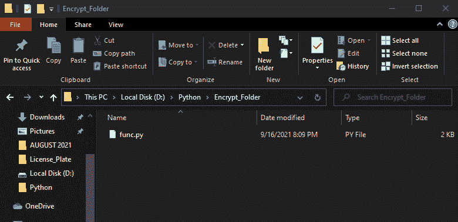
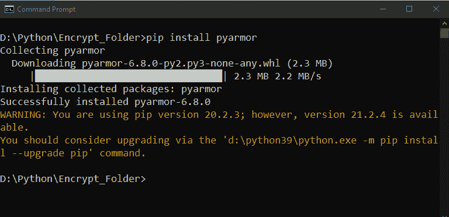
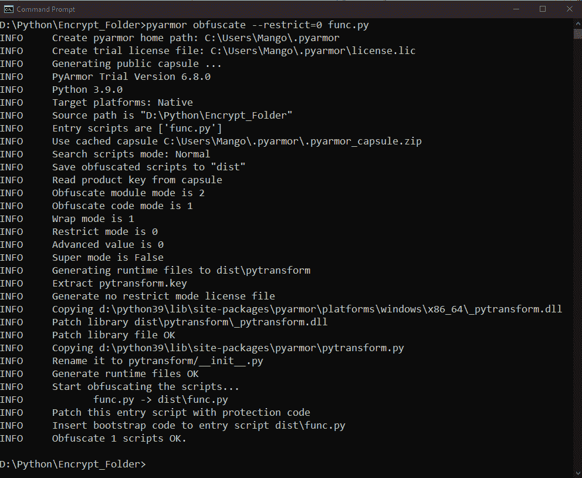
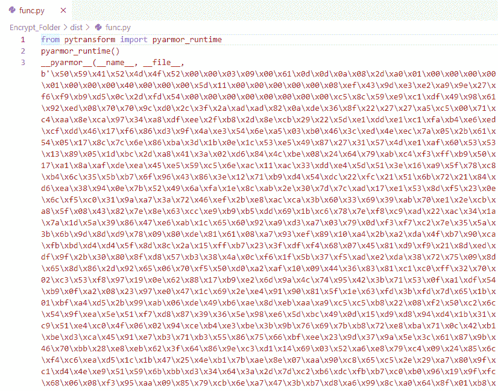
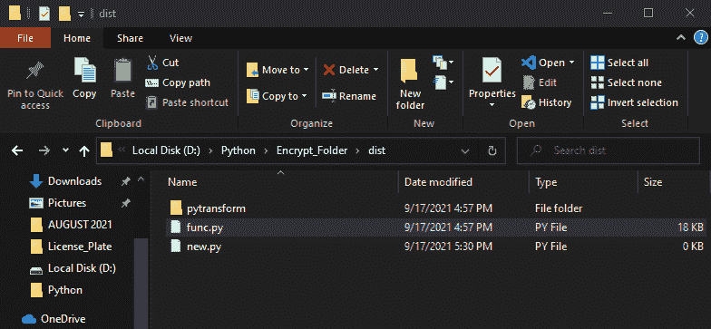

# 混淆 Python 程序

> 原文：<https://www.javatpoint.com/obfuscating-a-python-program>

在下面的教程中，我们将了解如何混淆 python 程序。我们将使用名为 **pyarmor** 的 Python 包进行混淆。

我们有时可能会遇到这样一种情况，出于某些原因，我们必须将代码直接交付给客户端。然而，通过执行这样的功能，我们将失去对代码的控制。在这种情况下，我们可能会对脚本进行加密以保护它，保留控制，并包括一些用于控制依赖关系的后备条件，就像我们交付的代码只在一定时间内使用一样。

在下面的教程中，我们将使用由上述功能组成的函数来解决上述问题。我们将使用 **pyarmor** python 库来混淆任何 python 代码。

那么，让我们开始吧。

## 创建基本功能

我们将从创建一个新的 Python 程序文件开始，以便在 Python 代码上实现混淆。在文件中，我们将定义一个推理函数，并在稍后对其进行加密。

让我们考虑推理函数的以下代码片段。

**档案:func.py**

```py

# importing the required modules
import os
import json
import sys
from datetime import datetime

# defining an inference function
def infer(person_name = "", tag = True):
    '''
    if the present year is 2021, then inference function will execute properly, else it fails.
    Here the attribute variable contains the string version of the date in MM-DD-YYYY format
    '''

    print("Hello " + person_name + ", the inference function has been initiated successfully")

    atr = str(datetime.now().strftime('%m-%d-%Y'))
    resp = "Your license has been expired, please contact us."
    expiration_year = int(2023)

    try:
        assert int(atr.split('-')[-1]) == expiration_year, resp
    except AssertionError as e:
        print(resp)
        sys.exit()

    # if the above assertion is True, it will reach until this point,
    # otherwise it will stop in the previous line.

    if tag:
        print("Inference function has been done properly!")
        return True
    else:
        return False

if __name__ == "__main__":
    _ = infer(person_name = "Peter Parker")

    '''
    Function outputs,
    Case 1: if expiration_year = int(2021)
    Hello Peter Parker, the inference function has been intiated successfully
    Inference function has been done properly!
    [Finished in 0.2s]

    Case 2: if expiration_year = int(2022)
    Hello Peter Parker, the inference function has been intiated successfully
    Inference function has been done properly!
    [Finished in 0.2s]

    Case 3: if expiration_year = int(2023)
    Hello Peter Parker, the inference function has been intiated successfully
    You license has been expired, please contact us.
    [Finished in 0.2s]
    '''

```

**输出:**

```py
Hello Peter Parker, the inference function has been initiated successfully
Your license has been expired, please contact us.

```

**说明:**

在上面的代码片段中，我们已经导入了一些必需的模块。然后我们定义一个推理函数为**explore()**，它接受两个参数- **person_name** 和 **tag = True** 。然后，我们为启动推理功能的用户打印了一份声明。后来，我们将存储当前日期的变量定义为 **atr** ，将字符串变量定义为 **resp** 。我们还将另一个变量**到期 _ 年**赋给了 **2023** 。然后，我们使用**尝试-异常**方法来处理任何引发的异常。最后，我们使用 **if-else** 条件语句根据情况打印一条语句。最后，我们将 **__name__** 分配给 **__main__** 来执行推理功能。

现在，让我们将这个 python 文件保存在一个文件夹中。



## 使用 pyarmor 加密文件

借助 **pyarmor** 对文件进行加密的过程分为两个步骤:

步骤 1:安装 pyarmor 包

我们可以使用如下所示的 pip 安装程序安装 **pyarmor** 包:

**语法:**

```py

$ pip install pyarmor

```



步骤 2:加密 python 文件

我们可以通过在命令提示符下键入以下命令来加密文件。

**语法:**

```py

$ pyarmor obfuscate --restrict=0  
```

现在，让我们在 func.py 文件上实现上面的命令。

**语法:**

```py

$ pyarmor obfuscate --restrict=0 func.py

```



现在，如果我们打开包含原始 **func.py** 文件的文件夹，我们将看到创建了一个名为 **dist** 的新子文件夹。

在 **dist** 文件夹中，我们将找到另一个名为 **pytransform** 的文件夹和一个加密的 **func.py** 文件。

现在，让我们看看这个文件里面的内容。

**文件:func.py(加密)**

```py

from pytransform import pyarmor_runtime
pyarmor_runtime()
__pyarmor__(__name__, __file__, b'\x50\x59\x41\x52\x4d\x4f\x52\x00\...', 2)

```



## 导入推理函数

完成后，直到这一部分，现在让我们尝试将这个加密的 func.py 导入一个名为 **new.py** 的新 python 文件中，该文件是我们在 **dist** 文件夹中创建的。

允许我们在运行时解密 func.py 的强制密钥使用 **pyarmor** 来处理。它存在于 **pytransform** 文件夹中；因此，造成代码不可读的其他人的眼睛。

然而，如果我们想对实际的 **func.py** 脚本做一些修改，我们必须从步骤 1 开始，继续执行相同的步骤。



让我们考虑下面的代码片段，我们必须在 new.py 文件中键入。

**文件:new.py**

```py

# importing the inference function definition inside the func.py file
from func import infer

_ = infer(person_name = "Tony Stark")

```

**输出:**

```py
Hello Tony Stark, the inference function has been initiated successfully
Your license has been expired, please contact us.

```

**说明:**

在上面的代码片段中，我们已经在新的 python 文件中导入了 **func.py** 的推理函数，该文件是我们作为 **new.py** 创建的。然后，我们使用与**功能**相同的配置来执行该功能。

* * *