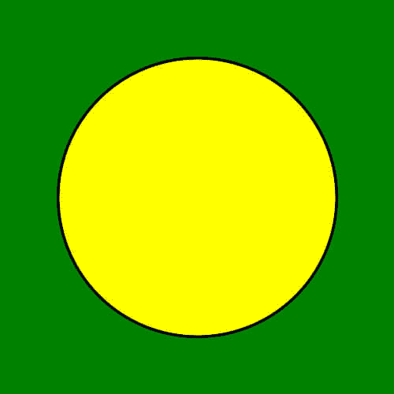

# Python ImageMagick 库

> 原文：<https://www.javatpoint.com/python-wand-library>

**ImageMagick** 是一个为从一种格式到另一种格式的图像转换而设计和开发的实用程序。该工具得到了一个大型社区的支持，因为它有多种多样的图像格式，并且执行起来既精确又简单。我们可以从 PDF 格式的文件中获取图像。

在接下来的教程中，我们将讨论由 **Imagemagick** 为 Python 开发的一个名为**魔杖**的绑定。我们将通过不同的例子来了解 Python 编程语言中**魔杖**库的特性和用途。

所以，让我们开始吧。

## 理解 Python 中的 ImageMagick 库

**魔杖**是一个为 Python 编程语言开发的 **ImageMagick** 库。该库支持 Python 版本 2.6、2.7、3.3+和 PyPy 中 **ImageMagick** 或 **Imagick** API 的功能。**棒**用于打开和操作图像。该库不仅支持图像处理，而且在 **NumPy** 库的帮助下，为机器学习代码提供了有价值的功能。**棒**提供了大量操作图像的功能。Python **棒**库的一些用途如下所示:

### Python 棒库的用途:

1.  **棒**库用于读取/写入各种格式的图像，也用于将图像从一种形式转换为另一种形式。
2.  它还支持图像缩放和裁剪。
3.  这个库为图像添加了简单的效果。
4.  该库还为图像添加了特殊效果。
5.  它也用于变换图像。
6.  它还支持其他颜色增强。

现在，让我们安装 Python **魔杖**库。

## 如何安装 ImageMagick 库？

我们可以使用以下命令在 pip 安装程序的帮助下安装**棒**模块:

**语法:**

```py

$ pip install wand

```

该模块将作为 Python 和 pip 版本安装在系统中。

正如我们已经讨论过的**魔杖**库是一个 **Imagick** API，因此，我们还必须包含 **Imagick** 依赖项。**映像包**依赖项的安装过程对于不同的操作系统是非常不同的。

### 对于 Ubuntu/Debian:

**语法:**

```py

$ sudo apt-get install libmagickwand-dev

```

### 对于苹果电脑(使用 Brew 安装程序):

**语法:**

```py

$ brew install imagemagick

```

### 安装 MacPort:

**语法:**

```py

$ sudo port install imagemagick

```

#### 注意:如果 Python 没有使用 MacPort 安装，我们必须导出 MAGICK_HOME，如下所示:

**语法:**

```py

$ export MAGICK_HOME=/opt/local

```

### 对于窗口:

我们可以自己创建**ImageMagick**；然而，为了编译它，它需要一个构建工具链，比如 Visual Studio。一个简单的方法是为该架构(win32 或 win64)下载一个预构建的二进制文件 **ImageMagick**

我们可以从以下链接下载:
[https://www.imagemagick.org/download/binaries/](https://www.imagemagick.org/download/binaries/)

### 验证安装

为了检查模块是否已经正确安装在系统中，我们可以尝试导入模块并执行程序。

安装完成后，创建一个新的 Python 文件，并在其中键入以下语法。

**示例:**

```py

# importing the required module
import wand

```

现在，保存该文件并在命令提示符下使用以下命令运行该文件。

**语法:**

```py

$ python .py 
```

如果程序运行时没有出现任何导入错误，则模块安装正确。否则，建议重新安装该模块，并参考其官方文档。

现在，让我们了解开始使用 ImageMagick 库。

## 使用 Python 棒读取图像

Python **魔杖**的**图像**库允许程序员使用其**图像**模块导入图像文件。然后我们可以使用不同的属性来读取图像，例如**高度、宽度**等等。

让我们同样考虑下面的例子。

**示例:**

```py

# Importing library from the wand
from wand.image import Image

# Importing the image
with Image(filename ='jtp_logo.png') as my_pic:

    # Reading the image to fetch original dimensions
    print('Height of the image:', my_pic.height)
    print('Width of the image:', my_pic.width)

```

**输入图像:**


**输出:**

```py
Height of the image: 33
Width of the image: 150

```

**说明:**

在上面的代码片段中，我们从**魔杖. image** 库中导入了 **Image** 模块。然后我们使用**图像()**功能从目录导入图像。然后，我们使用不同的属性来读取输入图像的尺寸。结果，程序将图像的尺寸(高度和宽度)返回给用户。

## 使用 Python 棒模糊图像

**棒**库允许程序员使用**模糊()**功能模糊图像，并将其保存为**保存()**功能。

让我们考虑下面的例子来理解同样的事情。

**示例:**

```py

# Importing library from the wand
from wand.image import Image

# Importing the image
with Image(filename ='jtp_logo.png') as my_pic:
    # Invoking blur function with radius 0 and sigma 3
    my_pic.blur(radius = 0, sigma = 3)

    # saving the processed iamge
    my_pic.save(filename ="blur_img.png")

```

**输入图像:**


**输出:**


**说明:**

在上面的代码片段中，我们从**魔杖. image** 库中导入了 **Image** 模块。然后我们从目录中导入所需的图像，并使用**模糊()**功能，将**半径**参数指定为 **0** ，将**西格玛**参数指定为 **3** 。最后，我们已经使用 **save()** 函数保存了文件，该函数为图像文件指定了新的文件名。

结果，提供的图像变得模糊，半径为 0 和σ3，并保存为指定的文件名。

## 使用 Python 棒转换图像

我们也可以使用**棒**库的几个功能来转换图像。让我们考虑下面的例子来理解同样的事情。

**示例:**

```py

# Importing library from the wand
from wand.image import Image

# Importing the image
with Image(filename ='jtp_logo.png') as my_pic:
    # Cloning the image in order to process
    with my_pic.clone() as my_flip:

        # Invoking flip function
        my_flip.flip()

        # Saving the image
        my_flip.save(filename = 'flip-jtp.jpg')

```

**输入图像:**


**输出:**


**说明:**

在上面的代码片段中，我们从**魔杖. image** 库中导入了 **Image** 模块。然后，我们再次从目录中导入图像文件，并使用**克隆()**功能制作图像。然后，我们对克隆的图像使用了 **flip()** 功能，并使用 **save()** 功能将结果图像保存在文件中。

因此，输入图像已成功转换。

## 用 Python 棒绘制不同的图形

Python **魔杖**库也为我们提供了不同的功能，让我们可以画出不同的图形。

让我们考虑下面的例子来理解同样的事情。

**示例:**

```py

# Importing libraries from the wand  
from wand.image import Image
from wand.drawing import Drawing
from wand.color import Color

with Drawing() as img_draw:
    # Setting Stroke color the circle to black
    img_draw.stroke_color = Color('black')

    # Setting Width of the circlw to 3
    img_draw.stroke_width = 3

    # Setting the fill color to 'Yellow'
    img_draw.fill_color = Color('yellow')

    # Invoking the Circle function with center 
    # at 250, 250 and radius 125
    img_draw.circle((250, 250), # Center point
                (125, 125)) # Perimeter point
    with Image(
        width = 420,
        height = 420,
        background = Color('green')
        ) as my_pic:
        img_draw(my_pic)
        my_pic.save(filename = 'img-circle.jpg')

```

**输出:**



**说明:**

在上面的代码片段中，我们已经从**棒**库中导入了所需的模块。然后我们使用**绘制()**功能来绘制一个圆。然后，我们使用不同的属性来指定尺寸、颜色和轮廓颜色。然后，我们使用**图像()**功能指定高度、宽度和背景颜色，并使用**保存()**功能为用户保存结果图像。

* * *