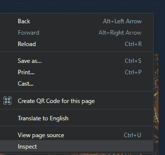
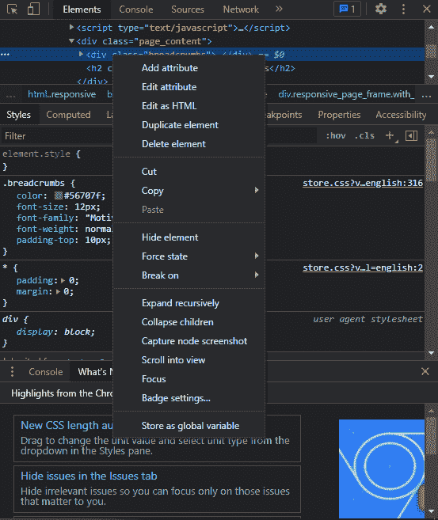
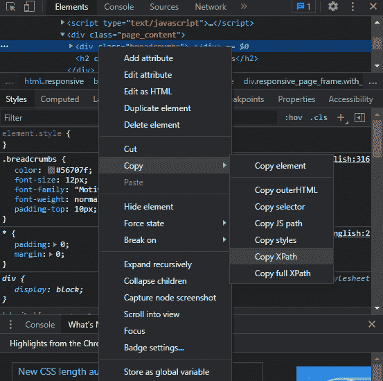

# Python `lxml`模块

> 原文：<https://www.javatpoint.com/python-lxml-module>

我们都一定听说过网络报废，以及如何使用网络报废从网站上报废信息。网页报废非常重要，因为它帮助我们从一个网页或网站获得所有有用的信息，我们可以从那个网页获得我们想要的任何信息。现在，我们中的许多人会想，为什么我们首先从网页上获取信息很重要，为什么我们不直接访问网页来查看信息？使用网片报废流程有两个主要目的，如下所示:

*   首先，当我们必须从网页上寻找一些特定的信息时，如果我们直接从网页上寻找，会花费很多时间。
*   第二，使用网页抓取过程可以非常容易地存储和收集来自任何网站的所有重要信息。

这是为什么刮网很重要和为什么我们必须使用刮网的两个重要原因。现在，当我们明白网页报废对于节省时间和获取所有有用信息有多重要时，我们都想学习如何使用网页报废。我们可以通过多种方法来实现和使用网页抓取过程，在 Python 中也有多种方法来实现网页抓取过程。

Python 为我们提供了多个模块，并且使用这些模块；我们可以使用 Python 程序来实现网络报废。其中一个 Python 模块是 `lxml`模块，它提供了多个函数库，通过这些函数库可以实现网络报废。在本教程中，我们将学习 Python `lxml`模块，并学习如何使用该模块实现网络废弃。

#### 注意:我们应该注意的是，在对任何网页或网页链接执行网页报废时，我们必须事先获得某些网站的许可；否则，将被视为非法。在实施网络废弃时，我们还应该记住一件事，即向一个网站发送多个网络废弃请求可能会导致该网站被阻止。

## Python 中的 `lxml`模块

Python 的 `lxml`模块是一个 xml 工具包，基本上是以下两个 C 库的 Python 绑定:libxlst 和 libxml2。`lxml`模块是 Python 非常独特和特殊的模块，因为它提供了 xml 特性和速度的组合。在 `lxml`模块中，我们被提供了多个函数，并在 Python 程序中使用这些函数；我们可以很容易地执行网页清理，并从任何网页上收集所有有用的信息。Python 的 `lxml`模块还允许我们轻松处理所有的 HTML 和 xml 文件，以及它在网页抓取过程中的应用。

**下面是在 Python 程序中使用 `lxml`模块可以执行的功能:**

*   我们可以用 l XML 模块解析所有的 XML 和 HTML 文档。
*   我们甚至可以使用 Python 程序中的 etree 功能创建一个 XML 或 HTML 文档。
*   我们甚至可以执行多个操作，并在用 `lxml`模块解析 HTML 或 XML 文档后，从其中搜索或检索特定信息。
*   我们还可以在 Python 程序中使用 `lxml`模块的功能来执行网页抓取。

在本教程中，我们将只学习 `lxml`模块在 web 废弃中的实现，以及如何使用该模块的功能来执行 web 废弃。

### Python 中的 `lxml`模块:安装

Python 的 `lxml`模块不是内置的 Python 库，这就是为什么如果我们必须使用这个模块来使用 Python 程序实现网页抓取，那么首先我们应该确保 `lxml`模块是否安装在我们的系统中。而且，如果 `lxml`模块没有安装在我们的系统中，那么首先我们必须安装这个模块，只有在这之后我们才能继续这个模块的 web 废弃实现。

我们有多种安装方法可用于安装 `lxml`模块，我们可以根据自己的选择使用这些方法中的任何一种，但是在本节中，我们将只使用 pip installer 方法来安装 `lxml`模块。在 pip 安装方法中，首先我们要打开我们设备的 cmd 提示终端，然后我们要在终端中写下下面的 pip 命令:

```py

pip install lxml

```

在终端中写入上面给出的命令后，我们必须按回车键来启动安装过程。一旦我们按下回车键，`lxml`模块的安装过程将开始，并且需要一段时间才能成功安装该模块。


我们可以看到，`lxml`模块已经成功安装在系统中，现在我们可以将这个模块导入到我们的 Python 程序中，借助其功能实现网页抓取过程。

#### 注意:在我们使用 `lxml`模块进行 web 废弃的实现部分之前，我们应该注意到，在使用 `lxml`模块执行 web 废弃时，我们还需要一个 Python 模块。如果我们想使用 `lxml`模块执行网页抓取，我们需要在系统中安装 Python `requests`模块和 `lxml`模块。这是因为 Python 的`requests`模块会向我们要执行网页抓取的网站或网页发出请求。Python 的 requests 模块也不是内置模块，因此，我们应该确保这个模块也存在于我们的系统中。如果我们的系统中没有安装`requests`模块，那么我们可以使用 pip 安装程序来安装这个模块。我们必须在 cmd 终端中使用以下命令:

```py

pip install requests

```

并且，写完命令后，我们必须按照流程等待一段时间，直到`requests`模块的安装过程完成。


我们可以看到 Python Requests Module 已经成功安装在我们的系统中，现在我们可以使用 `lxml`模块继续进行 web 废弃的实现部分。

### Python 中的 `lxml`模块:网络报废的实现

在我们继续本节中的实现部分之前，我们应该学习一些东西，只有在这之后，我们才能继续实现 web 废弃。

**通过 `lxml`模块实现网络报废的步骤:**

我们必须遵循一个逐步的程序来实现和使用网络废弃，并使用这个过程从网页中检索信息。以下是我们在使用 `lxml`模块实现 web 废弃时必须遵循的步骤:

*   **第一步:**首先我们要发送一个我们想要进行网页抓取的网页链接，然后我们从发送的网页链接中得到响应。
*   **第二步:**从发送的网页链接得到响应后，我们要把收到的响应对象转换成字节串。
*   **步骤 3:** 接下来，我们必须将 web 链接的转换后的字节串响应传递给‘from string’方法(一个存在于 `lxml`模块的 html 类中的方法)。
*   **第 4 步:**通过‘from string’方法传递响应字节字符串后，我们应该通过使用我们用于 web 报废的 web 链接的 xpath 来获得特定的元素。
*   **第五步:**在最后一步中，我们已经使用 xpath 从一个网页中检索到了内容，现在我们可以根据需要使用这些内容或信息，我们还可以保存起来以供进一步使用。

这些是我们从网页中检索特定内容必须遵循的步骤。按照上面给出的步骤，我们可以实现网络废弃和从任何网络链接中检索内容。

### 网络链接的 xpath:

在实现 web 报废的第 4 步和第 5 步中，我们可以找到“xpath”这个词，它对于成功实现 web 报废非常重要。现在，我们中的许多人会问什么是“xpath ”,以及我们如何获得 web 链接的 xpath。我们将在这一部分回答这两个问题。

**xpath:** xpath 使用非 xml 语法提供灵活的寻址方式，代表 XML 路径语言，通过 xpath，我们可以指向给定 XML 文档(或网页)的不同部分。xpath 用于 web 废弃，这样程序就可以寻址或唯一地识别网页中需要检索的部分。xpath 是 web 废弃中的一个重要元素，因为 xpath 是程序中唯一指定必须检索的 web 链接内容的元素。

现在，第二个问题，即我们如何获取给定链接的 xpath，这个问题的答案是，我们必须按照下面给出的步骤来获取 web 链接的 xpath:

**第一步:**首先我们要访问我们要进行网页抓取的 URL，然后我们要右键点击那里，会弹出一个选项列表的窗口。右键单击 URL 页面后将打开的窗口如下所示:



**第二步:**我们要从选项列表中选择**【检查】**选项，它会在同一个 URL 页面上打开第二个，在那里我们可以找到 URL 页面的编码及其所有元素。

**第三步:**现在，在这一步中我们必须再次右键单击，但是现在我们必须右键单击在选择 inspect 选项后打开的元素窗口。当我们右键单击 div 元素时，会打开另一个包含选项列表的弹出窗口。右键单击检查页面窗口元素后将打开的窗口如下所示:



**第四步:**这一步我们要去复制选项那里，我们会看到那里有很多复制选项。当我们从选项列表转到复制选项时，将出现以下选项列表:



我们必须选择**的‘完整 xpath’**选项，这样就会复制网址的完整 xpath，并且我们必须在断网期间在程序中使用这个 XPath。

我们应该遵循这些步骤，同时获取我们在网络清理中使用的网址的 xpath，我们应该注意 xpath 是网络清理过程中的一个重要元素。

### 网络报废的实施:

当我们在 Python 程序中使用 `lxml`模块来实现网页抓取时，我们必须在执行程序之前修复许多事情，如下所示:

*   网站或网页，我们的目标是网页报废，
*   我们想要检索的信息等。

在程序中决定并修复这些东西之后，我们可以执行程序并通过 `lxml`模块实现 web 废弃。

在这一节中，我们将使用一个定制的 URL，然后通过首先获取它的 xpath，在那个定制的 URL 上执行 web 废弃，即新版本。我们将从本教程中使用的自定义 URL 中获得以下两个重要元素:

1.  来自网址的价目表
2.  来自网址的标题列表

我们将在每种情况下使用一个 Python 程序，通过这些程序，我们将通过 `lxml`模块了解 web 报废过程的实现。

**实现 1:使用 `lxml`模块的网络报废获取价目表:**

这个实现方法将使用 lxml & requests 模块的函数从输出中的自定义 URL 获取价目表。在这个实现中，我们将使用下面的示例程序来获取新版本的价目表。

**例 1:**

```py

# Import requests module in the program
import requests
# Import html from lxml module
import lxml.html
# URL for the source weblink
URL = 'https://store.steampowered.com/explore/new/'
# Get the request for the URL
getHtml = requests.get(URL)
# Using the fromstring method to get html content
docContent = lxml.html.fromstring(getHtml.content)
# Getting complete xpath from the URL
xpathComplete = docContent.xpath('//div[@id="tab_newreleases_content"]')[0]
# Getting xpath for the prices from URL
xpathPrices = xpathComplete.xpath('.//div[@class="discount_final_price"]/text()')
# Print prices from URL in the output
print("The price list from the URL of new releases:")
print(xpathPrices)

```

**输出:**

```py
The price list from the URL of new releases:

```


正如我们所看到的，来自“新版本”网址的价格列表在输出中被成功打印，我们甚至可以保存该列表以供进一步使用。

**说明:**

我们从程序中的 `lxml`模块和 requests 模块导入了 html 库，使用它们的功能来实现 web 废弃。之后，我们初始化了一个网址变量，并在这个变量中提供了新版本的网址(我们将在这个网址上执行网页废弃)。

然后，我们使用带有 URL 变量的 requests 模块的 get()函数，通过发送请求从 URL 中获取数据。我们在 getHtml 变量中使用了 get()方法，然后在这个变量上使用了 fromstring()方法来获取程序中 URL 的内容。

我们在初始化的变量，即 docContent()中使用了 fromstring()，并将该变量进一步用于 xpath 变量。我们使用 `lxml`模块的 xpath()函数在初始化的“xpathComplete”变量中定义了 URL 的完整 xpath。之后，我们在“xpathPrices”变量中的 xpath()函数的帮助下再次定义了价格的 xpath。

最后，我们在输出中使用 print 语句中的‘XPath prices’变量打印了价格列表，程序将通过 web 废弃从网页中检索价格列表。

**实现 2:使用 `lxml`模块从 URL 获取标题列表:**

在这个实现方法中，我们将借助通过 lxml 和 requests 模块实现的 web 报废，从输出中的自定义 URL 获取价目表。在这个实现部分，我们将使用下面的示例程序来获取新版本的标题列表。

**例 2:**

```py

# Import requests module in the program
import requests
# Import html from lxml module
import lxml.html
# URL for the source weblink
URL = 'https://store.steampowered.com/explore/new/'
# Get the request for the URL
getHtml = requests.get(URL)
# Using the fromstring method to get html content
docContent = lxml.html.fromstring(getHtml.content)
# Getting complete xpath from the URL
xpathComplete = docContent.xpath('//div[@id="tab_newreleases_content"]')[0]
# Getting xpath for the title from URL
xpathTitles = xpathComplete.xpath('.//div[@class="tab_item_name"]/text()')
# Print titles from URL in the output
print("The title list from the URL of new releases:")
print(xpathTitles)

```

**输出:**

```py
The title list from the URL of new releases:

```


如我们所见，“新版本”网址的标题列表在输出中成功打印，我们甚至可以保存该列表以供进一步使用。

* * *