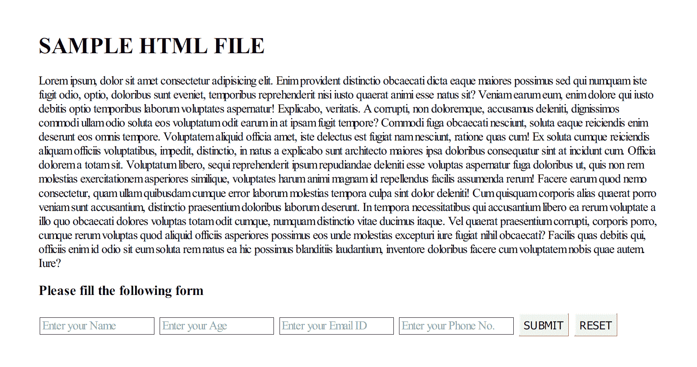
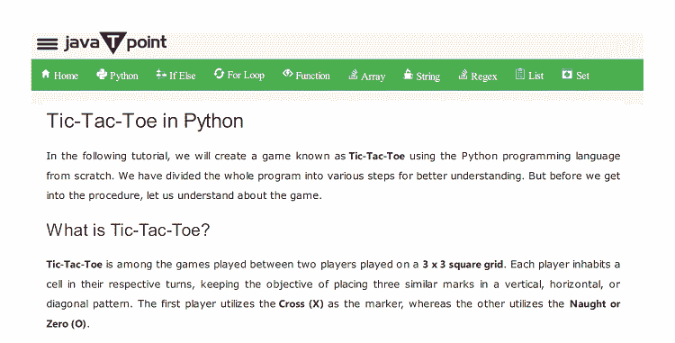
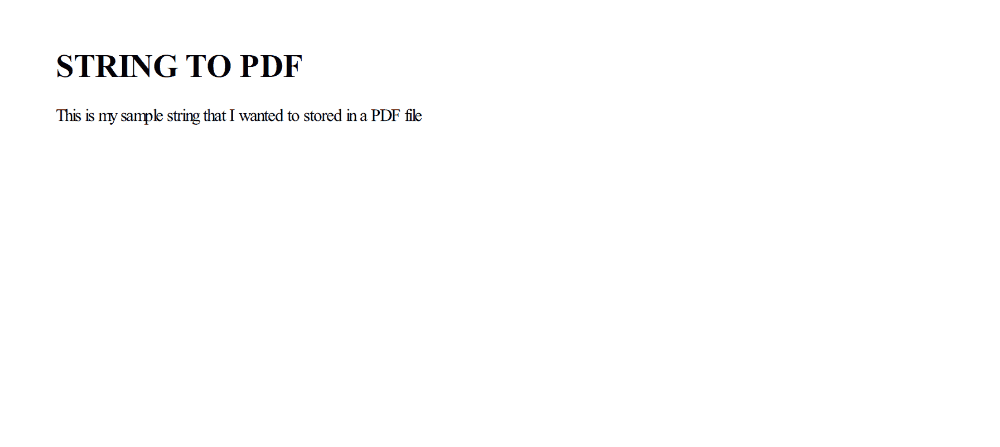

# 使用 Python 将 HTML 转换为 PDF 文件

> 原文：<https://www.javatpoint.com/converting-html-to-pdf-files-using-python>

我们大多数人可能知道，有许多网站不允许用户以 PDF 格式文件下载网站内容。相反，他们要么要求他们购买其服务的高级版本，要么不提供 PDF 文件形式的下载服务。

然而，像 Python 这样的编程语言提供了 **PDFKit** 模块来生成 PDF 文件。在下面的教程中，我们将了解如何借助 Python 编程语言中的 **PDFKit** 模块将 HTML 转换为 PDF 文件。

## 了解 Python PDFKit 模块

Python 提供了各种生成 PDF 文件的方法；然而， **PDFKit** 是一些最好的方法之一。 **pdfKit** 作为 **wkhtmltopdf** 工具的包装器，允许程序员在 **Webkit** 的帮助下将 HTML 文件转换为 PDF 格式。它将 HTML 渲染成具有不同图像格式、HTML 表单和其他复杂可打印文档的 PDF。

### 如何安装 Python PDFKit 模块？

为了安装 Python 模块，我们需要“ **pip** ”，这是一个管理从可信公共存储库中安装模块所需的包的框架。一旦我们有了“ **pip** ”，我们就可以使用来自 Windows 命令提示符(CMD)或终端的命令安装 **PDFKit** 模块，如下所示:

**语法:**

```py

$ pip install pdfkit

```

现在，我们要安装 **PDFKit** 模块的依赖项，即 **wkhtmltopdf** 工具。

**对于 Ubuntu/Debian:**

键入以下命令:

**命令:**

```py

$ sudo apt-get install wkhtmltopdf

```

**对于窗户:**

**第一步:**我们可以从以下链接下载 **wkhtmltopdf** 工具:

[https://wkhtmltopdf.org/downloads.html](https://wkhtmltopdf.org/downloads.html)

**步骤 2:** 将 PATH 变量设置为环境变量中的二进制文件夹。

### 验证安装

一旦模块安装完成，我们可以通过创建一个空的 Python 程序文件并编写一个 **import** 语句来验证它，如下所示:

**文件:验证. py**

```py

import pdfkit

```

现在，保存上述文件，并在终端中使用以下命令执行它:

**语法:**

```py

$ python test_file.py

```

如果上述 Python 程序文件没有返回任何错误，则模块安装正确。但是，在出现异常的情况下，请尝试重新安装该模块，并且还建议参考该模块的官方文档。

现在，让我们开始使用 Python 中的 **PDFKit** 。

## 使用 Python 中的 PDFKit

本节将通过不同的示例演示如何使用 Python 编程语言中的 **PDFKit** 模块将 HTML 转换为 PDF 格式的文件。

Python **PDFKit** 模块允许程序员使用 **from_file()** 函数将本地 HTML 文件转换为 PDF 格式。让我们考虑下面的例子来证明这一点:

**示例:**

```py

# importing the required module
import pdfkit

# configuring pdfkit to point to our installation of wkhtmltopdf
config = pdfkit.configuration(wkhtmltopdf = r"C:\\Program Files\\wkhtmltopdf\\bin\\wkhtmltopdf.exe")

# converting html file to pdf file
pdfkit.from_file('sample.html', 'output.pdf', configuration = config)

```

**输出:**



**说明:**

在上面的代码片段中，我们已经导入了所需的模块。然后，我们将变量定义为配置，使用**配置()**函数将地址存储到 **wkhtmltopdf** 工具的执行文件中。然后，我们使用了 **PDFKit** 模块的 **from_file()** 功能，将参数指定为 html 文件的地址、要存储的 PDF 文件的位置和配置。

因此，我们已经成功地将本地 HTML 文件转换为 PDF 文件。

借助 **from_url()** 功能，我们还可以使用 Python **PDFKit** 模块将网站网址转换为 PDF 文件。让我们考虑下面的例子来证明这一点:

**示例:**

```py

import pdfkit

# configuring pdfkit to point to our installation of wkhtmltopdf
config = pdfkit.configuration(wkhtmltopdf = r"C:\\Program Files\\wkhtmltopdf\\bin\\wkhtmltopdf.exe")

# converting url to pdf file
pdfkit.from_url('https://www.javatpoint.com/tic-tac-toe-in-python', 'output2.pdf', configuration = config)

```

**输出:**



**说明:**

在上面的代码片段中，我们已经导入了所需的模块。然后，我们将变量定义为配置，使用**配置()**函数将地址存储到 **wkhtmltopdf** 工具的执行文件中。然后，我们使用了 **PDFKit** 模块的 **from_url()** 功能，将参数指定为 url、要存储的 PDF 文件的位置和配置。

因此，我们已经成功地将网址转换为 PDF 文件。

此外， **PDFKit** 模块允许程序员使用 **from_url()** 功能将字符串存储到 PDF 文件中。让我们考虑下面的例子来说明这一点:

**示例:**

```py

# importing the required module
import pdfkit

# configuring pdfkit to point to our installation of wkhtmltopdf
config = pdfkit.configuration(wkhtmltopdf = r"C:\\Program Files\\wkhtmltopdf\\bin\\wkhtmltopdf.exe")

my_string = """
    <html>
    <head>
    <body>
        <div class = "container">
            <h1>STRING TO PDF</h1>
            <p>This is my sample string that I wanted to stored in a PDF file</p>
        </div>
    </body>
    </head>
    </html>
"""

# storing string to pdf file
pdfkit.from_string(my_string, 'output3.pdf', configuration = config)

```

**输出:**



**说明:**

在上面的代码片段中，我们已经导入了所需的模块。然后，我们将变量定义为配置，使用**配置()**函数将地址存储到 **wkhtmltopdf** 工具的执行文件中。然后，我们使用了 **PDFKit** 模块的 **from_string()** 功能，将参数指定为字符串变量、要存储的 PDF 文件的位置和配置。

结果，我们成功地将字符串存储到了一个 PDF 文件中。

* * *