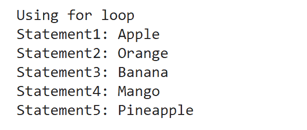
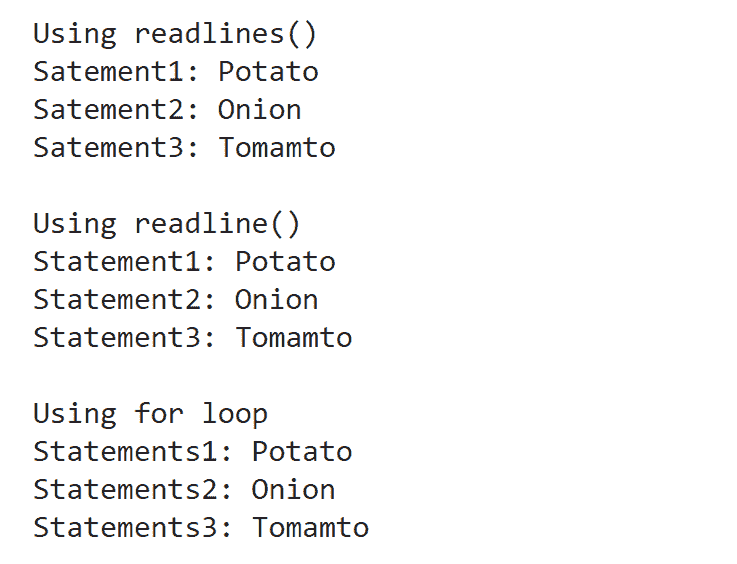

# Python 中的读取行

> 原文：<https://www.javatpoint.com/readlines-in-python>

*   Readlines()是 Python 中使用的一个函数，用于一次性逐行读取特定的文件。
*   在使用蛮力方法读取文件以及使用循环和不同的迭代时，这对于降低**时间复杂度**非常有用。
*   它是一个**一行代码**和简单的函数，比仅仅读取一个文件使用很多循环要好得多。
*   在 C 编程中，读取文件是一项相当艰巨的任务，但是由于 Python 中的 readlines()函数，它非常容易实现。
*   readlines()函数只从给定文件中读取一个完整的行；读取后，它以列表的形式返回包含所有元素的整行。
*   如果我们想以正常读取模式打开文件，readline()函数将返回字符串。
*   如果我们想以二进制模式打开文件，那么 readline()函数将返回一个二进制对象。
*   在行尾追加一个换行符(" \n ")也是非常有益的。
*   这个 readlines()函数最适合小文件，包含的数据较少，可以在更短的时间内轻松读取整个文件。
*   它首先一次性将文件内容读入内存，然后将它们分成不同的行。借助 `strip()`函数，我们可以遍历由 readline()函数生成的整个列表，通过使用 `strip()`函数，我们可以剥离换行符' \n '字符。

## Python 文件概念

Python 编程语言有各种内置的功能用于**写、创建、**和**读文件。**Python 中处理两类文件，一类是普通文本文件，第二类是以二进制语言为主写的二进制文件，即 0 和 1。

1.  **文本文件:**这些文件包含文本形式的数据，以一个名为 EOL(行尾)的特殊字符结束，默认情况下是 Python 中的新行字符(' \n ')。
2.  **二进制文件:**这些类型的文件包含二进制序列形式的数据，主要由 0 和 1 组成。

要在文件中执行的某些基本步骤:

**打开文件:**打开文件是使用 open()函数完成的；使用此函数时，我们必须将文件名和访问模式作为参数传递。

这里的文件访问模式如下:

1.  **只读(r ):** 用于从文件中读取数据。它正在定位文件的开头。如果提到的文件不存在，它将产生输入/输出错误。只读是打开文件的默认模式；使用此模式时，我们无法编辑文件的数据，也无法将其写入文件。
2.  **只写(' w ' ):** 用于将数据写入文件，定位文件开头。如果提到的文件不存在，那么它将产生输入/输出错误。使用此模式时，我们无法从文件中读取数据。
3.  **读写(' r+ ' ):** 此模式用于从文件中写入和读取数据。如果我们将其与之前的模式进行比较，我们可以区分出我们不能在只读模式下写入文件，但是我们可以在该模式下读写文件。

例如，如果我们有一个名为 hello.txt 的文件，并且我们想以写模式打开它，那么我们可以将它用作:

**文件 1 =打开(“hello.txt”，“w”)**

**关闭文件:**关闭功能用于释放文件所需的内存空间；当不再需要该文件时，或者当我们想要关闭整个文件并且想要以不同的模式打开该文件时，使用该方法。它是通过使用 close()函数来执行的，在这个函数内部，我们不需要传递任何参数；这个函数可以使用文件名访问，并由点关闭函数提供。

例如，如果我们有一个名为 hello.txt 的文件，并且我们想以写模式打开它，那么我们可以将它用作:

**File1 = open ( " hello.txt " , " w " )**
**File1.close ( )**

**写入文件:**顾名思义，我们可以很容易地预测在这个方法中，我们需要在文件中写入什么。有两种方法可以写入文件:

1.  **Write ( ):** 在这个函数中，我们必须传递一个单独的参数，也就是我们想要插入到文件中的字符串。
    例如，如果我们有一个名为 hello.txt 的文件，并且我们想以写模式打开它，那么我们可以将其用作:
    **file 1 = open(“hello . txt”，“w”)**
    **file 1 . write(str)**
    这里，str 是我们想插入到文件中的字符串。
2.  **writeline():**在这个函数中，我们必须传递一个数组或者一个由多个字符串组成的列表。它用于一次向文件中插入多个不同的字符串。
    例如，如果我们有一个名为 hello.txt 的文件，并且我们想以写模式打开它，那么我们可以将它用作:
    **file 1 = open(“hello . txt”，“w”)**
    **file 1 . write lines(S)表示 S = [ str1，str2，str3 ]**

**从文件中读取:**同样，在这个中，我们可以预测我们在这个中要做什么；即使在本教程中，我们也将详细阅读其中一种阅读方法。在这种方法中，我们需要从特定的文件中读取数据。从文件中读取数据有三种方法:

1.  **Read ( ):** 以字符串的形式返回读取的字节。读取 n 个字节；如果未指定 n，则读取整个文件。
2.  **Readline ( ):** 读取文件的一行，并以字符串的形式返回。对于指定的 n，读取最多 n 个字节。readline()函数不会一次读取多行；即使 n 超过，它也只读取一行。Readline()函数读取文件的一行并以字符串形式返回。它采用整数值 n 作为参数来读取一次读取的字符数。Readline()方法在从非常大的文件中读取数据时非常有效，因为它逐行读取数据，并在屏幕上返回和打印。Readline()返回文件的下一行，最后包含一个换行符。此外，如果到达文件的末尾，它将返回一个空字符串。
3.  **readline():**读取所有行，并将其作为列表中的字符串元素返回。Readlines()用于一次性读取所有行，然后将它们作为列表中的字符串元素返回。这个函数可以用于小文件，因为它将整个文件内容读入内存，然后将其拆分成单独的行。使用 `strip()`函数，我们可以遍历列表，并使用 `strip()`函数删除换行符' \n '。

现在让我们借助一个例子来详细理解读取文件的概念:

## 用 Python 读取文件的示例:

**例 1:**

***使用 readlines()功能读取文件***

```py

# Python program to implement the file concept using readlines ( ) for reading a file
Fruits = ["Apple\n", "Orange\n", "Banana\n"]
# writing to file
file = open('hello.txt', 'w')
file.writelines(Fruits)                              # writelines is used to write the data into the file in                                                # the form of a list, by inserting multiple values at the same time, 
                                                       # here, we are taking the hello.txt file 
file.close()                                           # This instruction is used to close the file, i.e., hello.txt
# Using readlines()
file = open('hello.txt', 'r')
Statements = file.readlines()
count = 0
# Strips the newline character
for line in Statements:                                     # Using for loop to print the data of the file
  count = count + 1
  print("Statement{}: {}".format(count, line.strip()))

```

***上例的输出:***


**例 2:**

***使用 readline()功能读取文件***

```py

# Python program to implement the file concept using readline() for reading a file
Fruit = [ "Apple\n" , "Graphs\n" , "Mango\n" , "Orange\n" , "Kiwi\n" ]
# Writing to a file
file1 = open('new.txt', 'w')
file1.writelines((Fruit))                          # writelines is used to write the data into the file in                                                # the form of list, by inserting multiple values at a same time, 
                                                       # here we are taking new.txt file 

file1.close()                                       # This instruction is used to close the file, i.e., hello.txt

# Using readline()
file1 = open('new.txt', 'r')
count = 0
while True:
  count = count + 1
  # Get next line from file
  s = file1.readline()

  # if line is empty
  # end of file is reached
  if not s:
    break
  print("Statement{}: {}".format(count, s.strip()))
file1.close()

```

***上例的输出:***


**例 3:**

***使用简单 `for`循环读取文件:***

在这个方法中，我们没有使用 readline()函数，甚至没有使用 readline()函数，因为我们已经在上面的例子中看到了这两个函数的使用；在这个方法中，我们将使用 `for`循环来打印文件的数据。我们将迭代文件的对象，并逐行读取文件，尽管我们使用的是一些 python 预定义的内置函数。使用这些内置的 Python 函数，我们可以很容易地使用 `for`循环隐式迭代文件对象，并结合使用 iterable 对象。

```py

## Python program to implement the file concept using the simple for loop for reading a file
Fruits = ["Apple \n", " Orange \n", "Banana \n", "Mango\n", "Pineapple\n" ]
# Writing to file
file2 = open('file2.txt', 'w')
file2.writelines(Fruits)           # writelines is used to write the data into the file in                                                
                                                 # the form of list, by inserting multiple values at a same time,
                                                       # here we are taking file2.txt file                                                
file2.close()                                        # This instruction is used to close the file, i.e., hello.txt

# Opening file
file2 = open('file2.txt', 'r')
count = 0
# Using for loop
print("Using for loop")
for line in file2:
count = count + 1
print("Statement{}: {}".format(count, line.strip()))
# Closing files
file2.close()

```

***上例的输出:***



**例 4:**

***使用‘with’语句读取文件:***

如果我们注意到上面 3 个例子，我们可以很容易地观察到，每当文件需要打开时，那么它就需要关闭；如果我们不关闭文件，那么它将在程序中产生几个错误，因为许多更改在文件中没有完成，或者直到我们不关闭文件才生效。

因此，为了克服这个问题，我们将使用“with”语句，它主要用于 Python 中的异常处理，以使代码更加清晰和易读。在这里，在这个例子中，你可以很容易地观察到，我们没有使用 file.close()函数，一次又一次地，为了防止文件，使用它可以用语句自动完成。因此，它减少了代码行，使程序运行更快，实现更高效。

```py

# Python program to implement the file concept using with statement for reading a file
Veges = ["Potato\n", "Onion\n", "Tomamto\n"]                             
# Writing to file
with open("file3.txt", "w") as file:     
  file.writelines(Veges)             # writelines is used to write the data into the file in                                                
                                                # the form of list, by inserting multiple values at a same time, 
                                                       # here we are taking file3.txt file 
# using readlines()
count = 0
print("Using readlines()")
with open("file3.txt") as file:
  Statements = file.readlines()
  for line in Statements:
    count = count + 1
    print("Satement{}: {}".format(count, line.strip()))
# Using readline()
count = 0
print("\nUsing readline()")
with open("file3.txt") as file:
  while True:
    count = count + 1
    line = file.readline()
    if not line:
      break
    print("Statement{}: {}".format(count, line.strip()))
# Using for loop
count = 0
print("\n Using for loop")
with open("file3.txt") as file:
  for line in file:
    count = count + 1
    print("Statements{}: {}".format(count, line.strip()))

```

***上例的输出:***



* * *