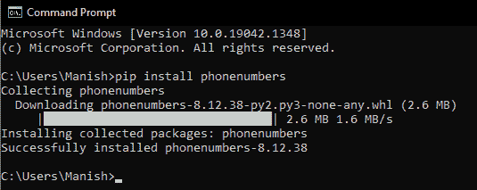

# Python PhoneNumbers 模块

> 原文：<https://www.javatpoint.com/python-phonenumbers-module>

每当我们看到陌生的电话号码或一个随机号码打来的电话，一些基本的问题就会浮现在我们的脑海中，包括谁在打电话，打电话的人在哪里，电话号码的地区，电话号码是否有效，以及许多其他问题。如果我们必须手动找出所有这些问题的答案，这将需要一些时间，因为我们不能同时执行所有操作。比如，为了知道电话号码的地区，我们必须了解每个国家的国家代码，这实际上是不可能的(除了一些例外)。同样，如果我们必须手动检查给定的电话号码是否有效，那么我们必须拨打该号码，如果我们有数百或数千个这样的号码怎么办。因此，手动执行这样的操作非常繁忙和耗时，这就是为什么我们必须寻找替代解决方案。许多编程语言为我们提供扩展或包，以便在给定的电话号码上执行这些操作。

Python 是最流行的编程语言之一，它为我们提供了 phonenumbers Module，这对我们使用程序执行所有此类操作非常有帮助。因此，我们将在本教程中学习 Python 的 phonenumbers 模块，并通过在示例程序中使用该模块来执行几个这样的操作。

## Python 的PhoneNumbers 模块介绍

Phonenumbers 是一个 Python 模块，具有解析电话号码等多种功能。Python 的 Phonenumbers 模块具有多种功能，能够对给定的电话号码执行各种操作，例如查找电话号码的区域、电话号码的运营商等。我们可以通过将 phonenumbers 模块导入到程序中来使用 Python 程序中 phone numbers 模块的功能，然后我们可以使用这些功能对给定的电话号码执行所需的操作。Phonenumbers 模块在许多方面对我们非常有帮助，包括以下几个好处:

*   这个模块节省了我们大量的精力
*   本模块节省了我们对电话号码进行操作的时间
*   我们可以使用 phonenumbers 模块对给定的电话号码同时执行多个操作
*   我们甚至可以使用这个模块同时对多个电话号码执行操作

以下是在 Python 程序中使用 phonenumbers 模块的几个突出优点。在本教程中，我们将通过示例程序对给定的电话号码执行一些这样的操作，这就是我们如何理解 phonenumbers 模块的实现。我们还将在本节中执行 phonenumbers 模块的安装过程。

### Python 的PhoneNumbers 模块:安装

Phonenumbers 不是 Python 的内置包(它不会随 Python 安装一起安装)，这就是为什么如果我们的系统中还没有这个模块，我们就必须安装这个模块。我们应该首先确定 phonenumbers 模块是否已经安装在系统中，因为如果系统中没有这个模块，我们将无法执行实现。如果我们的系统中没有安装 phonenumbers 模块，我们有多种方法来安装该模块，在所有可能的安装方法中，使用 pip 安装程序安装 phonenumbers 模块是最简单的方法。这就是为什么我们将在本教程中使用 pip installer 在我们的系统中安装 phonenumbers 模块，在此方法中，我们将使用以下 pip installer 命令:

```py

pip install phonenumbers

```

我们必须在命令提示符终端 Shell 中写入上面给出的命令，并且在写入命令后，我们必须按回车键，以便 pip 安装程序将开始在我们的系统中安装该模块。一旦这个模块的安装过程开始，将需要一段时间才能在我们的系统中成功安装该模块，我们必须等到那时。



正如我们所看到的，一个成功安装的消息显示在我们的屏幕上，这意味着 phonenumbers 模块现在已经成功安装在我们的系统中。现在，我们可以通过将 phonenumbers 模块导入示例 Python 程序并理解其实现来开始使用它。

### Python 的PhoneNumbers 模块:实现

正如我们已经讨论过的，我们可以使用 Python 程序中 phonenumbers 模块的函数来执行几个操作。我们将在这一部分中使用 phonenumbers 模块的功能执行几个这样的操作，以了解该模块的实现。我们将使用 phonenumbers 模块的功能执行以下操作，以了解其实现:

*   知道电话号码的区域
*   知道电话号码的时区
*   知道电话号码的携带者
*   将字符串变量转换为电话号码格式
*   匹配和提取电话号码
*   验证电话号码

我们将通过在一个示例程序中使用 phonenumbers 模块的函数来执行上面给出的所有操作，以了解其实现和工作原理。

### 应用 1:知道电话号码的地区

我们可以知道给定电话号码的区域，即我们可以找出给定电话号码属于哪个国家或哪个地区。phonenumbers 模块的 Geocoder 库为我们提供了 description_for_number()函数，我们可以用它来找出给定电话号码的区域。我们可以通过在函数中给出电话号码作为参数来使用它，然后我们可以在输出中打印电话号码的区域作为结果。我们可以通过下面的示例程序来理解 phonenumbers 模块的 description_for_number()函数的实现。

**示例 1:** 看看下面的程序，我们已经在输出中打印了给定电话号码的区域:

```py

# Importing phonenumbers module
import phonenumbers as pn
# Importing geocoder library from the phonenumbers module
from phonenumbers import geocoder as gc
# Parsing a given phone number
givenPN = pn.parse("+919034xxxxxx")
# Using parse phone number for finding region
regionOfPN = gc.description_for_number(givenPN, 'en')
# Printing region as the result
print("The region of the given phone number is: ", regionOfPN)

```

**输出:**

```py
The region of the given phone number is:  India

```

正如我们所看到的，给定电话号码的区域被打印在输出中，这就是我们如何找到并打印任何给定电话号码的区域。出于安全和个人原因，我们隐藏了示例中使用的电话号码的最后六位数字。

**说明:**

在将 phonenumbers 模块导入为 pt 后，我们已经将 phonenumbers 模块的地理编码库导入为 gc。之后，我们解析了给定的电话号码，并将结果存储在初始化的变量(givenPN)中，以将其用作 description_for_number()函数中的参数。然后，我们使用 description_for_number()中解析的数字变量作为参数，并将结果存储在第二个初始化的变量中。在 description_for_number()函数中，我们还使用了“en”语言来指定打印和存储结果的英语。最后，我们通过在 print 语句中使用 regionOfPN 变量在输出中打印结果。

### 应用 2:查找给定电话号码的操作员:

我们甚至可以使用 phonenumbers 模块找出给定的电话号码属于哪个 SIM 卡运营商。phonenumbers 模块的运营商库为我们提供了使用 name_for_number()函数查找电话号码运营商的选项。在运营商库的 name_for_number()函数中，我们必须使用解析电话号码作为参数，然后我们可以在输出中打印给定电话号码的运营商。我们可以通过下面的示例程序来理解 phonenumbers 模块的 name_for_number()函数的实现。

**示例 2:** 看看下面的 Python 程序，我们在其中打印了给定电话号码的 sim 卡运营商:

```py

# Importing phonenumbers module
import phonenumbers as pn
# Importing carrier library from the phonenumbers module
from phonenumbers import carrier as cr
# Parsing a given phone number
givenPN = pn.parse("+919034xxxxxx")
# Using parse phone number for finding the carrier
carrierOfPN = cr.name_for_number(givenPN, 'en')
# Printing carrier as the result
print("The SIM Card operator or carrier of the given phone number is: ", carrierOfPN)

```

**输出:**

```py
The SIM Card operator or carrier of the given phone number is:  Tata Docomo

```

如我们所见，输出中打印了给定电话号码的载体，这就是我们如何找到并打印任何给定电话号码的 SIM 卡运营商。

**说明:**

我们已经在 name_for_number()函数中使用了解析后的电话号码变量来找出载体，最后，我们在 print 语句中使用结果变量，即 carrierOfPN 变量，在输出中打印了程序的结果。

### 应用 3:解析给定的电话号码:

解析给定的电话号码意味着根据PhoneNumbers 模块格式设置给定的电话号码。我们可以通过在 phonenumbers 模块的 parse()函数中提供一个电话号码作为参数来完成这个操作。该函数将通过在输出中以 phonenumbers 格式提供给定的电话号码来产生结果。我们可以通过下面的示例程序来理解 parse()函数的用法，在该程序中，我们解析给定的电话号码。

**示例 3:** 看看下面的程序，其中我们使用了 parse()函数来解析电话号码:

```py

# Importing phonenumbers module
import phonenumbers as pn
# Parsing a given phone number
givenPN = pn.parse("+919034xxxxxx")
# Printing the parsed phone number
print("The given phone number after parsed will look like as the following format: ")
print(givenPN)

```

**输出:**

```py
The given phone number after parsed will look like as the following format: 
Country Code: 91 National Number: 9034xxxxxx

```

正如我们所看到的，我们已经解析了程序中给定的电话号码，我们可以使用这个解析函数来解析参数中给定的任何电话号码。

#### 注意:我们必须记住，在 parse()函数中作为参数的给定电话号码应该带有它的国家代码。

### 应用 4:获取给定电话号码所在地区的时区:

我们甚至可以简单地从给定的电话号码中得到给定电话号码所属地区的时区。我们可以使用 phonenumbers 模块来执行这个任务，因为 phonenumber 模块为我们提供了时区库，用于找出给定电话号码所在区域的时区。phonenumbers 模块的时区库为我们提供了 time_zones_for_number()函数，我们可以用它来找出 phonenumber 的时区。我们只需在 time_zones_for_number()中给出解析后的电话号码作为参数，因此，我们可以找出电话号码的时区，并在输出中打印结果。我们可以通过下面的示例程序来理解 phonenumbers 模块的 time_zones_for_number()函数的实现。

**示例 4:** 看看下面的 Python 程序，其中我们在输出中打印了给定电话号码的时区:

```py

# Importing phonenumbers module
import phonenumbers as pn
# Importing timezone library from the phonenumbers module
from phonenumbers import timezone as tz
# Parsing a given phone number
givenPN = pn.parse("+919034xxxxxx")
# Using parse phone number for finding timezone
timezoneOfPN = tz.time_zones_for_number(givenPN)
# Printing carrier as the result
print("The timezone of the given phone number is: ", timezoneOfPN)

```

**输出:**

```py
The timezone of the given phone number is:  ('Asia/Calcutta',)

```

正如我们所看到的，给定电话号码的时区打印在输出中，这就是我们如何找到并打印任何给定电话号码的时区。

### 应用 5:匹配和提取电话号码:

有时我们给出了多个电话号码，我们必须在其中找出特定国家代码或地区的电话号码。如果我们手动这样做，会花费很多时间，但是在 phonenumbers 模块的帮助下可以节省很多时间。Phonenumbers 模块为我们提供了 PhoneNumberMatcher 对象，该对象具有执行电话号码匹配任务的相关功能。我们可以对一些给定的电话号码使用 PhoneNumberMatcher()函数来过滤出需要的电话号码，然后我们可以在输出中打印出来。借助以下示例程序，我们可以理解 phonenumbers 模块的这种实现:

**示例 5:** 看看下面的 Python 程序，我们已经对给定的电话号码执行了提取和匹配操作:

```py

# Importing phonenumbers module
import phonenumbers as pn
# Defining multiple phone numbers
sampleText = "You can contact us at +919034xxxxxx in daytime or you can reach out us in night with +119876543210"
# Searching for a particular phone number
resultPN = pn.PhoneNumberMatcher(sampleText, "IN")
# Printing result in the output
for desiredPN in resultPN:
      print(desiredPN)

```

**输出:**

```py
PhoneNumberMatch [23,36) +919034xxxxxx

```

如我们所见，我们已经从给定的示例文本中提取了一个特定地区(在本例中是印度)的电话号码，并将其打印在输出中。这就是我们如何使用 PhoneNumberMatcher 对象来匹配和提取给定文本中的特定电话号码。

**说明:**

在定义了一个示例文本(其中我们提到了两个不同地区的电话号码)之后，我们在 PhoneNumberMatcher()函数中使用了这个带有“in”参数的 sample text 变量，这样它将从示例文本中找出印度地区的电话号码。之后，我们在输出中打印了这个搜索的结果，使用 `for`循环来循环 resultPN 变量。

### 应用 6:验证电话号码:

我们甚至可以使用 phonenumbers 模块检查给定的电话号码是否有效。除此之外，我们还可以检查给定的数字是否可能。为了执行这两项任务，电话号码为我们提供了两种不同的功能，即 is _ valid _ number()& is _ may _ number()。我们可以使用这些函数，通过在这些函数中提供解析的电话号码作为参数，来确定给定电话号码的有效性和可能性。我们可以通过下面的示例程序来理解这两个函数的实现。

**示例 6:** 看看下面的程序，我们已经验证并检查了给定数字的可能性:

```py

# Importing phonenumbers module
import phonenumbers as pn
# Parsing a given phone number
givenPN = pn.parse("+919034xxxxxx")
# Validating the parsed number
validNumber = pn.is_valid_number(givenPN)
# Checking possibility of the number
possibleNumber = pn.is_possible_number(givenPN)
# Printing results in the output
print("Is the given phone number is valid?: ", validNumber)
print("Is the given phone number is possible?: ", possibleNumber)

```

**输出:**

```py
Is the given phone number is valid?:  True
Is the given phone number is possible?:  True

```

正如我们所看到的，给定号码的有效性和可能性被打印在输出中，这就是我们如何验证和检查任何给定电话号码的可能性。

* * *