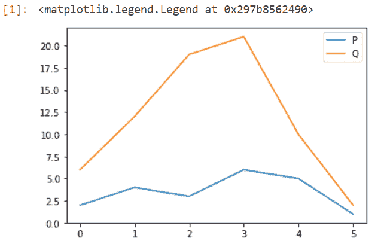
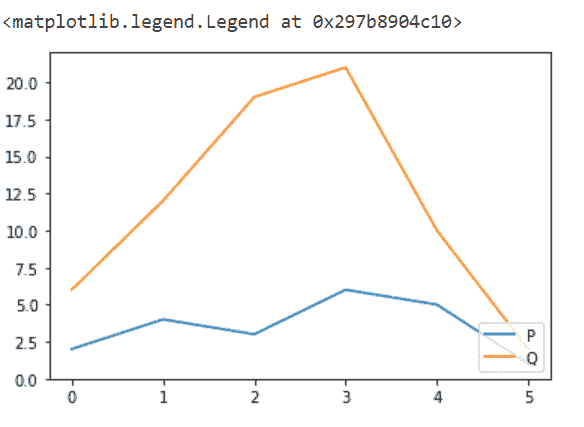
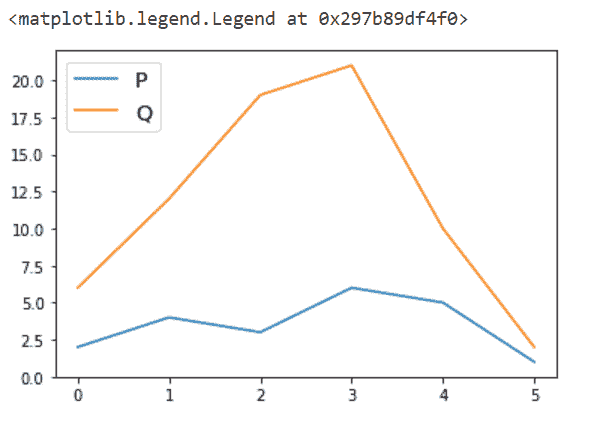
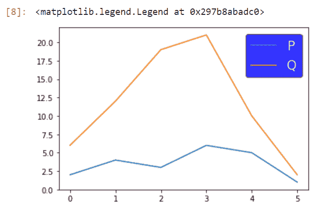
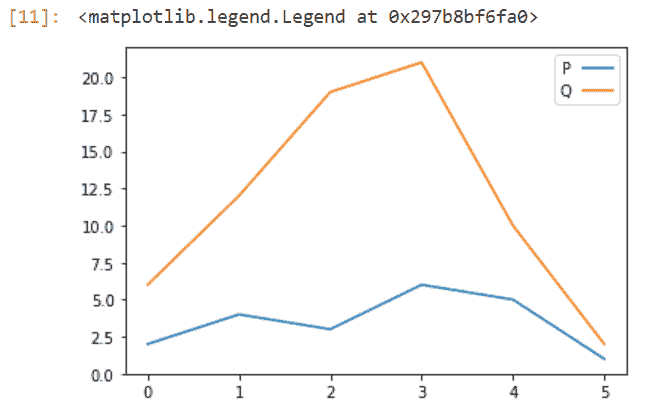
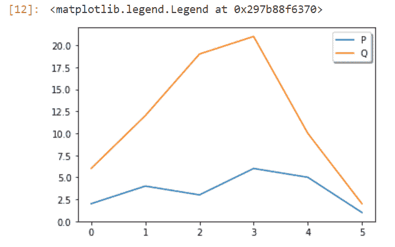
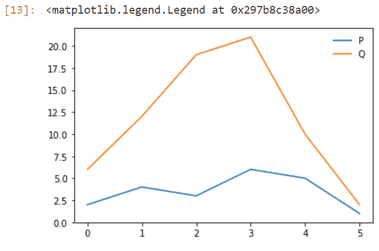
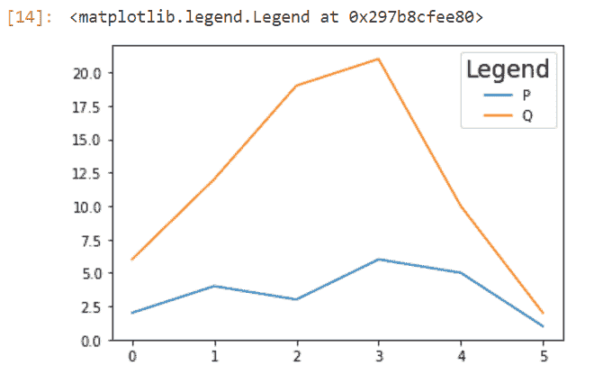

# 如何使用 Matplotlib 自定义图例

> 原文：<https://www.javatpoint.com/how-to-customize-legends-with-matplotlib>

在本教程中，我们将解释如何学习改变 matplotlib 的传说。Matplotlib 是一个众所周知的数据可视化软件。这是一个用 Python 编写的图形库，并且有数值计算的 NumPy 扩展。

图例是图表上描述组成的每个元素的区域。从某种意义上来说，图表可能很简单。如果我们包括标题、X 的标签、Y 的标签和图例，它会更清晰。当我们查看名称时，我们能够很容易地确定图形代表什么以及它代表的数据类型。

首先，让我们看看如何使用 matplotlib 创建图像图例。

### 语法:

Matplotlib 中图例的语法是:

```py

legend(*args, **kwargs)

```

可以用以下术语来描述:

*   **图例():**图例()自动确定要显示的元素。它通过显示每个标有关键字参数“标签”的图来实现这一点。
*   **图例(标签):**图例中显示的 X 的名称和 Y 的名称
*   **图例(手柄和标签):**要添加到图例中的行号列表。将标签和句柄组合在一起，您可以完全控制图例中应该包含哪些信息。建议图例和手柄的长度应该相等。

**代码:**

```py

# First, we will import the required modules
import matplotlib.pyplot as mplot

# Here, we will plot values
P = [2, 4, 3, 6, 5, 1]
Q = [6, 12, 19, 21, 10, 2]

# Now, we will plot using matplotlib
mplot.plot(P, label = "P")
mplot.plot(Q, label = "Q")

# Here, we will create the legend
mplot.legend()

```

**输出**



## 如何自定义图例

图例增加了图表的意义。字体、产地等的加入，让图例更加清晰可见，易于识别。让我们来看看各种各样的程序来改变剧情的图例。

### 位置:

有时图例可能不正确或没有放在正确的位置。Matplotlib 让我们指定放置图例的位置。这样，我们就可以把传说放在不盖过剧情的地方。这意味着地块会显得更加整洁干净。

**语法:**

```py

legend(loc = ")

```

按照以下步骤通过是可能的:

*   **“左上”“右上”“左下”“右下**”:位于地块适当区域。
*   **“上中”、“下中”、“中左”、“中右”:**位于中间的边缘。
*   **“中心”:**它位于地图的正中间。
*   **“最佳”:**不与艺人交叉放置。

**代码:**

```py

# First, we will import the required modules
import matplotlib.pyplot as mplot

# Here, we will plot values
P = [2, 4, 3, 6, 5, 1]
Q = [6, 12, 19, 21, 10, 2]

# Now, we will plot using matplotlib
mplot.plot(P, label = "P")
mplot.plot(Q, label = "Q")

# Here, we will create the legend and add the location
mplot.legend(loc = 'lower right')

```

**输出**



### 字体大小:

为了改善传说的外观，我们也可以改变传说的大小。通过将字体尺寸参数与操作联系起来，我们可以按照与绘图标题相同的方式更改图例框中的字体大小。

**语法:**

```py

legend(fontsize = ")

```

这可以通过' xx-small '，' x-small '，' small '，'中'，' large '，' x-large '，' xx-large '来传递

**代码:**

```py

# First, we will import the required modules
import matplotlib.pyplot as mplot

# Here, we will plot values
P = [2, 4, 3, 6, 5, 1]
Q = [6, 12, 19, 21, 10, 2]

# Now, we will plot using matplotlib
mplot.plot(P, label = "P")
mplot.plot(Q, label = "Q")

# Here, we will create the legend and adjusting its fontsize.
mplot.legend(fontsize = 'x-large', loc = 'upper left')

```

**输出**



### 传说的颜色

有时候，我们认为给图例盒子涂上颜色会让它看起来更有吸引力，并帮助它从情节中脱颖而出。Matplotlib 还可以帮助我们通过改变文本和背景的颜色，甚至改变图例显示的边缘来改变图例的外观。

**语法:**

```py

legend(labelcolor = ")

```

*   **labelcolor** :用于改变文字的颜色。

```py

legend(facecolor = ")

```

*   **facecolor:** 用于更改图例的背景颜色

```py

legend(edgecolor=")

```

*   **边缘颜色:**用于改变图例的边缘颜色

**代码:**

```py

# First, we will import the required modules
import matplotlib.pyplot as mplot

# Here, we will plot values
P = [2, 4, 3, 6, 5, 1]
Q = [6, 12, 19, 21, 10, 2]

# Now, we will plot using matplotlib
mplot.plot(P, label = "P")
mplot.plot(Q, label = "Q")

# Here, we will create the legend and add the colour to it:
mplot.legend(labelcolor = 'Pink', facecolor = 'blue',
           edgecolor = 'Brown', fontsize = 'xx-large')

```

**输出**



在上面的例子中，我们可以清楚地辨别哪些关键字的参数在图例块中添加了哪些颜色。

### 标记属性:

在这里，如果我们看到图例框，

**语法:**

```py

legend(markerfirst = bool, default: True)

```

标记放在第一位，而标签放在第二位。markerfirst 参数允许我们改变标记的位置。如果我们将它设置为 False，标记和标签的位置将被交换。

**代码:**

```py

# First, we will import the required modules
import matplotlib.pyplot as mplot

# Here, we will plot values
P = [2, 4, 3, 6, 5, 1]
Q = [6, 12, 19, 21, 10, 2]

# Now, we will plot using matplotlib
mplot.plot(P, label = "P")
mplot.plot(Q, label = "Q")

# Here, we will create the legend
mplot.legend(markerfirst = False)

```

**输出**



### 更改外观:

图例可以包括一些基本的 CSS 属性，例如创建阴影、放入框架和转弯，如果您不想被框架遮住情节的那些微小方面，让我们将图例变成透明框。

**阴影:**这个参数给传说制造阴影。

**框架:**为图例提供框架。

**fancybox:** 为标题提供平滑的边缘。

**framealpha:** 为图例的背景提供透明度。

**例 1:** 添加阴影和圆角:

```py

# First, we will import the required modules
import matplotlib.pyplot as mplot

# Here, we will plot values
P = [2, 4, 3, 6, 5, 1]
Q = [6, 12, 19, 21, 10, 2]

# Now, we will plot using matplotlib
mplot.plot(P, label = "P")
mplot.plot(Q, label = "Q")
#Here, we will create the legend and adding shadow and fancybox to the legend
mplot.legend(shadow = True, fancybox = True)

```

**输出**



**示例 2:** 移除图例框的框架:

```py

# First, we will import the required modules
import matplotlib.pyplot as mplot

# Here, we will plot values
P = [2, 4, 3, 6, 5, 1]
Q = [6, 12, 19, 21, 10, 2]

# Now, we will plot using matplotlib
mplot.plot(P, label = "P")
mplot.plot(Q, label = "Q")
#Here, we will create the legend and removing frame
mplot.legend(frameon = False)

```

**输出**



### 图例的标题:

在图例框中添加标题至关重要。title 参数可以让我们创建标题的图例，title_size 参数可以让我们为名称选择特定的字体大小。

**语法:**

```py

legend(title= "" , title_fontsize = "")

```

**标题:**将为传说赋予标题

**title_fontize:** 它会给标题赋予大小。

这可以是' xx-small '，' x-small '，' small '，'中型'，'大型'，' x-large '，' xx-large '

**代码:**

```py

# First, we will import the required modules
import matplotlib.pyplot as mplot

# Here, we will plot values
P = [2, 4, 3, 6, 5, 1]
Q = [6, 12, 19, 21, 10, 2]

# Now, we will plot using matplotlib
mplot.plot(P, label = "P")
mplot.plot(Q, label = "Q")
#Here, we will create the legend and give title and fontsize:
mplot.legend(title = "Legend", title_fontsize = 'xx-large')

```

**输出**



## 结论

在本教程中，我们已经讨论了如何自定义图例，例如添加标题、阴影、移除框架、更改字体大小和颜色等。

* * *