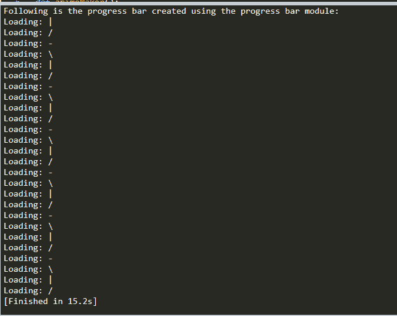

# Python ProgressBar 模块

> 原文：<https://www.javatpoint.com/python-progressbar-module>

这是非常基本的人性，我们想知道给定的过程何时完成，以及给定的任务完成了多少百分比。这是因为当一个过程正在进行时，我们变得非常不耐烦，我们只需要等到它完成。这是非常可以理解的，因为我们的天性就是对正在发生的事情和何时发生的事情保持好奇。因此，我们总是试图找出给定的任务何时完成，以及完成给定的任务需要多长时间。例如，当我们下载文件或软件时，我们总是寻找剩余的时间或下载文件所需的时间。因此，我们可以说，如果给定的时间或给定的百分比可供我们使用，我们会比我们不知道这些点时感觉到的不耐烦少。有时，下载文件的视觉图示也有助于保持冷静和耐心，直到过程完成。这是因为下载文件的直观图示告诉我们，文件的这一大部分被下载了，或者还剩下这么多。但实际上，这些视觉插图并不意味着是下载的指示器，但它们实际上保持了我们的注意力，并使下载或受苦更具互动性。

视觉插图如今也变得非常普遍，几乎可以看到它们嵌入在每个应用、网站或软件中。因此，我们可以看到这些正在进行的过程的视觉插图(像下载文件、在网站上受苦等。)是任何网站、软件或应用的重要方面。现在，我们中的大多数人会认为自己制作这些视频插图会非常困难，并且需要数百行后端编码。但是，在现实中，这完全不是真的，我们自己创作这样的视觉插画也不是很难。许多编程语言为我们提供了可以用来创建这些视频插图的包。像编程语言的任何其他方面一样，Python 在这方面也处于领先地位。具体说到 Python，它给我们提供了很多包，比如 tqdm、progressbar 等。，我们可以在程序中使用它来自己创建进度条。从 Python 提供的所有进度条包中，我们将只了解本教程中的ProgressBar 模块。我们将理解 Python 的这个 progressbar 模块，并通过将其导入示例程序来处理这个模块。

## Python 的 Progressbar 模块介绍

Progressbar 是一个 Python 模块，它附带了许多功能，我们可以使用这些功能来为正在进行的过程创建视觉插图，这将有助于我们转移对不耐烦的注意力。progressbar 模块有许多内置函数，我们可以在 Python 程序中使用这些函数来创建正在进行的过程和过程完成时间的可视化图示。这个模块允许我们为正在进行的过程创建一个进度条，这样我们就可以知道这个过程完成了多少百分比，需要多长时间才能完成。进度条或加载条，我们通常在游戏应用中看到，加载屏幕，可以使用这个模块的功能创建。该加载栏指示启动应用或游戏所需的资源正在从系统的主存储器或应用的服务器导入。

在本教程中，我们将使用 Python 的 progress bar 模块创建一个加载栏或进度条。我们将在示例程序中使用这个模块来理解这个模块的实现。

## Python 的 Progressbar 模块:安装

Python 的 progressbar 模块不是 Python 的内置包，这意味着需要一个安装过程才能将这个模块安装到我们的系统中。由于这个模块不是在安装源 Python 时出现的，所以如果我们想使用这个模块的功能执行操作，我们必须首先确保这个模块成功安装在我们的系统中。如果 progressbar 还没有出现在我们的系统中，我们有多种安装方法可以用来将 progressbar 模块安装到我们的系统中，只有在这之后，我们才能在示例程序中使用该模块的功能。在我们的系统中安装 progressbar 模块最简单的方法之一是使用 pip 安装程序。

我们将使用 pip installer 方法在我们的系统中安装 progressbar 模块，并使用该方法安装 progressbar 模块；我们必须首先在系统的命令提示符终端中写下以下命令:

```py

pip install progressbar

```

或者，我们也可以使用以下 pip 命令在系统中安装最新版本的 progressbar 模块(progressbar2 ):

```py

pip install progressbar2

```

在我们系统的提示符 Shell 中写完上面提到的 pip 命令后，我们必须按下“enter”，这将启动 progressbar(或 progressbar2)模块的安装过程。一旦这个模块的安装过程开始，我们必须等待一段时间，直到 pip 安装程序安装这个模块所需的所有依赖项。


如我们所见，在 pip 安装程序的帮助下，progressbar 模块成功安装在我们的系统中。我们还可以按照相同的安装过程安装 progressbar2 模块，并写下第二个 pip 命令(如上所述)。我们现在可以继续进行 progressbar 模块的实现部分，因为该模块已成功安装在我们的系统中，现在，我们可以在任何示例程序中使用它的功能。

## Python 的 Progressbar 模块:实现

在这一部分，我们将把刚才安装的 progressbar 模块导入到示例程序中，使用这个模块的功能来理解这个模块的实现。我们将尝试使用该模块的功能创建一个进度条，当程序执行时，进度条将显示在输出中。进度条的输出将取决于我们运行示例程序的 Python 集成开发环境。我们也可以使用 progressbar2，因为它是 progressbar 模块的升级版本，并且执行所有可以使用后者执行的功能。但是，在本教程中，我们将只把 progressbar 模块导入示例程序，并使用它的函数来理解它的实现。

查看以下示例程序，了解 progressbar 模块的实现:

**示例:**看看下面的示例程序，其中我们使用 progress bar 模块的功能创建了一个进度条:

```py

# Importing the progressbar module
import progressbar as pgr
# Also importing the time module
import time 
# Default functions for a progress bar 
def animeMaker():
    # Creating widget of the progress bar
    varWidget = ['Loading: ', pgr.AnimatedMarker()]
    # Creating bar from the widget
    varBar = pgr.ProgressBar(widgets = varWidget).start()
    # Using for loop to loop over the progress bar
    for a in range(26):
        # Using time module to give break in progress bar
        time.sleep(0.5)
        # Updating the progress bar
        varBar.update(a)
# Showing the progress bar in the output
print("Following is the progress bar created using the progress bar module: ")
# Calling the default function to execute it 
animeMaker()

```

**输出:**

```py
Following is the progress bar created using the progress bar module:

```



如我们所见，进度条被打印并显示在输出中，显示的输出将根据我们在其中运行该示例程序的 Python IDE 而有所不同。这就是我们如何使用 progress bar 或 progressbar2 模块的功能创建进度条或加载条。

**说明:**首先我们已经在程序中导入了 progressbar 模块作为 pgr。之后，我们还将时间模块导入到程序中，在创建进度条时使用该模块的功能创建时间推移。然后，我们用 animeMaker()名称定义了一个默认函数，并在这个函数中使用 progressbar 模块的函数来创建一个 progressbar。在这个默认函数中，首先，我们使用 progressbar 模块的 AnimatedMarker()函数为加载栏创建了一个小部件。之后，我们定义了另一个变量来使用 ProgressBar 模块的 progressbar 函数创建一个 bar。在这个函数中，我们给出了 Widget 变量(varWidget)作为参数来定义加载栏的 widget。之后，我们在函数中使用了一个 `for`循环，这样它就可以在加载栏上连续循环，输出中将显示一个动画栏。在 `for`循环中，首先，我们使用了 sleep()函数来显示给定时间(即 0.5 秒)中断后的加载条状态。然后，我们使用 progressbar 模块的 update()函数将输出中的加载条更新到函数中的给定限制，即 a，我们在 26 的范围内定义了该限制。最后，我们通过调用 animeMaker 函数在输出中显示加载栏。

## 结论

我们可以在 Python 程序中使用 progress bar 或 progressbar2 模块的功能创建一个加载栏或进度条。加载栏或进度条的输出将取决于我们运行程序的 Python IDE，进度条的动画可能会根据这些 IDE 而有所不同。progressbar 模块在创建各种动画进度条和加载条时非常有用。

* * *