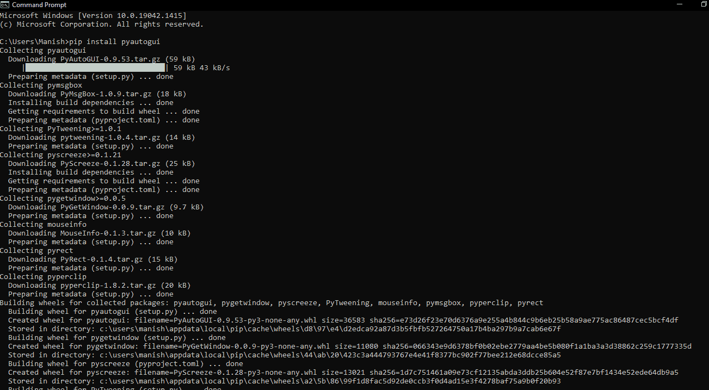
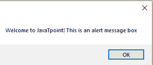
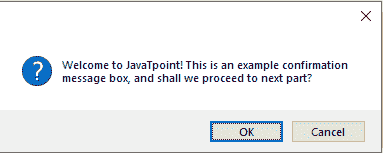
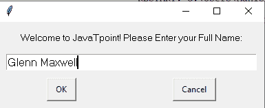
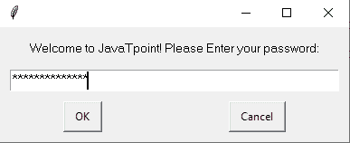

# python pyautogui 模块


在不同类型的应用和网站上执行多个任务时，我们都会看到各种消息框。这些消息框有不同的类型，如警报消息框、确认消息框、密码消息框和许多其他类型。这些不同类型的消息框旨在显示我们正在执行给定任务的网站或应用的特定消息。就像确认消息框要求在网站或应用上工作的用户进行确认，这种确认可以是关于任何事情，如提交应用等。因此，这些消息框成为应用或网站非常重要的一部分，提高了它们的交付质量。这些消息是应用的图形用户界面(GUI)的一部分，它们内置于应用或网站中。这些消息框是专门为向用户传达一些需要用户关注的重要消息而创建的。这些消息框有助于应用或网站抓住用户的注意力，从而永远不会错过来自这些应用或网站的重要消息。当今时代，几乎每个应用或网站都在其图形用户界面中内置了消息框功能，这就是为什么了解这些消息框在当今时代变得越来越重要的原因。

许多编程语言都有内置或扩展的包，可以用来创建这样的消息框，这些消息框可以嵌入到应用或网站的图形用户界面中。人们可以使用不同编程语言提供的这些包的功能来创建不同类型的消息框。特别是关于 Python，它单独提供了几个库和包，我们可以使用它们为任何应用或网站的图形用户界面创建消息框。一个这样的 Python 包是 pyautogui 模块，它带有许多内置功能，我们可以使用这些功能来创建消息框。因此，在本教程中，我们将学习 Python 的 pyautogui 模块，并学习使用该模块的功能创建消息框。我们将在本教程的示例程序中使用该模块的功能来创建示例消息框。

## Python 的 PyAutoGUI 模块介绍

pyautogui 模块是一个 Python 包，附带了多种功能，可用于自动化我们系统或机器的图形用户界面。我们还可以使用该模块的功能来自动化我们系统的键盘和鼠标的功能。除此之外，pyautogui 模块还提供了许多其他图形用户界面功能，我们可以使用这些功能为任何应用和网站的图形用户界面创建消息框。本文只关注 pyautogui 模块的这一功能。这意味着我们将只谈论和学习这些图形用户界面功能(用于创建消息框)，并通过在示例程序中使用它们来了解它们在本教程中的实现。但是，在我们开始学习这些功能之前，我们必须先完成安装部分。

## Python 的 PyAutoGUI 模块:安装

Python 的 pyautogui 模块不是内置的，因此在我们开始学习使用该模块的 gui 功能创建消息框之前，我们必须在系统中安装该模块。我们可以使用多种方法在我们的机器上安装 pyautogui 模块，但是我们将使用 pip installer 方法来安装这个模块。这背后的主要原因是 pip installer 方法是安装这个模块最简单和最容易的方法，我们可以通过使用 pip installer 方法非常快速地安装这个模块。

**要使用 pip installer 方法执行 pyautogui 模块的安装，首先，我们必须在系统的终端Shell中编写以下 pip 安装命令:**

```py

pip install pyautogui

```

一旦我们在终端Shell中完成了上面提到的命令的编写，我们只需要按下“enter”键，这将启动 pyautogui 模块的安装过程。当 pyautogui 模块的安装过程开始时，我们必须等待一小段时间，直到该模块所需的所有依赖项都成功安装到我们的系统中。



正如我们所看到的，pyautogui 模块的安装过程已经完成，这意味着我们已经成功地在我们的系统中安装了这个模块。现在，我们可以将这个模块导入到示例程序中，使用这个模块的功能并理解它们的实现。

## Python 的 PyAutoGUI 模块:实现

现在，我们将通过在本部分的示例程序中使用 pyautogui 模块的 GUI 功能来学习它们的功能。我们将只理解 pyautogui 模块的那些 gui 功能的实现，这些功能用于在应用或网站的 GUI 中创建消息框。我们将使用 pyautogui 模块的各种图形用户界面功能创建不同类型的消息框。**下面是我们将使用 pyautogui 模块的 GUI 功能创建的不同类型的消息框:**

1.  创建警报消息框
2.  确认消息框
3.  选择消息框
4.  提示消息框
5.  密码消息框

让我们理解 pyautogui 模块的这些 GUI 功能的实现，我们将使用这些功能在示例程序中创建上面给出的消息框。

### 1)警报消息框:

pyautogui 模块有一个 **alert()** 功能，我们可以通过在这个功能中给出一个输入消息来创建一个报警消息框。以下是使用此函数创建警报消息框的语法:

```py

>> alert('Message')

```

查看下面的示例程序，了解 alert()函数的实现:

**示例 1:** 看看下面的 Python 程序，我们在其中创建了一个警报消息框:

```py

# Importing the pyautogui module
import pyautogui as pag
# Creating an alert message box
pag.alert('Welcome to JavaTpoint! This is an alert message box')

```

**输出:**



如我们所见，输出中显示了一个带有输入消息的警报消息框，当我们单击警报消息框上的 ok 时，我们将退出它。这就是我们如何使用 pyautogui 模块的 **alert()** 功能来创建一个警报消息框。

**说明:**首先，我们已经将 pyautogui 模块作为 pag 导入到程序中。之后，我们使用**警报()**功能创建了一个警报消息框，并提供了一条输入消息，该消息将显示在警报消息框中。

### 2)确认消息框:

pyautogui 模块有 **confirm()** 功能，用于在该功能中给出输入消息，创建确认消息框。以下是使用此功能创建确认消息框的语法:

```py

>> confirm('Message')

```

看下面的示例程序，了解 **confirm()** 功能的实现:

**示例 2:** 看看下面的 Python 程序，我们在其中创建了一个确认消息框:

```py

# Importing the pyautogui module
import pyautogui as pag
# Creating a confirmation message box
pag.confirm('Welcome to JavaTpoint! This is an example confirmation message box, and shall we proceed to next part?')

```

**输出:**



如我们所见，输出中显示了一个带有输入消息的确认消息框，当我们在确认消息框上单击 ok 时，我们将退出。这就是我们如何使用 pyautogui 模块的 **confirm()** 功能来创建一个确认消息框。

### 3)多选项消息框:

我们也可以使用 pyautogui 模块的 **confirm()** 功能来创建一个多选项消息框。我们只需在**确认()**功能中提供 buttons 参数，即可在输出消息框中显示多个选项。查看以下示例程序，了解**确认()**功能的多选项功能:

**示例 3:** 看看下面的 Python 程序，我们在其中创建了多个选项消息框:

```py

# Importing the pyautogui module
import pyautogui as pag
# Creating a multiple options message box
pag.confirm('Welcome to JavaTpoint! This is a multiple option message box', buttons = ['Option A', 'Option B', 'Option C', 'Option D'])

```

**输出:**


如我们所见，我们已经使用**确认()**功能在输出中显示了一个多选项消息框。这就是我们如何使用**确认()**功能中的按钮参数来创建一个多选项消息框。

### 4)提示(输入)消息框:

我们还可以创建一个提示消息框，在这里我们可以使用 pyautogui 模块的**提示()**功能输入个人消息。我们可以在提示消息框中编写任何消息，它将显示在输出中。我们将在输出中输入的文本将显示在输出窗口中，如果我们在输入消息后按下 ok，如果我们按下 cancel 按钮，则不会显示任何文本。查看以下示例程序，了解**提示符()**功能的实现:

**示例 4:** 看看下面的 Python 程序，我们在其中创建了一个提示消息框:

```py

# Importing the pyautogui module
import pyautogui as pag
# Creating a prompt message box
pag.prompt('Welcome to JavaTpoint! Please Enter your Full Name:')

```

**输出:**



正如我们所看到的，输出中显示了一个提示消息框，我们已经在其中输入了输入消息。这就是我们如何使用本模块的**提示()**功能来创建提示消息框。

### 5)密码消息框:

我们还可以使用 pyautogui 模块创建密码消息框，使用该模块创建密码消息框类似于创建提示消息框。pyautogui 模块有**密码()**功能，我们在其中创建一个密码消息框，用户可以在其中手动输入密码。密码消息框中输入的密码或文本将被隐藏。查看以下示例程序，了解**密码()**功能的实现:

**示例 4:** 看看下面的 Python 程序，我们在其中创建了一个密码消息框:

```py

# Importing the pyautogui module
import pyautogui as pag
# Creating a password message box
pag.password('Welcome to JavaTpoint! Please Enter your password:')

```

**输出:**



正如我们所看到的，在输出中显示了一个密码消息框，我们已经在其中输入了密码或输入了消息。这就是我们如何使用本模块的**密码()**功能来创建密码消息框。

* * *