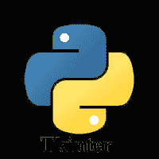
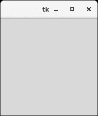
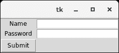
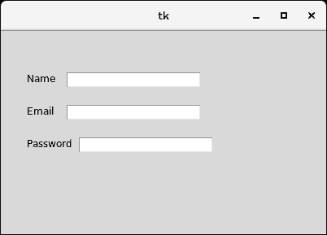

# Python Tkinter 教程

> 哎哎哎:# t0]https://www . javatppoint . com/python-tkinter



Tkinter 教程提供了 Python Tkinter 的基本和高级概念。我们的 Tkinter 教程是为初学者和专业人士设计的。

Python 提供了标准库 Tkinter，用于为基于桌面的应用创建图形用户界面。

用 python Tkinter 开发基于桌面的应用并不是一项复杂的任务。使用以下步骤可以创建一个空的 Tkit 顶层窗口。

1.  导入 Tkit 模块。
2.  创建主应用窗口。
3.  添加标签、按钮、框架等小部件。去窗口。
4.  调用主事件循环，以便操作可以在用户的计算机屏幕上进行。

### 例子

```py
# !/usr/bin/python3
from tkinter import *
#creating the application main window. 
top = Tk()
#Entering the event main loop
top.mainloop()

```

**输出:**



* * *

## tkinter widgets

有各种各样的小部件，如按钮、画布、checkbutton、条目等。用于构建 python 图形用户界面应用。

| 塞内加尔 | 小部件 | 描述 |
| one | [按钮](python-tkinter-button) | 按钮用于向 python 应用添加各种按钮。 |
| Two | [帆布](python-tkinter-canvas) | 画布小部件用于在窗口上绘制画布。 |
| three | [检查按钮](python-tkinter-checkbutton) | 检查按钮用于在窗口上显示检查按钮。 |
| four | [条目](python-tkinter-entry) | 入口小部件用于向用户显示单行文本字段。它通常用于接受用户值。 |
| five | [框架](python-tkinter-frame) | 它可以被定义为一个容器，可以在其中添加和组织另一个小部件。 |
| six | 标签 | 标签是用于显示关于其他小部件的消息或信息的文本。 |
| seven | [列表框](python-tkinter-listbox) | 列表框小部件用于向用户显示选项列表。 |
| eight | [菜单按钮](python-tkinter-menubutton) | 菜单按钮用于向用户显示菜单项。 |
| nine | 菜单 | 它用于向用户添加菜单项。 |
| Ten | [消息](python-tkinter-message) | 消息小部件用于向用户显示消息框。 |
| Eleven | [单选按钮](python-tkinter-radiobutton) | 单选按钮不同于复选按钮。这里，向用户提供了各种选项，并且用户只能在其中选择一个选项。 |
| Twelve | [刻度](python-tkinter-scale) | 它用于向用户提供滑块。 |
| Thirteen | [滚动条](python-tkinter-scrollbar) | 它向用户提供滚动条，以便用户可以上下滚动窗口。 |
| Fourteen | [文字](python-tkinter-text) | 它不同于 Entry，因为它为用户提供了一个多行文本字段，以便用户可以编写文本并编辑其中的文本。 |
| Fourteen | [上一层](python-tkinter-toplevel) | 它用于创建单独的窗口容器。 |
| Fifteen | [旋转箱](python-tkinter-spinbox) | 它是一个入口小部件，用于从选项值中进行选择。 |
| Sixteen | [平板式窗口](python-tkinter-panedwindow) | 它就像一个包含水平或垂直窗格的容器小部件。 |
| Seventeen | [标签框架](python-tkinter-labelframe) | 标签框架是充当容器的容器小部件 |
| Eighteen | [消息框](python-tkinter-messagebox) | 该模块用于在基于桌面的应用中显示消息框。 |

* * *

## Python Tkinter 几何

Tkit 几何指定了显示小部件的方法。python Tkinter 提供了以下几何方法。

1.  pack()方法
2.  grid()方法
3.  place()方法

让我们详细讨论每一个。

### Python Tkinter pack()方法

pack()小部件用于组织块中的小部件。使用 pack()方法添加到 python 应用的位置小部件可以通过使用方法调用中指定的各种选项来控制。

但是，控件较少，小部件通常以不太有组织的方式添加。

下面给出了使用 pack()的语法。

### 句法

```py
widget.pack(options)

```

下面列出了可以在 pack()中传递的可能选项。

*   **展开:**如果展开设置为真，小部件将展开以填充任何空间。
*   **填充:**默认情况下，填充设置为无。但是，我们可以将其设置为 X 或 Y，以确定小部件是否包含任何额外的空间。
*   **大小:**它表示窗口上小部件将被放置到的父窗口的一侧。

### 例子

```py
# !/usr/bin/python3
from tkinter import *
parent = Tk()
redbutton = Button(parent, text = "Red", fg = "red")
redbutton.pack( side = LEFT)
greenbutton = Button(parent, text = "Black", fg = "black")
greenbutton.pack( side = RIGHT )
bluebutton = Button(parent, text = "Blue", fg = "blue")
bluebutton.pack( side = TOP )
blackbutton = Button(parent, text = "Green", fg = "red")
blackbutton.pack( side = BOTTOM)
parent.mainloop()

```

**输出:**


### Python Tkinter 网格()方法

grid()几何管理器以表格形式组织小部件。我们可以在方法调用中将行和列指定为选项。我们还可以指定小部件的列跨度(宽度)或行跨度(高度)。

这是一种将小部件放置到 python 应用中的更有条理的方式。下面给出了使用 grid()的语法。

### 句法

```py
widget.grid(options)

```

下面给出了可以在 grid()方法中传递的可能选项的列表。

*   **列**
    要放置小部件的列号。最左边的列用 0 表示。
*   **Columnspan**
    小部件的宽度。它表示列扩展到的列数。
*   **ipadx，ipady**
    它表示在小部件边框内填充小部件的像素数。
*   **padx，pady**
    它表示在小部件边框外填充小部件的像素数。
*   **行**
    要放置小部件的行号。最上面的一行由 0 表示。
*   **rowspan**
    小部件的高度，即小部件扩展到的行数。
*   **Sticky**
    如果单元格比小部件大，那么 Sticky 用于指定小部件在单元格内的位置。它可能是代表小部件位置的粘性字母的串联。可能是北、东、西、南、东北、西北、南北、东西、东南。

### 例子

```py
# !/usr/bin/python3
from tkinter import *
parent = Tk()
name = Label(parent,text = "Name").grid(row = 0, column = 0)
e1 = Entry(parent).grid(row = 0, column = 1)
password = Label(parent,text = "Password").grid(row = 1, column = 0)
e2 = Entry(parent).grid(row = 1, column = 1)
submit = Button(parent, text = "Submit").grid(row = 4, column = 0)
parent.mainloop()

```

**输出:**



### Python Tkinter place()方法

place()几何管理器将小部件组织到特定的 x 和 y 坐标。

### 句法

```py
widget.place(options)

```

下面列出了可能的选择。

*   **Anchor:** 它表示小部件在容器中的确切位置。默认值(方向)是西北(左上角)
*   **bordermode:** 边框类型的默认值是 INternet，表示忽略父级的内部边框。另一个选项是“外部”。
*   **高度、宽度:**是指以像素为单位的高度和宽度。
*   **relheight，relwidth:** 表示 0.0 到 1.0 之间的浮动，表示父代的高度和宽度的分数。
*   **relx，rely:** 它表示为 0.0 到 1.0 之间的浮动，即水平和垂直方向上的偏移。
*   **x，y:** 指像素中的水平和垂直偏移量。

### 例子

```py
# !/usr/bin/python3
from tkinter import *
top = Tk()
top.geometry("400x250")
name = Label(top, text = "Name").place(x = 30,y = 50)
email = Label(top, text = "Email").place(x = 30, y = 90)
password = Label(top, text = "Password").place(x = 30, y = 130)
e1 = Entry(top).place(x = 80, y = 50)
e2 = Entry(top).place(x = 80, y = 90)
e3 = Entry(top).place(x = 95, y = 130)
top.mainloop()

```

**输出:**



## 先决条件

在学习 Tkinter 之前，必须具备 Python 的基础知识。

## 观众

我们的 Python Tkinter 教程旨在帮助初学者和专业人士。

## 问题

我们向您保证，在本 Tkinter 教程中，您不会发现任何问题。但是如果有任何错误，请在联系表格中发布问题。