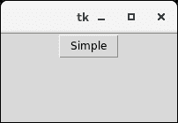
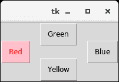
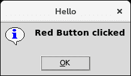

# Tkinter 按钮


按钮小部件用于向 python 应用添加各种类型的按钮。Python 允许我们根据自己的需求配置按钮的外观。根据需要，可以设置或重置各种选项。

我们还可以将方法或函数与按钮相关联，当按钮被按下时，就会调用该按钮。

下面给出了使用按钮部件的语法。

### 句法

```py

W = Button(parent, options) 

```

下面列出了可能的选择。

| 塞内加尔 | [计]选项 | 描述 |
| one | 活动背景 | 它表示鼠标悬停在按钮上时按钮的背景。 |
| Two | 活动前景 | 它表示鼠标悬停在按钮上时按钮的字体颜色。 |
| three | 反向二极管(Backward Diode) | 它以像素为单位表示边框宽度。 |
| four | 锥齿轮 | 它表示按钮的背景色。 |
| five | 命令 | 它被设置为在调用函数时计划的函数调用。 |
| six | 细粒 | 按钮的前景色。 |
| seven | 字体 | 按钮文本的字体。 |
| eight | 高度 | 按钮的高度。高度用文本行的文本行数或图像的像素数来表示。 |
| Ten | 高亮颜色 | 按钮具有焦点时高亮显示的颜色。 |
| Eleven | 图像 | 它被设置为按钮上显示的图像。 |
| Twelve | 证明合法 | 它说明了多条文本行的表示方式。它设置为左对齐，右对齐，中心对齐。 |
| Thirteen | 垫板 | 水平方向按钮的附加填充。 |
| Fourteen | 帕迪 | 垂直方向上按钮的附加填充。 |
| Fifteen | 减轻 | 它表示边框的类型。它可以是凹陷的、凸起的、凹槽的和脊的。 |
| Seventeen | 状态 | 该选项设置为禁用，使按钮无响应。ACTIVE 表示按钮的活动状态。 |
| Eighteen | 强调 | 设置此选项使按钮文本带有下划线。 |
| Nineteen | 宽度 | 按钮的宽度。它作为文本按钮的若干字母或图像按钮的像素而存在。 |
| Twenty | 包装长度 | 如果该值设置为正数，文本行将被换行以适应该长度。 |

### 例子

```py

#python application to create a simple button

from tkinter import * 

top = Tk()

top.geometry("200x100")

b = Button(top,text = "Simple")

b.pack()

top.mainaloop()

```

**输出:**



### 例子

```py

from tkinter import * 

top = Tk()

top.geometry("200x100")

def fun():
    messagebox.showinfo("Hello", "Red Button clicked")

b1 = Button(top,text = "Red",command = fun,activeforeground = "red",activebackground = "pink",pady=10)

b2 = Button(top, text = "Blue",activeforeground = "blue",activebackground = "pink",pady=10)

b3 = Button(top, text = "Green",activeforeground = "green",activebackground = "pink",pady = 10)

b4 = Button(top, text = "Yellow",activeforeground = "yellow",activebackground = "pink",pady = 10)

b1.pack(side = LEFT)

b2.pack(side = RIGHT)

b3.pack(side = TOP)

b4.pack(side = BOTTOM)

top.mainloop()

```

**输出:**


