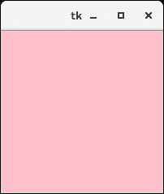
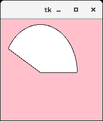

# Tkinter 画布


画布小部件用于将结构化图形添加到 python 应用中。它用于绘制 python 应用的图表。下面给出了使用画布的语法。

### 句法

```py

w = canvas(parent, options)

```

下面列出了可能的选择。

| 塞内加尔 | [计]选项 | 描述 |
| one | 弹底引信（base detonating 的缩写） | 表示边框宽度。默认宽度为 2。 |
| Two | 锥齿轮 | 它代表画布的背景颜色。 |
| three | 限制 | 它被设置为使画布在滚动区域之外不可滚动。 |
| four | 光标 | 光标用作箭头、圆、点等。在画布上。 |
| five | 高度 | 它表示画布在垂直方向上的大小。 |
| six | 高亮颜色 | 它表示小部件聚焦时的高亮颜色。 |
| seven | 减轻 | 它表示边框的类型。可能的值有凹陷值、凸起值、凹槽值和脊值。 |
| eight | 滚动区域 | 它表示指定为包含画布区域的元组的坐标。 |
| nine | 宽度 | 它表示画布的宽度。 |
| Ten | xscrollincrement | 如果设置为正值。画布仅放置到该值的倍数。 |
| Eleven | xscrollcommand | 如果画布是可滚动的，则该属性应该是。水平滚动条的 set()方法。 |
| Twelve | yscrollincrement | 像 xscrollincrement 一样工作，但控制垂直移动。 |
| Thirteen | yscrollcommand | 如果画布是可滚动的，则该属性应该是。垂直滚动条的 set()方法。 |

### 例子

```py

from tkinter import * 

top = Tk()

top.geometry("200x200")

#creating a simple canvas
c = Canvas(top,bg = "pink",height = "200")

c.pack()

top.mainloop()

```

**输出:**



### 示例:创建圆弧

```py

from tkinter import * 

top = Tk()

top.geometry("200x200")

#creating a simple canvas
c = Canvas(top,bg = "pink",height = "200",width = 200)

arc = c.create_arc((5,10,150,200),start = 0,extent = 150, fill= "white")

c.pack()

top.mainloop()

```

**输出:**

