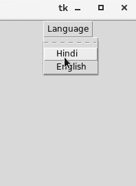

# Tkinter 菜单按钮


菜单按钮部件可以定义为一直向用户显示的下拉菜单。它用于为用户提供选择应用中存在的适当选项的选项。

Menubutton 用于在 python 应用中实现各种类型的菜单。菜单与菜单按钮相关联，当用户单击菜单按钮时，可以显示菜单按钮的选项。

下面给出了使用 Tkinter Menubutton 的语法。

### 句法

```py

w = Menubutton(Top, options) 

```

下面列出了各种选项。

| 塞内加尔 | [计]选项 | 描述 |
| one | 活动背景 | 小部件聚焦时的背景色。 |
| Two | 活动前景 | 小部件聚焦时小部件文本的字体颜色。 |
| three | 锚 | 当小部件被分配了比需要更多的空间时，它指定了小部件内容的确切位置。 |
| four | 锥齿轮 | 它指定小部件的背景颜色。 |
| five | 位图 | 它被设置为要显示给小部件的图形内容。 |
| six | 弹底引信（base detonating 的缩写） | 它表示边框的大小。默认值为 2 像素。 |
| seven | 光标 | 当小部件处于焦点下时，鼠标指针将更改为指定的光标类型。光标类型的可能值是箭头或点等。 |
| eight | 方向 | 可以指定方向，以便菜单可以显示到按钮的指定方向。使用“左”、“右”或“上”相应地放置小部件。 |
| nine | 禁用的前景 | 小部件被禁用时小部件的文本颜色。 |
| Ten | 细粒 | 小部件的正常前景色。 |
| Eleven | 高度 | 菜单按钮的垂直尺寸。它被指定为行数。 |
| Twelve | 高亮颜色 | 焦点下显示给小部件的高亮颜色。 |
| Thirteen | 图像 | 小部件上显示的图像。 |
| Fourteen | 证明合法 | 这指定了当文本无法填充小部件的宽度时，文本在小部件下的确切位置。我们可以用 LEFT 表示左对齐，RIGHT 表示右对齐，CENTER 表示中心对齐。 |
| Fifteen | 菜单 | 它表示用菜单按钮指定的菜单。 |
| Sixteen | 垫板 | 小部件的水平填充。 |
| Seventeen | 帕迪 | 小部件的垂直填充。 |
| Eighteen | 减轻 | 此选项指定边框的类型。默认值为 REGISTED。 |
| Nineteen | 状态 | 鼠标按钮的正常状态被启用。我们可以将其设置为“禁用”以使其无响应。 |
| Twenty | 文本 | 小部件显示的文本。 |
| Twenty-one | textvariable | 我们可以将字符串类型的控制变量设置为文本变量，这样我们就可以在运行时控制小部件的文本。 |
| Twenty-two | 强调 | 默认情况下，小部件的文本不加下划线，但是我们可以设置该选项，使小部件的文本加下划线。 |
| Twenty-three | 宽度 | 它以字符表示小部件的宽度。默认值为 20。 |
| Twenty-four | 包装长度 | 我们可以用行数来分隔小部件的文本，以便文本包含的行数不大于指定值。 |

### 例子

```py

# !/usr/bin/python3

from tkinter import *

top = Tk()

top.geometry("200x250")

menubutton = Menubutton(top, text = "Language", relief = FLAT)

menubutton.grid()

menubutton.menu = Menu(menubutton)

menubutton["menu"]=menubutton.menu

menubutton.menu.add_checkbutton(label = "Hindi", variable=IntVar())

menubutton.menu.add_checkbutton(label = "English", variable = IntVar())

menubutton.pack()

top.mainloop()

```

**输出:**

