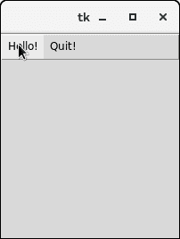
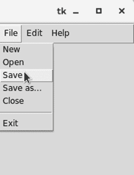

# Python Tkinter Menu

> 哎哎哎:# t0]https://www . javatppoint . com/python-tkinter-menu

菜单小部件用于在 python 应用中创建各种类型的菜单(顶层、下拉和弹出)。

顶层菜单显示在父窗口标题栏的正下方。我们需要创建一个菜单小部件的新实例，并使用 add()方法向其中添加各种命令。

下面给出了使用菜单小部件的语法。

### 句法

```py

w = Menu(top, options) 

```

下面列出了可能的选择。

| 塞内加尔 | [计]选项 | 描述 |
| one | 活动背景 | 小部件处于焦点下时的背景色。 |
| Two | activeborderwidth | 小部件位于鼠标下方时的边框宽度。默认值为 1 像素。 |
| three | 活动前景 | 小部件具有焦点时小部件的字体颜色。 |
| four | 锥齿轮 | 小部件的背景色。 |
| five | 弹底引信（base detonating 的缩写） | 小部件的边框宽度。 |
| six | 光标 | 鼠标指针悬停在小部件上时会变为光标类型。光标类型可以设置为箭头或点。 |
| seven | 禁用的前景 | 小部件禁用时的字体颜色。 |
| eight | 字体 | 小部件文本的字体类型。 |
| nine | 细粒 | 小部件的前景色。 |
| Ten | 命令后 | 后置命令可以设置为当鼠标悬停在菜单上时调用的任何功能。 |
| Eleven | 减轻 | 小部件边框的类型。默认类型是 REGISTED。 |
| Twelve | 图像 | 它用于在菜单上显示图像。 |
| Thirteen | 选择颜色 | 选中 checkbutton 或 radiobutton 时用于显示它们的颜色。 |
| Fourteen | 提洛尔夫 | 默认情况下，菜单中的选项从位置 1 开始。如果我们设置撕裂= 1，那么它将从第 0 个位置开始。 |
| Fifteen | 标题 | 如果要更改窗口标题，请将此选项设置为窗口标题。 |

## 方法

菜单小部件包含以下方法。

| 塞内加尔 | [计]选项 | 描述 |
| one | add_command(选项) | 它用于向菜单添加菜单项。 |
| Two | add_radiobutton(选项) | 此方法将 radiobutton 添加到菜单中。 |
| three | add_checkbutton(选项) | 此方法用于向菜单添加检查按钮。 |
| four | add_cascade(选项) | 它用于通过将给定菜单与父菜单相关联来创建父菜单的分层菜单。 |
| five | add _ seperator() | 它用于将分隔符行添加到菜单中。 |
| six | 添加(类型，选项) | 它用于将特定菜单项添加到菜单中。 |
| seven | delete（startindex， endindex） | 它用于删除存在于指定范围内的菜单项。 |
| eight | entryconfig(索引，选项) | 它用于配置由给定索引标识的菜单项。 |
| nine | 索引(项目) | 它用于获取指定菜单项的索引。 |
| Ten | insert_seperator(索引) | 它用于在指定的索引处插入分隔符。 |
| Eleven | 调用(索引) | 它用于调用与指定索引处给定的选项相关联的。 |
| Twelve | 类型(索引) | 它用于获取索引指定的选项类型。 |

## 创建顶层菜单

通过实例化菜单小部件并将菜单项添加到菜单中，可以创建顶级菜单。

### 例 1

```py

# !/usr/bin/python3

from tkinter import *

top = Tk()

def hello():
    print("hello!")

# create a toplevel menu
menubar = Menu(root)
menubar.add_command(label="Hello!", command=hello)
menubar.add_command(label="Quit!", command=top.quit)

# display the menu
top.config(menu=menubar)

top.mainloop()

```

**输出:**



单击 hello 菜单按钮将在控制台上打印 hello，而单击退出菜单按钮将退出 python 应用。

### 例 2

```py

from tkinter import Toplevel, Button, Tk, Menu

top = Tk()
menubar = Menu(top)
file = Menu(menubar, tearoff=0)
file.add_command(label="New")
file.add_command(label="Open")
file.add_command(label="Save")
file.add_command(label="Save as...")
file.add_command(label="Close")

file.add_separator()

file.add_command(label="Exit", command=top.quit)

menubar.add_cascade(label="File", menu=file)
edit = Menu(menubar, tearoff=0)
edit.add_command(label="Undo")

edit.add_separator()

edit.add_command(label="Cut")
edit.add_command(label="Copy")
edit.add_command(label="Paste")
edit.add_command(label="Delete")
edit.add_command(label="Select All")

menubar.add_cascade(label="Edit", menu=edit)
help = Menu(menubar, tearoff=0)
help.add_command(label="About")
menubar.add_cascade(label="Help", menu=help)

top.config(menu=menubar)
top.mainloop()

```

**输出:**

