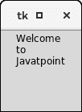

# Tkinter 消息


消息小部件用于向用户显示关于 python 应用行为的消息。消息小部件向用户显示无法编辑的文本消息。

消息文本包含多行。但是，消息只能以单一字体显示。

下面给出了使用消息小部件的语法。

### 句法

```py

w = Message(parent, options)

```

下面列出了可能的选择。

| 塞内加尔 | [计]选项 | 描述 |
| one | 锚 | 如果小部件包含的空间超过了文本所需的空间，则使用它来确定文本在提供给小部件的空间中的确切位置。默认值为“中心”。 |
| Two | 锥齿轮 | 小部件的背景色。 |
| three | 位图 | 它用于在小部件上显示图形。它可以设置为任何图形或图像对象。 |
| four | 弹底引信（base detonating 的缩写） | 它表示像素中边框的大小。默认大小为 2 像素。 |
| five | 光标 | 鼠标指针变为指定的光标类型。光标类型可以是箭头、点等。 |
| six | 字体 | 小部件文本的字体类型。 |
| seven | 细粒 | 小部件文本的字体颜色。 |
| eight | 高度 | 消息的垂直维度。 |
| nine | 图像 | 我们可以将此选项设置为静态图像，以将其显示在小部件上。 |
| Ten | 证明合法 | 此选项用于指定多行代码的相互对齐。可能的值可以是左对齐(左对齐)、中对齐(默认)和右对齐(右对齐)。 |
| Eleven | 垫板 | 小部件的水平填充。 |
| Twelve | 帕迪 | 小部件的垂直填充。 |
| Thirteen | 减轻 | 它表示边框的类型。默认类型是 FLAT。 |
| Fourteen | 文本 | 我们可以将该选项设置为字符串，这样小部件就可以表示指定的文本。 |
| Fifteen | textvariable | 这用于控制小部件所表示的文本。textvariable 可以设置为小部件中显示的文本。 |
| Sixteen | 强调 | 此选项的默认值为-1，表示没有下划线。我们可以将此选项设置为现有的数字，以指定字符串的第`n`个字母将带有下划线。 |
| Seventeen | 宽度 | 它以字符数(而不是像素)指定小部件的水平尺寸。 |
| Eighteen | 包装长度 | 我们可以通过将该选项设置为所需的行数来将文本换行，以便每行只包含该数量的字符。 |

### 例子

```py

from tkinter import *

top = Tk()
top.geometry("100x100")
var = StringVar()
msg = Message( top, text = "Welcome to Javatpoint")

msg.pack()
top.mainloop()

```

**输出:**

